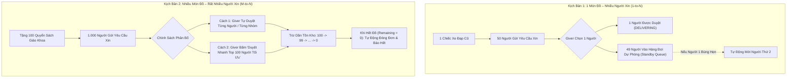
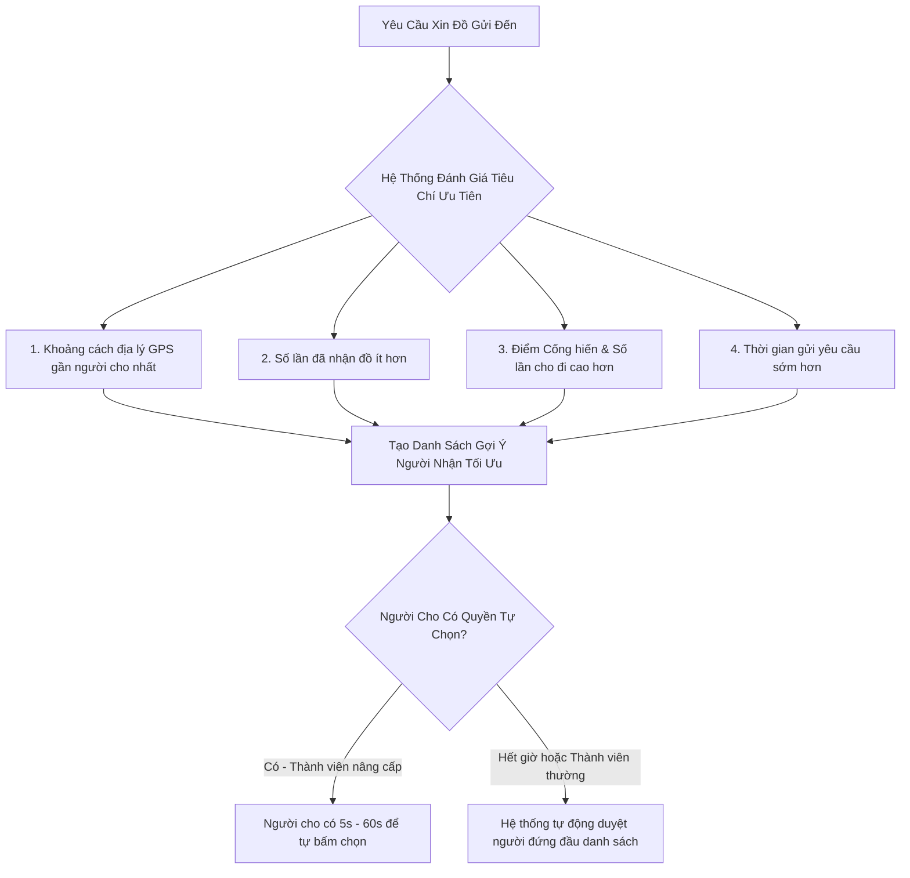

# TÀI LIỆU ĐỊNH HƯỚNG VÀ ĐẶC TẢ YÊU CẦU PHẦN MỀM
## ỨNG DỤNG CHO - TẶNG & TỪ THIỆN CỘNG ĐỒNG "CHÂN TÂM" (TRUE HEART)
### Khẩu hiệu: "Lánh Ác Làm Lành – Đáp Đền Tiếp Nối (Pay It Forward)"

---

| Thông Tin Tổng Quan | Chi Tiết |
| :--- | :--- |
| **Tên Ứng Dụng** | **Chân Tâm** (Tên tiếng Anh: **True Heart**) |
| **Biểu Tượng (Logo)** | Hình trái tim màu đỏ và hai bàn tay nâng lên màu vàng |
| **Khẩu Hiệu (Slogan)** | "Lánh ác làm lành – Đáp đền tiếp nối" (*Pay it forward*) |
| **Phong Cách Thiết Kế** | Định hướng Phật giáo, trang nhã, nhân văn, thanh tịnh |
| **Nền Tảng Hỗ Trợ** | Ứng dụng Di động (Android & iOS) + Nền tảng Web trên máy tính |
| **Ngôn Ngữ Hỗ Trợ** | Tiếng Việt (chính) và Tiếng Anh |
| **Mục Tiêu Cốt Lõi** | Kết nối người cho và người nhận vật phẩm/từ thiện hoàn toàn miễn phí, ưu tiên cự ly địa lý gần nhất |

---

## MỤC LỤC TỔNG QUAN

1. **PHẦN I: ĐỊNH HƯỚNG & TỔNG QUAN PHẦN MỀM**
2. **PHẦN II: HỆ THỐNG ĐIỂM, THỨ HẠNG & CƠ CHẾ ĐIỂM CỐNG HIẾN**
3. **PHẦN III: QUY ĐỊNH CHO, NHẬN & DUYỆT ĐƠN**
4. **PHẦN IV: QUY ĐỊNH HỘI VIÊN, KỶ LUẬT & CHỐNG THAO TÚNG**
5. **PHẦN V: GIAO DIỆN & TÍNH NĂNG HỆ THỐNG**
6. **PHẦN VI: PHÁP LÝ, TRUYỀN THÔNG & NHÀ TÀI TRỢ / QUẢNG CÁO**
7. **PHẦN VII: YÊU CẦU HỢP ĐỒNG, TIẾN ĐỘ & BÀN GIAO KỸ THUẬT**

---

# PHẦN I: ĐỊNH HƯỚNG & TỔNG QUAN PHẦN MỀM

## 1.1 Tôn Chỉ & Mục Đích Sản Phẩm
- **Mục tiêu chính:** Xây dựng công cụ công nghệ trực quan, dễ sử dụng trên điện thoại thông minh (smartphone) và máy tính, giúp người dùng tìm kiếm thông tin về vật phẩm/sản phẩm mà người khác muốn tặng hoặc cần xin, ưu tiên sắp xếp theo tính thuận tiện của vị trí địa lý (GPS cự ly gần), 100% miễn phí.
- **Ý nghĩa & Sứ mệnh:** Kết nối và đẩy mạnh phong trào từ thiện, sẻ chia trong xã hội trên nền tảng mang bản sắc Phật giáo; đối tượng tham gia là đông đảo Tăng Ni, Phật tử và cộng đồng người có lòng thiện nguyện tại Việt Nam cũng như trên toàn thế giới.
- **Tiêu chí trải nghiệm người dùng (UX):** Giao diện cực kỳ thân thiện, người dùng mở app là vào ngay trang chính để xem bảng tin; chỉ khi đi sâu vào tương tác (đăng bài cho đồ, gửi yêu cầu xin nhận) mới yêu cầu đăng nhập và khai báo thông tin định danh.

## 1.2 Nhận Diện Thương Hiệu & Thiết Kế
- **Tên tiếng Việt:** Chân Tâm
- **Tên tiếng Anh:** True Heart
- **Biểu tượng (Logo):** Hình trái tim màu đỏ nằm trong hai bàn tay nâng niu màu vàng.
- **Khẩu hiệu (Slogan):** "Lánh ác làm lành – Đáp đền tiếp nối" (*Pay it forward*).
- **Phong cách thị giác:** Hình nền, màu sắc và đồ họa mang âm hưởng Phật giáo (ấm áp, thanh tịnh, biểu trưng hoa sen, ánh sáng từ bi), tạo cảm giác an tâm, tin tưởng. Hình nền trang chủ có thể thay đổi định kỳ hoặc ngẫu nhiên theo các sự kiện Phật giáo, lễ hội hoặc các chiến dịch từ thiện.

## 1.3 Nguyên Tắc Bảo Mật & Quyền Riêng Tư Cốt Lõi
- **Bảo vệ danh tính cá nhân:** Trên giao diện công khai, các thông tin nhạy cảm của người cho (địa chỉ nhà chi tiết, số điện thoại liên lạc) được bảo mật tuyệt đối.
- **Cơ chế cấp quyền xem:** **CHỈ người được chủ món đồ chọn duyệt nhận** thì mới được hệ thống mở khóa để biết thông tin liên hệ và địa chỉ chính xác của người cho để đến nhận đồ.
- **Tính an minh và tuân thủ pháp luật:** Nghiêm cấm mọi hành vi lợi dụng nền tảng để lừa đảo, kinh doanh trục lợi, thu thập dữ liệu trái phép hoặc thao túng hệ thống điểm.

## 1.4 Tính Tương Thích & Khả Năng Mở Rộng Thiết Bị
- Ứng dụng hỗ trợ cả hai hệ điều hành di động phổ biến nhất: **Android** và **iOS**, đồng thời có phiên bản **Web** trên máy tính.
- Tối ưu hóa để tương thích tốt với các **dòng điện thoại đời cũ**, cấu hình thấp, giúp mọi tầng lớp người dân (kể cả người già, người có hoàn cảnh khó khăn dùng máy cấu hình yếu) đều có thể tiếp cận và sử dụng mượt mà.
- Ứng dụng mã nguồn mở, kiến trúc sẵn sàng mở rộng module (hỗ trợ đa ngôn ngữ Tiếng Việt, Tiếng Anh và các ngôn ngữ khác trong tương lai).

---

# PHẦN II: HỆ THỐNG ĐIỂM, THỨ HẠNG & CƠ CHẾ ĐIỂM CỐNG HIẾN

## 2.1 Các Cấp Bậc Hội Viên & Quy Trình Đăng Ký

### 1. Thành Viên Mới (New Member / Khách)
- **Thủ tục đăng ký tối giản:** Người dùng chỉ cần quét mã QR hoặc bấm vào đường link chia sẻ để tải ứng dụng, nhấn nút "Đồng ý điều khoản" là có thể mở ngay giao diện xem bảng tin và video ngắn (Short clips).
- **Kích hoạt tương tác nâng cao:** Khi muốn đăng bài cho đồ hoặc gửi yêu cầu xin nhận, người dùng cần:
  - Quét 2 mặt Căn cước công dân (CCCD) để xác thực danh tính.
  - Điền số điện thoại liên lạc chính chủ.
  - Đặt Nickname (Tên hiển thị công khai).
- Tất cả các thông tin khác trong Hồ sơ cá nhân (Profile) người dùng có toàn quyền quyết định mức độ hiển thị công khai hay ẩn danh. Đăng ký địa điểm chính xác nơi nhận hàng trong hồ sơ và có thể cập nhật linh hoạt.

### 2. Thành Viên Chính Thức (Official Member)
- **Điều kiện trở thành Thành viên chính thức:**
  - Đã xác thực danh tính (CCCD + SĐT).
  - Hoàn thành ít nhất **01 giao dịch** cho hoặc nhận đồ thành công, HOẶC giới thiệu được thành viên mới gia nhập hệ thống thành công.
- **Đặc quyền:** Bắt đầu được kích hoạt tính năng tính điểm uy tín, tham gia bảng xếp hạng và mở khóa các quyền lợi cộng đồng.

---

## 2.2 Cơ Chế Tính Điểm Cống Hiến & Xếp Hạng

### 1. Phân Kỳ Xếp Hạng & Bảng Lưu Danh
- Hệ thống xét duyệt và xếp hạng cống hiến định kỳ theo: **Tháng – Quý – Năm**.
- Phân chia làm **3 cấp bậc thành viên**.
- Có **Bảng vàng lưu danh** những thành viên có đóng góp cống hiến lớn nhất trong tháng/quý.

### 2. Công Thức Quy Đổi Điểm Cống Hiến
Điểm cống hiến được tổng hợp từ nhiều nguồn đóng góp khác nhau với hệ số trọng số tương ứng:
- **Đóng góp vật phẩm:** Giá trị ước tính của đồ cho/nhận được quy đổi theo công thức: **100.000 VNĐ giá trị = 1 Điểm Cống Hiến**.
- **Điểm Giới thiệu thành viên mới:** Cộng điểm thưởng khi mời được người mới đăng ký và người đó hoàn thành nhiệm vụ đầu tiên.
- **Điểm Nhiệm vụ Hàng ngày & Hàng tháng:**
  - Đăng nhập liên tục 30 ngày.
  - Hoàn thành tối thiểu 5 lần cho tặng thành công trong tháng.
  - Giới thiệu 20 người dùng mới trong 30 ngày.
- **Điểm Tương tác & Tần suất truy cập:** Tích cực truy cập, tương tác lành mạnh trên nền tảng.
- *Hết chu kỳ thời gian (tháng/quý), hệ thống tự động chốt bảng xếp hạng và tái lập chu kỳ mới.*

### 3. Quy Định Bất Biến Về Điểm Cống Hiến
- ❌ **KHÔNG ĐƯỢC PHÉP** quy đổi điểm ra tiền mặt dưới bất kỳ hình thức nào.
- ❌ **KHÔNG ĐƯỢC PHÉP** mua bán, chuyển nhượng hoặc cho/tặng điểm số giữa các tài khoản.
- ✅ **ĐƯỢC PHÉP THỪA KẾ** tài khoản và điểm uy tín cho người thân/người kế thừa hợp pháp.

---

## 2.3 Quyền Lợi, Quà Tặng & Đặc Quyền Nâng Hạng

1. **Quà tặng định kỳ:** Thành viên đạt chuẩn cống hiến hàng tháng/quý được ưu tiên chọn nhận các phần quà đặc biệt từ quỹ từ thiện, mục "Quà tặng tri ân", hoặc được cộng thêm Điểm cống hiến danh dự.
2. **Quyền năng theo thứ hạng:**
   - Cấp thành viên càng cao thì càng có nhiều quyền ưu tiên: Được tự tay chọn người nhận đồ (trong thời hạn ưu tiên 5 giây - 1 phút trước khi hệ thống tự động duyệt), được đăng bài tặng các loại tài sản/dịch vụ phi vật chất giá trị lớn.
   - Được quyền chạy thông báo kêu gọi tài trợ/từ thiện quy mô lớn trên hệ thống (cần Admin phê duyệt).
   - Được cấp quyền quản lý bình luận: Ẩn/xử lý các bình luận ác ý, không phù hợp dưới bài viết của mình.
3. **Nhân đôi điểm cống hiến:** Tham gia các sự kiện đặc biệt nhân ngày lễ Phật giáo (Đại lễ Phật Đản, Vu Lan Báo Hiếu...) để được nhân đôi điểm cống hiến cho mỗi lượt cho đi thành công.

---

# PHẦN III: QUY ĐỊNH CHO, NHẬN & DUYỆT ĐƠN

## 3.1 Cơ Chế Đăng Bài Hai Chiều: Đăng Tin Cho Đồ (Offering) & Đăng Tin Xin Đồ (Wanted / Wishlist)
Nền tảng "Chân Tâm" hỗ trợ mô hình tương tác sẻ chia hai chiều toàn diện: Người có đồ đăng tặng HOẶC Người cần đồ chủ động đăng bài tìm kiếm.

### 1. Phân Loại 2 Loại Bài Đăng Cốt Lõi:
1. **Bài Đăng Cho Tặng (Offering Posts):** Người có đồ dư thừa hoặc có khả năng hỗ trợ tinh thần đăng tin tìm người nhận phù hợp quanh khu vực.
2. **Bài Đăng Xin Đồ / Cần Tìm Đồ (Wanted / Wishlist Posts):** Người dùng có nhu cầu thực tế (sinh viên cần sách giáo trình, gia đình khó khăn cần bàn học/quần áo ấm, người già cần xe lăn...) chủ động đăng bài mô tả món đồ mình đang tìm kiếm và lý do cần được giúp đỡ.

---

### 2. Chế Độ Đăng Tin "Cần Xin Đồ Khẩn Cấp" (SOS Urgent Wishlist Radar)
Dành riêng cho các trường hợp cấp thiết, hoạn nạn đột xuất (Mẹ đơn thân cần sữa/tã gấp cho con sơ sinh, gia đình bị hỏa hoạn/thiên tai, người bệnh cần phương tiện hỗ trợ y tế khẩn cấp...):
- **Huy Hiệu Nổi Bật:** Bài đăng được gắn nhãn đỏ `[CẦN GẤP - SOS]` và ưu tiên ghim lên đầu Bảng tin & hiển thị nổi bật trên Bản đồ số.
- **Bắn Thông Báo Khẩn Theo Bán Kính GPS (Geo-Radius Push Alert):** Hệ thống tự động quét vị trí và bắn thông báo đẩy tức thì đến những người dùng ở cự ly gần (bán kính 3 - 5km) có lịch sử hay cho tặng danh mục đó: *"Gần bạn có một hoàn cảnh đang cần xin gấp món đồ [Tên đồ], bạn có thể mở lòng tiếp sức?"*.
- **Xác Thực Nghiêm Ngặt:** Bài đăng SOS yêu cầu xác minh danh tính CCCD + SĐT và được Admin/Tình nguyện viên kiểm duyệt nhanh để chống lạm dụng.

---

### 3. Động Cơ Khớp Nối Nhu Cầu Thông Minh Hai Chiều (Bidirectional Matching Engine)
- **Tự Động Gợi Ý Khi Đăng Bài:**
  - Khi một người đăng bài **Cho đồ (Offering)** $
ightarrow$ Hệ thống tự động quét và gợi ý ngay danh sách các bài **Cần xin (Wanted)** phù hợp về danh mục và vị trí địa lý gần nhất.
  - Khi một người đăng bài **Cần xin (Wanted)** $
ightarrow$ Hệ thống tự động hiển thị danh sách các bài **Đang cho (Offering)** sẵn có quanh khu vực để họ gửi yêu cầu nhận ngay.
- **Tính Năng "Tôi Muốn Tặng Cho Bạn" (Direct Gift Offer):** Người cho khi lướt thấy một bài xin đồ hoàn cảnh khó khăn có thể bấm nút **"Tôi Muốn Tặng Cho Bạn"** $
ightarrow$ Hệ thống lập tức tạo giao dịch trao tặng và gửi thông báo mừng rỡ đến người xin mà người xin không cần phải mất công tìm kiếm.

---

## 3.2 Hạng Mục Vật Phẩm & Sự Hỗ Trợ (Cho & Xin)
Người cho phải là hội viên hợp lệ và không bị kỷ luật/đánh tụt hạng.

### Hình thức Cho được chia làm 2 loại:
1. **Cho Vật Chất / Phương Tiện / Vật Phẩm:** Đồ gia dụng, quần áo, sách vở, xe cộ, đồ điện tử, thiết bị học tập... có ghi nhận giá trị ước tính trên thị trường.
2. **Cho Phi Vật Chất / Tinh Thần & Dịch Vụ:**
   - Gặp gỡ, tư vấn tâm lý, hướng nghiệp, giải quyết khó khăn.
   - Hỗ trợ đi lại, phương tiện di chuyển miễn phí.
   - Hỗ trợ sửa chữa nhà cửa, đồ dùng, đào tạo nghề, dạy học từ thiện...

### Quy định bài đăng cho đồ:
- Mọi đồ cho/nhận phải thuộc quyền sở hữu hợp pháp của chính người đăng.
- Toàn bộ bài đăng phải qua hệ thống kiểm duyệt tự động và Admin xét duyệt nội dung.
- **Xử lý đồ không có người nhận:** Đồ đăng tặng sau một thời hạn nhất định (ví dụ: **1 tháng**) nếu không có người nhận sẽ tự động chuyển sang mục **"Kho Từ Thiện Chung"** để phân bổ cho các chương trình thiện nguyện vùng sâu vùng xa.

---

## 3.2 Quy Định Đối Với Người Nhận
- **Điều kiện:** Là thành viên đã đăng ký hợp lệ; có lịch sử nhận đồ và đánh giá tốt từ những lần nhận trước.
- **Quy tắc chống trục lợi / Đầu cơ:**
  - Hệ thống ưu tiên những người chưa từng được nhận đồ trước.
  - **Quy định giới hạn:** Một người nhận **không được phép nhận đồ lần thứ 2 từ cùng một người cho trong vòng 3 tháng** (nhằm tránh tình trạng cấu kết, thiên vị hoặc gom đồ).

---

## 3.3 Cơ Chế Phân Quyền Chọn Người Nhận Theo Thứ Hạng & Phân Bổ Số Lượng Lớn (1-to-N & M-to-N Allocation)

### 1. Phân Quyền Chọn Người Nhận Dựa Trên Thứ Hạng (Rank-Based Selection Privilege)
- **Thành viên Thứ Hạng Cao (Rank Tinh Anh / Uy Tín Cao):**
  - Có **TOÀN QUYỀN tự tay lựa chọn** người nhận trong danh sách người gửi yêu cầu.
  - Được cấp **Thời gian ưu tiên lựa chọn (Priority Window)**: Trong vòng 24h - 48h kể từ khi có người xin, người cho có thể đọc từng lời nhắn, xem trang cá nhân, lịch sử uy tín của người xin để chủ động trao tặng cho người mình cảm thấy xứng đáng nhất.
- **Thành viên Mới / Thứ Hạng Tiêu Chuẩn:**
  - Hệ thống hỗ trợ bộ lọc thông minh tự động xếp hạng người xin tối ưu. Nếu sau thời gian quy định (ví dụ 12h) người cho chưa đưa ra lựa chọn, hệ thống sẽ kích hoạt chế độ **Tự Động Ghép Nối (Auto-Match)** người có điểm ưu tiên cao nhất để đảm bảo món đồ được trao đi nhanh chóng, không bị tồn đọng.

---

### 2. Phân Tích Chuyên Sâu Các Kịch Bản Phân Bổ Số Lượng Lớn (Inventory & Batch Allocation Engine)

#### Phân Tích Kỹ Thuật 2 Kịch Bản Cụ Thể:
1. **Kịch Bản 1: Một Món Đồ – Nhiều Người Xin (1 Món $
ightarrow$ 50 Người Xin):**
   - Hệ thống hiển thị danh sách 50 người xin kèm điểm Trust Score, cự ly GPS và lời nhắn.
   - Giver chọn duyệt Người A $
ightarrow$ Bài đăng chuyển sang `DELIVERING`.
   - **Hàng Đợi Dự Phòng (Standby Queue):** 49 người còn lại không bị xóa mà đưa vào trạng thái chờ dự phòng. Nếu trong 48h Người A bùng hẹn (Giao dịch bị CANCELLED), Giver có thể chọn ngay Người B trong danh sách chờ mà không cần phải đăng bài lại từ đầu.
2. **Kịch Bản 2: Số Lượng Lớn Vật Phẩm – Cực Nhiều Người Xin (Ví dụ: 100 Quyển Sách $
ightarrow$ 1.000 Người Xin):**
   - **Quản lý Hạn mức & Tồn kho (Quota Pool):** Người cho khai báo: `total_quantity = 100`, `max_per_receiver = 1` (Mỗi người chỉ được xin tối đa 1 hoặc 2 quyển sách để tránh ôm đồ).
   - **Cơ chế Duyệt Hàng Loạt Thông Minh (Smart Batch Approval):**
     - Giver có thể tick chọn 100 người cụ thể để duyệt cùng lúc.
     - HOẶC Giver bấm nút **"Duyệt Nhanh 100 Người Tối Ưu"**: Hệ thống tự động chọn top 100 người đạt điểm cao nhất theo thuật toán (Cự ly gần + Điểm cống hiến cao + Chưa nhận sách bao giờ).
   - **Khóa Tồn Kho Nguyên Tử (Atomic Inventory Decrement):** Mỗi khi 1 người được duyệt, `remaining_quantity` tự động giảm đi 1. Khi `remaining_quantity = 0`, hệ thống tự động khóa nhận đơn mới và gửi thông báo cảm ơn đến 900 người chưa được chọn.

---

### 3. Cơ Chế Can Thiệp & Cấu Hình Toàn Cục Từ Phía Admin (Global Admin Matching Policy)
Hệ thống cấp cho Admin công cụ cấu hình toàn bộ chính sách phân bổ trên toàn app:
1. **Cấu Hình Ngưỡng Quyền Hạn:** Thiết lập điểm Trust Score tối thiểu (VD: $\ge 120$ điểm) để Giver được toàn quyền tự chọn người nhận.
2. **Cấu Hình Thời Hạn Ưu Tiên (Priority Timeout):** Cho phép Admin chỉnh sửa thời gian Giver được tự duyệt (12h, 24h, 48h) trước khi hệ thống tự động can thiệp.
3. **Điều Phối Trọng Số Thuật Toán Gợi Ý:** Admin có thể điều chỉnh tỷ trọng % các tiêu chí: *Cự ly GPS (40%) + Điểm cống hiến (30%) + Số lần đã nhận ít (20%) + Thời gian gửi đơn sớm (10%)*.
4. **Quyền Can Thiệp Cưỡng Chế Trong Trường Hợp Khẩn Cấp (Emergency Admin Override):** Trong các chiến dịch cứu trợ bão lũ, thiên tai, Admin có quyền can thiệp duyệt phân bổ hàng loạt 1.000 phần quà cho danh sách 1.000 hộ dân nghèo đã được địa phương xác thực một cách nhanh chóng.

## 3.4 Tiêu Chí Ưu Tiên Duyệt Người Nhận (Thuật Toán Cơ Sở)
Hệ thống tính toán và tự động sắp xếp danh sách người xin theo thứ tự ưu tiên dựa trên các tiêu chí sau:

---

# PHẦN IV: QUY ĐỊNH HỘI VIÊN, KỶ LUẬT & CHỐNG THAO TÚNG

## 4.1 Cơ Chế Duy Trì Hội Viên & Minh Bạch Hóa
- Thành viên duy trì thứ hạng thông qua việc tích cực cho đi, tham gia các hoạt động cộng đồng và giới thiệu thành viên mới.
- Hệ thống công khai bảng tiêu chí chấm điểm, ghi nhận minh bạch để tránh mọi hành vi thao túng thuật toán.

## 4.2 Các Hình Thức Xử Lý Vi Phạm & Trục Lợi (Anti-Abuse Rules)

| Mức Độ Vi Phạm | Hành Vi Vi Phạm | Biện Pháp Xử Lý Kỹ Thuật |
| :--- | :--- | :--- |
| **Vi Phạm Lần 1** | Bùng hẹn nhận đồ không báo trước, đăng sai danh mục nhẹ | **Nhắc nhở tự động** qua thông báo/popup. |
| **Vi Phạm Lần 2** | Tái phạm bùng hẹn, thái độ không đúng mực | **Đánh tụt 1 bậc thứ hạng** HOẶC **Tạm treo tài khoản 1 tháng**. |
| **Vi Phạm Lần 3** | Cố tình spam yêu cầu, thông tin sai sự thật | **Treo tài khoản 3 tháng**, tước toàn bộ quyền ưu tiên. |
| **Vi Phạm 3 Lần Trong Năm** | Vi phạm lặp đi lặp lại nhiều lần | **Treo tài khoản vô thời hạn** và chuyển Admin xem xét kỷ luật. |
| **Khóa Tài Khoản Vĩnh Viễn** | Lợi dụng app để kinh doanh bán hàng, lừa đảo, trục lợi cá nhân, quấy rối, phá hoại hoặc thao túng hệ thống | **Khóa vĩnh viễn (Permanent Ban)**, đưa CCCD và SĐT vào danh sách đen của toàn bộ hệ thống. |

---

# PHẦN V: GIAO DIỆN & TÍNH NĂNG HỆ THỐNG

## 5.1 Các Phân Hệ Giao Diện
1. **Giao diện Người xem (Guest Viewer):** Xem bảng tin, clip ngắn, tìm kiếm đồ quanh đây, xem thông tin từ thiện chung.
2. **Giao diện Thành viên (Member App):** Đăng bài cho đồ, gửi yêu cầu xin nhận, quản lý giao dịch, chat bảo mật, theo dõi điểm cống hiến, bảng xếp hạng.
3. **Giao diện Quản trị (Admin CMS Web):** Kiểm duyệt bài đăng, duyệt yêu cầu kêu gọi từ thiện, xử lý báo cáo vi phạm, quản lý nhà tài trợ, thống kê số liệu.

## 5.2 Tính Năng Tùy Biến Màn Hình Home Động Theo Chiến Dịch (Server-Driven Home CMS)
Hệ thống cho phép Quản trị viên (Admin) tùy biến diện mạo, hình ảnh, màu sắc, thông điệp và thứ tự các khối nội dung của Màn hình Home theo từng chiến dịch từ thiện hoặc sự kiện Phật giáo trực tiếp từ trang Admin CMS mà **không cần phải phát hành bản cập nhật mới trên App Store / Google Play**:

1. **Tùy Biến Giao Diện & Hình Nền (Dynamic Theme & Background):**
   - Thay đổi hình nền trang chủ (Background Image/Pattern), màu sắc gradient chủ đạo và icon biểu trưng theo từng sự kiện (Đại lễ Phật Đản, Mùa Vu Lan, Chiến dịch Cứu trợ Bão lũ Miền Trung, Tết Vì Người Nghèo...).
2. **Quản Lý Banner & Hero Slider Chiến Dịch:**
   - Đăng tải các banner quảng bá chiến dịch từ thiện nổi bật kèm tiêu đề, khẩu hiệu và nút hành động (CTA) điều hướng sâu (Deep Link) vào trang kêu gọi ủng hộ hoặc danh mục đồ quyên góp ưu tiên.
3. **Thanh Thông Điệp Chạy (Dynamic Campaign Marquee / Greeting Bar):**
   - Tùy chỉnh câu chúc an lành hoặc thông điệp kêu gọi khẩn cấp trên đầu màn hình (Ví dụ: *"Chung tay cứu trợ đồng bào lũ lụt – Triệu tấm lòng Chân Tâm"*).
4. **Bật/Tắt & Sắp Xếp Thứ Tự Khối Nội Dung (Dynamic Section Layout):**
   - Admin có thể kéo thả thay đổi thứ tự hoặc tạm ẩn các khối: *[Khối 1: Banner Chiến dịch] $
ightarrow$ [Khối 2: Đồ Cần Tặng Khẩn Cấp] $
ightarrow$ [Khối 3: Video Shorts Ý Nghĩa] $
ightarrow$ [Khối 4: Bảng Vàng Cống Hiến Chiến Dịch] $
ightarrow$ [Khối 5: Đồ Quanh Đây Thường Quy]*.
5. **Lên Lịch Chiến Dịch Tự Động (Automated Campaign Scheduler):**
   - Thiết lập ngày giờ bắt đầu và kết thúc chiến dịch; hệ thống tự động kích hoạt giao diện chiến dịch và tự động hoàn nguyên về giao diện tiêu chuẩn khi kết thúc.
6. **Tối Ưu Tốc Độ Tải Giao Diện:** Cấu hình giao diện động được lưu đệm trong Redis Cache. Client tải cấu hình chỉ mất $< 2	ext{ms}$. Khi Admin lưu thay đổi trên Web CMS, hệ thống xóa cache tức thì để toàn bộ người dùng nhận diện mạo mới ngay lập tức.

## 5.3 Bố Cục Trang Chủ Chính (Bản Mặc Định)
- **Mục Muốn Tặng:** Phân loại rõ đồ vật chất và hỗ trợ phi vật chất.
- **Mục Muốn Nhận:** Cho phép đăng nhu cầu bản thân hoặc kêu gọi từ thiện thay cho các hoàn cảnh khó khăn khác (người già neo đơn, trẻ mồ côi...).
- **Mục Kêu Gọi Từ Thiện & Bán Thanh Lý Gây Quỹ:** Kết nối các chương trình thiện nguyện lớn, bán đấu giá/thanh lý đồ gây quỹ từ thiện.
- **Khu vực Clip Ngắn (Video Shorts):** Trình chiếu các video ngắn ghi lại những câu chuyện trao tặng thành công, lan tỏa sự xúc động và năng lượng tích cực.

## 5.4 Cơ Chế Hiển Thị Lịch Âm & Sự Kiện Phật Giáo (Vietnamese Lunar Calendar Engine)
Nhằm phục vụ thói quen tu tập, ăn chay và làm thiện nguyện của cộng đồng Phật tử, ứng dụng tích hợp công cụ Âm Lịch thuần Việt chuyên sâu:
1. **Hiển Thị Lịch Âm Song Hành Trên Header:**
   - Tại đầu màn hình chính (Home Header), ngày tháng luôn được hiển thị song song cả Dương lịch và Âm lịch kèm Can Chi: *Ví dụ: "Thứ Tư, 20/08/2026 – Ngày 08 tháng 07 năm Bính Ngọ (Âm Lịch)"*.
2. **Thanh Lịch Tuần & Đếm Ngược Ngày Lễ / Ngày Ăn Chay (Lunar Events Bar):**
   - Thanh trượt lịch nhỏ hiển thị trực quan các ngày **Mùng Một (01)**, **Ngày Rằm (15)** và các ngày lễ trọng đại của Phật giáo (Phật Đản, Vu Lan, Lễ Thành Đạo, Vía Quan Âm...).
   - Hiển thị thông báo đếm ngược: *Ví dụ: "Còn 7 ngày nữa đến Ngày Rằm Tháng 7 (Đại Lễ Vu Lan Báo Hiếu)"*.
3. **Nhắc Nhở & Gợi Ý Làm Việc Thiện Vào Ngày Sóc / Vọng:**
   - Vào các ngày Mùng 1 và Ngày Rằm hàng tháng, ứng dụng tự động hiển thị thông điệp từ bi và gửi thông báo gợi ý: phát tâm phóng sinh, cho tặng đồ dùng, chia sẻ thực phẩm chay hoặc hỗ trợ người có hoàn cảnh khó khăn để tích lũy phước lành.
4. **Hiển Thị Lịch Âm Trong Chi Tiết Bài Đăng & Giao Dịch:**
   - Mọi bài đăng cho đồ và lịch sử giao dịch đều hiển thị kèm ngày Âm lịch để người dùng dễ theo dõi những dịp kỷ niệm hoặc ngày cúng dường.
5. **Thuật Toán Chuyển Đổi Âm Dương Cục Bộ (Offline Calculation):**
   - Sử dụng thuật toán chuyển đổi Thiên văn học Âm lịch Việt Nam (Thuật toán Hồ Ngọc Đức) chạy trực tiếp trên thiết bị (Offline 100%), tính toán chính xác năm nhuận, tiết khí và can chi mà không làm tốn tài nguyên mạng.

## 5.5 Tính Năng Thông Báo & Tương Tác Chủ Động
- Hệ thống **tự động nhắc nhở** thành viên hoàn thành nhiệm vụ ngày/tháng để nhận thưởng.
- Tự động gửi thông báo chúc mừng sinh nhật hội viên, thông điệp an lành nhân các ngày rằm, mùng một và đại lễ Phật giáo.
- Thông báo đẩy tức thì (Push Notification) khi có đồ tặng mới phù hợp ở cự ly gần hoặc khi đơn xin đồ được duyệt.

## 5.5 Chế Độ Xem Bản Đồ Trực Quan Quanh Đây (Interactive Map View Mode)
Tính năng bản đồ số tương tác giúp người dùng có trải nghiệm khám phá không gian trực quan, sinh động:
1. **Giao Diện Bản Đồ Số Toàn Màn Hình:**
   - Người dùng có thể chuyển đổi linh hoạt giữa chế độ **Xem Danh Sách (List View)** và **Xem Bản Đồ (Map View)** chỉ bằng 1 nút chạm.
   - Vị trí của người dùng hiển thị bằng **Chấm Xanh nhấp nháy** kèm vòng bán kính định vị.
2. **Hệ Thống Ghim Biểu Tượng Theo Danh Mục (Custom Category Markers):**
   - Các món đồ đang được cho tặng hiển thị trực tiếp dưới dạng các **Ghim (Pins/Markers)** mang icon phân loại đặc trưng (Quần áo, Đồ gia dụng, Sách học, Đồ điện tử, Hỗ trợ tinh thần...).
3. **Thuật Toán Gom Cụm Điểm (Marker Clustering):**
   - Khi thu nhỏ bản đồ (Zoom out) hoặc tại các khu vực tập trung nhiều bài cho tặng (Khu ký túc xá, khu dân cư đông đúc), hệ thống tự động gom các ghim lại thành cụm số (VD: `[+12 món]`) để tránh rối mắt. Khi phóng to (Zoom in), cụm tự động bung ra từng vị trí chi tiết.
4. **Thẻ Xem Nhanh Món Đồ (Bottom Sheet Quick Preview):**
   - Khi chạm vào một Ghim trên bản đồ, màn hình tự động trượt lên một Thẻ xem nhanh hiển thị: *Ảnh đại diện, Tiêu đề món đồ, Tình trạng (Mới/Cũ), Cự ly khoảng cách (VD: "Cách bạn 450m"), Tên & Điểm uy tín của Giver*.
   - Có sẵn nút **"Xem Chi Tiết"** để gửi lời nhắn xin đồ và nút **"Chỉ Đường"** tích hợp Google Maps / Apple Maps.
5. **Tự Động Nạp Đồ Theo Khung Nhìn (Dynamic Bounding Box Fetch):**
   - Khi người dùng kéo di chuyển bản đồ (Pan) hoặc phóng to/thu nhỏ (Zoom), ứng dụng tự động gọi API nạp các món đồ nằm trong phạm vi tọa độ khung nhìn màn hình hiện tại (`min_lat`, `max_lat`, `min_lng`, `max_lng`).

## 5.6 Hệ Thống Blog, Tin Tức & Bài Viết Phật Pháp / Thiện Nguyện (Admin Blog CMS)
Kênh truyền thông chính thống giúp nuôi dưỡng tâm từ bi, lan tỏa giáo lý Phật giáo nhân văn và truyền cảm hứng thiện nguyện:
1. **Công Cụ Soạn Thảo Bài Viết Cho Admin (Rich Text & Media Editor):**
   - Quản trị viên dễ dàng soạn thảo bài viết phong phú: Định dạng chữ, tiêu đề, chèn trích dẫn lời Phật dạy, đính kèm hình ảnh sắc nét lưu trên Cloudflare R2, chèn link video ngắn.
2. **Phân Loại Chuyên Mục Bài Viết Đa Dạng:**
   - *Góc Phật Pháp Ứng Dụng:* Lời Phật dạy về hạnh bố thí, buông xả, nhân quả, gieo duyên lành.
   - *Gương Sáng Thiện Nguyện:* Những câu chuyện người thật việc thật, tấm lòng sẻ chia ấm áp trong cộng đồng.
   - *Nhật Ký Chiến Dịch:* Cập nhật hình ảnh, số liệu thực tế của các chương trình trao tặng quà, cứu trợ đồng bào khó khăn.
   - *Hướng Dẫn Sống Xanh / Tái Sử Dụng:* Mẹo tái chế, sửa chữa đồ cũ, bảo vệ môi trường.
3. **Trải Nghiệm Đọc Bài Trên Mobile App & Web:**
   - Tab "Góc Chân Tâm" trên ứng dụng di động cho phép người dùng đọc tin tức mượt mà, hỗ trợ chế độ đọc ban đêm (Dark Mode), lưu bài viết yêu thích, chia sẻ bài viết lên Facebook / Zalo để lan tỏa việc thiện.

## 5.7 Cơ Chế Tùy Biến Toàn Diện Cho Từng Chiến Dịch Từ Thiện (Campaign Landing Page & Customization)
Mỗi chiến dịch từ thiện (Cứu trợ bão lũ miền Trung, Vu Lan báo hiếu, Tết vì người nghèo, Tiếp sức mùa thi...) được cung cấp bộ công cụ tùy biến chuyên sâu:
1. **Trang Giới Thiệu Chiến Dịch Riêng Biệt (Campaign Landing Page):**
   - Mỗi chiến dịch có một trang riêng hiển thị thông điệp, mục đích, đơn vị bảo trợ, đối tượng hướng tới và thời gian diễn ra.
2. **Thanh Tiến Độ Mục Tiêu Quyên Góp (Campaign Goal Progress Bar):**
   - Hiển thị trực quan mục tiêu chiến dịch (Ví dụ: Mục tiêu 1.000 phần quà sách vở $
ightarrow$ Đã trao tặng thành công 750 phần quà - Đạt 75%).
3. **Danh Mục Bài Đăng Gắn Nhãn Chiến Dịch (Tagged Campaign Items):**
   - Các món đồ người dùng đăng tặng phục vụ chiến dịch sẽ được tự động gắn huy hiệu chiến dịch (Campaign Badge) và gom vào khu vực ưu tiên duyệt nhanh.
4. **Bảng Vinh Danh Đóng Góp Riêng Của Chiến Dịch:**
   - Xếp hạng và tôn vinh các cá nhân, tập thể có đóng góp nổi bật nhất trong chiến dịch đó.
Hỗ trợ tìm kiếm và lọc thông minh:
- Theo **Địa điểm / Bán kính GPS** (Gần nhất $
ightarrow$ Xa dần).
- Theo **Lĩnh vực / Danh mục** (Gia dụng, Quần áo, Học tập, Điện tử, Hỗ trợ tinh thần...).
- Theo **Giá trị ước tính** (VNĐ) và **Tình trạng sử dụng** (Mới 100%, Như mới, Đã sử dụng).
- Theo **Độ uy tín của người tặng** (Điểm Trust Score).

## 5.6 Động Cơ Đánh Giá Đa Chiều (3 Bên)
Hệ thống chấm điểm dựa trên 3 luồng dữ liệu khách quan:
1. **Đánh giá từ Hệ thống:** Tự động tính toán dựa trên điểm cống hiến, số lượt cho thành công và giá trị đóng góp thực tế.
2. **Đánh giá từ Người nhận:** Chấm điểm sao (1 - 5 sao) và nhận xét thái độ, chất lượng đồ sau khi hoàn tất trao nhận.
3. **Đánh giá từ Người xem / Cộng đồng:** Điểm bình chọn, ghi nhận từ cộng đồng theo dõi theo hệ số quy định.

## 5.7 Nguồn Thu Tự Động Hóa Nhằm Duy Trì Nền Tảng (Monetization)
Ứng dụng tích hợp các công cụ tạo nguồn thu nhân văn để tự trang trải chi phí máy chủ và vận hành:
- Tích hợp mạng quảng cáo tự động **Google AdSense** tại các vị trí phù hợp, không gây phiền người dùng.
- Chèn banner liên kết tài trợ của các doanh nghiệp, nhà hảo tâm đồng hành tại trang giới thiệu và chân trang bảng tin.

---

# PHẦN VI: PHÁP LÝ, TRUYỀN THÔNG & NHÀ QUẢNG CÁO

1. **Khẩu hiệu xuyên suốt:** *"Đáp đền tiếp nối – Pay it forward"*.
2. **Định hướng truyền thông:** Lan tỏa hình ảnh nhân văn, tâm linh trong sáng, kết nối tình người theo lời dạy của Đức Phật.
3. **Quy định đối với Nhà tài trợ / Quảng cáo:** Có quy chế chặt chẽ về sản phẩm được phép quảng cáo (nghiêm cấm rượu bia, cờ bạc, chất kích thích, văn hóa phẩm độc hại; chỉ chấp nhận các sản phẩm chay, hữu cơ, giáo dục, sức khỏe lành mạnh).
4. **Khung pháp lý vững chắc:** Minh bạch quy chế hoạt động, quyền hạn, nghĩa vụ, tài chính (các khoản chi thu vận hành), điều kiện nâng hạ hạng thành viên theo quy định pháp luật Việt Nam.

---

# PHẦN VII: YÊU CẦU HỢP ĐỒNG, TIẾN ĐỘ & BÀN GIAO KỸ THUẬT

## 7.1 Tiến Độ Thực Hiện & Bàn Giao
- **Giai đoạn chuẩn bị (1 Tháng):** Làm việc giữa Bên A (Chủ đầu tư) và Bên B (Đơn vị Coding) để chốt kiến trúc kỹ thuật, tài liệu yêu cầu (SRS/TFR), hợp đồng kinh tế và báo giá chi tiết.
- **Giai đoạn phát triển cơ bản (MVP - 2 đến 3 Tháng):** Xây dựng các tính năng cốt lõi (Bản mô tả tính năng bắt buộc phải có cho phiên bản đầu).
- **Giai đoạn thử nghiệm & Tối ưu (6 Tháng):** Chạy thử nghiệm thực tế, bảo hành, sửa lỗi, theo dõi phản hồi người dùng.

## 7.2 Phương Thức Thanh Toán & Quản Lý Bản Quyền
- Báo giá tách bạch rõ ràng giữa: **Chi phí Coding phần mềm** và **Chi phí thuê hạ tầng bên thứ 3** (Máy chủ, Tên miền, Cloudflare, Apple/Google Developer...).
- Bàn giao từng phần và thanh toán theo mốc tiến độ thực tế; thanh toán đợt cuối sau 6 tháng vận hành ổn định và hết hạn bảo hành.
- **Bản quyền & Pháp lý sở hữu:** Bàn giao toàn bộ mã nguồn mở (Full Source Code), tài liệu thiết kế và hồ sơ kỹ thuật để Công ty Bên A tiến hành đăng ký bản quyền tác giả, đáp ứng đầy đủ điều kiện của doanh nghiệp kinh doanh phần mềm để hưởng các ưu đãi thuế theo quy định.
- **Bên thứ 3 giám sát:** Bên A có quyền thuê đơn vị tư vấn/chuyên gia kỹ thuật độc lập để đại diện nhận bàn giao, kiểm tra nghiệm thử mã nguồn và đánh giá vận hành hệ thống.

---

### --- HẾT TÀI LIỆU ĐỊNH HƯỚNG VÀ YÊU CẦU PHẦN MỀM CHÂN TÂM ---
