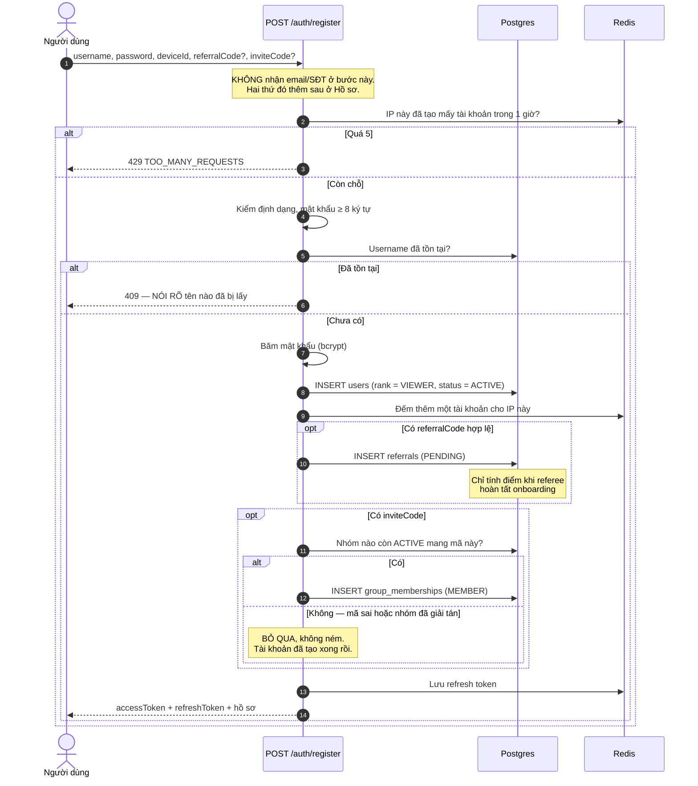
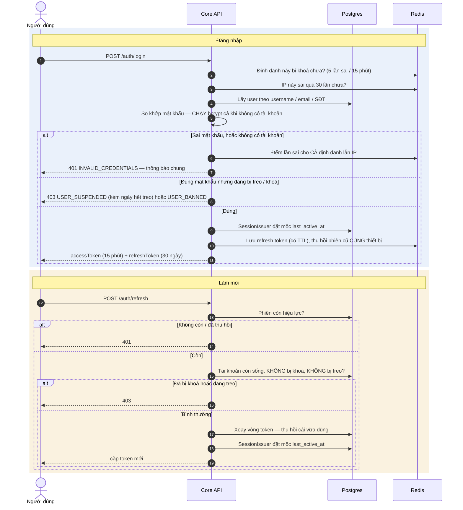
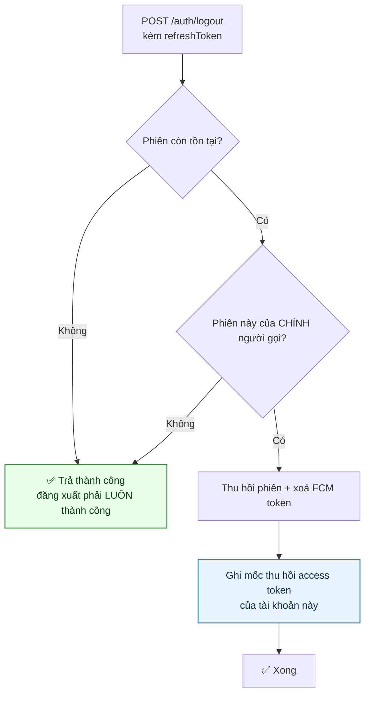
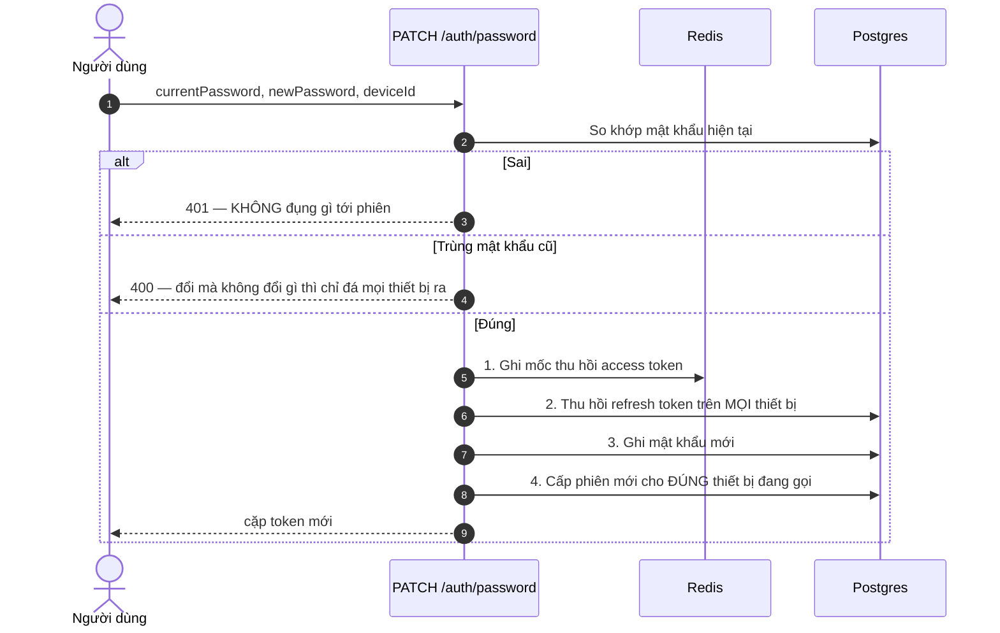
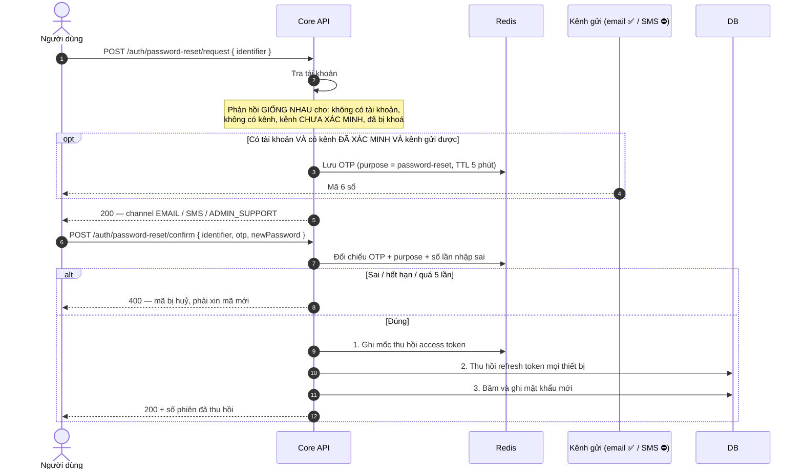
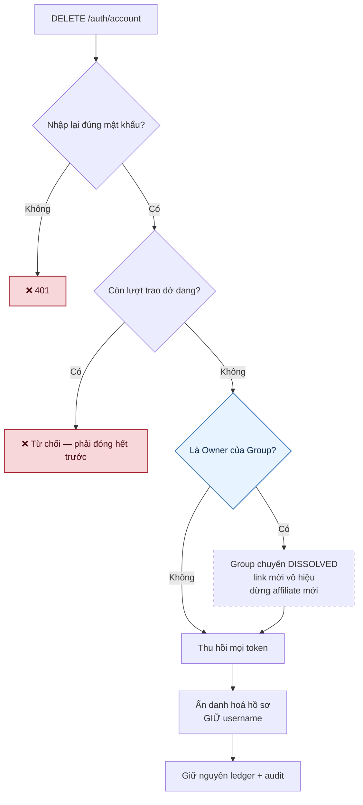

# 01 · Xác thực & tài khoản

Trạng thái: ✅ **đã hiện thực đầy đủ**, trừ kênh gửi OTP qua SMS/Zalo.

Chín endpoint:

| Endpoint | Việc | Cần token |
| --- | --- | --- |
| `POST /auth/register` | Đăng ký, tự đăng nhập luôn | — |
| `POST /auth/login` | Đăng nhập | — |
| `POST /auth/refresh` | Làm mới phiên | — |
| `POST /auth/logout` | Đăng xuất một thiết bị | ✅ |
| `POST /auth/password-reset/request` · `/confirm` | Quên mật khẩu | — |
| `PATCH /auth/password` | **Đổi mật khẩu khi đang đăng nhập** | ✅ |
| `DELETE /auth/account` | Xoá tài khoản | ✅ |
| `GET /auth/me` | Danh tính của phiên hiện tại | ✅ |

## 1.1 Đăng ký

> **Vì sao 409 NÓI RÕ tên nào đã bị lấy.** Username là định danh công khai — người ta phải
> biết tên đó bận để chọn tên khác. Lập luận "thông báo chung chống dò tài khoản" chỉ đúng cho
> **email**, mà email thì không có ở bước này.

> **Vì sao có trần theo IP.** Tài khoản mới **đẻ ra điểm** qua referral và affiliate, nên tạo
> hàng loạt là một đường gian lận chứ không chỉ là rác. Trần đếm số tài khoản **tạo được**,
> không đếm lần gõ hỏng form — phạt người dùng thật vì lỗi đánh máy là sai chỗ.
> Ngưỡng: `MAX_REGISTRATIONS_PER_IP` (mặc định 5) trong `REGISTRATION_WINDOW_SECONDS` (1 giờ).

> **Vì sao `inviteCode` nằm ở đây chứ không phải một endpoint "vào nhóm" riêng.** Membership
> chỉ sinh ra cho tài khoản MỚI (F54/BR-GRP-04), và chính ràng buộc đó là hàng rào chặn việc
> một người nhảy vòng quanh các nhóm để gom affiliate. Có endpoint join riêng là phá hàng rào.
> Xem [`18-group.md §18.2`](./18-group.md).

## 1.2 Đăng nhập và làm mới phiên

> **Vì sao trạng thái tài khoản kiểm SAU khi so mật khẩu.** Trả "tài khoản bị khoá" trước khi
> biết người gọi có mật khẩu hay không là biến màn đăng nhập thành công cụ dò xem username nào
> có thật **và** đang ở trạng thái gì. Sau khi họ đã chứng minh biết mật khẩu thì nói thẳng là
> đúng — không nói thì họ chỉ thấy "sai mật khẩu" và gõ lại mãi.

> **Vì sao có hai cái trần chống dò.** Trần theo **định danh** (5 lần / 15 phút) chặn người dò
> mật khẩu của MỘT người. Trần theo **IP** (`MAX_LOGIN_ATTEMPTS_PER_IP`, mặc định 30) chặn
> người rải một mật khẩu phổ biến qua hàng nghìn username — ở kiểu đó mỗi tài khoản chỉ sai
> một lần nên không tài khoản nào chạm trần của riêng nó. Trần IP **chỉ đếm khi sai**: đếm cả
> lần đúng thì một văn phòng chung IP sẽ tự khoá nhau.

> **Vì sao tên là `last_active_at` chứ không `last_login_at`, và vì sao ghi ở nhánh refresh.**
> App mobile giữ refresh token nên người mở app hằng ngày vẫn có thể không "đăng nhập" lần nào
> suốt 90 ngày. Chỉ ghi ở nhánh login sẽ đánh nhầm người đang dùng đều thành không hoạt động,
> và họ mất phần chia affiliate.

> **Vì sao `/refresh` cũng chặn tài khoản đang treo.** Đường treo duy nhất hiện nay là Admin,
> mà Admin thì thu hồi sạch phiên — nhưng đó là một **giả định ngầm**. Ngày nào có chế tài tự
> động đặt `SUSPENDED` mà quên thu hồi, người bị treo vẫn tự gia hạn phiên thêm 30 ngày.

## 1.3 Đăng xuất

> **Vì sao phải giết cả access token.** Thiếu bước đó thì bấm "Đăng xuất" xong token cũ vẫn gọi
> API được tới **15 phút**. Trên máy mượn hay máy công cộng, đó đúng là khoảng thời gian người
> ta sợ.
>
> Danh sách chặn ghi theo **tài khoản**, không theo thiết bị. Nên thiết bị khác của cùng người
> sẽ nhận **một lần 401** rồi tự lấy token mới bằng refresh token của nó — phiên của họ KHÔNG
> mất, chỉ tốn thêm một vòng gọi.

## 1.4 Đổi mật khẩu khi đang đăng nhập

> **Vì sao thứ tự bốn bước không đảo được.** Ba lệnh ghi đầu KHÔNG nằm chung transaction (một
> trên Redis, hai trên Postgres). Đổi mật khẩu đứng **cuối**: nếu nó chạy trước mà lệnh thu hồi
> chưa kịp chạy, kẻ đang giữ refresh token vẫn gọi `/refresh` lấy được token mới — và việc đổi
> mật khẩu chẳng đuổi được ai. Chết giữa chừng theo thứ tự này thì mật khẩu chưa đổi, phiên đã
> mất; người dùng làm lại, không ai bị chiếm.

> **Vì sao trả về cặp token mới.** Bước 2 thu hồi cả phiên vừa gọi endpoint này. Không cấp lại
> thì người dùng vừa làm đúng một việc nên làm đã bị đá ra khỏi app.

> **Vì sao endpoint này là bắt buộc, không phải tiện nghi.** Đăng ký chỉ cần username + mật
> khẩu. Tài khoản chưa gắn email/SĐT **đã xác minh** thì luồng quên mật khẩu rơi về
> `ADMIN_SUPPORT` — mà chưa có endpoint nào cho Admin đặt lại mật khẩu hộ. Không có đường này
> thì họ không bao giờ đổi được mật khẩu.

## 1.5 Quên mật khẩu

> **Vì sao chỉ kênh ĐÃ XÁC MINH mới nhận được mã.** Email vào hồ sơ chỉ bằng cách gõ vào —
> không ai kiểm. Gõ nhầm một ký tự mà vẫn gửi mã đặt lại mật khẩu tới đó là trao đường chiếm
> tài khoản cho người lạ: họ bấm quên mật khẩu, nhận mã, đổi mật khẩu, và mọi phiên của chủ
> thật bị thu hồi. Xem [02-profile §xác minh email](./02-profile.md).

> **Vì sao OTP có `purpose`.** Cùng một mã 6 số mà dùng chung cho đổi mật khẩu và xác minh
> SĐT thì một mã lấy được ở luồng này mở được luồng kia. Tách purpose là chặn đúng chỗ đó.

> **Vì sao xin mã phải chờ 60 giây giữa hai lần.** Không có chốt đó thì endpoint quên mật khẩu
> thành công cụ dội tin nhắn vào một số điện thoại bất kỳ — nạn nhân không cần có tài khoản
> vẫn bị làm phiền.

## 1.6 Xoá tài khoản

| Bước | Trạng thái |
| --- | --- |
| Bắt nhập lại mật khẩu | ✅ — access token có thể đang ở tay người mượn máy |
| Chặn "còn lượt trao dở dang" | ✅ `countOpenForUser` + `UserHasOpenTransactionsException` |
| Owner xoá → Group giải tán | ✅ `dissolveOwnedBy`, giữ nguyên membership/ledger/audit |
| Ẩn danh hoá, thu hồi token, giữ ledger | ✅ |

> **Vì sao giữ username.** Username là biệt danh tự chọn, không phải dữ liệu định danh bắt
> buộc — và giữ nó khiến người khác không đăng ký lại đúng tên đó để mạo danh trong lịch sử
> giao dịch cũ.

> **Vì sao giữ ledger thay vì xoá.** Bút toán điểm của người này là đối ứng của bút toán
> người khác. Xoá đi thì sổ của người ở lại không còn khớp, và không ai dựng lại được.

## Chỗ cần soát

1. ⛔ **Chưa có đường cho Admin đặt lại mật khẩu hộ.** Luồng quên mật khẩu trả
   `ADMIN_SUPPORT` cho tài khoản không có kênh đã xác minh, nhưng Admin chỉ có đổi trạng thái,
   cấp vai và xoá — không có nút nào ứng với nhánh đó. Cần Bên A chốt: có cho Admin đặt lại
   mật khẩu không, và nếu có thì ràng buộc gì (lý do bắt buộc, audit, thông báo cho chủ tài
   khoản).
2. ⚠️ **Mật khẩu chỉ yêu cầu 8 ký tự**, không có quy tắc nào khác — `12345678` qua được. Cần
   Bên A chốt có thêm luật độ mạnh không.
3. ✅ **Trần theo IP đã có** cho đăng nhập và đăng ký. ⛔ Vẫn **chưa có giới hạn tốc độ toàn
   hệ thống** cho các endpoint còn lại.
4. Đăng ký **không bắt buộc** SĐT. Cổng hoàn thiện hồ sơ (F07) mới là chỗ chặn — xem
   [02-profile](./02-profile.md).
5. Kênh gửi OTP: email ✅ đã chạy thật; SMS/Zalo bật được trong CMS nhưng `canSend` trả
   `false` ở production vì chưa có adapter.
