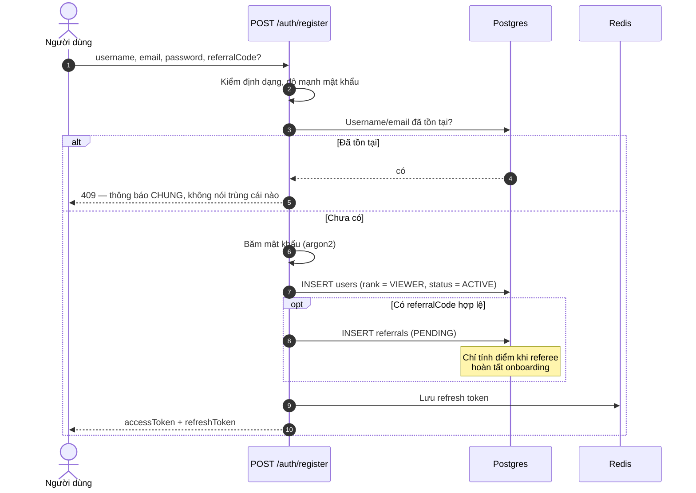
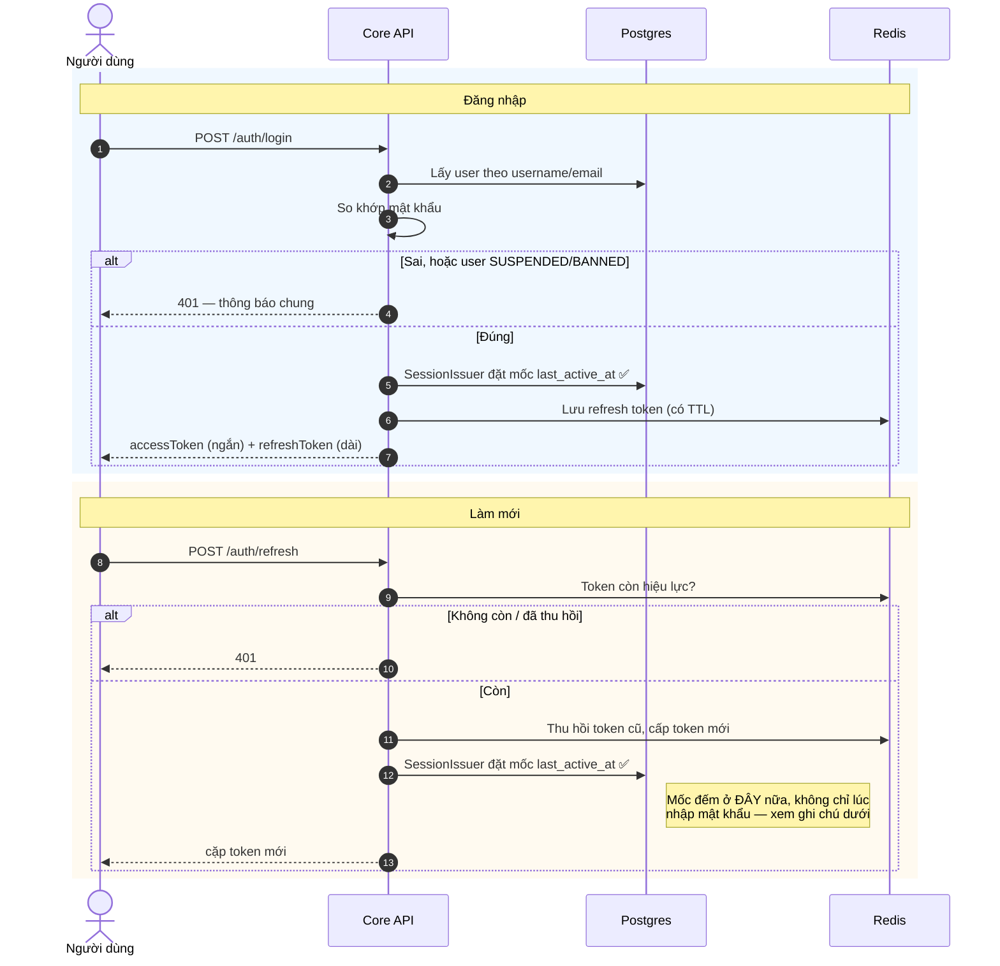
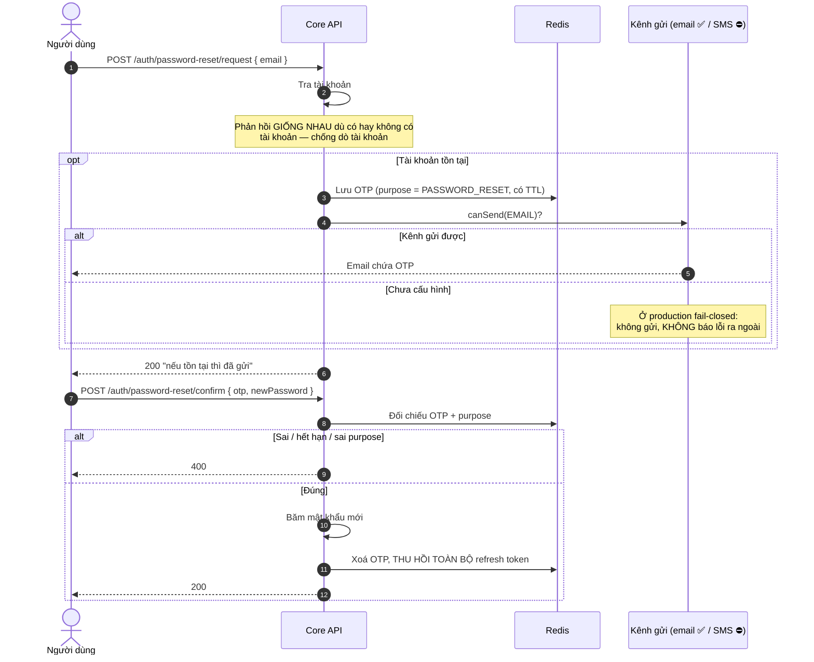
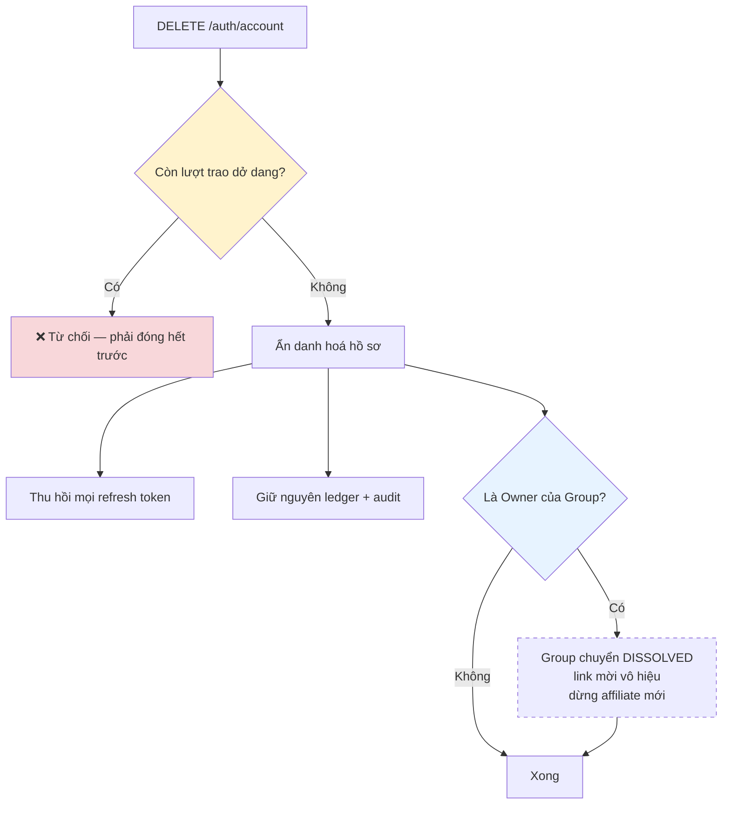

# 01 · Xác thực & tài khoản

Trạng thái: ✅ **đã hiện thực đầy đủ**, trừ kênh gửi OTP qua SMS/Zalo.

## 1.1 Đăng ký

> **Vì sao 409 không nói trùng cái nào.** Trả "email này đã tồn tại" biến form đăng ký thành
> công cụ dò xem một địa chỉ có tài khoản hay không. Thông báo chung làm người dùng hợp lệ
> khó chịu hơn một chút, nhưng đó là cái giá rẻ.

## 1.2 Đăng nhập và làm mới phiên

> **Vì sao tên là `last_active_at` chứ không `last_login_at`, và vì sao ghi ở nhánh refresh.** App mobile giữ refresh token nên
> người mở app hằng ngày vẫn có thể không "đăng nhập" lần nào suốt 90 ngày. Chỉ ghi ở nhánh
> login sẽ đánh nhầm người đang dùng đều thành không hoạt động, và họ mất phần chia affiliate.

## 1.3 Quên mật khẩu

> **Vì sao OTP có `purpose`.** Cùng một mã 6 số mà dùng chung cho đổi mật khẩu và xác minh
> SĐT thì một mã lấy được ở luồng này mở được luồng kia. Tách purpose là chặn đúng chỗ đó.
>
> **Vì sao thu hồi toàn bộ refresh token.** Đổi mật khẩu thường là phản ứng với việc bị chiếm
> tài khoản. Không thu hồi thì kẻ đang giữ phiên vẫn ở nguyên trong đó.

## 1.4 Xoá tài khoản

| Bước | Trạng thái |
| --- | --- |
| Ẩn danh hoá, thu hồi token, giữ ledger | ✅ đã có |
| Chặn "còn lượt trao dở dang" | ✅ `countOpenForUser` + `UserHasOpenTransactionsException`, có test |
| Owner xoá → Group giải tán | ✅ `dissolveOwnedBy`, giữ nguyên membership/ledger/audit |

> **Vì sao giữ ledger thay vì xoá.** Bút toán điểm của người này là đối ứng của bút toán
> người khác. Xoá đi thì sổ của người ở lại không còn khớp, và không ai dựng lại được.

## Chỗ cần soát

1. ✅ **`users.last_active_at` đã có** (không đặt tên `last_login_at` vì nó không chỉ ghi lúc
   đăng nhập). `SessionIssuer` là chỗ chung của đăng ký, đăng nhập và làm mới token nên chỉ
   có MỘT chỗ ghi mốc. Cột `NOT NULL DEFAULT now()`, có index cho job quét Active Member.
2. ✅ **Chặn xoá khi còn lượt trao dở dang đã có** — và chặn TRƯỚC khi thu hồi token, vì thu
   hồi rồi mới phát hiện không xoá được là đá người dùng ra khỏi phiên dù tài khoản vẫn nguyên.
3. Đăng ký hiện **không bắt buộc** SĐT. Cổng hoàn thiện hồ sơ (F07) mới là chỗ chặn — xem
   [02-profile](./02-profile.md).
4. Kênh gửi OTP: email ✅ đã chạy thật; SMS/Zalo bật được trong CMS nhưng `canSend` trả
   `false` ở production vì chưa có adapter.
