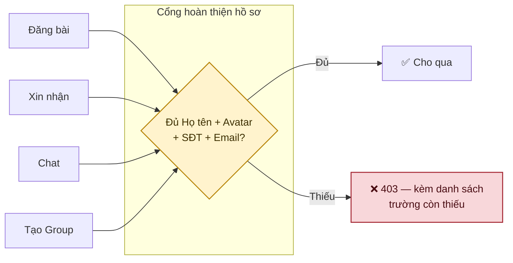
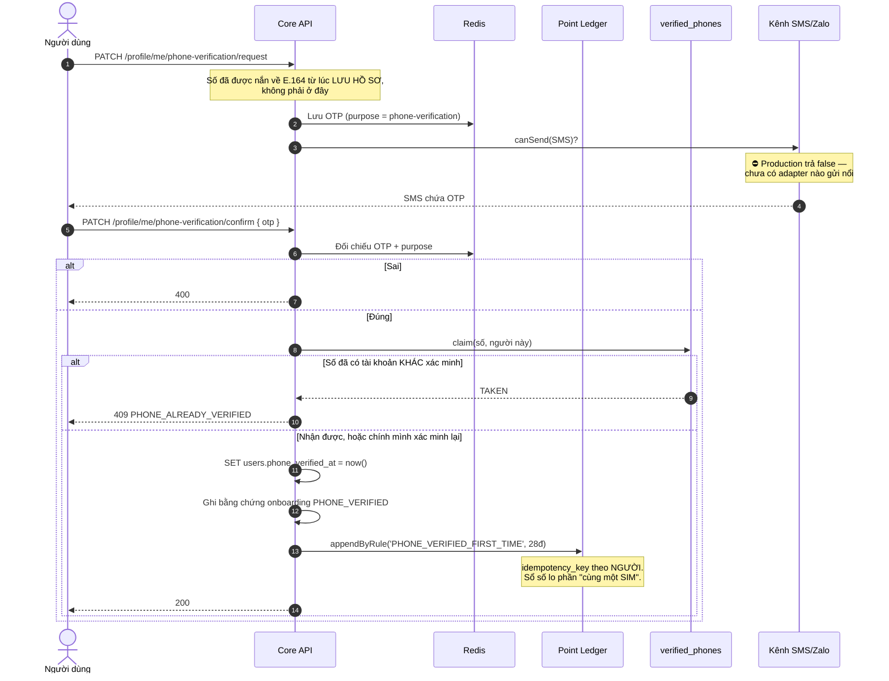
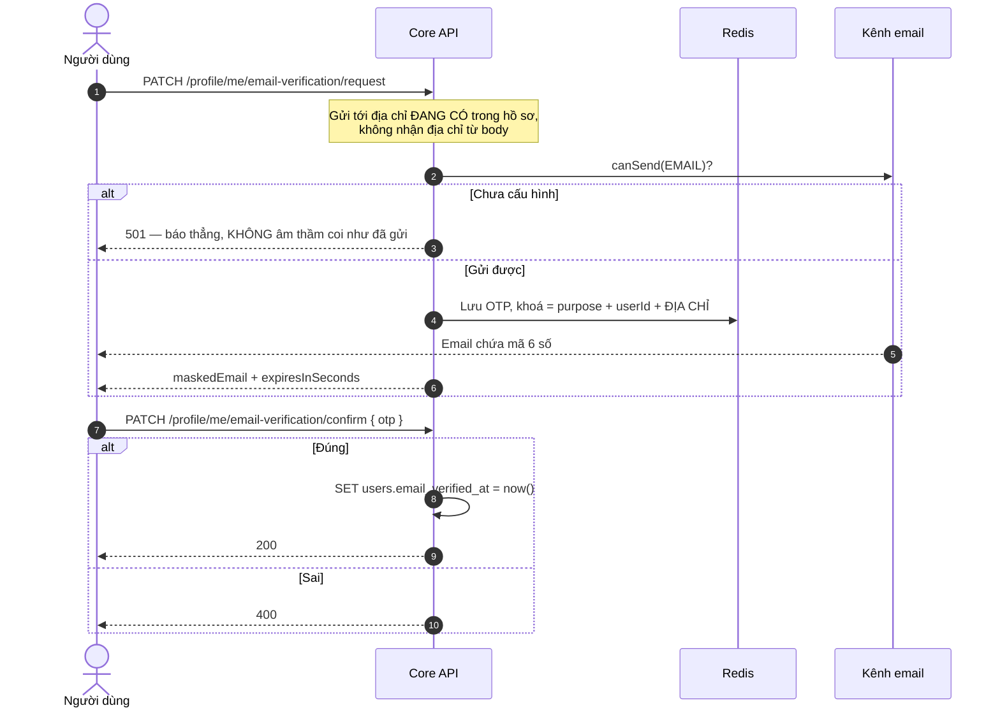
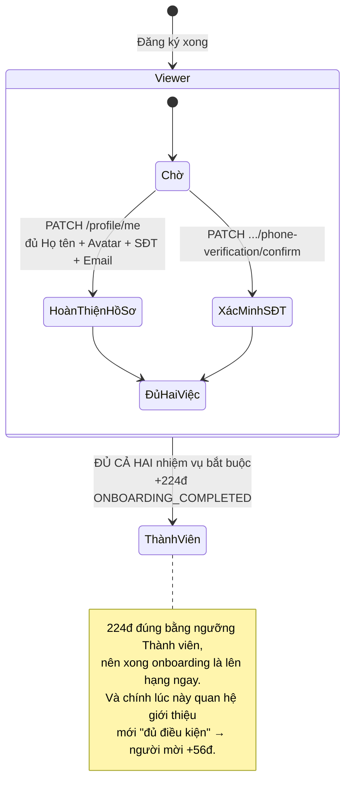
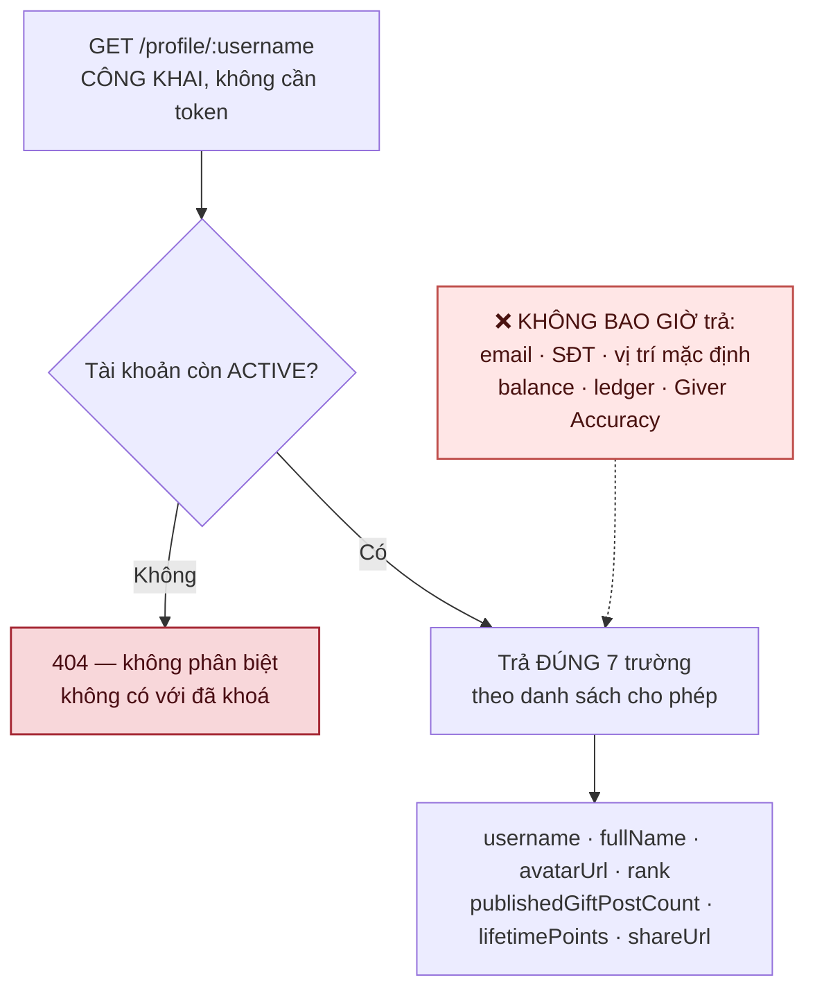
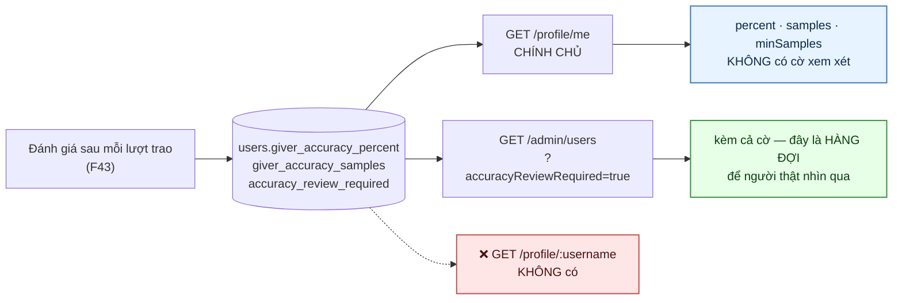

# 02 · Hồ sơ, xác minh & onboarding

## 2.1 Cổng hoàn thiện hồ sơ (F07)

**Chốt 2026-09-24:** cổng chặn **4 hành vi**, không chỉ đăng bài.

> **Vì sao trả về danh sách trường còn thiếu chứ không chỉ "hồ sơ chưa đủ".** Người dùng
> không đoán được mình thiếu gì, và mỗi lần đoán sai là một lần họ bỏ cuộc.

| Hành vi | Trạng thái chặn |
| --- | --- |
| Đăng bài | ✅ `assertOnboarded` — cổng hồ sơ **cộng** điều kiện đã qua Viewer |
| Xin nhận | ✅ `assertComplete` |
| Chat (đường **gửi**) | ✅ `assertComplete` |
| Tạo Group | ✅ `assertComplete` + rank + có Default Location |

Gom về một `ProfileGate` thay vì viết lại ở từng use case — bốn nơi tự kiểm là bốn danh sách
trường bắt buộc có thể trôi khỏi nhau, và chỗ nào quên một trường thì chỗ đó lặng lẽ mở cửa.

> **Cổng đặt ở đường GỬI tin nhắn, không ở đường đọc.** Người hồ sơ chưa đủ vẫn phải đọc được
> tin nhắn gửi cho mình, nếu không họ mất luôn lời nhắn đang chờ.
>
> **Hồ sơ kiểm TRƯỚC rank.** Viewer thiếu SĐT phải nghe "thiếu SĐT" chứ không phải "chưa
> onboard" — điền SĐT chính là việc đưa họ ra khỏi Viewer.

## 2.2 Xác minh số điện thoại

> **Vì sao ghi sổ TRƯỚC khi đánh dấu.** Đánh dấu trước rồi mới ghi sổ thì hai request song
> song cùng vượt qua phép kiểm, và cả hai tài khoản cùng mang dấu đã xác minh cho một SIM.

> **Vì sao cần bảng `verified_phones` thay vì chỉ dựa vào `users.phone`.** Gỡ số khỏi hồ sơ
> (`phone: null`) và xoá tài khoản (đặt `phone = null`) đều **trả số lại** cho người khác dùng,
> vì phép kiểm trùng chỉ nhìn giá trị hiện tại. Không có sổ này thì một SIM quay vòng vô hạn:
> xác minh → 28đ → xong onboarding 224đ → kích hoạt thưởng giới thiệu 56đ cho người mời → gỡ
> số → tạo tài khoản mới → lặp lại.
>
> Sổ lưu **băm HMAC**, không lưu số đọc được: bảng này cố ý sống lâu hơn tài khoản, kể cả tài
> khoản đã xoá, nên giữ số ở dạng đọc được là giữ đúng thứ người ta vừa yêu cầu xoá.
>
> `released_at` là van xả cho Admin — mất máy, mất tài khoản, số bị nhà mạng thu hồi và cấp
> lại đều là chuyện có thật. ⛔ **Chưa có endpoint cho van đó**; hiện phải sửa tay database.

> **Chuẩn hoá E.164 nằm ở `PATCH /profile/me`, không nằm ở đây.** DTO chỉ loại bỏ thứ rõ ràng
> không phải số; `normalizePhoneNumber` trong `core-lib` mới là nơi phán quyết, và mọi đường
> vào đều đi qua đúng nó. Thiếu bước này thì `0912345678` và `+84912345678` là hai chuỗi khác
> nhau, index UNIQUE cho qua cả hai, và cùng một SIM thành hai tài khoản.

## 2.2b Xác minh email — ✅ 26/09

> **Vì sao khoá OTP gắn cả ĐỊA CHỈ chứ không chỉ `userId`.** Chỉ khoá theo `userId` thì người
> ta xin mã cho địa chỉ mình đọc được, đổi hồ sơ sang địa chỉ người khác, rồi xác nhận bằng mã
> cũ — và địa chỉ của người khác thành "đã xác minh".

> **Vì sao KHÔNG thưởng điểm như xác minh SĐT.** Phần thưởng 28đ của SĐT là một mục trong danh
> sách onboarding đã chốt. Thêm một khoản thưởng mới ở đây là tự đặt ra luật kinh tế mà chưa ai
> duyệt.

> **Đổi email thì mất dấu xác minh.** `email_verified_at` về `null`. Giữ lại là để dấu "đã xác
> minh" của địa chỉ CŨ chứng thực cho địa chỉ MỚI — mà đó chính là cửa mở đường đặt lại mật
> khẩu. Đổi SĐT cũng cùng luật.

> ⚠️ **Xác minh email KHÔNG phải điều kiện của cổng F07.** Cổng chỉ đòi có đủ trường. Xác minh
> chỉ quyết định một việc: địa chỉ đó có dùng làm kênh khôi phục mật khẩu được không
> ([01-auth §1.5](./01-auth.md)).

## 2.3 Onboarding

> **Chốt 26/09: xác minh SĐT là nhiệm vụ BẮT BUỘC.** Trước đó chỉ `PROFILE_COMPLETE` bắt
> buộc, mà nhiệm vụ đó chỉ đòi bốn trường **có mặt**, không đòi đúng. Chi phí tạo một tài
> khoản ảo khi ấy là: gõ một họ tên, một email bất kỳ qua được kiểm định dạng, một chuỗi số
> bất kỳ, và up một ảnh — xong là tự động nhận 224đ, lên thẳng Thành viên, và kích hoạt 56đ
> cho người mời. Đó là đường gian lận rẻ nhất trong hệ thống.
>
> ⚠️ **Hệ quả vận hành:** onboarding nay **không hoàn tất được cho tới khi có adapter SMS**.
> Đó là chủ ý — thà chặn đường lên hạng còn hơn để van điểm mở cho tài khoản ảo.

> **Không cần gọi `/onboarding/tasks/evaluate`.** `PATCH /profile/me` và
> `phone-verification/confirm` đều tự ghi bằng chứng, và bằng chứng cuối cùng tự kích hoạt
> phần thưởng. Hai endpoint kia chỉ để client **xem** và **chấm lại** khi nghi lệch.

| Endpoint | Việc |
| --- | --- |
| `GET /onboarding/tasks` | Danh sách nhiệm vụ và tiến độ |
| `POST /onboarding/tasks/evaluate` | Chấm lại toàn bộ |
| `POST /onboarding/tasks/:key/trigger` | Cũng chấm lại toàn bộ; `key` chỉ để client nói vừa làm xong việc gì, và **được kiểm** |

> **Vì sao `trigger` không chấm lẻ từng nhiệm vụ.** Phép chấm đọc thẳng trạng thái hồ sơ và
> mốc xác minh, nên nó luôn biết cả hai. Trước 26/09 endpoint này **bỏ qua `key` hoàn toàn**:
> gõ sai tên nhiệm vụ vẫn trả 200, và client tưởng thứ mình gửi là có thật.

## 2.4 Hồ sơ công khai

> **Danh sách CHO PHÉP, không phải danh sách cấm.** Thêm một cột vào `users` thì hồ sơ công
> khai không tự đổi hình dạng — muốn lộ ra phải có người gõ thêm một dòng.

> **Vì sao chỉ `lifetime`, không có `balance`.** `balance` là điểm tiêu được của riêng chủ tài
> khoản; lộ ra kênh công khai là lộ sức mua của người ta.

## 2.5 Giver Accuracy — ai thấy gì

> **Vì sao chính chủ KHÔNG thấy cờ xem xét.** Cờ là tín hiệu để Admin nhìn qua, không phải
> phán quyết. Nói với người ta "bạn đang bị đánh dấu xem xét" dựa trên năm lượt đánh giá là
> kết tội trước khi có người thật xem.

> **Vì sao công khai không thấy gì cả.** Gắn một con số "độ chính xác 62%" lên hồ sơ công khai
> là một bản án vĩnh viễn dựng từ vài lượt đánh giá, và người bị chấm sai không có đường kháng.

> ✅ **Nối ra ngoài 26/09.** Trước đó chỉ số được tính, được lưu, rồi **nằm đó**: `getAccuracy()`
> không nơi nào gọi, và cờ `accuracy_review_required` không hàng đợi nào đọc.

## Chỗ cần soát

1. ⛔ **SMS/Zalo chưa có adapter — và nay nó CHẶN onboarding.** Từ 26/09 xác minh SĐT là
   nhiệm vụ bắt buộc, nên không có SMS thì không ai lên được hạng Thành viên, không ai nhận
   224đ, và không quan hệ giới thiệu nào đủ điều kiện. Đây là việc gấp nhất của phân hệ này.
2. ⛔ **Chưa có nút cho Admin giải phóng một số đã xác minh.** Cột `released_at` đã có, van đã
   thiết kế, nhưng hiện phải sửa tay database. Mất máy, đổi số, số bị nhà mạng cấp lại cho
   người khác — đều là chuyện sẽ xảy ra.
3. **Onboarding cho 224đ = lên thẳng Thành viên** mà không cần giao dịch nào. Nay đã đòi thêm
   xác minh SĐT, nhưng con số vẫn đúng bằng ngưỡng hạng. Đúng ý chưa?
4. ⚠️ **Cổng F07 vẫn chỉ đòi CÓ email và SĐT, không đòi đã xác minh.** Tức "đăng bài được"
   chưa đồng nghĩa "liên hệ được thật". Đưa mốc xác minh vào điều kiện cổng sẽ chặn thêm một
   lượng người đang đăng bài được, nên cần chốt trước.
5. ✅ `users.last_active_at` đã có — xem [01-auth](./01-auth.md).
