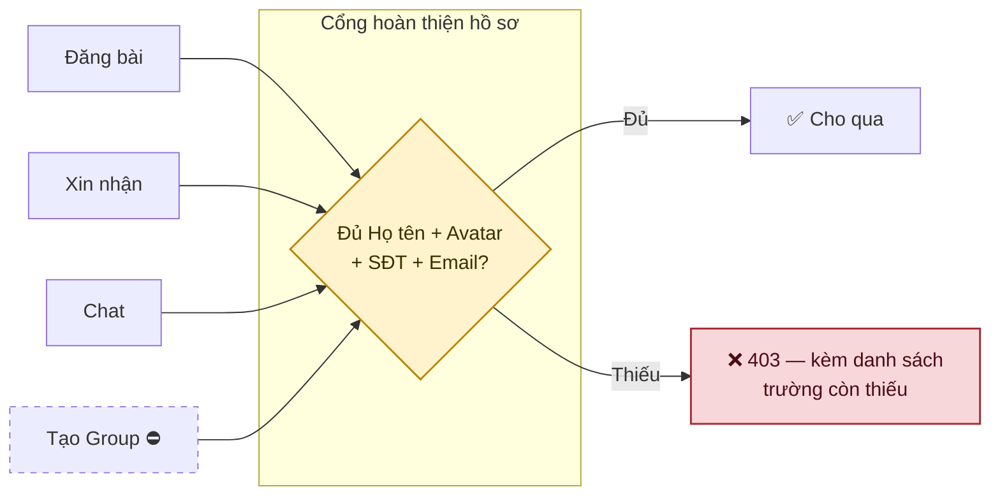
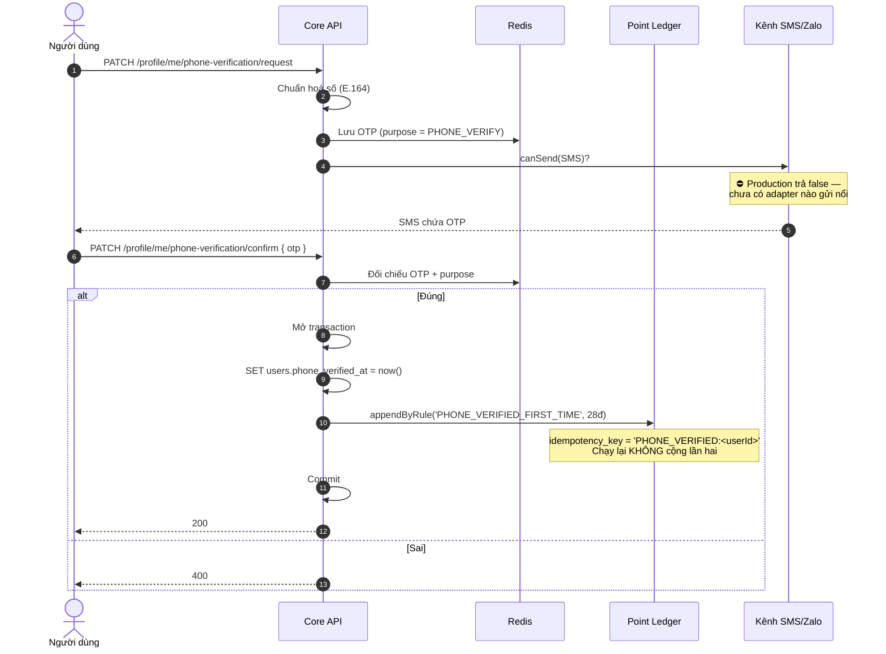
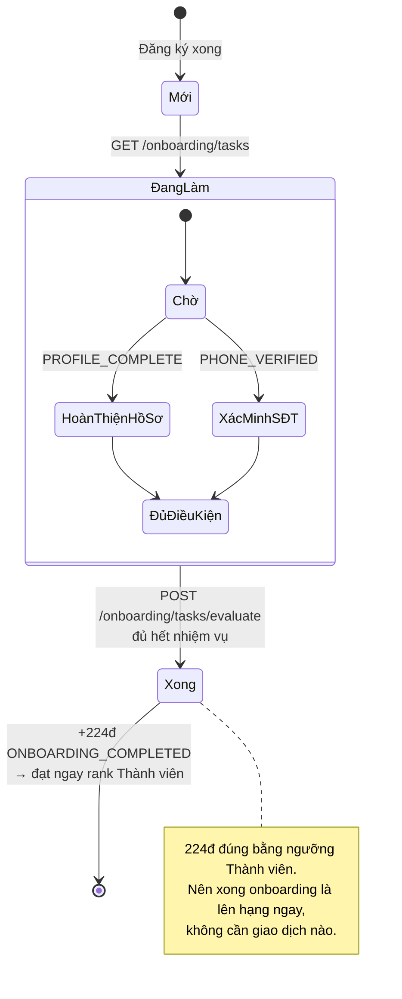
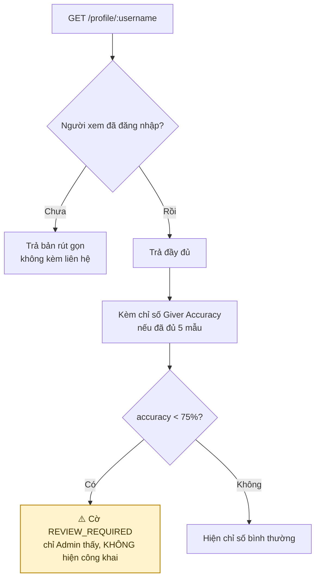

# 02 · Hồ sơ, xác minh & onboarding

## 2.1 Cổng hoàn thiện hồ sơ (F07)

**Chốt 2026-09-24:** cổng chặn **4 hành vi**, không chỉ đăng bài.

> **Vì sao trả về danh sách trường còn thiếu chứ không chỉ "hồ sơ chưa đủ".** Người dùng
> không đoán được mình thiếu gì, và mỗi lần đoán sai là một lần họ bỏ cuộc.

| Hành vi | Trạng thái chặn |
| --- | --- |
| Đăng bài | ✅ `assertOnboarded` — cổng hồ sơ **cộng** điều kiện đã qua Viewer |
| Xin nhận | ✅ `assertComplete` |
| Chat (đường **gửi**) | ✅ `assertComplete` |
| Tạo Group | ⛔ chưa có Group |

Gom về một `ProfileGate` thay vì viết lại ở từng use case — bốn nơi tự kiểm là bốn danh sách
trường bắt buộc có thể trôi khỏi nhau, và chỗ nào quên một trường thì chỗ đó lặng lẽ mở cửa.

> **Cổng đặt ở đường GỬI tin nhắn, không ở đường đọc.** Người hồ sơ chưa đủ vẫn phải đọc được
> tin nhắn gửi cho mình, nếu không họ mất luôn lời nhắn đang chờ.
>
> **Hồ sơ kiểm TRƯỚC rank.** Viewer thiếu SĐT phải nghe "thiếu SĐT" chứ không phải "chưa
> onboard" — điền SĐT chính là việc đưa họ ra khỏi Viewer.

## 2.2 Xác minh số điện thoại

> **Vì sao hai việc nằm trong một transaction.** Đánh dấu đã xác minh mà chưa kịp cộng điểm
> là mất điểm vĩnh viễn — lần sau vào sẽ thấy "đã xác minh rồi" và không cộng nữa. CLI
> `point:reconcile` là lưới an toàn thứ hai cho đúng ca này.

## 2.3 Onboarding

> **Lưu ý khi soát:** `ONBOARDING_COMPLETED = 224` trùng khít ngưỡng Thành viên (224). Đây
> có vẻ là chủ ý — "xong onboarding thì thành Thành viên" — nhưng nó cũng có nghĩa là
> **mốc hạng đầu tiên không đòi hỏi bất kỳ hoạt động trao tặng nào**. Cần xác nhận.

## 2.4 Hồ sơ công khai

> **Vì sao cờ xem xét không hiện công khai.** Cờ là tín hiệu để Admin xem, không phải một
> phán quyết. Gắn nhãn công khai lên hồ sơ một người dựa trên năm lượt đánh giá là kết tội
> trước khi có người thật nhìn qua.

## Chỗ cần soát

1. ✅ **Cổng F07 đã chặn đủ ba hành vi đang có.** Còn tạo Group thì chờ phân hệ Group.
2. **Onboarding cho 224đ = lên thẳng Thành viên** mà không cần giao dịch nào. Đúng ý chưa?
3. SMS/Zalo chưa có adapter nên **luồng xác minh SĐT không chạy được thật ở production**,
   kéo theo phần thưởng 28đ không phát sinh.
4. `last_login_at` sẽ đặt ở `users` — xem [01-auth](./01-auth.md).
