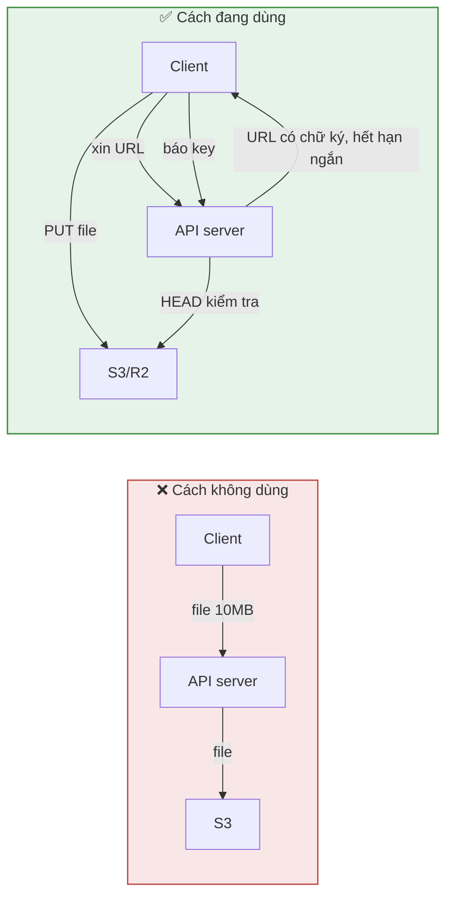
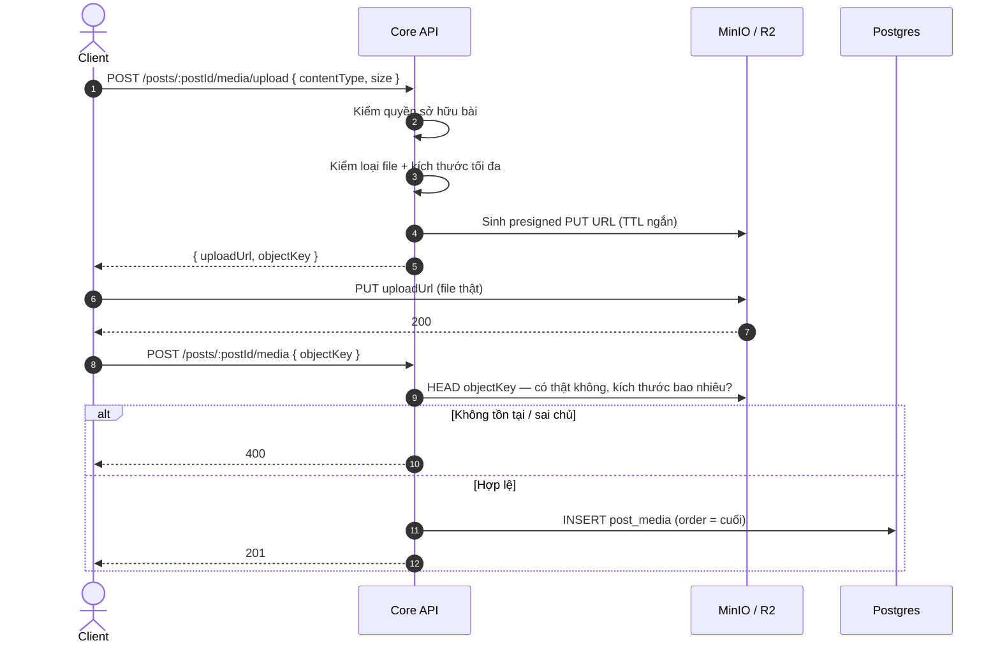
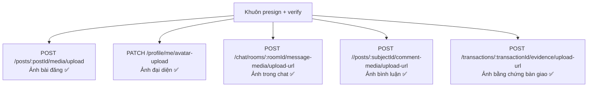
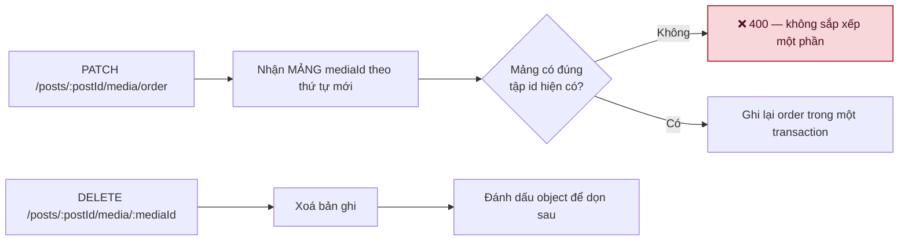

# 03 · Media & lưu trữ

Trạng thái: ✅ **đã hiện thực** (MinIO ở local/CI). 🟡 R2 staging/production chưa dựng.

## 3.1 Vì sao không upload thẳng qua API

> File không đi qua API server: không ăn băng thông, không chiếm worker, và một người upload
> video 500MB không làm chậm mọi request khác.

## 3.2 Luồng đầy đủ

> **Vì sao phải `HEAD` lại sau khi client báo key.** Client nói "tôi upload xong rồi" là một
> lời khai, không phải bằng chứng. Không kiểm thì một người gửi key trỏ vào object của người
> khác là gắn được ảnh của họ vào bài mình.

## 3.3 Ba nơi dùng cùng một khuôn

## 3.4 Sắp xếp và xoá

> **Vì sao sắp xếp phải gửi trọn mảng.** Gửi từng cặp "đổi chỗ A với B" thì hai request chồng
> nhau cho ra thứ tự không ai đoán được. Gửi trọn mảng là một phép gán, chạy lại bao nhiêu
> lần cũng ra cùng kết quả.

## Chỗ cần soát

1. **Object mồ côi chưa có ai dọn.** Client xin URL rồi bỏ ngang, hoặc upload xong không gọi
   bước xác nhận — object nằm lại trong bucket mãi mãi. Cần một job quét theo tuổi.
2. R2 staging/production chưa có bucket, key, CORS, CDN domain — hiện chỉ chạy MinIO.
3. Chưa có giới hạn tổng dung lượng theo người dùng. Dashboard KPI (F59) có mục "dung lượng
   lưu trữ" nhưng không có hạn mức nào chặn.
