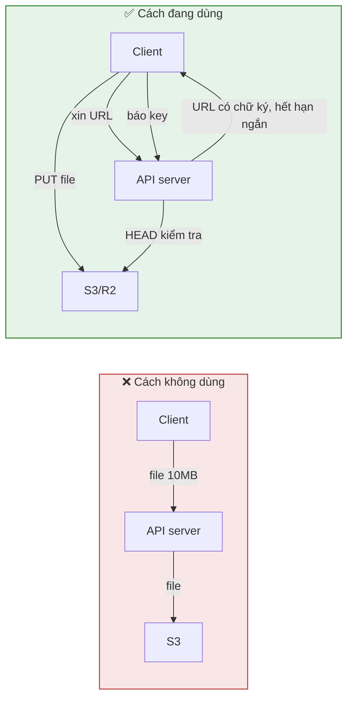
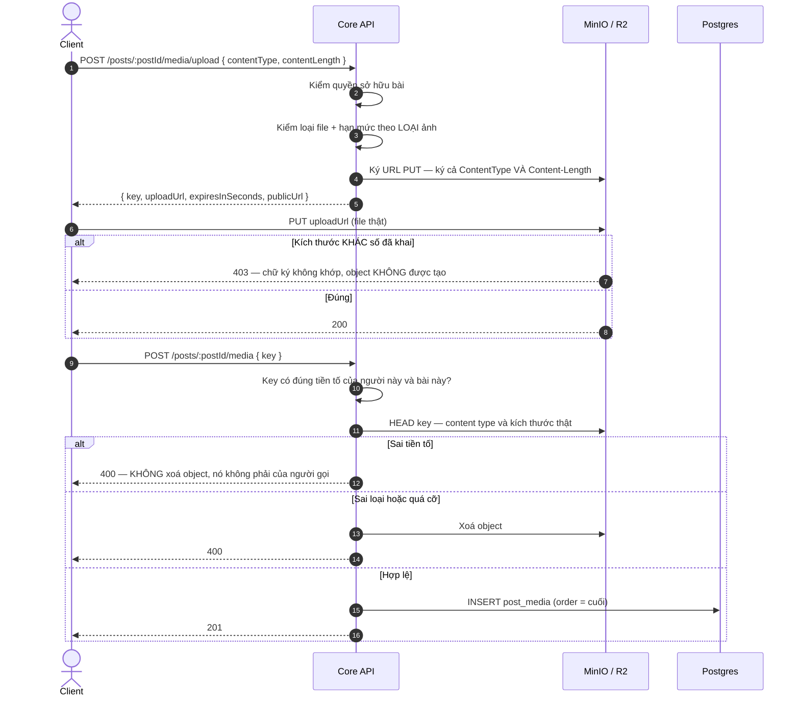
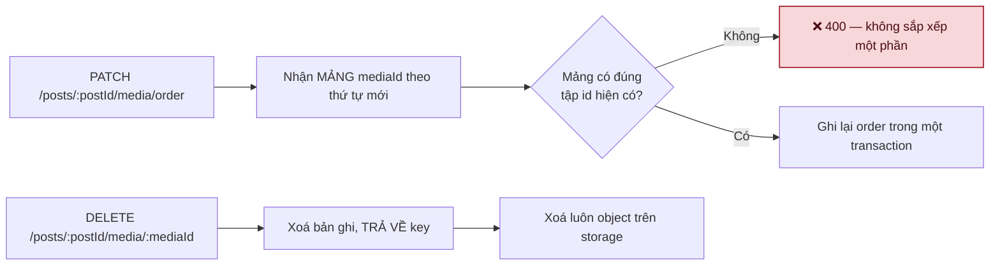
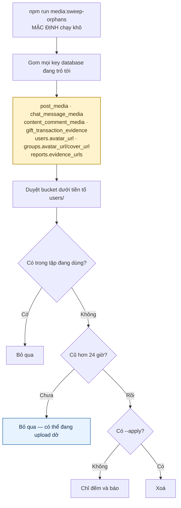

# 03 · Media & lưu trữ

Trạng thái: ✅ **đã hiện thực** (MinIO ở local/CI). 🟡 R2 staging/production chưa dựng.

Năm đường tải đi chung một khuôn, mỗi loại một hạn mức riêng (`MediaSizeLimits`, hiện đều
5 MB). Script kiểm trên MinIO thật: `npm run test:media-policy`.

## 3.1 Vì sao không upload thẳng qua API

> File không đi qua API server: không ăn băng thông, không chiếm worker, và một người upload
> video 500MB không làm chậm mọi request khác.

## 3.2 Luồng đầy đủ

> **Vì sao phải KÝ cả `Content-Length`.** Trước 26/09 URL chỉ ký `Bucket`, `Key` và
> `ContentType`; con số client khai chỉ dùng để kiểm ở tầng chính sách rồi vứt đi. Nghĩa là
> xin đường tải cho 1 KB rồi PUT 500 MB vẫn trôi — bất kỳ tài khoản nào cũng bơm được dung
> lượng tuỳ ý, và không bản ghi nào trong database nhắc rằng object đó tồn tại. Ký vào thì
> `content-length` nằm trong chữ ký: gửi lệch một byte là 403 và object không hề được tạo.
>
> Đã dựng lại trên MinIO thật để chắc chắn chữ ký không làm hỏng lần tải đúng —
> `npm run test:media-policy`.

> **Vì sao xoá object khi từ chối, nhưng KHÔNG xoá khi sai tiền tố.** Sai loại hay quá cỡ thì
> object đã nằm trong bucket và người gọi sẽ không quay lại dọn hộ. Còn sai tiền tố nghĩa là
> object đó **của người khác** — xoá nó là biến endpoint xác nhận thành công cụ xoá ảnh người
> ta, chỉ cần đoán đúng một key.

> **Vì sao phải `HEAD` lại sau khi client báo key.** Client nói "tôi upload xong rồi" là một
> lời khai, không phải bằng chứng. Không kiểm thì một người gửi key trỏ vào object của người
> khác là gắn được ảnh của họ vào bài mình.

## 3.3 Năm nơi dùng cùng một khuôn

## 3.4 Sắp xếp và xoá

> **Vì sao sắp xếp phải gửi trọn mảng.** Gửi từng cặp "đổi chỗ A với B" thì hai request chồng
> nhau cho ra thứ tự không ai đoán được. Gửi trọn mảng là một phép gán, chạy lại bao nhiêu
> lần cũng ra cùng kết quả.

> **Xoá object đứng SAU khi bản ghi đã xoá, và cố ý ngoài transaction.** S3 không tham gia
> transaction database được. Chết giữa chừng theo thứ tự này để lại một object mồ côi — thứ
> `media:sweep-orphans` dọn. Làm ngược lại thì để lại một bản ghi trỏ vào ảnh không còn tồn
> tại, và người xem thấy ô ảnh vỡ.

## 3.5 Dọn object mồ côi — ✅ 26/09

> **Vì sao mặc định KHÔNG xoá, và vì sao lịch cron cũng chạy khô.** Danh sách nguồn key trong
> mã là thứ duy nhất đứng giữa job này và ảnh thật. Thiếu một dòng ở đó nghĩa là toàn bộ ảnh
> của phân hệ tương ứng bị coi là mồ côi và bị xoá sạch. **Thêm bảng mới có lưu key thì phải
> thêm vào danh sách đó.**

> **Vì sao chờ 24 giờ.** Giữa lúc client PUT xong và lúc gọi bước xác nhận có một khoảng
> trống. Quét quá sát là xoá ảnh của người đang upload dở, và họ thấy ảnh biến mất ngay sau
> khi tải lên xong.

## Chỗ cần soát

1. ⛔ **Bucket đang MỞ ĐỌC cho tất cả** (`mc anonymous set download`). Ảnh bài đăng công khai
   thì đúng, nhưng **ảnh chat riêng tư và ảnh bằng chứng bàn giao** cũng đọc được bởi bất kỳ
   ai có URL, vĩnh viễn — bảo mật dựa hoàn toàn vào UUID trong key không đoán được. Ảnh bằng
   chứng có thể là mặt người, cửa nhà, giấy tờ. **Cần Bên A chốt:** chấp nhận "URL là chìa
   khoá", hay tách chat + bằng chứng sang presigned GET có hạn?
2. ✅ **Object mồ côi đã có job dọn** — `media:sweep-orphans`, chạy khô theo lịch.
3. R2 staging/production chưa có bucket, key, CORS, CDN domain — hiện chỉ chạy MinIO.
4. Chưa có giới hạn tổng dung lượng theo người dùng. Dashboard KPI (F59) có mục "dung lượng
   lưu trữ" nhưng không có hạn mức nào chặn. Hạn mức theo TỪNG ảnh thì đã tách theo loại
   (`MediaSizeLimits`), hiện đều 5 MB.
