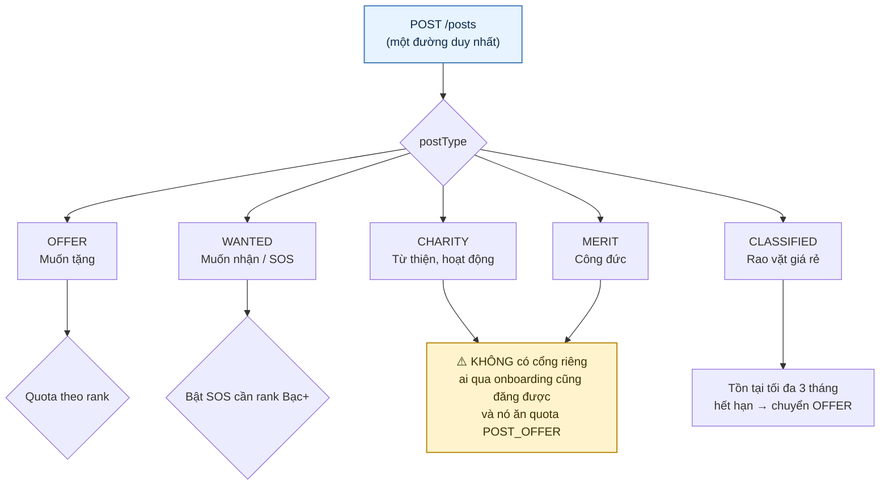
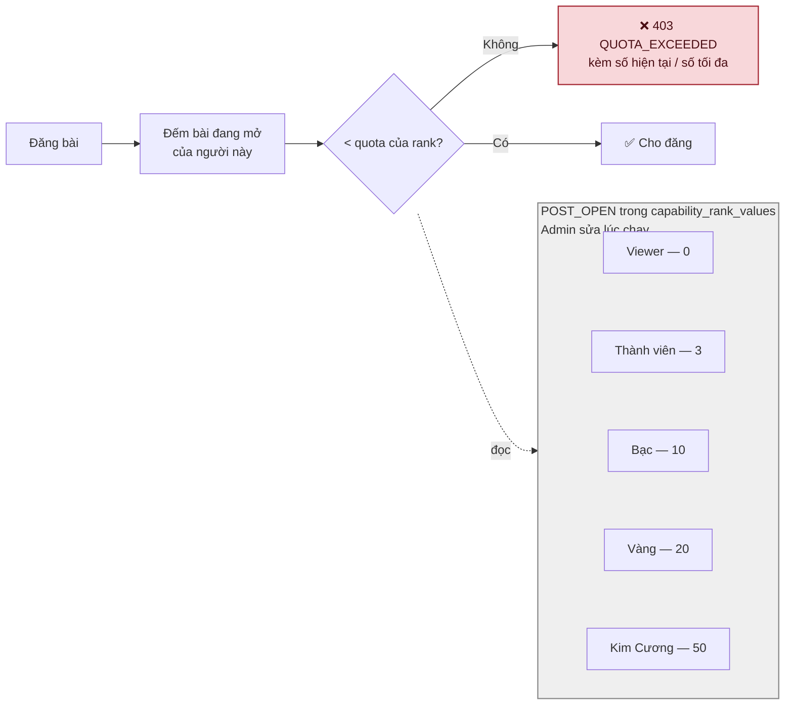
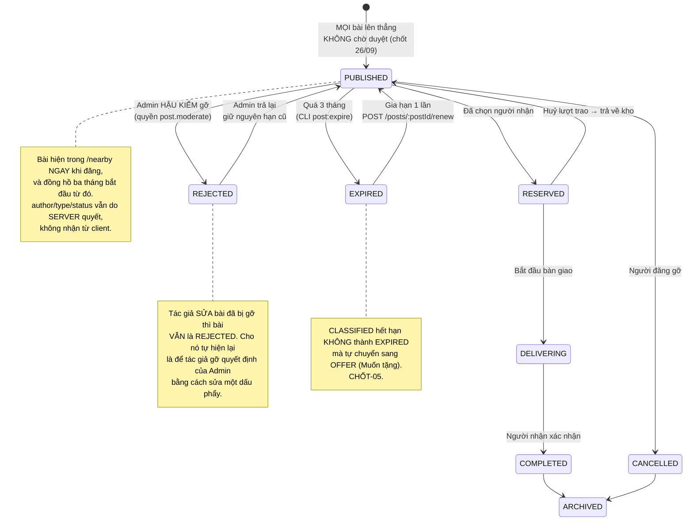
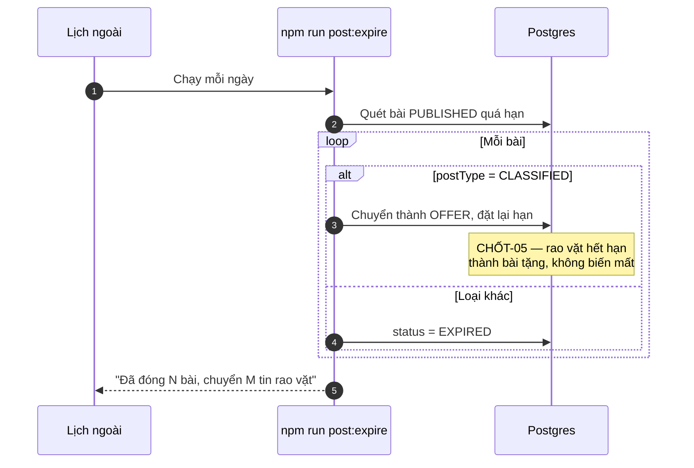
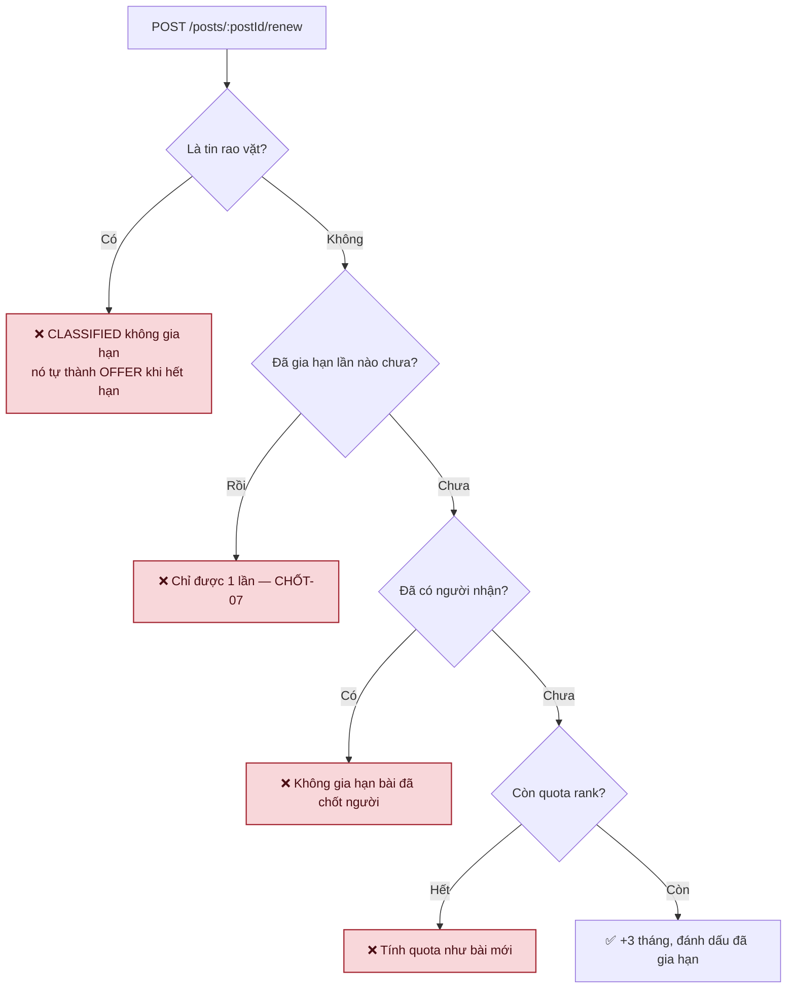
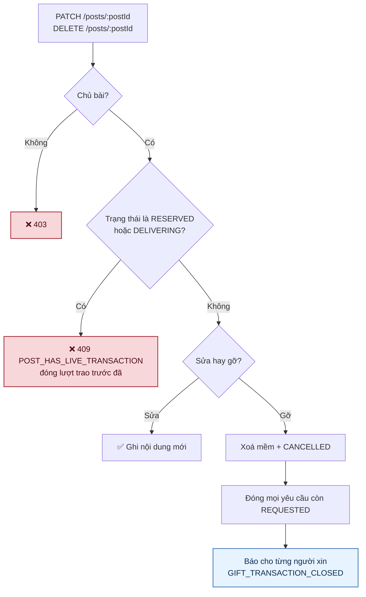
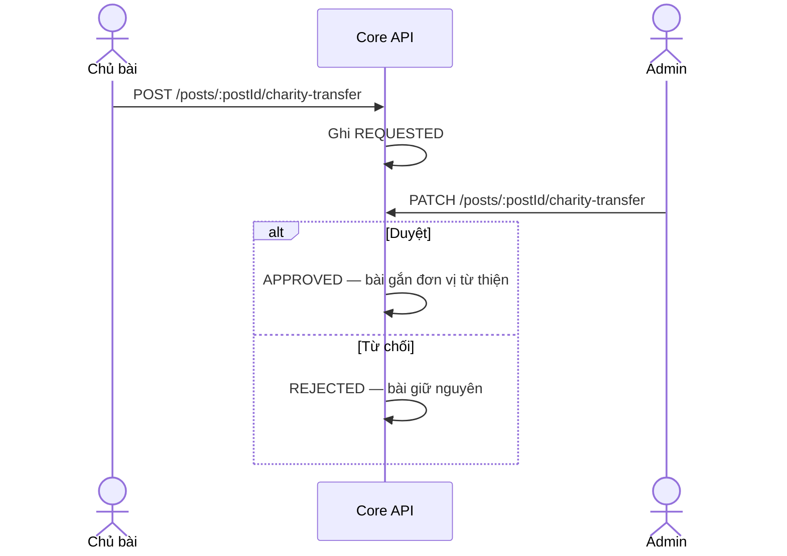

# 04 · Bài đăng

Trạng thái: ✅ **đã hiện thực**. Năm loại bài đi chung **một** endpoint `POST /posts`.

## 4.1 Năm loại bài

> ⚠️ **Sơ đồ cũ ghi CHARITY cần "Kim Cương đề xuất → Admin duyệt" — trong mã KHÔNG có gì như
> vậy.** Không cổng theo hạng, không bước duyệt. `CHARITY` và `MERIT` hiện chỉ khác `OFFER` ở
> chỗ chúng không mang trường riêng nào, và cả hai đều ăn quota `POST_OFFER`. Cần Bên A chốt
> có muốn cổng thật không.

> **Vì sao một endpoint chứ không năm.** Năm đường riêng thì năm chỗ kiểm quyền, năm chỗ kiểm
> quota, năm chỗ kiểm media — và chỉ cần sót một chỗ là có một lối vào không được canh.

## 4.2 Quota theo rank

> Con số là **baseline**, Admin chỉnh qua `POST /api/v1/admin/entitlements` không cần deploy.
> Viewer 0 nghĩa là **phải xong onboarding mới đăng được bài** — đó là cổng vào thật sự.

> ✅ **Chốt 26/09: MỘT hạn mức `POST_OPEN` cho mọi loại bài.** Trước đó có hai capability
> `POST_OFFER` và `POST_WANTED`, mỗi cái một bộ số theo hạng — nhưng phép đếm vẫn là **mọi
> bài đang mở, bất kể loại**, rồi so với con số của loại đang đăng. Tức hai cái thước đo cùng
> một rổ.
>
> Hôm đó hai số bằng nhau nên không ai thấy gì. Đặt lệch đi là ra kết quả khó đoán: với
> `POST_WANTED=10`, `POST_OFFER=3` và 5 bài OFFER đang mở thì **đăng WANTED được** (5 < 10)
> mà **đăng OFFER không** (5 ≥ 3). Gộp lại không đổi hạn mức thực tế của ai — chỉ làm cấu
> hình nói đúng điều nó làm.
>
> Migration chép số từ `POST_OFFER` **đang có** chứ không từ hằng số gốc: Admin có thể đã
> chỉnh, và ghi đè bằng baseline là lặng lẽ huỷ thay đổi của họ. Các bản cấu hình **cũ giữ
> nguyên** hai capability kia — chúng là lịch sử, và một bút toán điểm cũ phải tra lại được
> nó ra đời dưới luật nào.

## 4.3 Vòng đời bài đăng

> **Chốt 26/09: bỏ duyệt TRƯỚC, chuyển sang hậu kiểm.** Bài lên thẳng. Admin vẫn gỡ được bất
> cứ lúc nào qua `PATCH /admin/posts/:postId/moderation`, nhưng **không** chạm được vào bài
> đang có giao dịch sống (`RESERVED`/`DELIVERING`) hay đã đóng — gỡ ngang một lượt trao đang
> diễn ra để lại hai người đã hẹn nhau mà bài thì biến mất.

## 4.4 Hết hạn và gia hạn

## 4.5 Sửa và gỡ bài — ✅ siết 26/09

> **Vì sao chặn cả sửa lẫn gỡ ở đúng hai trạng thái đó.** Trước 26/09 hai đường này chỉ kiểm
> chủ sở hữu. Người tặng đã chốt người nhận vẫn **gỡ được bài**, để bên kia lại với một giao
> dịch trỏ vào bài không còn tồn tại; và vẫn **sửa được nội dung**, nên người nhận đồng ý "tủ
> lạnh còn tốt" rồi mở lại thấy "quạt cũ" — với tin rao vặt thì sửa được cả giá. Không bản ghi
> nào nói nội dung từng khác.
>
> Hai trạng thái này trùng đúng danh sách mà **xoá tài khoản** và **hậu kiểm của Admin** đã
> chặn từ trước. Chỉ đường của chính tác giả là không canh gì — mà đó lại là nút dễ bấm nhất.

> **Vì sao gỡ bài phải đóng các yêu cầu còn treo.** Không đóng thì người xin không bao giờ
> nhận được câu trả lời, và mỗi yêu cầu treo vẫn ăn một suất trong trần "yêu cầu đang mở" của
> họ — tức gỡ một bài là khoá bớt chỗ của người khác. Đẩy thông báo hỏng KHÔNG làm hỏng việc
> gỡ bài: bài đã gỡ xong rồi, ném ở đây chỉ khiến client bấm lại và nhận 404.

## 4.6 Chuyển bài sang từ thiện

## Chỗ cần soát

1. ⚠️ **`CHARITY` và `MERIT` không có cổng nào.** Ai qua onboarding cũng đăng được, và cả hai
   ăn quota `POST_OFFER`. Sơ đồ cũ hứa một cổng không tồn tại. F65 nói Admin quản lý đơn vị
   Công đức — chưa có gì.
2. **Quota đếm "bài đang mở"** — bài `EXPIRED` và `COMPLETED` không tính. Đúng ý chưa?
3. **Gia hạn tính quota như bài mới**, nên người đang đầy quota không gia hạn được bài cũ dù
   không tạo thêm bài nào. Có thể gây khó chịu — cần xác nhận.
4. **SOS (`WANTED` gấp)** mở theo capability `POST_SOS`, mặc định Bạc trở lên. Con số này
   vẫn đang là giả định chờ Bên A xác nhận.
