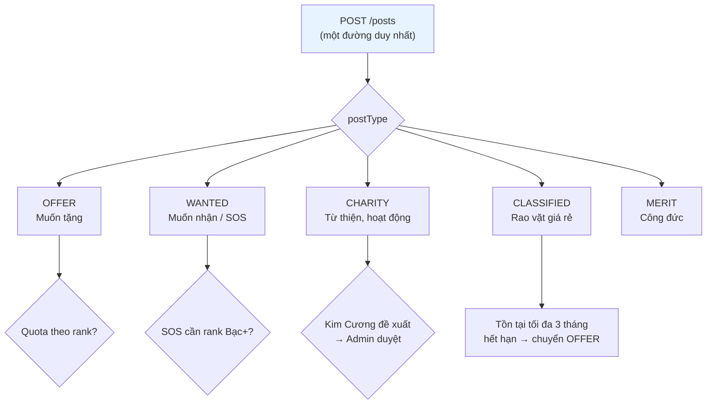
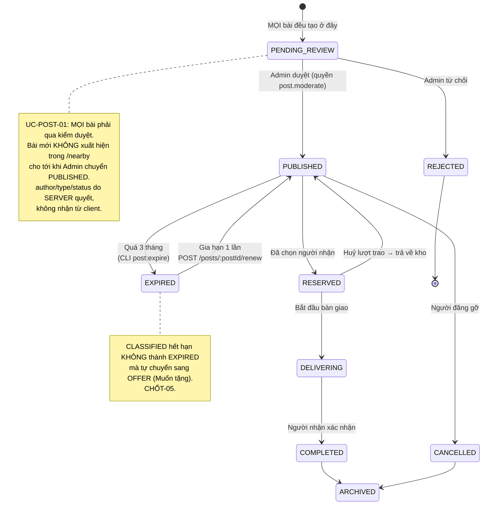
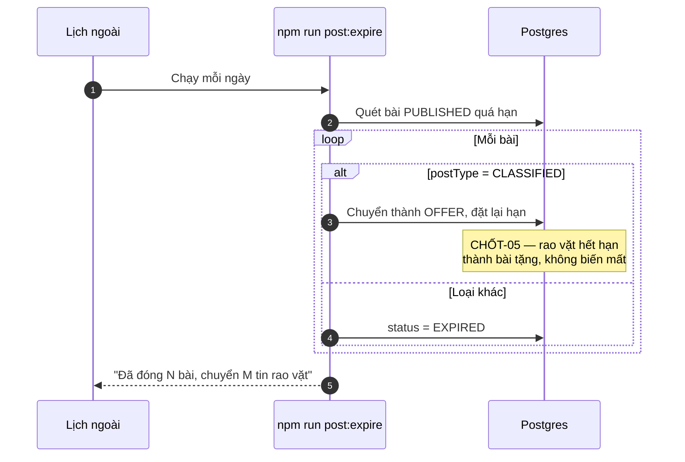
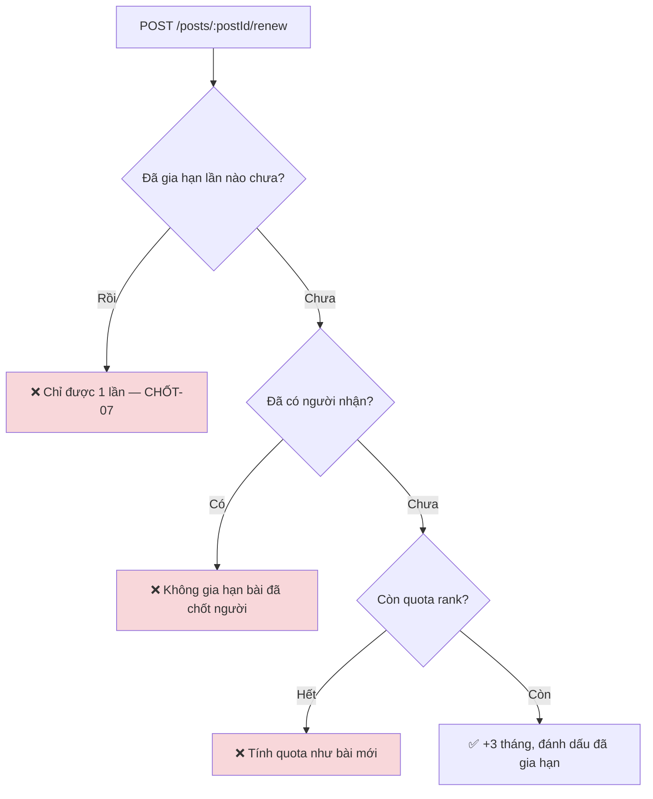
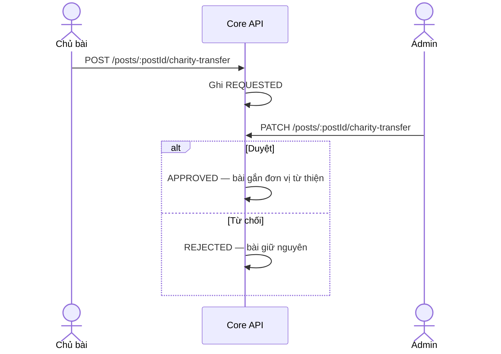

# 04 · Bài đăng

Trạng thái: ✅ **đã hiện thực**. Năm loại bài đi chung **một** endpoint `POST /posts`.

## 4.1 Năm loại bài



> **Vì sao một endpoint chứ không năm.** Năm đường riêng thì năm chỗ kiểm quyền, năm chỗ kiểm
> quota, năm chỗ kiểm media — và chỉ cần sót một chỗ là có một lối vào không được canh.

## 4.2 Quota theo rank

```mermaid
flowchart LR
    A[Đăng bài] --> B["Đếm bài đang mở<br/>của người này"]
    B --> C{"< quota của rank?"}
    C -->|Không| D[❌ 403 QUOTA_EXCEEDED<br/>kèm số hiện tại / số tối đa]
    C -->|Có| E[✅ Cho đăng]

    subgraph Cấu hình["capability_rank_values — Admin sửa lúc chạy"]
        R1["Viewer — 0"]
        R2["Thành viên — 3"]
        R3["Bạc — 10"]
        R4["Vàng — 20"]
        R5["Kim Cương — 50"]
    end
    C -.đọc.-> Cấu hình

    style D fill:#f8d7da
    style Cấu hình fill:#f0f0f0
```

> Con số là **baseline**, Admin chỉnh qua `POST /api/v1/admin/entitlements` không cần deploy.
> Viewer 0 nghĩa là **phải xong onboarding mới đăng được bài** — đó là cổng vào thật sự.

## 4.3 Vòng đời bài đăng



## 4.4 Hết hạn và gia hạn





## 4.5 Chuyển bài sang từ thiện



## Chỗ cần soát

1. **Quota đếm "bài đang mở"** — bài `EXPIRED` và `COMPLETED` không tính. Đúng ý chưa?
2. **Gia hạn tính quota như bài mới**, nên người đang đầy quota không gia hạn được bài cũ dù
   không tạo thêm bài nào. Có thể gây khó chịu — cần xác nhận.
3. **SOS (`WANTED` gấp)** mở theo capability `POST_SOS`, mặc định Bạc trở lên. Con số này
   vẫn đang là giả định chờ Bên A xác nhận.
4. Bài `MERIT` (Công đức) hiện chỉ có chỗ đăng, **chưa có luồng nghiệp vụ riêng** — F65 nói
   Admin quản lý đơn vị Công đức nhưng chưa có gì.
