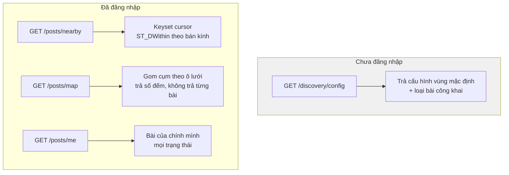
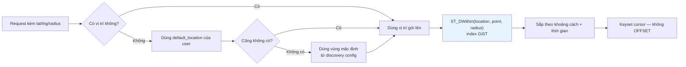
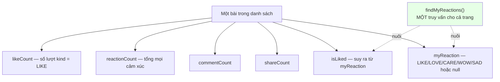
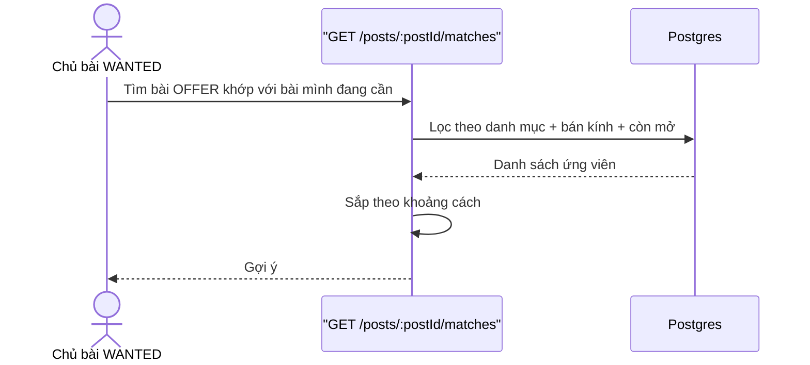

# 05 · Khám phá & feed

Trạng thái: ✅ **đã hiện thực**.

## 5.1 Ba đường đọc bài

> **Vì sao bản đồ trả cụm chứ không trả từng bài.** Một thành phố có 50.000 bài; trả hết là
> vài chục MB cho một lần kéo bản đồ. Gom cụm cho ra vài trăm điểm, và người dùng zoom vào
> mới cần chi tiết.

## 5.2 Truy vấn theo vị trí

> **Vì sao keyset chứ không `OFFSET`.** `OFFSET 10000` bắt Postgres đọc và bỏ đi 10.000 dòng
> mỗi lần. Keyset mang theo mốc của dòng cuối và đọc tiếp từ đó — trang thứ 1.000 nhanh bằng
> trang đầu. Và khi có bài mới chen vào, `OFFSET` làm người dùng thấy lặp hoặc nhảy bài.

## 5.3 Dữ liệu đính kèm mỗi bài

> **Vì sao gom một truy vấn cho cả trang.** Hỏi từng bài "người này đã thả cảm xúc chưa" là
> 20 truy vấn cho một trang 20 bài. Gom lại còn một, và `isLiked` suy ra từ `myReaction` chứ
> không hỏi thêm lần nữa.

## 5.4 Smart match

## Chỗ cần soát

1. **Smart match hiện chỉ khớp theo danh mục + khoảng cách.** Không tính tới rank người tặng,
   lịch sử, hay từ khoá trong mô tả. Đủ chưa?
2. **Guest discovery** trả cấu hình vùng mặc định — cần chốt vùng đó là gì (Hà Nội? toàn
   quốc?) và bán kính bao nhiêu.
3. Chưa có **bộ lọc theo loại bài** trên `nearby`. Người chỉ muốn xem Muốn Tặng vẫn thấy cả
   rao vặt và từ thiện.
