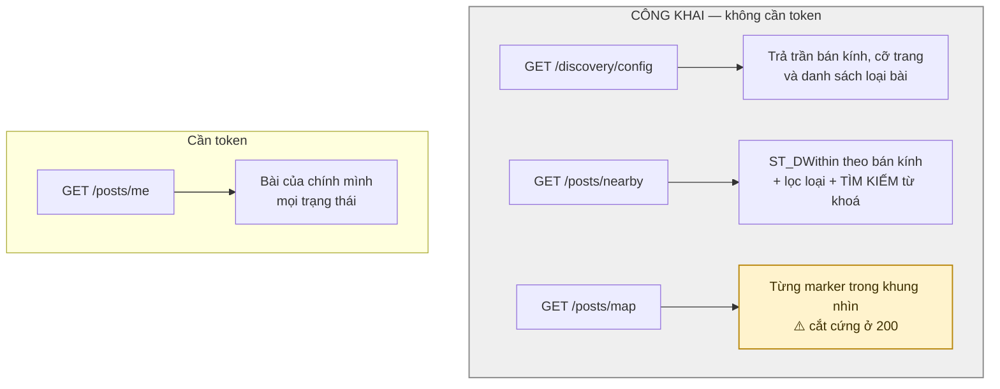
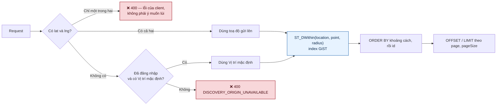
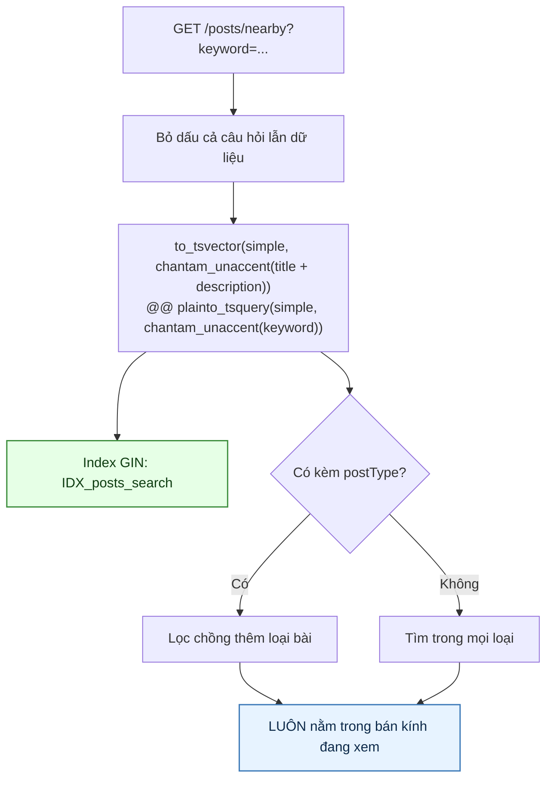
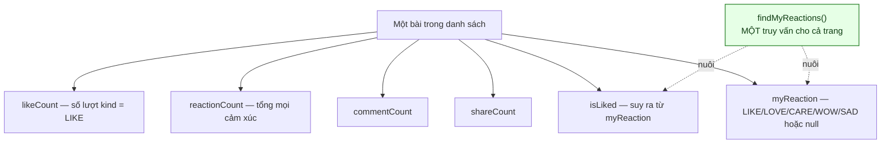
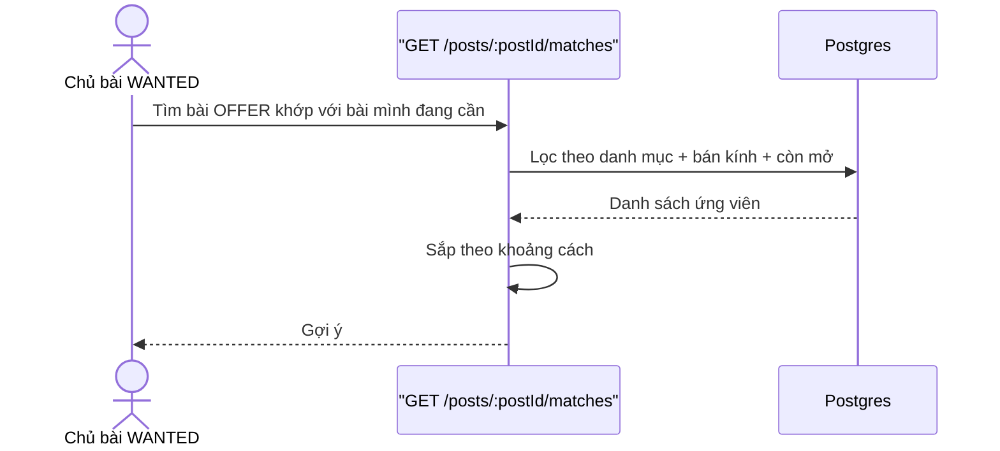

# 05 · Khám phá & feed

Trạng thái: ✅ **đã hiện thực**, gồm cả tìm kiếm theo từ khoá (26/09).

## 5.1 Bốn đường đọc bài

> **`nearby` và `map` là CÔNG KHAI.** Khách chưa đăng nhập xem được, miễn là gửi kèm toạ độ —
> không có token thì không có Vị trí mặc định để lùi về.

> ⚠️ **Bản đồ KHÔNG gom cụm.** Sơ đồ cũ mô tả một cơ chế gom cụm theo ô lưới trả về số đếm;
> thực tế trả **từng marker**, kèm tiêu đề, cờ SOS và ảnh thumbnail, **cắt cứng ở 200** không
> báo gì. Khu đông bài thì người dùng thấy 200 marker "nào đó" — không thứ tự đảm bảo, không
> cờ nói còn nữa, và zoom ra thấy bản đồ trống hơn thực tế mà không hiểu vì sao.

## 5.2 Truy vấn theo vị trí

> **KHÔNG có nhánh lùi thứ ba.** Sơ đồ cũ vẽ "dùng vùng mặc định từ discovery config" — mã cố
> ý **không** làm thế, và có ghi chú giải thích: trả kết quả quanh một điểm người dùng không
> chọn là nói sai về thứ họ đang xem. `discovery/config` chỉ trả trần bán kính và cỡ trang,
> không trả toạ độ nào.

> **Phân trang là OFFSET, không phải keyset.** Sơ đồ cũ khẳng định ngược lại. Keyset chỉ dùng
> cho chat. Đổi `nearby` sang keyset là đổi hợp đồng API (bỏ `page`), nên tạm thời vá bằng
> **tiebreak `post.id`** trong `ORDER BY`: thiếu nó thì hai bài cùng khoảng cách không có thứ
> tự đảm bảo giữa hai lần chạy, và lật trang sẽ lặp bài hoặc bỏ sót bài.

## 5.3 Tìm kiếm — ✅ 26/09

> **Tìm kiếm là một THAM SỐ của feed, không phải một endpoint riêng.** Cùng một lần gọi vừa
> lọc loại bài, vừa lọc danh mục, vừa tìm từ khoá, vừa giới hạn bán kính. Tách ra thành
> `/posts/search` sẽ có hai đường trả về hai hình dạng cho cùng một thứ, và client phải đổi
> đường gọi mỗi khi người dùng gõ hay xoá ô tìm kiếm.

> **Luôn giới hạn trong bán kính** (chốt 26/09). Đây là sàn cho–nhận: tìm ra một món ở cách
> 800 km là tìm ra một món không ai tới lấy được.

> **Không phân biệt dấu.** Gõ `noi com dien` ra `Nồi cơm điện`. `unaccent` mặc định là STABLE
> nên không đánh index được; bọc lại thành `chantam_unaccent` IMMUTABLE có chỉ rõ từ điển mới
> index được. **Biểu thức trong index phải trùng khít với biểu thức trong câu truy vấn** — sai
> một ký tự là Postgres lặng lẽ quét tuần tự cả bảng, và không ai thấy gì cho tới khi bảng đủ
> lớn. `test:lifecycle` có một phép kiểm `EXPLAIN` canh đúng chuyện đó.

> **`plainto_tsquery` chứ không `to_tsquery`:** người dùng gõ tự do, và `to_tsquery` ném lỗi
> cú pháp ngay khi gặp một dấu `&` hay dấu nháy.

> **Cách khớp:** mọi từ phải cùng xuất hiện, và khớp theo **từ trọn vẹn** — `nồi cơ` không ra
> `nồi cơm`. Muốn gõ tới đâu gợi ý tới đó thì cần thêm khớp tiền tố, chưa làm.

## 5.4 Dữ liệu đính kèm mỗi bài

> **Vì sao gom một truy vấn cho cả trang.** Hỏi từng bài "người này đã thả cảm xúc chưa" là
> 20 truy vấn cho một trang 20 bài. Gom lại còn một, và `isLiked` suy ra từ `myReaction` chứ
> không hỏi thêm lần nữa.

## 5.5 Smart match

> **Khác tìm kiếm ở §5.3.** Smart match chạy **tự động**, từ khoá lấy từ chính bài WANTED của
> người dùng chứ họ không gõ gì. Tìm kiếm là người dùng chủ động hỏi.

## Chỗ cần soát

1. ⛔ **Bản đồ cắt 200 marker không báo gì** — xem §5.1. Hai hướng: trả thêm `total` và cờ
   `truncated` (nhanh), hay gom cụm thật như sơ đồ cũ hứa (việc lớn). Chờ Bên A chọn.
2. ⚠️ **Phân trang vẫn là OFFSET.** Đã vá thứ tự bằng tiebreak nên không còn lặp/sót bài,
   nhưng trang thứ 1.000 vẫn bắt Postgres đọc rồi bỏ đi 20.000 dòng. Chuyển sang keyset là
   đổi hợp đồng API.
3. **Smart match chỉ khớp theo danh mục + khoảng cách + từ khoá lấy từ tiêu đề bài.** Không
   tính rank người tặng hay lịch sử. Đủ chưa?
4. **Tìm kiếm khớp theo từ trọn vẹn**, chưa có gợi ý theo tiền tố khi đang gõ. Cần không?
5. **Khách chưa đăng nhập phải tự gửi toạ độ.** Không có token thì không có Vị trí mặc định
   để lùi về, và hệ thống cố ý không chọn hộ một vùng nào.
6. **Feed không loại bài của chính mình** — bạn thấy bài mình vừa đăng lẫn trong danh sách.
   Cần chốt.
