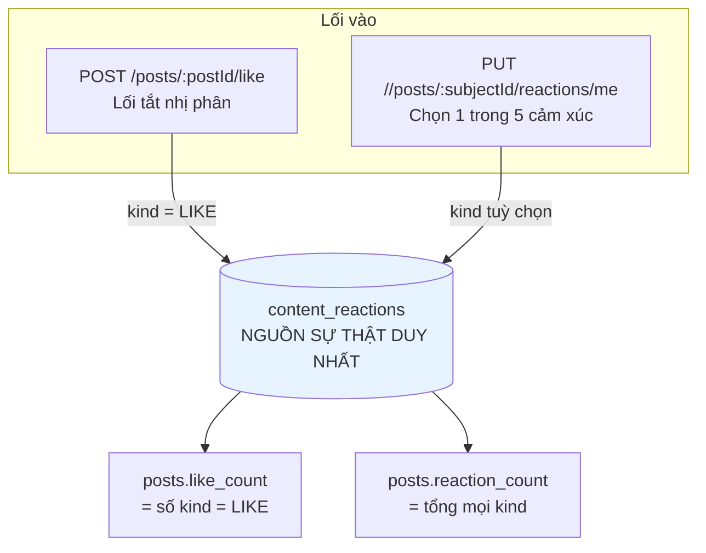
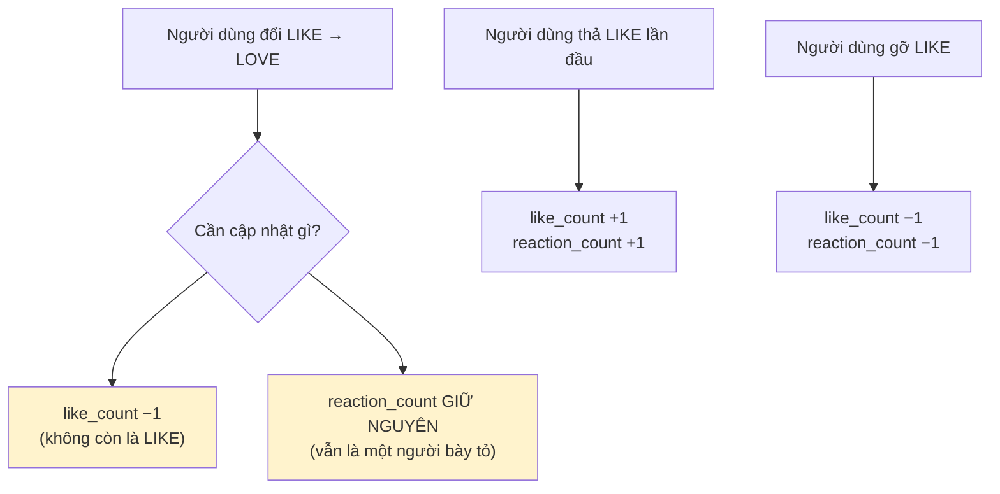
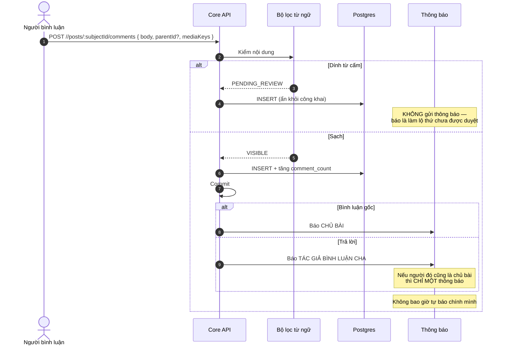
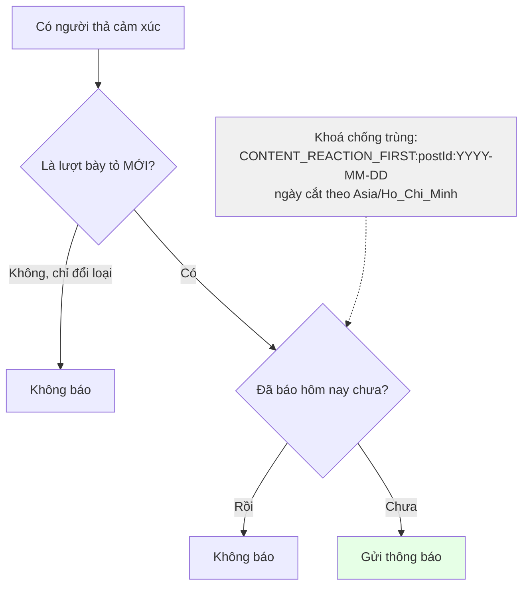
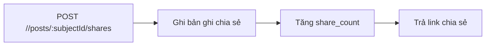

# 06 · Tương tác — cảm xúc, bình luận, chia sẻ

Trạng thái: ✅ **đã hiện thực**, gồm cả việc gộp hai hệ thống "thích" trùng nhau.

## 6.1 Một nguồn sự thật, hai lối vào



> **Vì sao giữ cả hai lối vào.** Trước đây hai nhánh code tạo ra hai bảng riêng, và
> `GET /posts/:id` trả **hai con số thích khác nhau** cho cùng một bài. Gộp về một bảng giữ
> được cả nút thích quen thuộc lẫn năm cảm xúc, mà chỉ còn một con số đúng.

## 6.2 Đổi cảm xúc — chỗ dễ sai nhất



Câu SQL phải biết **loại cũ** trước khi ghi loại mới:

```sql
WITH prev AS (
  SELECT kind FROM content_reactions
  WHERE subject_type = $1 AND subject_id = $2 AND user_id = $3
  FOR UPDATE
), upserted AS (
  INSERT INTO content_reactions (subject_type, subject_id, user_id, kind)
  VALUES ($1, $2, $3, $4)
  ON CONFLICT (subject_type, subject_id, user_id)
  DO UPDATE SET kind = EXCLUDED.kind, updated_at = now()
  RETURNING (xmax = 0) AS inserted
)
SELECT upserted.inserted, prev.kind AS old_kind
FROM upserted LEFT JOIN prev ON true
```

> `xmax = 0` phân biệt **chèn mới** với **cập nhật do đụng khoá**. Không có nó thì không biết
> nên cộng `reaction_count` hay giữ nguyên.

## 6.3 Bình luận và trả lời



## 6.4 Cảm xúc — chỉ báo lần đầu trong ngày



> **Vì sao chỉ một lần mỗi ngày.** Một bài 200 lượt cảm xúc mà báo 200 lần thì tác giả tắt
> thông báo, và từ đó mất luôn thông báo về lượt xin nhận — thứ thật sự quan trọng.
>
> **Vì sao cắt ngày theo giờ Việt Nam.** Cắt theo UTC thì "lần đầu trong ngày" rơi vào 7 giờ
> sáng, và người dùng thấy hai thông báo trong cùng một buổi sáng.

## 6.5 Chia sẻ



## Chỗ cần soát

1. **Bình luận `PENDING_REVIEW` hiện không có hàng đợi Admin riêng.** Nó nằm đó chờ, nhưng
   không ai được nhắc là có thứ đang chờ duyệt.
2. Bộ lọc từ ngữ dùng **danh sách tĩnh trong code** — chưa đưa ra cấu hình Admin.
3. Cảm xúc trên **bình luận** có `reaction_count` nhưng không có `like_count` (bình luận
   không có nút thích riêng). Đúng ý chưa?
4. Chưa có giới hạn số bình luận / phút — chống spam hiện chỉ dựa vào bộ lọc từ ngữ.
