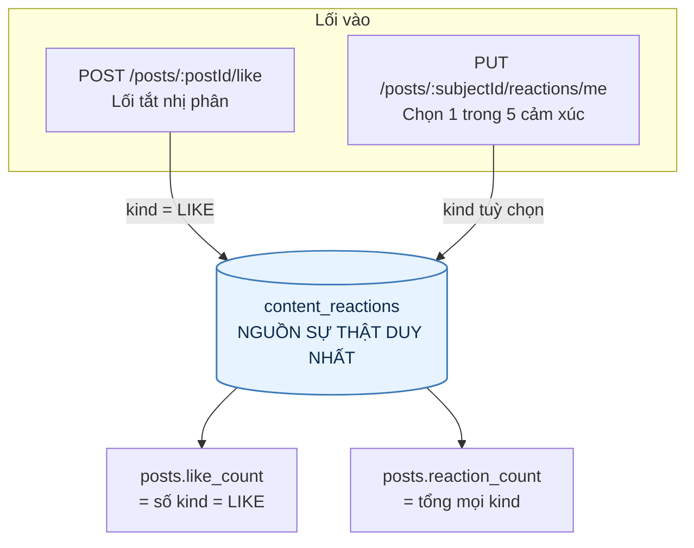
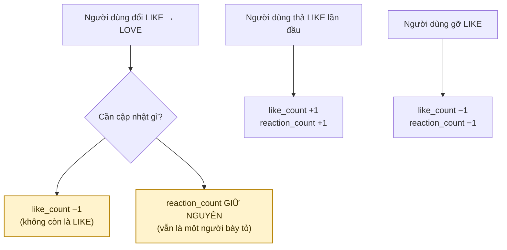
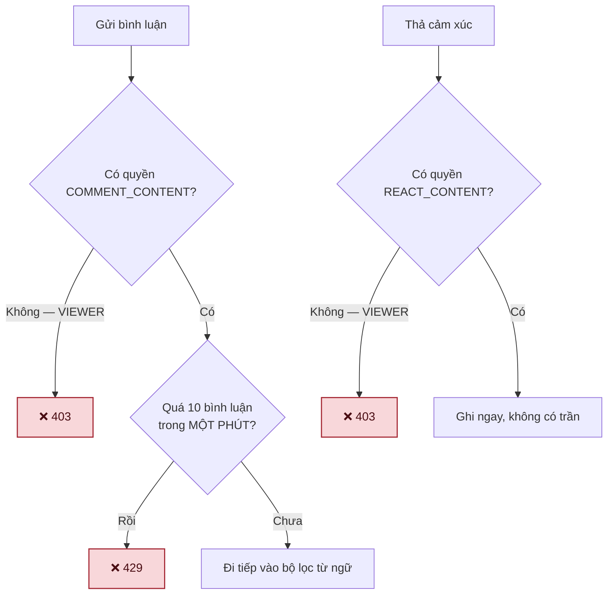
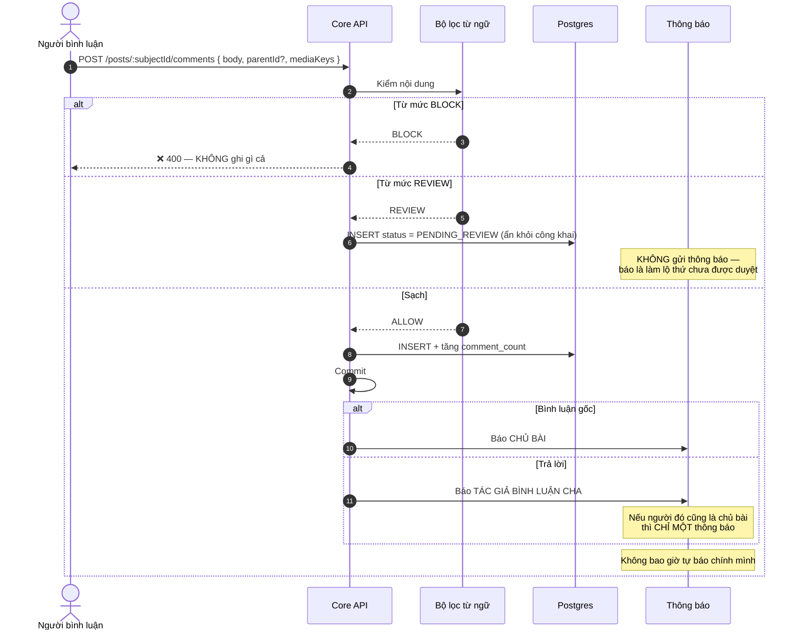
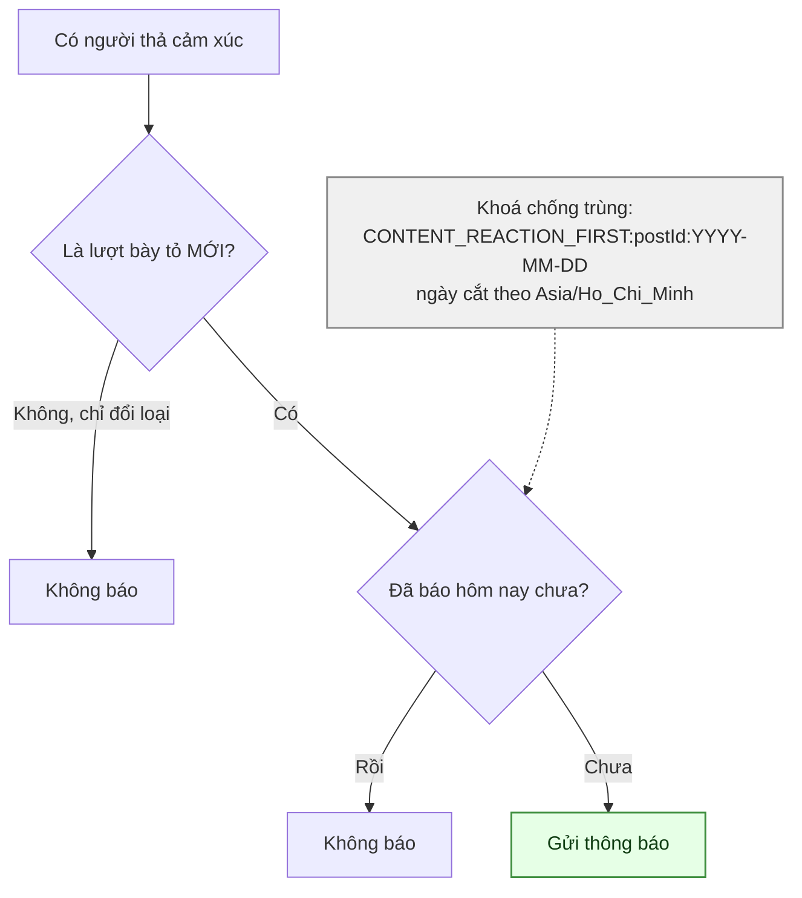
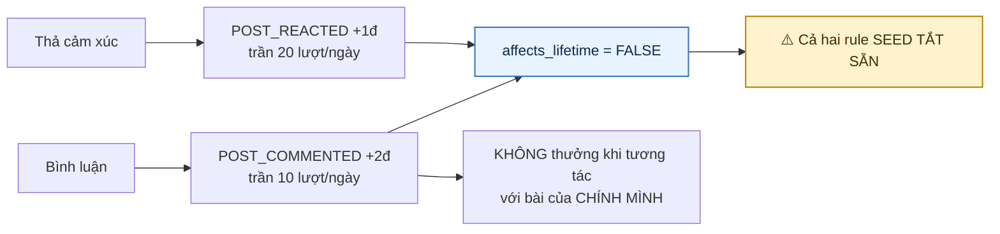
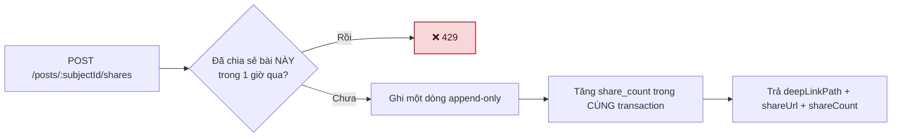
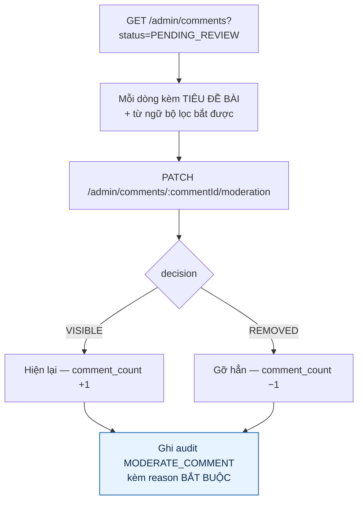

# 06 · Tương tác — cảm xúc, bình luận, chia sẻ

Trạng thái: ✅ **đã hiện thực**, gồm cả việc gộp hai hệ thống "thích" trùng nhau.

**Mười lăm endpoint:** một lối tắt `like`, năm endpoint cảm xúc (trên **bài** và trên **bình
luận**), sáu endpoint bình luận (xin link ảnh, tạo, đọc, đọc trả lời, sửa, gỡ), một endpoint
chia sẻ, và **hai endpoint hàng đợi kiểm duyệt bình luận cho Admin** (thêm 26/09).

## 6.1 Một nguồn sự thật, hai lối vào



> **Vì sao giữ cả hai lối vào.** Trước đây hai nhánh code tạo ra hai bảng riêng, và
> `GET /posts/:id` trả **hai con số thích khác nhau** cho cùng một bài. Gộp về một bảng giữ
> được cả nút thích quen thuộc lẫn năm cảm xúc, mà chỉ còn một con số đúng.

> **Cảm xúc trên bình luận đi cùng đường** (`PUT|DELETE /comments/:subjectId/reactions/me`),
> chỉ khác là bình luận **không có `like_count` riêng** — nó không có nút thích riêng.

## 6.2 Đổi cảm xúc — chỗ dễ sai nhất



Câu SQL phải biết **loại cũ** trước khi ghi loại mới:

```sql
WITH prev AS (
  SELECT kind FROM content_reactions
  WHERE subject_type = $1 AND subject_id = $2 AND user_id = $3
  FOR UPDATE
), upserted AS (
  INSERT INTO content_reactions (subject_type, subject_id, user_id, kind)
  VALUES ($1, $2, $3, $4)
  ON CONFLICT (subject_type, subject_id, user_id)
  DO UPDATE SET kind = EXCLUDED.kind, updated_at = now()
  RETURNING (xmax = 0) AS inserted
)
SELECT upserted.inserted, prev.kind AS old_kind
FROM upserted LEFT JOIN prev ON true
```

> `xmax = 0` phân biệt **chèn mới** với **cập nhật do đụng khoá**. Không có nó thì không biết
> nên cộng `reaction_count` hay giữ nguyên.

## 6.3 Ai được tương tác, và được bao nhiêu



> **VIEWER chỉ đọc.** `COMMENT_CONTENT` và `REACT_CONTENT` là hai cổng quyền theo hạng, seed
> `allowed = false` cho VIEWER và `true` cho mọi hạng còn lại. Cả hai là **boolean, không mang
> hạn mức** — nên trước 26/09 không có gì chặn một người gõ liên tục.

> ✅ **Trần 10 bình luận mỗi phút — thêm 26/09.** Rộng hơn hẳn tốc độ người thật gõ, nên người
> dùng bình thường không bao giờ chạm tới. Hôm nay rule điểm đang tắt nên spam chỉ làm bẩn
> bảng tin; bật lên là thành một đường farm điểm nhỏ (§6.6).

> **Đếm SAU khi ghi xong, không đếm trước.** Đếm trước là trừ mất một suất cho bình luận bị bộ
> lọc chặn thẳng — tức phạt người dùng vì một thứ chưa bao giờ đăng được.

## 6.4 Bình luận và trả lời



> **Bộ lọc có HAI mức, không phải một.** `BLOCK` từ chối thẳng và không ghi gì; `REVIEW` vẫn
> ghi nhưng ẩn khỏi công khai và đẩy vào hàng đợi Admin. Danh sách từ là **cấu hình động của
> Admin** (`system_configs`, khoá `moderation.blocked_terms`), **không** phải hằng trong mã.

> **Bộ lọc này không phải kiểm duyệt.** Nó bắt được người gõ thẳng từ bậy, không bắt được mỉa
> mai, đe doạ lịch sự hay lừa đảo, và luôn vừa bỏ sót vừa bắt nhầm. Giá trị của nó là giảm tải
> cho người kiểm duyệt — nên hàng đợi ở §6.7 là phần bắt buộc, không phải phần thêm.

> **Tác giả thấy bình luận `PENDING_REVIEW` của CHÍNH MÌNH**, người khác không thấy. Ẩn cả với
> tác giả thì họ tưởng hệ thống nuốt mất bình luận và gõ lại lần nữa — ra hai bản chờ duyệt.

> **Cửa sổ sửa 15 phút.** Quá hạn là không sửa được nữa: sửa được mãi thì một bình luận hiền
> lành đã có 20 lượt đồng tình có thể bị đổi thành thứ khác hẳn, mà người đã bày tỏ không rút
> lại được. Sửa xong bị bộ lọc gắn cờ thì `comment_count` và `reply_count` **đi theo** — không
> thì con số nói dối cho tới lần Admin xử.

> **Bình luận đã gỡ giữ chỗ trong cây** để chuỗi trả lời bên dưới không mất ngữ cảnh, nhưng
> không trả nội dung lẫn `mediaKeys` nữa. Giữ chỗ là một chuyện; để ảnh vẫn mở được bằng đường
> dẫn công khai là chuyện khác hẳn.

## 6.5 Cảm xúc — chỉ báo lần đầu trong ngày



> **Vì sao chỉ một lần mỗi ngày.** Một bài 200 lượt cảm xúc mà báo 200 lần thì tác giả tắt
> thông báo, và từ đó mất luôn thông báo về lượt xin nhận — thứ thật sự quan trọng.
>
> **Vì sao cắt ngày theo giờ Việt Nam.** Cắt theo UTC thì "lần đầu trong ngày" rơi vào 7 giờ
> sáng, và người dùng thấy hai thông báo trong cùng một buổi sáng.

## 6.6 Điểm cho tương tác (F41)



> **Vì sao `affects_lifetime = false`.** `lifetime` là sàn của Rank. Cho bình luận đẩy hạng thì
> gõ 300 dòng "hay quá ạ" là lên Bạc, trong khi tặng một món đồ thật được 56 điểm.

> **Vì sao điểm không được làm hỏng việc bình luận.** Việc một người vừa viết một câu là SỰ
> THẬT; thưởng bao nhiêu là CHÍNH SÁCH. Để chính sách đánh đổ sự thật thì người dùng không bình
> luận được chỉ vì đã đạt trần điểm trong ngày, hoặc vì Admin chưa bật rule. Nên hai ngoại lệ
> chính sách bị **nuốt**; mọi lỗi khác — tức lỗi database thật — vẫn nổi lên.

> ⚠️ **Hai rule seed TẮT.** Mọi lời gọi thưởng hiện ném `PointRuleUnavailableException` rồi bị
> nuốt, cho tới khi Admin bật. Bật lên là mở van tối đa 40đ/người/ngày (10×2 + 20×1) vào
> `balance` — không đụng `lifetime` nên không đẩy hạng.

## 6.7 Chia sẻ



> **`share_count` đếm theo LƯỢT, không theo người** (chốt 26/09). Một người chia sẻ hai lần ở
> hai thời điểm là hai lượt thật — đó là con số Bên A muốn thấy.

> ✅ **Vì thế phải có khoảng chờ — thêm 26/09.** Không đếm distinct nghĩa là không có gì tự
> chặn việc gọi endpoint một nghìn lần để bài hiện "1.000 lượt chia sẻ". Người thật không chia
> sẻ lại cùng một bài trong vòng một giờ; máy thì có.

> **Khoá theo CẢ người lẫn bài** (`share:POST:<postId>` khoá theo `userId`). Khoá theo mình
> người thì chia sẻ mười bài khác nhau trong một phút cũng bị chặn — mà đó là hành vi bình
> thường của người đang lướt.

> **Chỉ trả đường dẫn tương đối.** `shareUrl` tuyệt đối chỉ có khi `WEB_PUBLIC_BASE_URL` đã
> cấu hình; ghép tên miền hộ client là sinh ra link chết khi đổi môi trường.

## 6.8 Hàng đợi kiểm duyệt bình luận — ✅ 26/09



> **Vì sao trước đây đây là một lỗ thật.** Bình luận `PENDING_REVIEW` nằm im trong bảng, không
> hiện với ai, và không có endpoint nào đọc ra được — tức bộ lọc từ ngữ chỉ có nửa đường: nó
> giữ nội dung lại mà không ai xử được.

> **Vì sao kèm tiêu đề bài ngay trên danh sách.** Một câu chửi chỉ có nghĩa khi biết nó nằm
> dưới bài nào — bắt Admin mở từng cái để lấy ngữ cảnh là biến hàng đợi thành việc không ai
> muốn làm. `flaggedTerms` đi kèm để Admin thấy vì sao nó bị giữ.

> **Dùng chung quyền `post.moderate` với hậu kiểm bài.** Gỡ một bình luận và gỡ một bài là cùng
> một loại quyết định về nội dung; tách thành hai quyền chỉ tạo thêm một tổ hợp để Admin cấp
> sót.

> **Bấm lại đúng quyết định cũ trả 400** thay vì ghi thêm một dòng audit nói rằng có gì đó vừa
> đổi — cùng nếp với hậu kiểm bài đăng. Bình luận đã `REMOVED` thì coi như không còn.

> **Số đếm đi theo trạng thái.** `markStatus` tự lo `comment_count` và `reply_count`; nếu không
> thì bài hiện "12 bình luận" mà đếm ra 9.

## Chỗ cần soát

1. ⚠️ **Hai rule điểm F41 vẫn TẮT.** Bật lên là mở van tối đa 40đ/người/ngày vào `balance`. Cần
   Bên A chốt có bật không, và nếu bật thì con số 2đ/1đ với trần 10/20 đã đúng chưa.
2. **Hàng đợi bình luận chưa NHẮC ai cả.** Endpoint đã có, nhưng không thông báo nào báo Admin
   rằng có thứ đang chờ — vẫn phải tự mở màn hình mà xem.
3. **Chia sẻ chờ 1 giờ mỗi người mỗi bài** — con số này do tôi đặt, cần Bên A xác nhận.
4. **Trần 10 bình luận/phút là trần TỐC ĐỘ, không phải trần NGÀY.** Một người kiên nhẫn vẫn
   viết được 14.400 bình luận một ngày. Nếu bật điểm thì trần ngày của rule chặn phần điểm,
   nhưng không chặn phần làm bẩn bảng tin.
5. Cảm xúc trên **bình luận** có `reaction_count` nhưng không có `like_count` (bình luận không
   có nút thích riêng). Đúng ý chưa?
