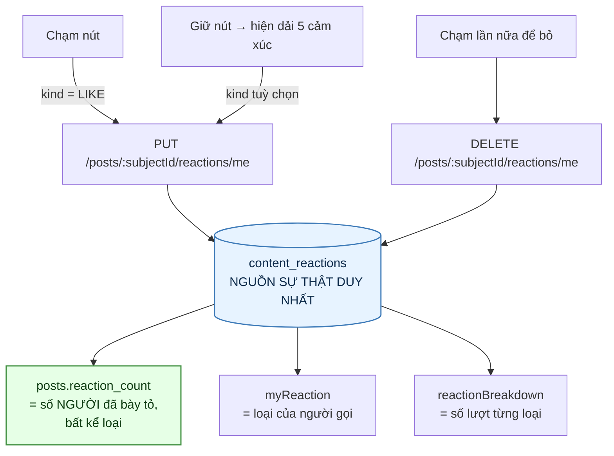
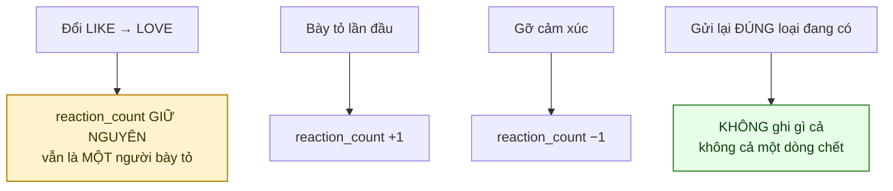
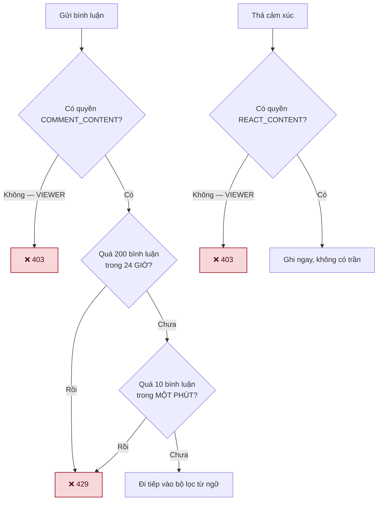
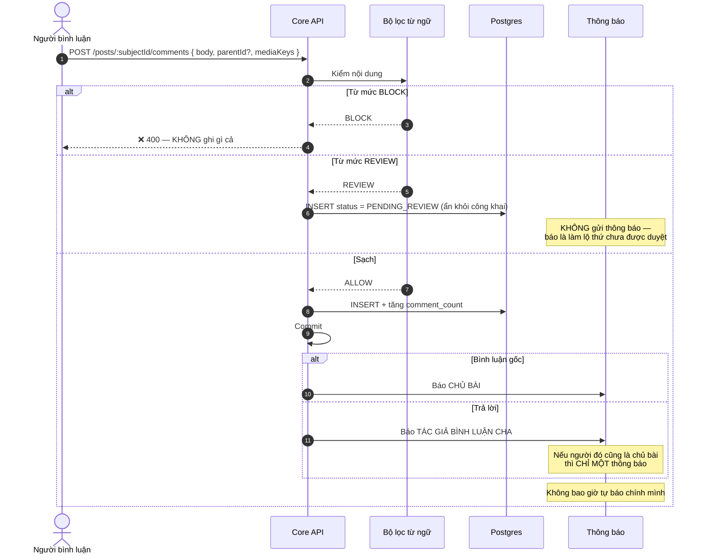
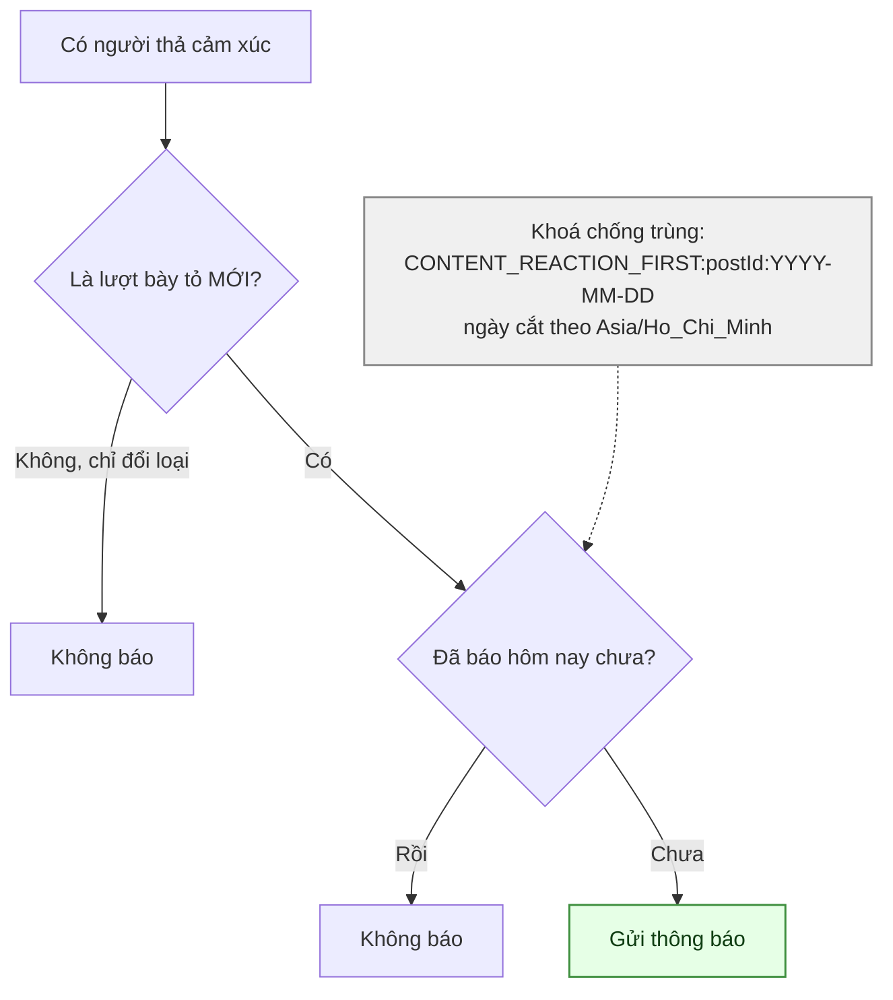
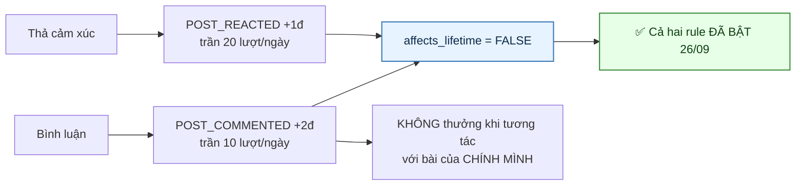
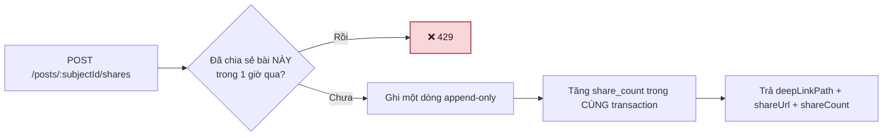
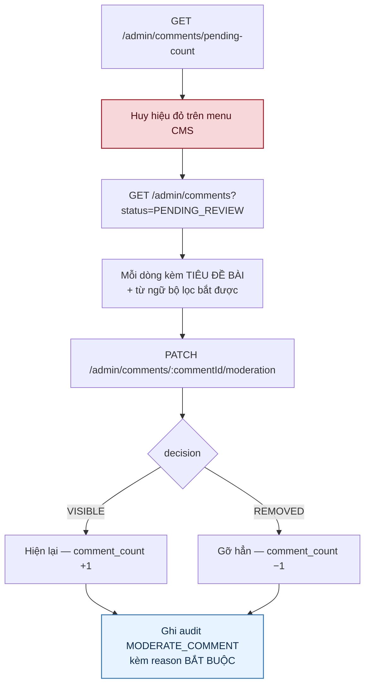

# 06 · Tương tác — cảm xúc, bình luận, chia sẻ

Trạng thái: ✅ **đã hiện thực**. Hai hệ thống "thích" trùng nhau đã gộp làm một, và từ 26/09
thì lối thích riêng cũng gỡ hẳn — chỉ còn một nút, đúng kiểu Facebook.

**Mười lăm endpoint:** năm endpoint cảm xúc (trên **bài** và trên **bình luận**), sáu endpoint
bình luận (xin link ảnh, tạo, đọc, đọc trả lời, sửa, gỡ), một endpoint chia sẻ, và **ba endpoint
cho Admin** — đếm hàng đợi, đọc hàng đợi, xử một bình luận (thêm 26/09).

## 6.1 Một nút, một bảng, một con số



> ✅ **Gỡ hẳn lối thích riêng — 26/09.** Trước đó có `POST /posts/:postId/like` cùng với
> `likeCount` và `isLiked`, chạy song song với năm cảm xúc. Nhưng giao diện chỉ có **một nút**:
> chạm là `LIKE`, giữ thì chọn loại khác. Một nút thì chỉ cần một đường ghi và một con số — giữ
> hai lối vào là bắt client đoán xem nên hiện con số nào.

> **`LIKE` không phải một hệ thống, nó là MỘT trong năm loại.** Nên `reaction_count` đếm mọi
> người đã bày tỏ, và `posts.like_count` đã bị gỡ khỏi bảng. `isLiked` cũ nay là
> `myReaction === "LIKE"` — client tự suy, không cần server trả thêm một trường.

> **Vì sao vẫn có `reactionBreakdown`.** Facebook hiện ba biểu tượng dẫn đầu cạnh con số tổng;
> muốn vẽ được thì phải biết từng loại bao nhiêu. Nhưng nó CHỈ có ở `GET /posts/:postId`: nhóm
> theo loại cho từng bài trong một trang 20 bài là 20 lần GROUP BY cho một thứ không ai nhìn kỹ
> khi đang cuộn.

> **Cảm xúc trên bình luận đi cùng đường** (`PUT|DELETE /comments/:subjectId/reactions/me`).

## 6.2 Đổi cảm xúc — chỗ dễ sai nhất



Câu SQL vẫn phải biết **loại cũ**, dù số đếm không đổi:

```sql
WITH prev AS (
  SELECT kind FROM content_reactions
  WHERE subject_type = $1 AND subject_id = $2 AND user_id = $3
  FOR UPDATE
), upserted AS (
  INSERT INTO content_reactions (subject_type, subject_id, user_id, kind)
  VALUES ($1, $2, $3, $4)
  ON CONFLICT (subject_type, subject_id, user_id)
  DO UPDATE SET kind = EXCLUDED.kind, updated_at = now()
  WHERE content_reactions.kind IS DISTINCT FROM EXCLUDED.kind
  RETURNING (xmax = 0) AS inserted
)
SELECT upserted.inserted, prev.kind AS old_kind
FROM (SELECT 1) AS always
LEFT JOIN prev ON true
LEFT JOIN upserted ON true
```

Ba trạng thái, đọc từ `inserted`:

| Giá trị | Nghĩa | Số đếm |
| --- | --- | --- |
| `true` | chèn dòng mới | **+1** |
| `false` | đụng khoá và đã ghi đè — loại thật sự đổi | đứng yên |
| `null` | đụng khoá nhưng **không ghi gì** — gửi trùng loại đang có | đứng yên |

> `xmax = 0` phân biệt **chèn mới** với **cập nhật do đụng khoá**. Không có nó thì không biết
> nên cộng `reaction_count` hay giữ nguyên — và đó là khác biệt giữa "một người đổi ý" với
> "thêm một người".

> ✅ **`WHERE ... IS DISTINCT FROM` — thêm 26/09, thay cho việc đặt trần.** Postgres không tự so
> giá trị: thiếu mệnh đề này thì gửi `LIKE` khi đang để `LIKE` vẫn ghi một phiên bản dòng mới,
> một bản ghi WAL, một mục index, và để lại một dòng chết cho vacuum — trong khi nội dung không
> đổi một ký tự. Có nó thì gọi một nghìn lần cũng chỉ còn một lần dò index.

> **Người dùng THẬT mới là bên hưởng lợi chính.** Chạm hai lần vì tưởng máy lag, client retry
> khi mạng chập chờn, hai thiết bị cùng đồng bộ — tất cả đang sinh ra ghi thừa, và nay thành
> miễn phí.

> **Chứng minh bằng `ctid`, không bằng giá trị trả về.** `ctid` là vị trí vật lý của dòng;
> Postgres không sửa tại chỗ nên mỗi lần UPDATE là một phiên bản mới ở chỗ khác. `test:feed-merge`
> gọi lại đúng loại cũ 20 lần rồi canh `ctid` **đứng yên**, và gọi với loại khác thì canh nó
> **dịch chỗ** — nếu không thì mệnh đề `WHERE` có thể đang chặn nhầm cả thay đổi có thật.

> ⚠️ **`FROM (SELECT 1)` rồi LEFT JOIN cả hai CTE** chứ không nối thẳng từ `upserted`: lúc không
> ghi gì thì `upserted` ra 0 dòng, kéo theo cả câu ra 0 dòng và mất luôn `old_kind` — không
> phân biệt được "không đổi" với "không có".

> **Loại cũ vẫn phải đọc ra** dù không còn cột nào phụ thuộc vào nó: thông báo "lần đầu trong
> ngày" (§6.5) chỉ bắn khi đây là lượt bày tỏ MỚI, không phải khi ai đó đổi từ `LIKE` sang
> `LOVE`.

> **Không chèn mới mà `prev` rỗng** nghĩa là có request song song của CHÍNH người này vừa chèn
> xong sau khi ảnh chụp được lấy. Lúc đó cộng trừ sẽ đoán sai, nên tính lại cả cột từ bảng cảm
> xúc — hiếm, và rẻ hơn một số đếm sai vĩnh viễn.

## 6.3 Ai được tương tác, và được bao nhiêu



> **VIEWER chỉ đọc.** `COMMENT_CONTENT` và `REACT_CONTENT` là hai cổng quyền theo hạng, seed
> `allowed = false` cho VIEWER và `true` cho mọi hạng còn lại. Cả hai là **boolean, không mang
> hạn mức** — nên trước 26/09 không có gì chặn một người gõ liên tục.

> ✅ **Hai trần, chặn hai thứ khác nhau.** Trần phút chặn **TỐC ĐỘ**; trần ngày chặn **TỔNG**.
> Thiếu trần ngày thì gõ đều mười cái mỗi phút suốt ngày vẫn ra **14.400 bình luận** — mỗi cái
> là một dòng thật trên bảng tin người khác. Hai trăm rộng gấp nhiều lần một người dùng chăm
> chỉ nhất, nhưng hạ trần spam bảy mươi hai lần.

> **Trần ngày của RULE ĐIỂM không thay được trần này.** Nó chỉ chặn phần điểm (10 lượt được
> thưởng mỗi ngày); bình luận thứ 11 vẫn đăng được, chỉ là không có điểm. Làm bẩn bảng tin và
> farm điểm là hai vấn đề, cần hai cái trần.

> **Hỏi trần NGÀY trước trần PHÚT.** Chạm cả hai mà báo "thử lại sau 57 giây" là nói sai — thật
> ra còn phải chờ nhiều giờ nữa.

> **Cửa sổ 24 giờ tính từ bình luận ĐẦU TIÊN của đợt**, không phải từ 0 giờ. Gia hạn cửa sổ
> theo mỗi lần gõ thì một người gõ chậm rãi sẽ tự khoá mình vĩnh viễn.

> **Đếm SAU khi ghi xong, không đếm trước.** Đếm trước là trừ mất một suất cho bình luận bị bộ
> lọc chặn thẳng — tức phạt người dùng vì một thứ chưa bao giờ đăng được.

## 6.4 Bình luận và trả lời



> **Bộ lọc có HAI mức, không phải một.** `BLOCK` từ chối thẳng và không ghi gì; `REVIEW` vẫn
> ghi nhưng ẩn khỏi công khai và đẩy vào hàng đợi Admin. Danh sách từ là **cấu hình động của
> Admin** (`system_configs`, khoá `moderation.blocked_terms`), **không** phải hằng trong mã.

> **Bộ lọc này không phải kiểm duyệt.** Nó bắt được người gõ thẳng từ bậy, không bắt được mỉa
> mai, đe doạ lịch sự hay lừa đảo, và luôn vừa bỏ sót vừa bắt nhầm. Giá trị của nó là giảm tải
> cho người kiểm duyệt — nên hàng đợi ở §6.7 là phần bắt buộc, không phải phần thêm.

> **Tác giả thấy bình luận `PENDING_REVIEW` của CHÍNH MÌNH**, người khác không thấy. Ẩn cả với
> tác giả thì họ tưởng hệ thống nuốt mất bình luận và gõ lại lần nữa — ra hai bản chờ duyệt.

> **Cửa sổ sửa 15 phút.** Quá hạn là không sửa được nữa: sửa được mãi thì một bình luận hiền
> lành đã có 20 lượt đồng tình có thể bị đổi thành thứ khác hẳn, mà người đã bày tỏ không rút
> lại được. Sửa xong bị bộ lọc gắn cờ thì `comment_count` và `reply_count` **đi theo** — không
> thì con số nói dối cho tới lần Admin xử.

> **Bình luận đã gỡ giữ chỗ trong cây** để chuỗi trả lời bên dưới không mất ngữ cảnh, nhưng
> không trả nội dung lẫn `mediaKeys` nữa. Giữ chỗ là một chuyện; để ảnh vẫn mở được bằng đường
> dẫn công khai là chuyện khác hẳn.

## 6.5 Cảm xúc — chỉ báo lần đầu trong ngày



> **Vì sao chỉ một lần mỗi ngày.** Một bài 200 lượt cảm xúc mà báo 200 lần thì tác giả tắt
> thông báo, và từ đó mất luôn thông báo về lượt xin nhận — thứ thật sự quan trọng.
>
> **Vì sao cắt ngày theo giờ Việt Nam.** Cắt theo UTC thì "lần đầu trong ngày" rơi vào 7 giờ
> sáng, và người dùng thấy hai thông báo trong cùng một buổi sáng.

## 6.6 Điểm cho tương tác (F41)



> **Vì sao `affects_lifetime = false`.** `lifetime` là sàn của Rank. Cho bình luận đẩy hạng thì
> gõ 300 dòng "hay quá ạ" là lên Bạc, trong khi tặng một món đồ thật được 56 điểm.

> **Vì sao điểm không được làm hỏng việc bình luận.** Việc một người vừa viết một câu là SỰ
> THẬT; thưởng bao nhiêu là CHÍNH SÁCH. Để chính sách đánh đổ sự thật thì người dùng không bình
> luận được chỉ vì đã đạt trần điểm trong ngày, hoặc vì Admin chưa bật rule. Nên hai ngoại lệ
> chính sách bị **nuốt**; mọi lỗi khác — tức lỗi database thật — vẫn nổi lên.

> ✅ **Đã bật 26/09.** Tối đa 40đ/người/ngày (10×2 + 20×1) vào `balance`, không đụng `lifetime`
> nên không đẩy hạng. Bật bằng một **phiên bản mới** của rule chứ không `UPDATE` dòng cũ:
> `point_rules` là bảng copy-on-write, sửa tại chỗ là xoá mất bằng chứng rằng rule từng tắt.

> ⚠️ **`REPORT_UPHELD` (+5đ, trần 5/ngày) vẫn TẮT.** Thưởng cho người báo xấu có động lực lệch
> hẳn: trả tiền cho việc bấm nút thì hàng đợi Admin ngập báo xấu vu vơ trong một tuần. Chờ Bên
> A chốt.

## 6.7 Chia sẻ



> **`share_count` đếm theo LƯỢT, không theo người** (chốt 26/09). Một người chia sẻ hai lần ở
> hai thời điểm là hai lượt thật — đó là con số Bên A muốn thấy.

> ✅ **Vì thế phải có khoảng chờ — thêm 26/09.** Không đếm distinct nghĩa là không có gì tự
> chặn việc gọi endpoint một nghìn lần để bài hiện "1.000 lượt chia sẻ". Người thật không chia
> sẻ lại cùng một bài trong vòng một giờ; máy thì có.

> **Khoá theo CẢ người lẫn bài** (`share:POST:<postId>` khoá theo `userId`). Khoá theo mình
> người thì chia sẻ mười bài khác nhau trong một phút cũng bị chặn — mà đó là hành vi bình
> thường của người đang lướt.

> **Chỉ trả đường dẫn tương đối.** `shareUrl` tuyệt đối chỉ có khi `WEB_PUBLIC_BASE_URL` đã
> cấu hình; ghép tên miền hộ client là sinh ra link chết khi đổi môi trường.

## 6.8 Hàng đợi kiểm duyệt bình luận — ✅ 26/09



> **Vì sao trước đây đây là một lỗ thật.** Bình luận `PENDING_REVIEW` nằm im trong bảng, không
> hiện với ai, và không có endpoint nào đọc ra được — tức bộ lọc từ ngữ chỉ có nửa đường: nó
> giữ nội dung lại mà không ai xử được.

> **Chuông là một CON SỐ, không phải thông báo.** Hàng đợi có cửa nhưng Admin không mở màn hình
> ra thì một câu chửi nằm chờ ba ngày cũng không ai hay. Nhưng bắn thông báo cho từng bình luận
> thì ngược lại: nội dung bẩn đến theo đợt, và Admin sẽ tắt thông báo ngay sau đợt đầu tiên —
> rồi mất luôn những thông báo thật sự quan trọng. Một con số trên menu là thứ họ thấy mỗi lần
> mở CMS mà không phải trả giá gì.

> **Vì sao kèm tiêu đề bài ngay trên danh sách.** Một câu chửi chỉ có nghĩa khi biết nó nằm
> dưới bài nào — bắt Admin mở từng cái để lấy ngữ cảnh là biến hàng đợi thành việc không ai
> muốn làm. `flaggedTerms` đi kèm để Admin thấy vì sao nó bị giữ.

> **Dùng chung quyền `post.moderate` với hậu kiểm bài.** Gỡ một bình luận và gỡ một bài là cùng
> một loại quyết định về nội dung; tách thành hai quyền chỉ tạo thêm một tổ hợp để Admin cấp
> sót.

> **Bấm lại đúng quyết định cũ trả 400** thay vì ghi thêm một dòng audit nói rằng có gì đó vừa
> đổi — cùng nếp với hậu kiểm bài đăng. Bình luận đã `REMOVED` thì coi như không còn.

> **Số đếm đi theo trạng thái.** `markStatus` tự lo `comment_count` và `reply_count`; nếu không
> thì bài hiện "12 bình luận" mà đếm ra 9.

## Chỗ cần soát

1. ⚠️ **`REPORT_UPHELD` vẫn TẮT.** Hai rule tương tác đã bật, còn thưởng cho người báo xấu thì
   chưa — cần Bên A chốt có thưởng không, và nếu có thì +5đ với trần 5/ngày đã đúng chưa.
2. ⚠️ **Đổi hợp đồng API.** `POST /posts/:postId/like` đã gỡ, `likeCount` và `isLiked` biến mất
   khỏi cả bốn endpoint đọc bài. Client phải chuyển sang `PUT /posts/:id/reactions/me` và suy
   `isLiked` từ `myReaction`.
3. **Cảm xúc cố ý KHÔNG có trần** (chốt 26/09). Điểm đã an toàn sẵn: khoá chống trùng của
   `POST_REACTED` là `(bài, người)`, nên gỡ rồi thả lại **không** được thưởng lần hai — muốn đủ
   20đ phải chạm 20 bài khác nhau, đúng bằng trần ngày của rule. Thông báo cũng chỉ một lần mỗi
   ngày mỗi bài. Nên chỉ còn chi phí ghi database, và chỗ đó xử bằng cách **không ghi** thay vì
   bằng cách **từ chối** (§6.2).
4. **Còn lại kiểu đổi qua đổi lại.** Thả → gỡ → thả, hoặc LIKE → LOVE → LIKE, vẫn là ghi thật
   mỗi lần vì mỗi lần đều là thay đổi trạng thái có thật. Muốn chặn cả kiểu này thì phải đặt
   trần ở tầng hạ tầng (nginx/Cloudflare theo IP) — hiện **chưa có gì** ở tầng đó, và nó là
   việc lúc triển khai chứ không nằm trong repo này.
4. **Huy hiệu `pending-count` không có ngưỡng cảnh báo.** Hàng đợi 5 cái và hàng đợi 500 cái
   hiện giống nhau về mức độ khẩn. Cần không?
5. **Chia sẻ chờ 1 giờ mỗi người mỗi bài** — Bên A đã chốt 26/09.
