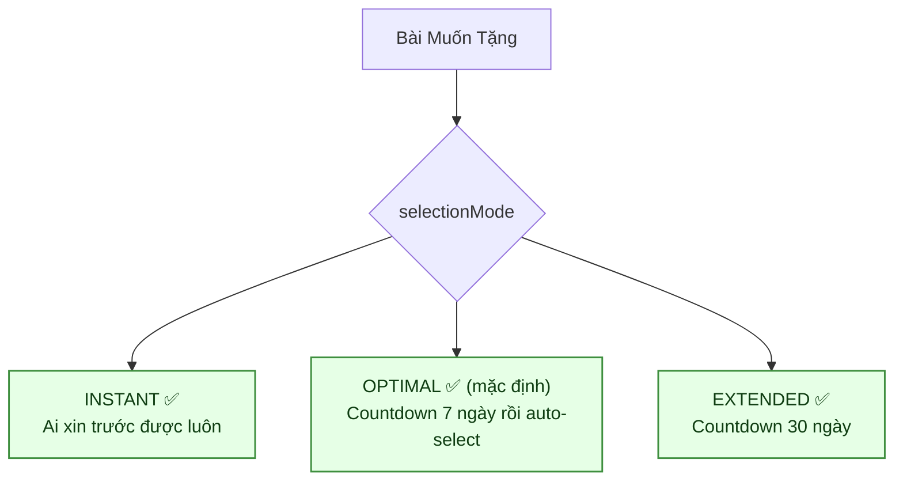
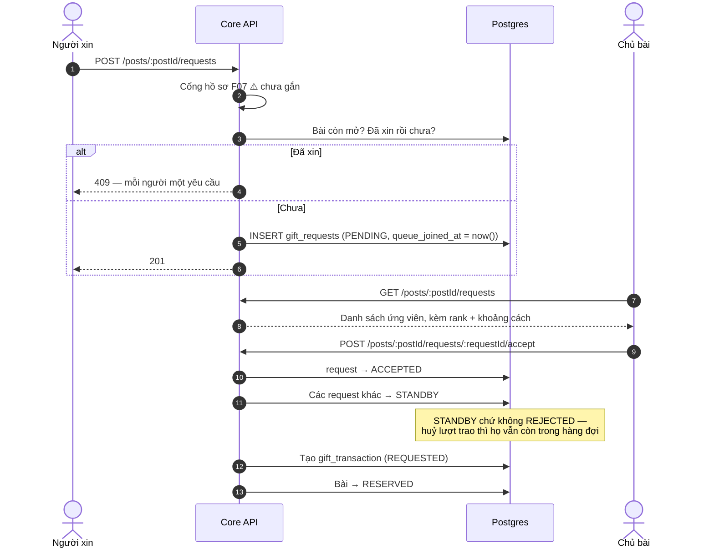
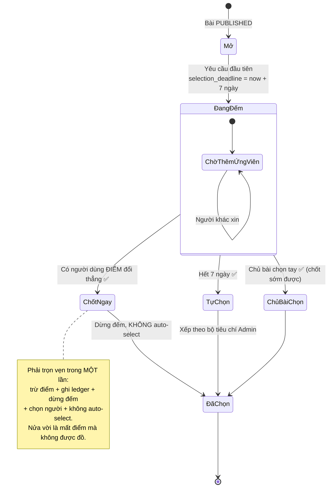
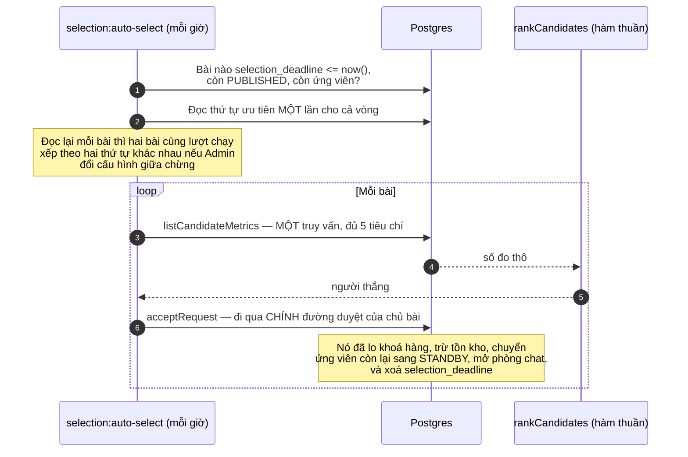
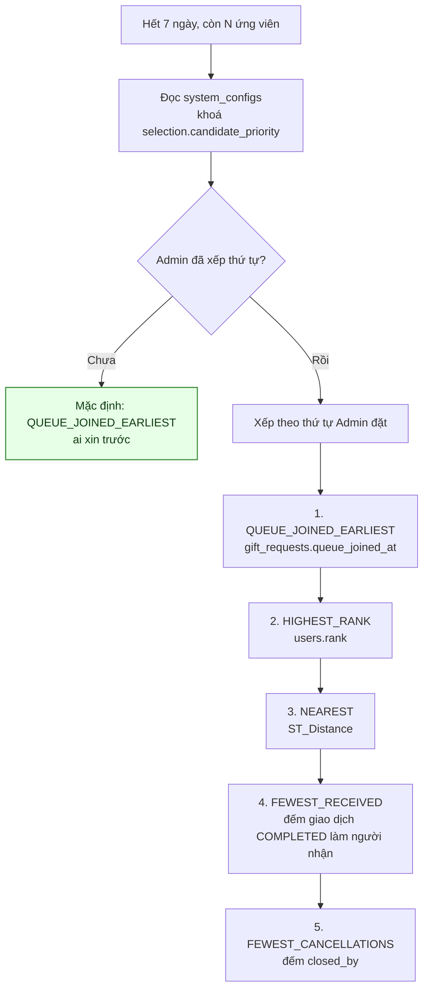
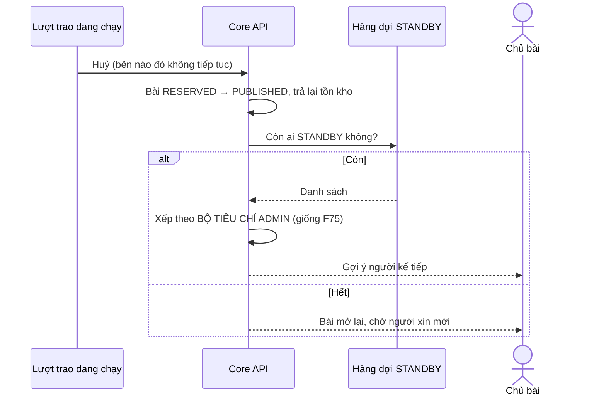

# 07 · Xin nhận & chọn người nhận

Trạng thái: ✅ **hàng đợi, countdown và auto-select đã chạy** (25/09). Có script kiểm trên
Postgres thật: `npm run test:selection`.

## 7.1 Ba chế độ chọn người nhận

## 7.2 Hàng đợi xin nhận

> **Vì sao ứng viên trượt thành `STANDBY` chứ không `REJECTED`.** Lượt trao đầu tiên đổ vỡ
> là chuyện thường. `REJECTED` là đóng cửa với họ và buộc chủ bài phải đăng lại từ đầu;
> `STANDBY` giữ nguyên hàng đợi để chọn người kế tiếp ngay.

## 7.3 Countdown 7 ngày (F75) — ✅ đã hiện thực

## 7.4 Bộ tiêu chí auto-select (CH-1) — ✅ đã chốt và đã nối

> **Một bài hỏng không làm dừng cả vòng** — những bài còn lại cũng đang để người xin chờ một
> đồng hồ đã reo. CLI thoát khác 0 và in từng bài hỏng.
>
> **Người chưa đặt vị trí ra `distanceMeters = null`, không phải 0 mét.** Coi là 0 thì người
> lười đặt vị trí luôn thắng tiêu chí NEAREST.
>
> **Cả hai đường báo cho người được chọn qua MỘT chỗ.** Hai đường tự gửi là hai đường có thể
> quên — và đúng chuyện đó đã xảy ra với đường duyệt tay.

> **Vì sao mặc định là "ai xin trước".** Đây là tiêu chí **duy nhất người dùng tự kiểm chứng
> được** — họ biết mình bấm lúc nào. Mọi tiêu chí còn lại dựa vào dữ liệu họ không nhìn thấy,
> nên khi trượt họ không có cách nào biết mình trượt vì lý do thật hay vì hệ thống sai.

Cấu hình đọc/ghi qua `GET|PUT /api/v1/admin/candidate-selection`, dùng **chung** cho cả
[F33 hàng đợi dự phòng](#75-hàng-đợi-dự-phòng) và F75. Hai chỗ xếp hai kiểu thì cùng một bài
sẽ đề xuất hai người khác nhau tuỳ đường nào chạy trước.

## 7.5 Hàng đợi dự phòng

## Chỗ cần soát

1. ✅ **Cả ba chế độ đã chạy.** `OPTIMAL` 7 ngày, `EXTENDED` 30 ngày, `INSTANT` chốt ngay.
   Chủ bài vẫn duyệt tay được bất cứ lúc nào trong lúc đếm.
2. ✅ **Nhánh "dùng điểm chốt ngay" đã có** (26/09) — `POST /posts/:postId/redeem`, xem
   [14-redemption](./14-redemption.md).
3. ✅ Cổng hồ sơ F07 **đã gắn** vào luồng xin nhận (25/09).
4. ✅ **Đã có giới hạn số yêu cầu đang mở** (25/09) — capability `OPEN_REQUEST_QUOTA`, theo bậc:
   Thành viên 5 · Bạc 10 · Vàng 20 · Kim Cương 30. Đếm cả `STANDBY` vì đó vẫn là yêu cầu đang
   mở; bỏ nó ra là mở đúng cái cửa giới hạn này sinh ra để đóng.
5. ✅ **Đã báo cho người thắng** (25/09) — và phát hiện ra **đường duyệt TAY cũng chưa từng
   báo**: mẫu `GIFT_REQUEST_ACCEPTED` có từ migration `1792900000000` nhưng không đường nào gửi.
   Nay cả hai đường đi qua một `AcceptedRequestNotifier`.
