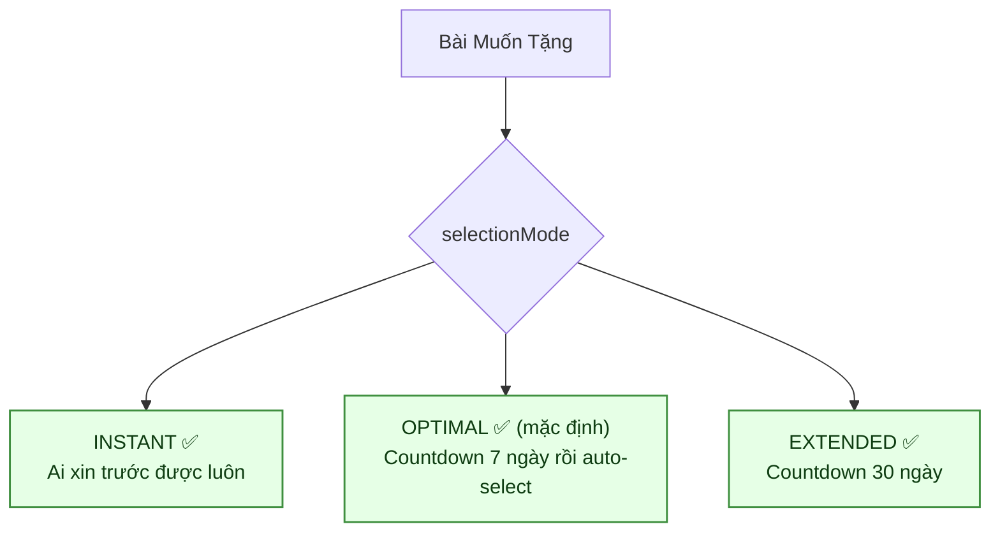
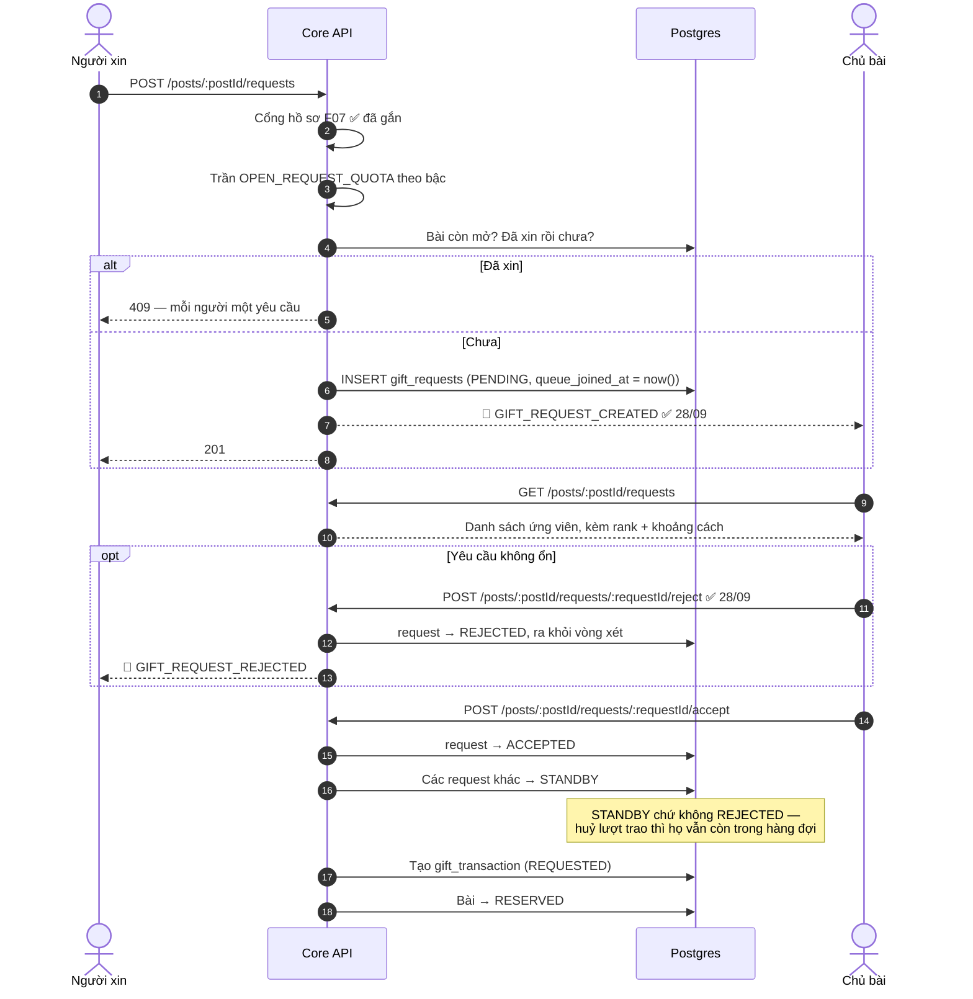
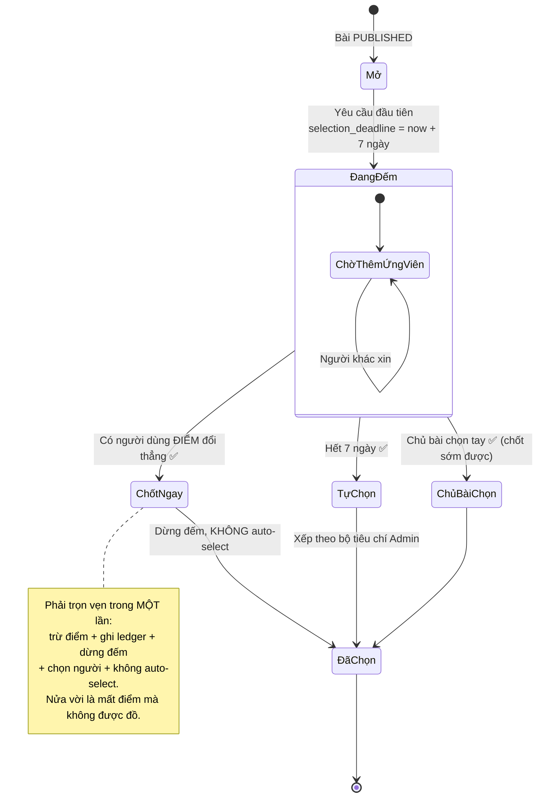
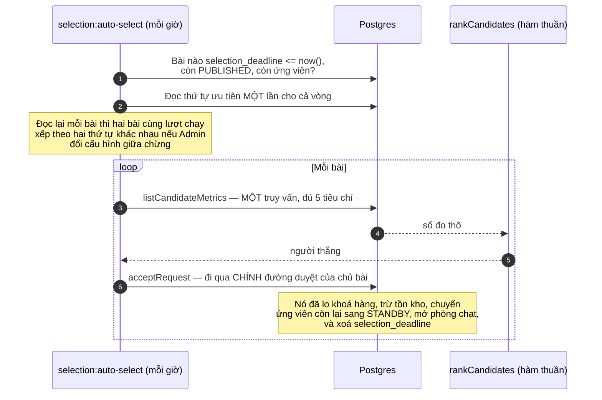
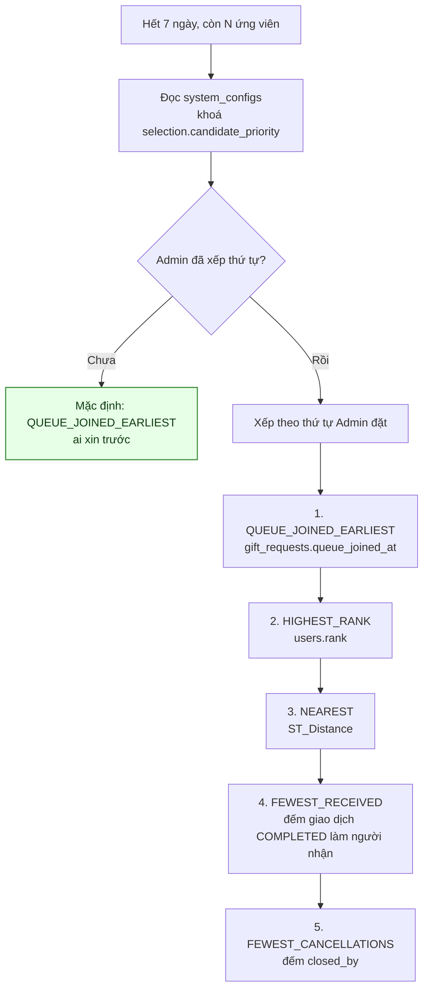
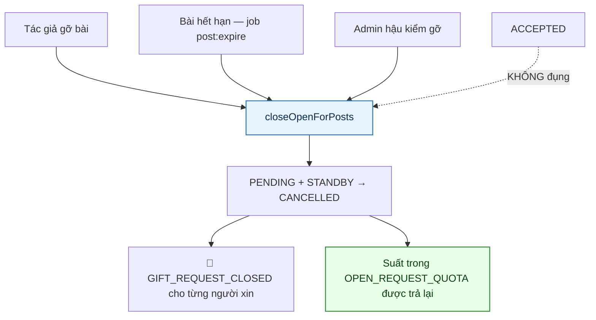
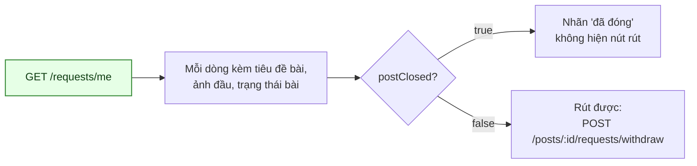
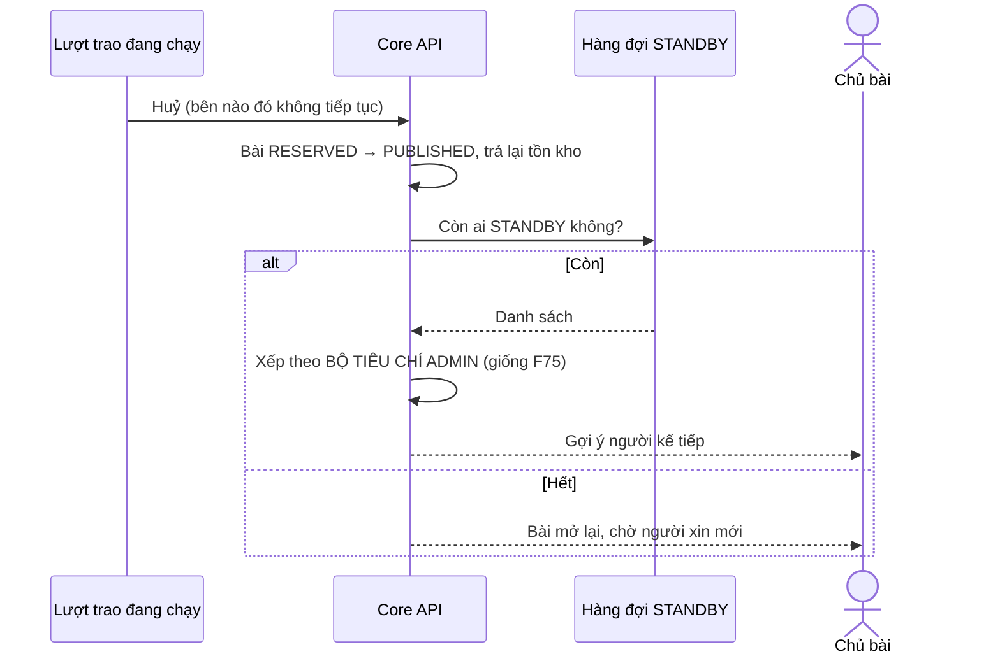

# 07 · Xin nhận & chọn người nhận

> **Sơ đồ hiện trạng backend.** Quy tắc mục tiêu ngày 07/10/2026 đã thay đổi mốc đồng hồ
> sang lúc đăng, bỏ option `EXTENDED`, thêm giai đoạn tự mở 30 ngày và áp cơ chế tương tự
> cho `WANTED`. Xem [đặc tả mới](../plan/GIVE-RECEIVE-2026-10-07.md); các sơ đồ dưới đây
> chưa mô tả luồng mục tiêu.

Trạng thái: ✅ **hàng đợi, countdown và auto-select đã chạy** (25/09), và từ 28/09 thì vòng
đời yêu cầu đã khép kín: yêu cầu treo được đóng, người xin xem được yêu cầu của mình, chủ bài
được báo và từ chối được. Hai script kiểm trên Postgres thật: `npm run test:selection` và
`npm run test:request-lifecycle`.

**Bảy endpoint:** gửi, rút, xem danh sách của bài, **xem danh sách của TÔI**, duyệt,
**từ chối**, và đổi điểm chốt ngay.

## 7.1 Ba chế độ chọn người nhận

## 7.2 Hàng đợi xin nhận

> **Vì sao ứng viên trượt thành `STANDBY` chứ không `REJECTED`.** Lượt trao đầu tiên đổ vỡ
> là chuyện thường. `REJECTED` là đóng cửa với họ và buộc chủ bài phải đăng lại từ đầu;
> `STANDBY` giữ nguyên hàng đợi để chọn người kế tiếp ngay.

> ✅ **Chủ bài nay được BÁO khi có người xin — thêm 28/09.** Trước đó không có loại thông báo
> nào cho việc này, và `CreateGiftRequestUseCase` thậm chí không inject bộ gửi thông báo. Cả cơ
> chế đồng hồ 7 ngày giả định chủ bài BIẾT có ứng viên để mà chốt sớm; họ chỉ biết nếu tự mở
> bài ra xem. Ở chế độ `INSTANT` thì KHÔNG báo "có người xin": người đầu tiên được chốt luôn,
> nên họ nhận thẳng thông báo "đã có người nhận".

> ✅ **`REJECTED` nay ghi được — thêm 28/09.** Trước đó nó là trạng thái CHẾT: khai trong enum,
> lọc ra khỏi bộ đếm, nhưng không đường nào ghi. Chủ bài thấy một yêu cầu rõ ràng không ổn cũng
> không gạt ra được, và nếu hết đồng hồ mà chưa kịp chọn ai khác thì auto-select có thể trao
> đúng cho người đó. Endpoint chỉ đụng `PENDING`/`STANDBY`: từ chối một yêu cầu đã `ACCEPTED`
> là huỷ một lượt trao đang sống, việc đó thuộc luồng `/transactions` nơi tồn kho và phòng chat
> phải dọn theo.

## 7.3 Countdown 7 ngày (F75) — ✅ đã hiện thực

## 7.4 Bộ tiêu chí auto-select (CH-1) — ✅ đã chốt và đã nối

> **Một bài hỏng không làm dừng cả vòng** — những bài còn lại cũng đang để người xin chờ một
> đồng hồ đã reo. CLI thoát khác 0 và in từng bài hỏng.
>
> **Người chưa đặt vị trí ra `distanceMeters = null`, không phải 0 mét.** Coi là 0 thì người
> lười đặt vị trí luôn thắng tiêu chí NEAREST.
>
> **Cả hai đường báo cho người được chọn qua MỘT chỗ.** Hai đường tự gửi là hai đường có thể
> quên — và đúng chuyện đó đã xảy ra với đường duyệt tay.

> **Vì sao mặc định là "ai xin trước".** Đây là tiêu chí **duy nhất người dùng tự kiểm chứng
> được** — họ biết mình bấm lúc nào. Mọi tiêu chí còn lại dựa vào dữ liệu họ không nhìn thấy,
> nên khi trượt họ không có cách nào biết mình trượt vì lý do thật hay vì hệ thống sai.

Cấu hình đọc/ghi qua `GET|PUT /api/v1/admin/candidate-selection`, dùng **chung** cho cả
[F33 hàng đợi dự phòng](#75-hàng-đợi-dự-phòng) và F75. Hai chỗ xếp hai kiểu thì cùng một bài
sẽ đề xuất hai người khác nhau tuỳ đường nào chạy trước.

## 7.5 Khi BÀI đóng lại — ✅ 28/09

> ⚠️ **Đây từng là một lỗi khoá tài khoản vĩnh viễn.** Trước 28/09 **không đường nào** đóng
> `gift_requests` khi bài đóng lại. Đường gỡ bài trông như đã lo việc đó, nhưng
> `closeOpenRequestsForPost` mà nó gọi chỉ đụng `gift_transactions` — mà yêu cầu ở
> `PENDING`/`STANDBY` thì chưa có lượt trao nào.

> **Vì sao nó nặng.** Yêu cầu treo vẫn tính vào `OPEN_REQUEST_QUOTA`. Một Thành viên (trần 5)
> xin 5 món mà cả 5 bài hết hạn sẽ **đứng ở trần mãi mãi**, không xin được gì nữa — và trước
> khi có `GET /requests/me` thì cũng không có màn hình nào để nhìn thấy vì sao.

> **Hai lớp, không phải một.** Đường đóng ở trên là chỗ sửa cho đúng; ngoài ra
> `countOpenByRequester` nay JOIN sang `posts` để bỏ qua yêu cầu dưới bài đã đóng. Mai này có
> thêm một đường đóng bài mà quên gọi, thì tệ nhất là con số hiển thị hơi lệch — chứ không phải
> một người bị khoá mà không hiểu vì sao.

> **`RESERVED`/`DELIVERING` KHÔNG tính là đóng.** Lượt trao đang chạy, và người đứng `STANDBY`
> dưới nó vẫn được xét tiếp nếu nó đổ.

> **Trả lại một bài gỡ nhầm thì KHÔNG mở lại hàng đợi.** Những người đó đã nhận thông báo đóng
> rồi; dựng lại sau lưng họ là mời họ vào một cuộc chờ họ không còn biết tới.

## 7.6 Màn "Yêu cầu của tôi" — ✅ 28/09

> **Vì sao trước đó là một bẫy kín.** Không có danh sách này thì người dùng không có cách nào
> biết mình đang xin những gì. Ghép với lỗi ở §7.5 thì thành: bị chặn vì 5 yêu cầu treo, không
> có màn hình nào để thấy chúng, và cũng không rút được vì `withdraw` cần `postId` của một bài
> đã biến mất khỏi feed.

> **`postClosed` do SERVER tính**, không để client tự suy từ `postStatus`. Bắt mỗi client cài
> lại đúng danh sách trạng thái là chờ một client cài sót, rồi hiện nút "rút yêu cầu" cho một
> bài không còn tồn tại.

> **Mặc định trả MỌI trạng thái**, kể cả đã rút và đã đóng: người dùng mở màn này chính là để
> biết chuyện gì đã xảy ra với những cái đã xong.

## 7.7 Hàng đợi dự phòng

## Chỗ cần soát

1. ⚠️ **INSTANT auto-accept nuốt lỗi.** Nếu `acceptRequest` hỏng, yêu cầu nằm lại ở `PENDING`
   trên một bài KHÔNG có `selection_deadline` — nên auto-select không bao giờ nhặt nó. Nó chỉ
   được dọn khi bài hết hạn (§7.5). Cần một đường quét lại, hay để vậy?
2. **Chưa có thông báo cho người bị chuyển sang `STANDBY`.** Họ không trượt hẳn, nhưng cũng
   không biết mình đang đứng chờ.
3. ✅ **Cả ba chế độ đã chạy.** `OPTIMAL` 7 ngày, `EXTENDED` 30 ngày, `INSTANT` chốt ngay.
   Chủ bài vẫn duyệt tay được bất cứ lúc nào trong lúc đếm.
4. ✅ **Nhánh "dùng điểm chốt ngay" đã có** (26/09) — `POST /posts/:postId/redeem`, xem
   [14-redemption](./14-redemption.md).
5. ✅ Cổng hồ sơ F07 **đã gắn** vào luồng xin nhận (25/09) — sơ đồ §7.2 trước đây vẫn vẽ
   "chưa gắn", mâu thuẫn với chính mục này; đã sửa 28/09.
6. ✅ **Đã có giới hạn số yêu cầu đang mở** (25/09) — capability `OPEN_REQUEST_QUOTA`, theo bậc:
   Thành viên 5 · Bạc 10 · Vàng 20 · Kim Cương 30. Đếm cả `STANDBY` vì đó vẫn là yêu cầu đang
   mở; bỏ nó ra là mở đúng cái cửa giới hạn này sinh ra để đóng.
7. ✅ **Đã báo cho người thắng** (25/09) — và phát hiện ra **đường duyệt TAY cũng chưa từng
   báo**: mẫu `GIFT_REQUEST_ACCEPTED` có từ migration `1792900000000` nhưng không đường nào gửi.
   Nay cả hai đường đi qua một `AcceptedRequestNotifier`.
