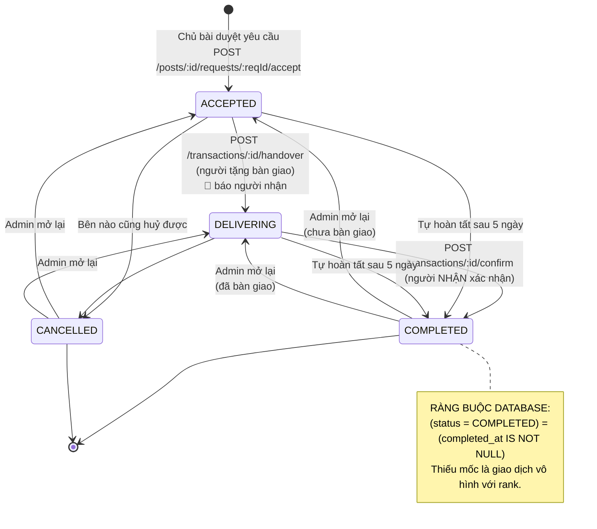
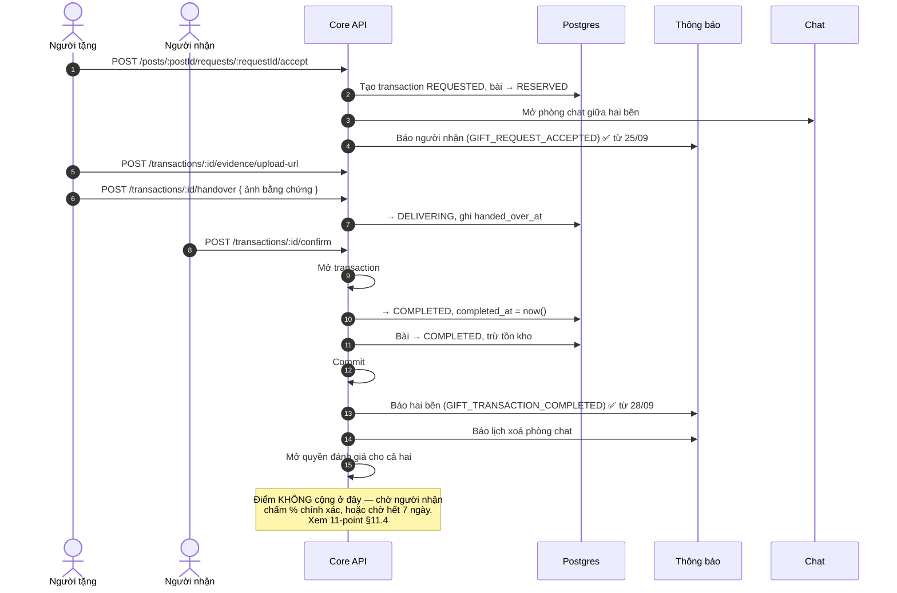
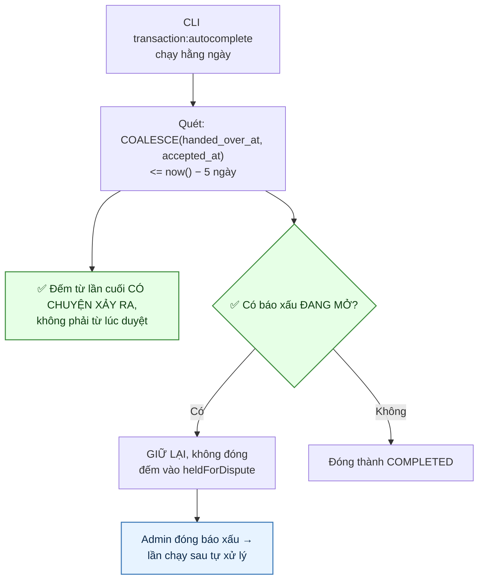
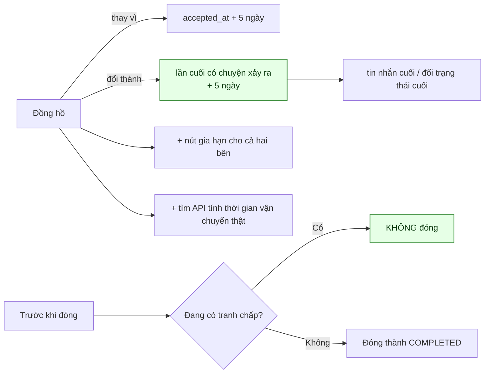
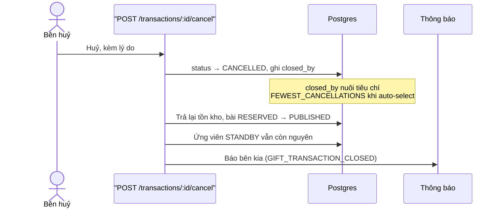
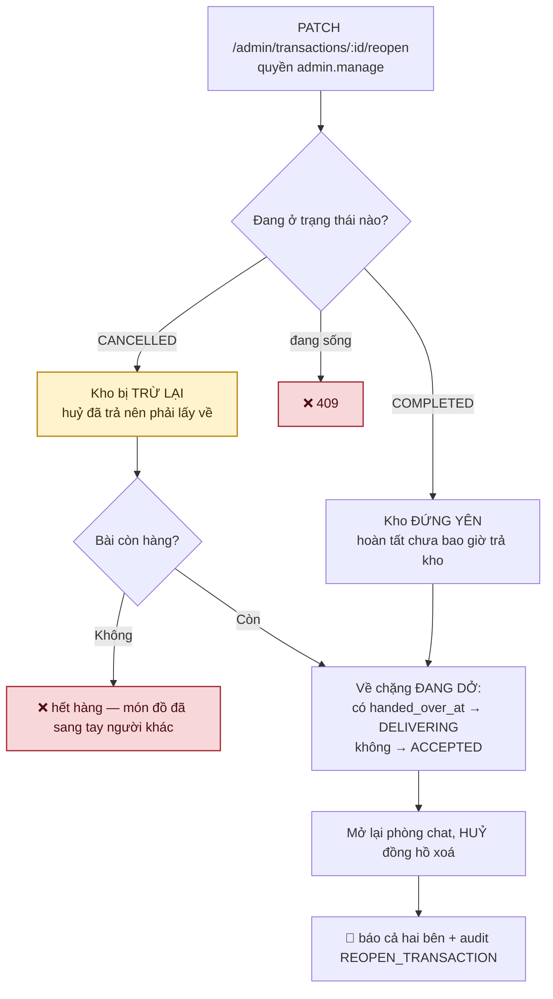
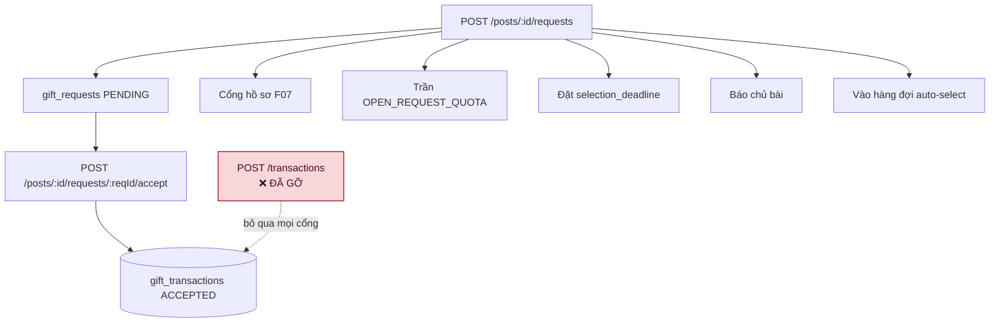
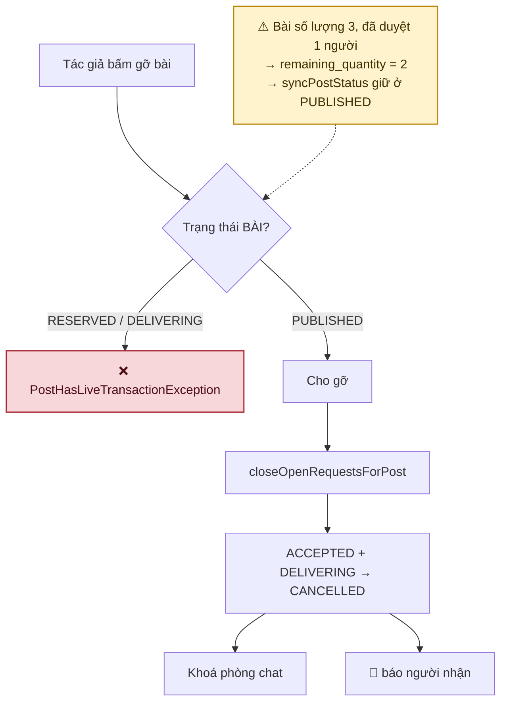

# 08 · Vòng đời lượt trao

Trạng thái: ✅ đã hiện thực. Từ 28/09 thì hoàn tất lượt trao **có báo cho hai bên** ở cả hai
đường, và cửa phụ tạo lượt trao đã gỡ.

**Tám endpoint:** xem danh sách của mình, xem một lượt, xin link ảnh bằng chứng, bàn giao,
xác nhận, báo bom ship, huỷ, và **mở lại** (Admin).

## 8.1 Máy trạng thái

> ⚠️ **Sơ đồ cũ vẽ sai đường vào — sửa 28/09.** Nó viết `[*] --> REQUESTED: Chủ bài chấp nhận
> yêu cầu`, rồi `REQUESTED --> ACCEPTED`. Thực tế duyệt yêu cầu ở [07](./07-request.md) chèn
> thẳng `status = 'ACCEPTED'`, không đi qua `REQUESTED` bao giờ.

> **`REQUESTED` và `REJECTED` nay là hai trạng thái CHẾT.** `REQUESTED` chỉ sinh ra được từ
> `POST /transactions` — cửa đã gỡ 28/09 (xem §8.6). `REJECTED` thì chưa đường nào ghi, dù sơ đồ
> cũ vẽ `Chủ bài từ chối`: từ chối một **yêu cầu** là việc của
> `POST /posts/:id/requests/:reqId/reject` ở luồng 07, và nó đụng `gift_requests` chứ không đụng
> `gift_transactions`. Giá trị enum giữ lại cho dữ liệu cũ.

Ràng buộc ở tầng schema, không chỉ ở tầng ứng dụng:

| Ràng buộc | Chặn điều gì |
| --- | --- |
| `CHK_gift_transactions_not_self` | `giver_id <> receiver_id` — tự tặng mình là đường farm điểm rẻ nhất |
| `CHK_gift_transactions_completed_at` | `COMPLETED` bắt buộc có `completed_at` |
| `CHK_gift_transactions_quantity` | `quantity > 0` |

## 8.2 Luồng đầy đủ

> ✅ **Thông báo hoàn tất — nối 28/09.** `GIFT_TRANSACTION_COMPLETED` có mẫu từ migration
> `1792900000000` nhưng là mẫu **duy nhất** trong migration đó chưa đường nào gửi; bảy mẫu còn
> lại đều đã nối. Nghĩa là khoảnh khắc trọng tâm của cả sản phẩm — món đồ đến tay người cần —
> không ai được báo.

> **Gửi cho CẢ HAI bên vì mỗi bên chỉ biết một nửa.** Người nhận vừa bấm xác nhận nên họ biết;
> người tặng thì không, trừ khi tự mở app ra xem. Ở đường tự hoàn tất (§8.3) thì không bên nào
> biết.

## 8.3 Tự hoàn tất sau 5 ngày

**Hai kênh tranh chấp, và cố ý chỉ hai kênh:**

| Kênh | Vì sao |
| --- | --- |
| Báo xấu vào **chính bài** của lượt trao | Nội dung bài là thứ đang bị nghi |
| Báo xấu vào **người tặng, do chính người nhận của lượt này gửi** | Giới hạn ở người nhận là có chủ ý — một báo xấu bất kỳ nhắm vào người tặng sẽ khoá **mọi** lượt trao của họ, và đó là một đường phá hoại rẻ tiền |

> ✅ **Đường này từng im lặng hoàn toàn — nối thông báo 28/09.** Repository khoá phòng chat,
> có chú thích hẳn hoi *"Tự hoàn tất cũng là hoàn tất"*, rồi dừng ở đó: không thông báo hoàn
> tất, và cũng không cảnh báo lịch xoá chat mà `confirm` lẫn `cancel` đều gửi. Thiếu ở đây nặng
> hơn: người dùng **không bấm gì cả**, nên thông báo là cách duy nhất họ biết lượt trao đã khép
> và lịch sử trò chuyện sắp bị xoá.

> **Repository nay trả ra CHÍNH những lượt đã đóng**, không chỉ con số — con số thì không báo
> cho ai được. Và đọc lại SAU câu `UPDATE`: `completed_at` chỉ có giá trị sau đó, đọc trước là
> gửi thông báo mô tả một trạng thái chưa xảy ra.

> `ship-unpaid` không cần nằm trong danh sách: nó **tự đóng lượt trao** thành `CANCELLED`, nên
> cron không còn chạm tới.
>
> **Lượt bị giữ tự khỏi** ở lần chạy sau khi Admin đóng báo xấu — không cần hàng đợi riêng.
> Nhưng CLI in ra và **thoát khác 0**: một lượt trao treo vô thời hạn vì báo xấu không ai xử là
> chuyện người vận hành cần thấy.

**Hướng xử lý còn lại (2026-09-24):**

## 8.4 Huỷ lượt trao

## 8.5 Phí ship và khoản phạt (CH-2)

> **Vì sao chỉ người gửi báo được.** Chỉ họ mới thấy hàng bị hoàn về. Cho người nhận báo là
> cho chính người bị phạt quyết định có bị phạt hay không.

### Điểm âm — hai cột nói hai chuyện

Phạt 50 một người đang có 20:

| Cột | Giá trị | Ý nghĩa |
| --- | ---: | --- |
| `balance` | `0` | Số **tiêu được**, kẹp ở 0 |
| `raw_balance` | `−30` | Giá trị **thật**, để hiển thị và đối soát |
| `note` | | `−50 điểm, đang âm 30 điểm` — dựng ở máy chủ |

Ràng buộc `CHK_point_ledger_balance_is_clamped_raw` giữ `balance_after = GREATEST(0, raw_balance_after)`.

> **Vì sao không chỉ kẹp về 0 rồi thôi.** Lúc đó không ai biết người đó hụt 30 hay hụt 300,
> và lần cộng điểm sau sẽ trả hết nợ một cách vô hình. Cộng 50 khi đang âm 30 phải ra 20,
> không phải 50 — khoản phạt là một món nợ, không phải một lần xoá sạch.

## 8.5b Mở lại lượt đóng nhầm — ✅ 28/09

> **Vì sao cần.** Cả hai đường đóng đều có thể sai: tự hoàn tất khép một lượt mà hàng chưa tới,
> hoặc một bên bấm huỷ nhầm. Và từ khi tự hoàn tất biết gửi thông báo (§8.3), người dùng sẽ
> **thấy** lượt trao bị khép rồi hỏi lại — nên càng cần một đường sửa.

> ⚠️ **Tồn kho đối xử khác nhau theo trạng thái đang đóng, và đây là chỗ dễ sai nhất.** Duyệt
> yêu cầu đã trừ kho. Huỷ **trả lại** kho, còn hoàn tất thì **không**. Nên mở lại một lượt
> `CANCELLED` phải trừ kho lần nữa — và từ chối nếu bài đã hết hàng, vì lúc đó món đồ thật sự
> đã sang tay người khác. Mở lại một lượt `COMPLETED` thì không đụng kho.

> **Về chặng đang dở, không về đầu.** Người tặng đã bàn giao thì bắt họ bàn giao lại là yêu cầu
> làm lại một việc đã làm.

> **Phòng chat mở lại VÀ đồng hồ xoá bị huỷ.** Khoá phòng đặt `purge_after`; không xoá mốc đó
> thì lượt trao được mở lại nhưng lịch sử trò chuyện vẫn biến mất đúng ngày đã hẹn — tức mở lại
> một cuộc rồi lấy đi bằng chứng của chính nó.

> **Điểm đã cộng GIỮ NGUYÊN.** Sổ điểm là append-only, và khoá chống trùng của phần thưởng hoàn
> tất theo chính lượt trao, nên hoàn tất lần nữa sau khi mở lại cũng không cộng thêm lần hai.

> **Quyền `admin.manage`, không phải `post.moderate`.** Mở lại một lượt trao là đụng vào tồn
> kho, thứ hạng và lịch sử của hai người thật — nó thuộc nhóm thao tác nặng, không phải nhóm
> kiểm duyệt nội dung.

## 8.6 Cửa phụ đã gỡ — ✅ 28/09

> **Hai cửa vào cùng một phòng, và cửa thứ hai bỏ qua mọi thứ cửa thứ nhất canh.**
> `POST /transactions` tạo thẳng `gift_transactions` mà **không** tạo `gift_requests`: không cổng
> hồ sơ, không trần yêu cầu đang mở, không đồng hồ chọn người, không báo chủ bài, và không nằm
> trong hàng đợi ứng viên. Đúng kiểu "hai hệ thống cho một việc" như `post_likes` và
> `content_reactions` đã gộp ở [06](./06-interaction.md).

> **Gỡ được vì không ai dùng.** Lớp tương thích `/gift-posts` không gọi tới, smoke test không
> gọi, không script kiểm nào gọi. Hàm `request()` ở repository cũng gỡ theo. `accept()` giữ lại
> cho những dòng `REQUESTED` còn sót từ trước, nhưng không endpoint nào chạm tới nữa.

## 8.7 Xem một lượt trao — ✅ 28/09

> **Trước đó chỉ có `/transactions/me`.** Trong khi MỌI thông báo của luồng này mang
> `referenceType: 'GIFT_TRANSACTION'` kèm `referenceId` — tức client bấm vào thông báo thì không
> có đường nào mở đúng lượt đó, phải tải cả danh sách rồi tự lọc.

> **Người ngoài cuộc nhận 404, không phải 403.** 403 xác nhận rằng lượt trao đó CÓ THẬT, và id
> đoán được thì đó là một kênh dò.

> **Khai route SAU `/transactions/me`.** `me` là chuỗi cố định còn `:transactionId` nuốt mọi
> thứ; đảo thứ tự thì `/transactions/me` rơi vào route dưới và trả 404 vì "me" không phải uuid.

## 8.8 Gỡ bài khi còn lượt trao sống — ✅ 28/09

> ⚠️ **Cổng chặn đọc trạng thái BÀI, không đọc lượt trao.** Và `syncPostStatus` giữ bài ở
> `PUBLISHED` chừng nào `remaining_quantity > 0`. Nên một bài số lượng 3 đã duyệt một người vẫn
> là `PUBLISHED` — tác giả **gỡ được**, trong khi lượt trao của người kia đang sống.

> **Điều kiện cũ là `status = 'REQUESTED'`, và nó không khớp dòng nào** kể từ khi duyệt yêu cầu
> chèn thẳng `ACCEPTED`. Nghĩa là hàm này vẫn chạy, vẫn trả về mảng rỗng, và lượt trao bị bỏ
> lại: phòng chat vẫn mở, và cron vẫn có thể đánh nó thành `COMPLETED` trên một bài đã biến mất.
> Nay lọc theo `ACCEPTED`/`DELIVERING` — cùng tập với `StockHoldingGiftTransactionStatuses`.

> **Khoá phòng chat trong CÙNG transaction**, y như mọi đường đóng khác. Bỏ bước này thì hai
> người vẫn nhắn tin được về một lượt trao đã đóng trên một bài không còn tồn tại.

> **Không trả tồn kho.** Bài đang bị gỡ mềm nên con số đó không còn ai đọc.

## Chỗ cần soát

1. ✅ **Báo khi BÀN GIAO** (28/09) — `GIFT_TRANSACTION_HANDED_OVER` tới người nhận. Đó cũng là
   lúc đồng hồ tự hoàn tất được đặt lại, nên không báo là để cái đồng hồ đó chạy sau lưng họ.
   Chỉ báo người nhận: người tặng vừa tự bấm nút này.
2. ✅ **Hoàn tất lượt trao nay sinh điểm** — nhưng **không ở bước `confirm`**: điểm chờ người
   nhận chấm % chính xác, hoặc chờ hết 7 ngày rồi áp mức mặc định. Xem
   [11-point §11.4](./11-point.md).
3. ✅ **Đồng hồ đếm từ `COALESCE(handed_over_at, accepted_at)`** và ✅ **đã kiểm tranh chấp**
   (25/09). Còn lại: tìm API tính thời gian vận chuyển thật để khỏi dùng con số 5 ngày cố định.
4. ✅ **Nguồn điểm xét hạng nay là cấu hình động** (28/09). Khoá `rank.points_source` nhận
   `BALANCE` (mặc định, giữ nguyên hành vi) hoặc `LIFETIME`. Chọn `LIFETIME` thì khoản phạt ship
   và việc tiêu điểm đổi vật phẩm không còn làm tụt hạng — thứ hạng trở lại là bằng ghi nhận đã
   đóng góp. Để Admin chọn vì đây là quyết định sản phẩm, và nó đã bị đổi qua lại một lần.
5. ✅ **Mở lại lượt đóng nhầm đã có** (28/09) — xem §8.5b.
6. ✅ **`REQUESTED` và `REJECTED` đã dọn** (28/09). Cột `status` là `varchar` nên không có enum
   để drop, nhưng nó mang **DEFAULT `'REQUESTED'`** — một cái bẫy: câu INSERT nào quên truyền
   `status` sẽ rơi thẳng vào trạng thái chết. Đã bỏ default và thay bằng ràng buộc
   `CHK_gift_transactions_live_status` chỉ cho bốn trạng thái còn sống.
7. ✅ **`closeOpenRequestsForPost` đã sửa** (28/09) — và nó KHÔNG phải nhánh chết như tôi
   tưởng lúc đầu. Xem §8.8.
