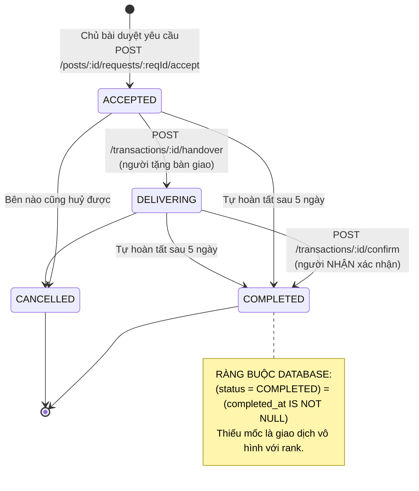
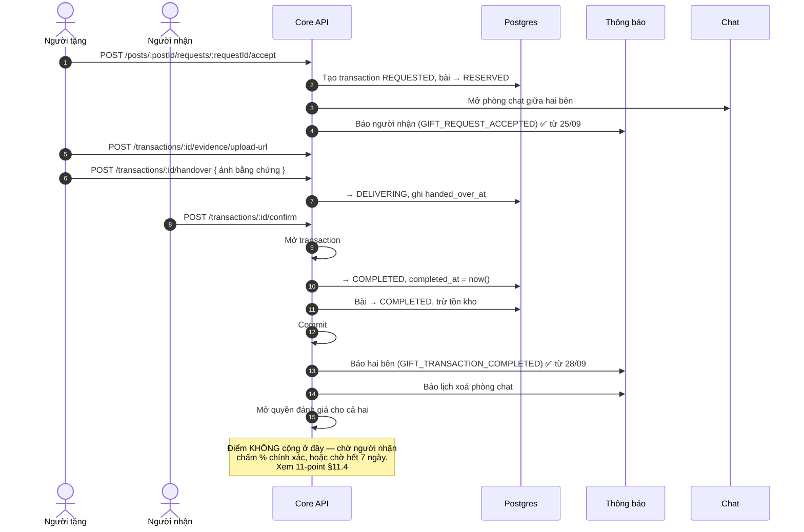
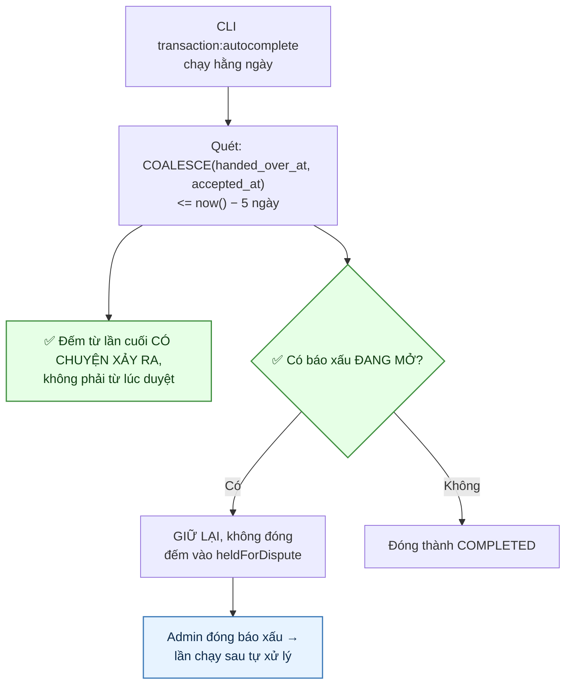
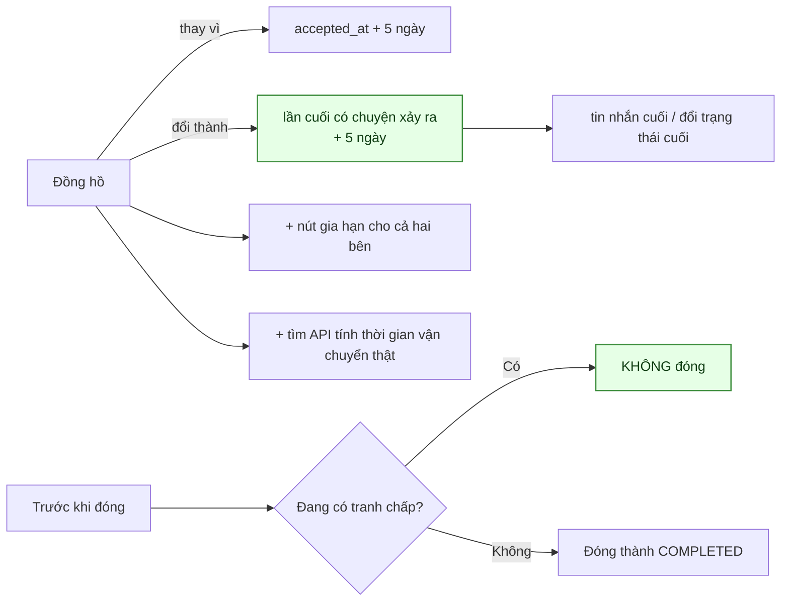
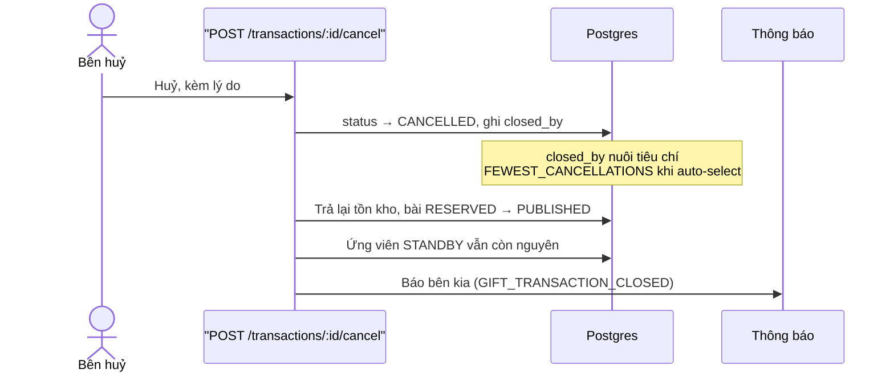
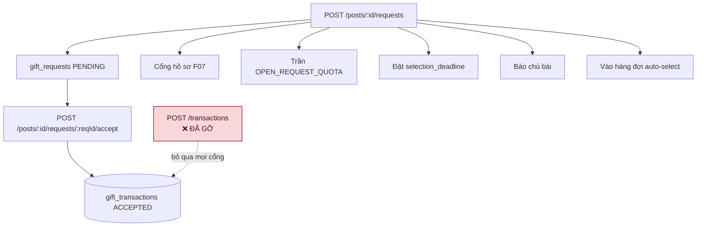

# 08 · Vòng đời lượt trao

Trạng thái: ✅ đã hiện thực. Từ 28/09 thì hoàn tất lượt trao **có báo cho hai bên** ở cả hai
đường, và cửa phụ tạo lượt trao đã gỡ.

**Bảy endpoint:** xem danh sách của mình, **xem một lượt**, xin link ảnh bằng chứng, bàn giao,
xác nhận, báo bom ship, huỷ.

## 8.1 Máy trạng thái

> ⚠️ **Sơ đồ cũ vẽ sai đường vào — sửa 28/09.** Nó viết `[*] --> REQUESTED: Chủ bài chấp nhận
> yêu cầu`, rồi `REQUESTED --> ACCEPTED`. Thực tế duyệt yêu cầu ở [07](./07-request.md) chèn
> thẳng `status = 'ACCEPTED'`, không đi qua `REQUESTED` bao giờ.

> **`REQUESTED` và `REJECTED` nay là hai trạng thái CHẾT.** `REQUESTED` chỉ sinh ra được từ
> `POST /transactions` — cửa đã gỡ 28/09 (xem §8.6). `REJECTED` thì chưa đường nào ghi, dù sơ đồ
> cũ vẽ `Chủ bài từ chối`: từ chối một **yêu cầu** là việc của
> `POST /posts/:id/requests/:reqId/reject` ở luồng 07, và nó đụng `gift_requests` chứ không đụng
> `gift_transactions`. Giá trị enum giữ lại cho dữ liệu cũ.

Ràng buộc ở tầng schema, không chỉ ở tầng ứng dụng:

| Ràng buộc | Chặn điều gì |
| --- | --- |
| `CHK_gift_transactions_not_self` | `giver_id <> receiver_id` — tự tặng mình là đường farm điểm rẻ nhất |
| `CHK_gift_transactions_completed_at` | `COMPLETED` bắt buộc có `completed_at` |
| `CHK_gift_transactions_quantity` | `quantity > 0` |

## 8.2 Luồng đầy đủ

> ✅ **Thông báo hoàn tất — nối 28/09.** `GIFT_TRANSACTION_COMPLETED` có mẫu từ migration
> `1792900000000` nhưng là mẫu **duy nhất** trong migration đó chưa đường nào gửi; bảy mẫu còn
> lại đều đã nối. Nghĩa là khoảnh khắc trọng tâm của cả sản phẩm — món đồ đến tay người cần —
> không ai được báo.

> **Gửi cho CẢ HAI bên vì mỗi bên chỉ biết một nửa.** Người nhận vừa bấm xác nhận nên họ biết;
> người tặng thì không, trừ khi tự mở app ra xem. Ở đường tự hoàn tất (§8.3) thì không bên nào
> biết.

## 8.3 Tự hoàn tất sau 5 ngày

**Hai kênh tranh chấp, và cố ý chỉ hai kênh:**

| Kênh | Vì sao |
| --- | --- |
| Báo xấu vào **chính bài** của lượt trao | Nội dung bài là thứ đang bị nghi |
| Báo xấu vào **người tặng, do chính người nhận của lượt này gửi** | Giới hạn ở người nhận là có chủ ý — một báo xấu bất kỳ nhắm vào người tặng sẽ khoá **mọi** lượt trao của họ, và đó là một đường phá hoại rẻ tiền |

> ✅ **Đường này từng im lặng hoàn toàn — nối thông báo 28/09.** Repository khoá phòng chat,
> có chú thích hẳn hoi *"Tự hoàn tất cũng là hoàn tất"*, rồi dừng ở đó: không thông báo hoàn
> tất, và cũng không cảnh báo lịch xoá chat mà `confirm` lẫn `cancel` đều gửi. Thiếu ở đây nặng
> hơn: người dùng **không bấm gì cả**, nên thông báo là cách duy nhất họ biết lượt trao đã khép
> và lịch sử trò chuyện sắp bị xoá.

> **Repository nay trả ra CHÍNH những lượt đã đóng**, không chỉ con số — con số thì không báo
> cho ai được. Và đọc lại SAU câu `UPDATE`: `completed_at` chỉ có giá trị sau đó, đọc trước là
> gửi thông báo mô tả một trạng thái chưa xảy ra.

> `ship-unpaid` không cần nằm trong danh sách: nó **tự đóng lượt trao** thành `CANCELLED`, nên
> cron không còn chạm tới.
>
> **Lượt bị giữ tự khỏi** ở lần chạy sau khi Admin đóng báo xấu — không cần hàng đợi riêng.
> Nhưng CLI in ra và **thoát khác 0**: một lượt trao treo vô thời hạn vì báo xấu không ai xử là
> chuyện người vận hành cần thấy.

**Hướng xử lý còn lại (2026-09-24):**

## 8.4 Huỷ lượt trao

## 8.5 Phí ship và khoản phạt (CH-2)

> **Vì sao chỉ người gửi báo được.** Chỉ họ mới thấy hàng bị hoàn về. Cho người nhận báo là
> cho chính người bị phạt quyết định có bị phạt hay không.

### Điểm âm — hai cột nói hai chuyện

Phạt 50 một người đang có 20:

| Cột | Giá trị | Ý nghĩa |
| --- | ---: | --- |
| `balance` | `0` | Số **tiêu được**, kẹp ở 0 |
| `raw_balance` | `−30` | Giá trị **thật**, để hiển thị và đối soát |
| `note` | | `−50 điểm, đang âm 30 điểm` — dựng ở máy chủ |

Ràng buộc `CHK_point_ledger_balance_is_clamped_raw` giữ `balance_after = GREATEST(0, raw_balance_after)`.

> **Vì sao không chỉ kẹp về 0 rồi thôi.** Lúc đó không ai biết người đó hụt 30 hay hụt 300,
> và lần cộng điểm sau sẽ trả hết nợ một cách vô hình. Cộng 50 khi đang âm 30 phải ra 20,
> không phải 50 — khoản phạt là một món nợ, không phải một lần xoá sạch.

## 8.6 Cửa phụ đã gỡ — ✅ 28/09

> **Hai cửa vào cùng một phòng, và cửa thứ hai bỏ qua mọi thứ cửa thứ nhất canh.**
> `POST /transactions` tạo thẳng `gift_transactions` mà **không** tạo `gift_requests`: không cổng
> hồ sơ, không trần yêu cầu đang mở, không đồng hồ chọn người, không báo chủ bài, và không nằm
> trong hàng đợi ứng viên. Đúng kiểu "hai hệ thống cho một việc" như `post_likes` và
> `content_reactions` đã gộp ở [06](./06-interaction.md).

> **Gỡ được vì không ai dùng.** Lớp tương thích `/gift-posts` không gọi tới, smoke test không
> gọi, không script kiểm nào gọi. Hàm `request()` ở repository cũng gỡ theo. `accept()` giữ lại
> cho những dòng `REQUESTED` còn sót từ trước, nhưng không endpoint nào chạm tới nữa.

## 8.7 Xem một lượt trao — ✅ 28/09

> **Trước đó chỉ có `/transactions/me`.** Trong khi MỌI thông báo của luồng này mang
> `referenceType: 'GIFT_TRANSACTION'` kèm `referenceId` — tức client bấm vào thông báo thì không
> có đường nào mở đúng lượt đó, phải tải cả danh sách rồi tự lọc.

> **Người ngoài cuộc nhận 404, không phải 403.** 403 xác nhận rằng lượt trao đó CÓ THẬT, và id
> đoán được thì đó là một kênh dò.

> **Khai route SAU `/transactions/me`.** `me` là chuỗi cố định còn `:transactionId` nuốt mọi
> thứ; đảo thứ tự thì `/transactions/me` rơi vào route dưới và trả 404 vì "me" không phải uuid.

## Chỗ cần soát

1. ✅ **Hoàn tất lượt trao nay sinh điểm** — nhưng **không ở bước `confirm`**: điểm chờ người
   nhận chấm % chính xác, hoặc chờ hết 7 ngày rồi áp mức mặc định. Xem
   [11-point §11.4](./11-point.md).
2. ✅ **Đồng hồ đếm từ `COALESCE(handed_over_at, accepted_at)`** và ✅ **đã kiểm tranh chấp**
   (25/09). Còn lại: tìm API tính thời gian vận chuyển thật để khỏi dùng con số 5 ngày cố định.
3. Khoản phạt ship giờ **cũng làm tụt hạng** (do rank đọc `balance` theo quyết định
   2026-09-24). Trước đây cố ý không đụng `lifetime` để tránh đúng chuyện này.
4. Chưa có cơ chế **mở lại** một lượt trao đã đóng nhầm. Nay còn đáng bàn hơn: tự hoàn tất đã
   gửi thông báo, nên người dùng sẽ thấy lượt trao bị khép và hỏi lại — mà không có đường nào mở.
5. ⚠️ **Không có thông báo khi người tặng BÀN GIAO** (`ACCEPTED → DELIVERING`). Người nhận chỉ
   biết nếu tự mở app, trong khi đó chính là lúc đồng hồ 5 ngày được đặt lại.
6. **`REQUESTED` và `REJECTED` là hai giá trị enum không còn đường nào ghi.** Giữ cho dữ liệu cũ,
   nhưng nên chốt có dọn hẳn không.
