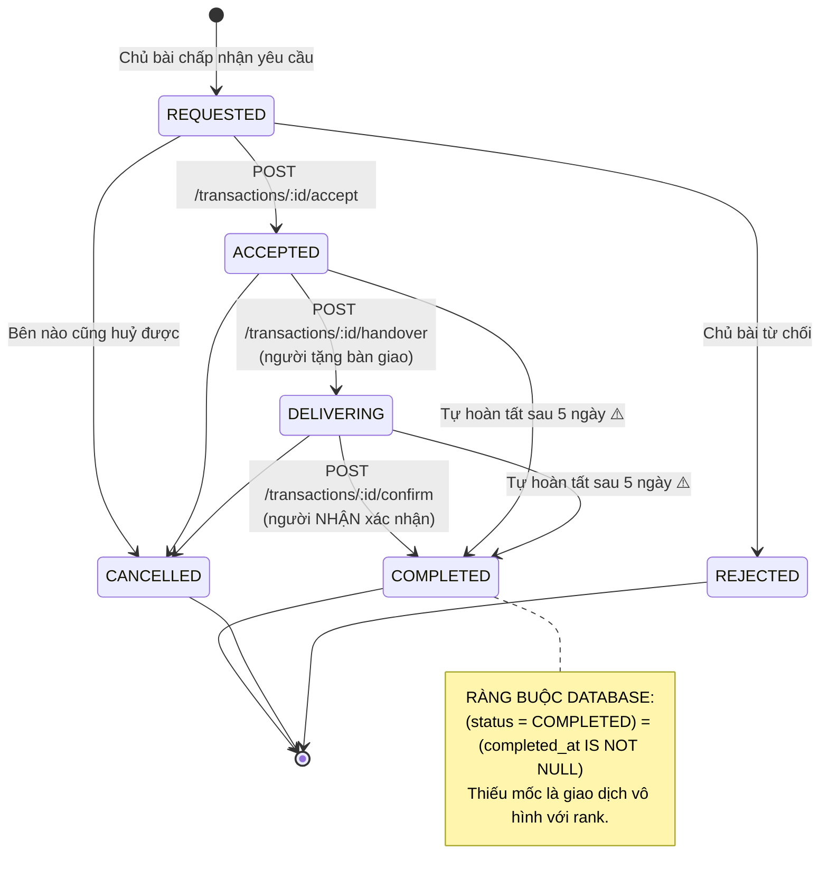
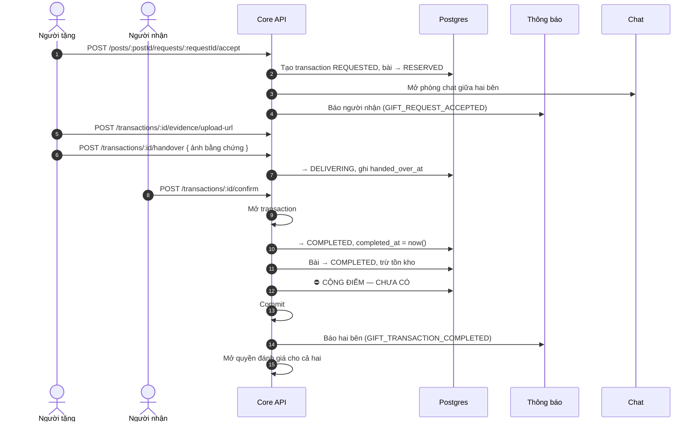
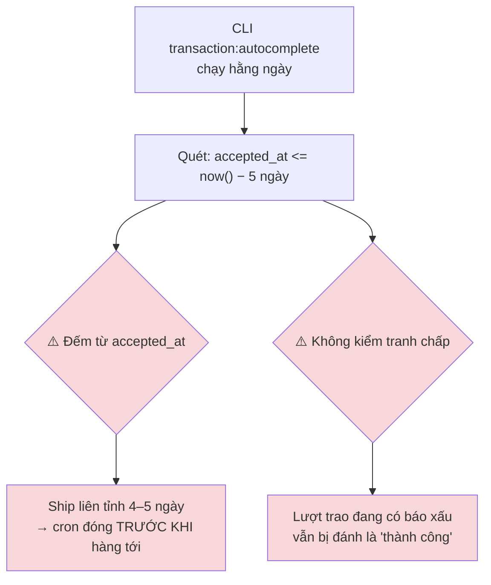
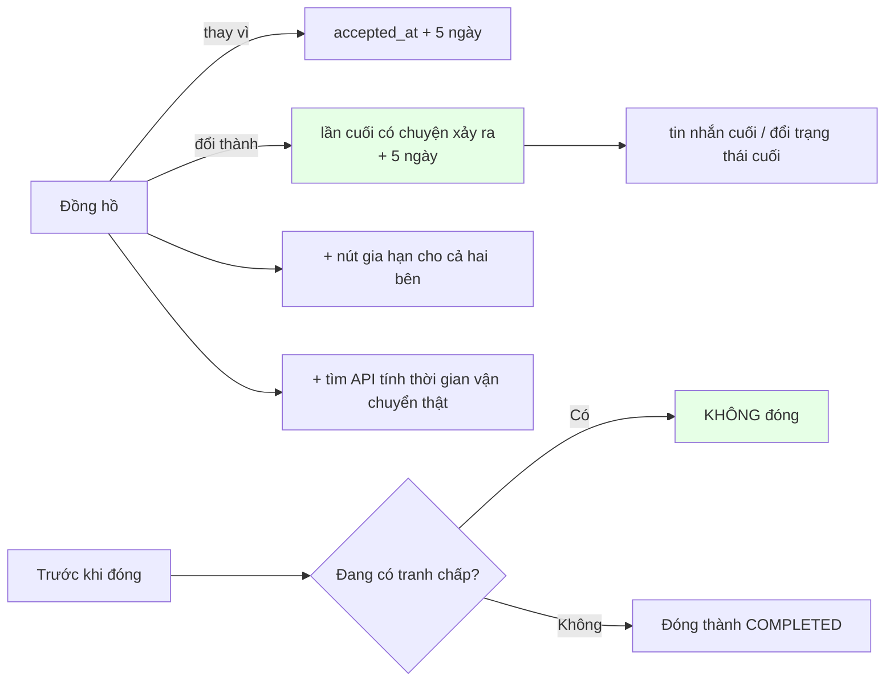
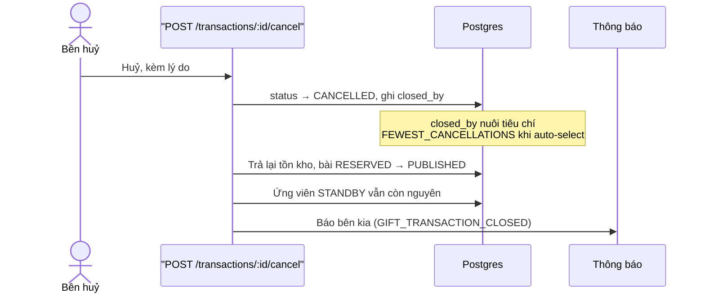
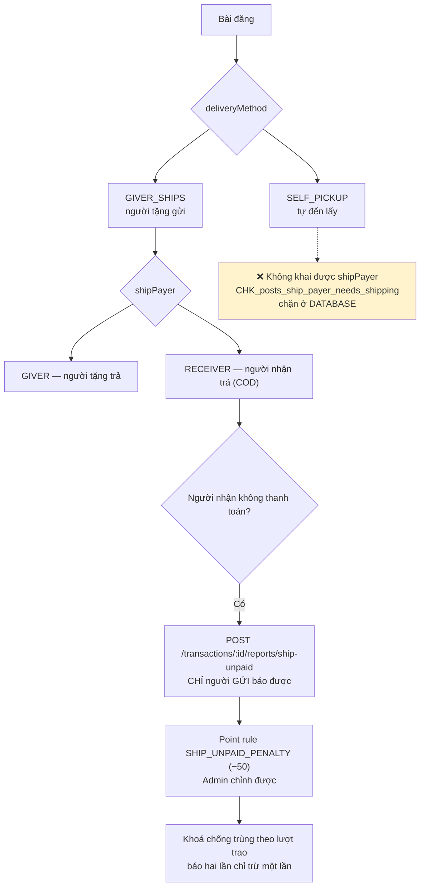

# 08 · Vòng đời lượt trao

Trạng thái: ✅ đã hiện thực. ⚠️ **Hoàn tất lượt trao hiện KHÔNG cộng điểm nào** — xem
[Chỗ cần soát](#chỗ-cần-soát).

## 8.1 Máy trạng thái

Ràng buộc ở tầng schema, không chỉ ở tầng ứng dụng:

| Ràng buộc | Chặn điều gì |
| --- | --- |
| `CHK_gift_transactions_not_self` | `giver_id <> receiver_id` — tự tặng mình là đường farm điểm rẻ nhất |
| `CHK_gift_transactions_completed_at` | `COMPLETED` bắt buộc có `completed_at` |
| `CHK_gift_transactions_quantity` | `quantity > 0` |

## 8.2 Luồng đầy đủ

## 8.3 Tự hoàn tất sau 5 ngày — ⚠️ hai vấn đề

**Hướng xử lý đã ghi nhận (2026-09-24):**

## 8.4 Huỷ lượt trao

## 8.5 Phí ship và khoản phạt (CH-2)

> **Vì sao chỉ người gửi báo được.** Chỉ họ mới thấy hàng bị hoàn về. Cho người nhận báo là
> cho chính người bị phạt quyết định có bị phạt hay không.

### Điểm âm — hai cột nói hai chuyện

Phạt 50 một người đang có 20:

| Cột | Giá trị | Ý nghĩa |
| --- | ---: | --- |
| `balance` | `0` | Số **tiêu được**, kẹp ở 0 |
| `raw_balance` | `−30` | Giá trị **thật**, để hiển thị và đối soát |
| `note` | | `−50 điểm, đang âm 30 điểm` — dựng ở máy chủ |

Ràng buộc `CHK_point_ledger_balance_is_clamped_raw` giữ `balance_after = GREATEST(0, raw_balance_after)`.

> **Vì sao không chỉ kẹp về 0 rồi thôi.** Lúc đó không ai biết người đó hụt 30 hay hụt 300,
> và lần cộng điểm sau sẽ trả hết nợ một cách vô hình. Cộng 50 khi đang âm 30 phải ra 20,
> không phải 50 — khoản phạt là một món nợ, không phải một lần xoá sạch.

## Chỗ cần soát

1. ⛔ **Hoàn tất lượt trao KHÔNG cộng điểm nào.** Không có rule `GIFT_COMPLETED` nào được
   seed hay gọi. Đây là lỗ hổng lớn nhất hiện tại: việc chính của nền tảng không sinh điểm,
   nên đường duy nhất lên Bạc là mời 12 người. Chờ X = 56 vào cấu hình.
2. ⚠️ **Đồng hồ 5 ngày đếm từ sai mốc** và **không kiểm tranh chấp** — mục 8.3.
3. Khoản phạt ship giờ **cũng làm tụt hạng** (do rank đọc `balance` theo quyết định
   2026-09-24). Trước đây cố ý không đụng `lifetime` để tránh đúng chuyện này.
4. Chưa có cơ chế **mở lại** một lượt trao đã đóng nhầm.
