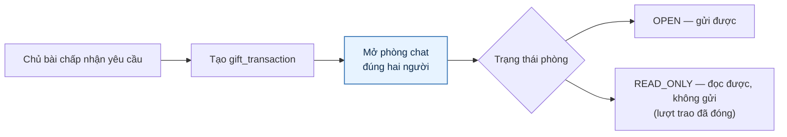
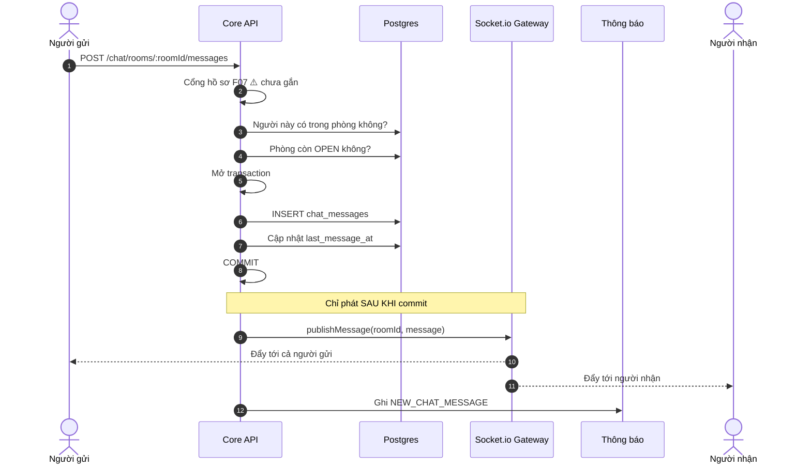
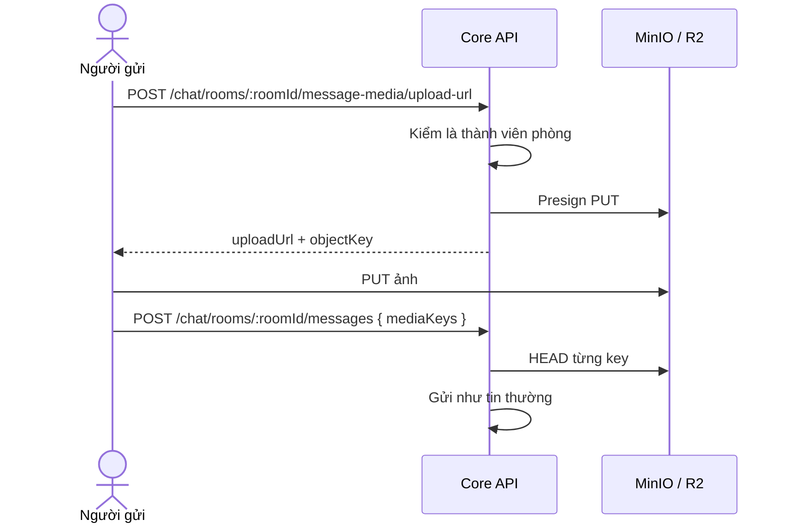
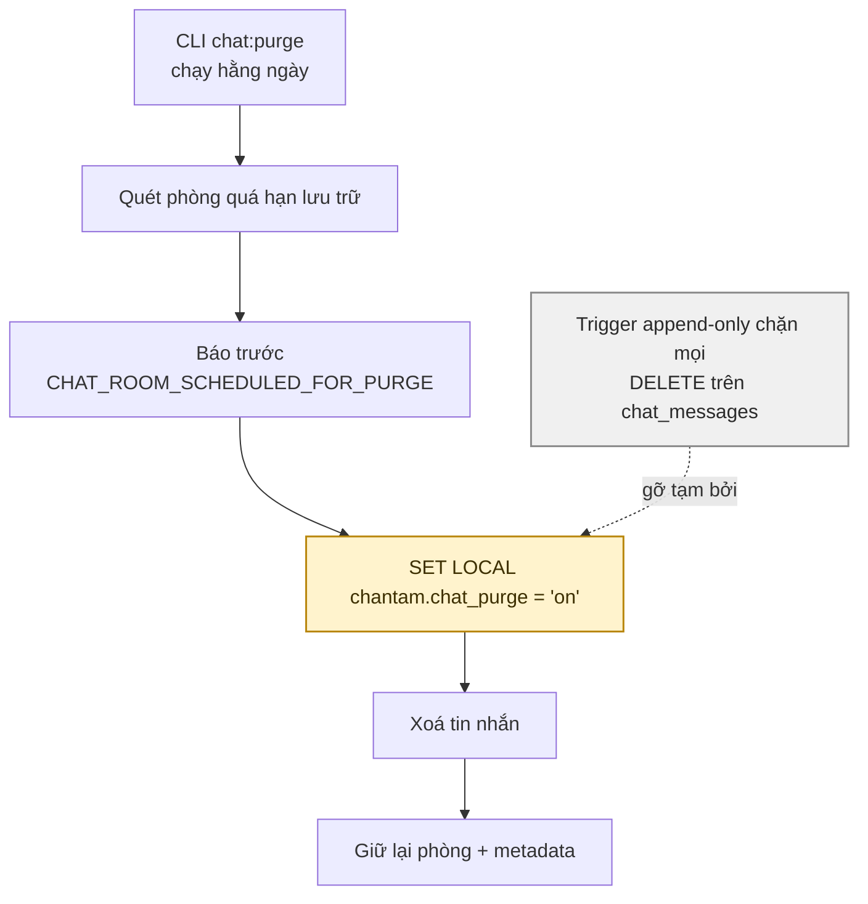

# 09 · Chat

Trạng thái: ✅ **đã hiện thực** gồm realtime, ảnh, và dọn tin quá hạn.

## 9.1 Phòng chat sinh từ lượt trao

> **Vì sao phòng khoá lại thay vì xoá khi lượt trao đóng.** Lịch sử trao đổi là bằng chứng
> khi có tranh chấp. Xoá đi thì hai bên chỉ còn lời khai.

## 9.2 Gửi tin nhắn

> **Vì sao phát tin chỉ sau khi commit.** Phát từ trong transaction rồi rollback là nói với
> client về một tin nhắn không tồn tại — và không có cách nào rút lại lời đó.
>
> **Vì sao người gửi cũng nhận.** Họ có thể đang mở phòng trên hai thiết bị; bỏ qua họ sẽ
> làm thiết bị thứ hai thiếu tin.

## 9.3 Ảnh trong chat

## 9.4 Dọn tin quá hạn lưu trữ

> **Vì sao cần một cái cổng riêng để xoá.** Bảng tin nhắn có trigger chặn sửa/xoá để không ai
> âm thầm đổi lịch sử trao đổi. Job dọn định kỳ là ngoại lệ **duy nhất** được phép, và nó phải
> khai báo rõ ràng bằng một biến phiên thay vì được miễn trừ ngầm.

## Chỗ cần soát

1. Cổng hồ sơ F07 **chưa gắn vào chat** dù đã chốt ngày 2026-09-24.
2. **Thời hạn lưu trữ tin nhắn** hiện là hằng trong code, chưa đưa ra cấu hình Admin.
3. Chưa có **chặn/báo xấu người dùng ngay trong phòng chat** — phải sang `POST /reports`.
4. Chưa có giới hạn tốc độ gửi tin. Một người spam 1.000 tin trong một phút là làm được.
5. Smart Match và chat nhóm chưa có (DEFERRED M3 ghi "Chat và Smart Match" chưa xong, nhưng
   chat 1-1 thì đã chạy).
