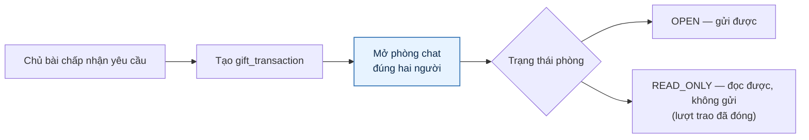
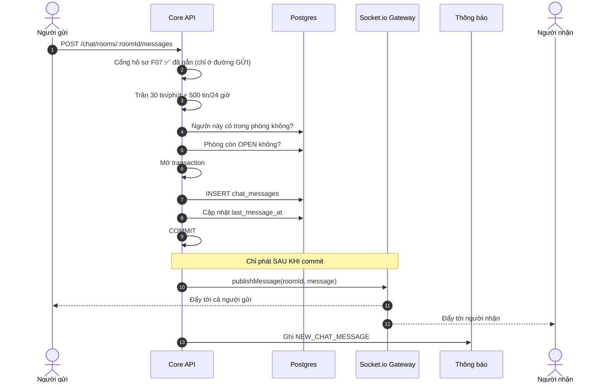
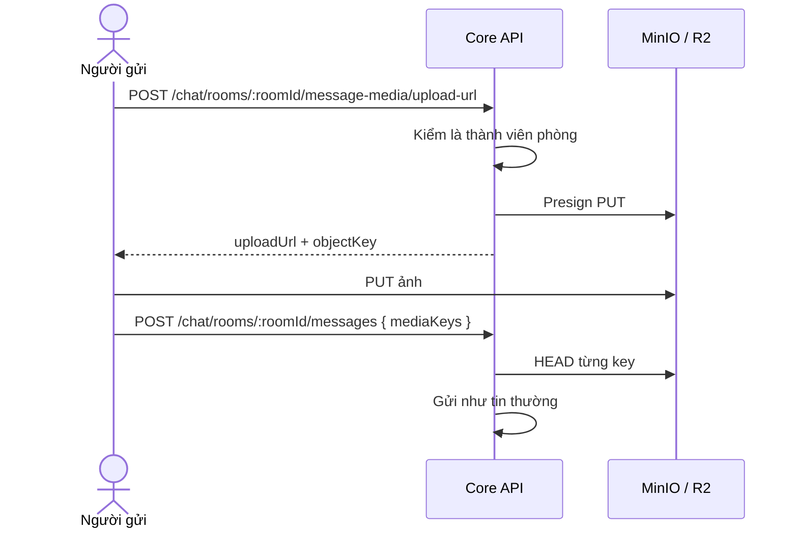
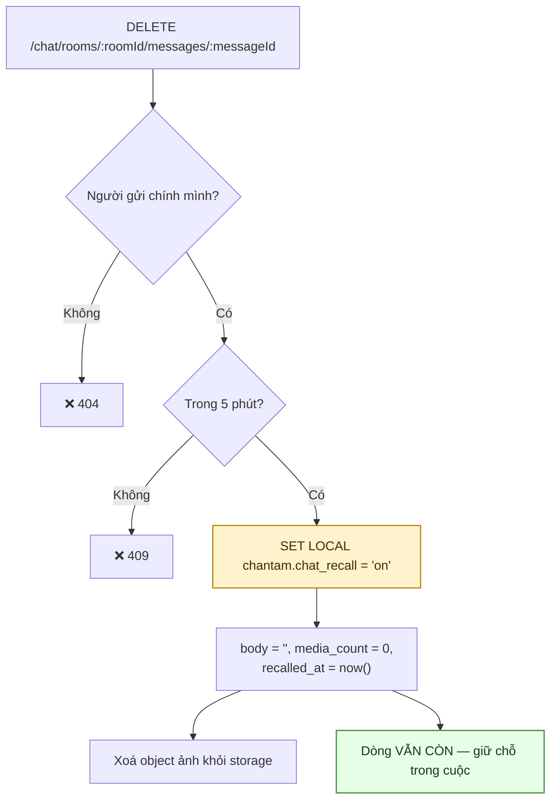
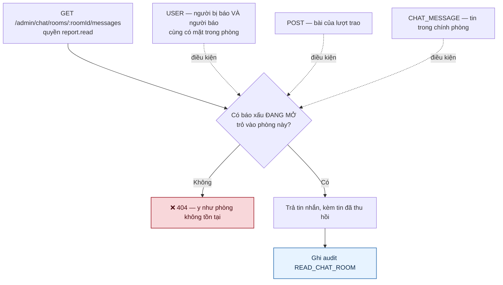
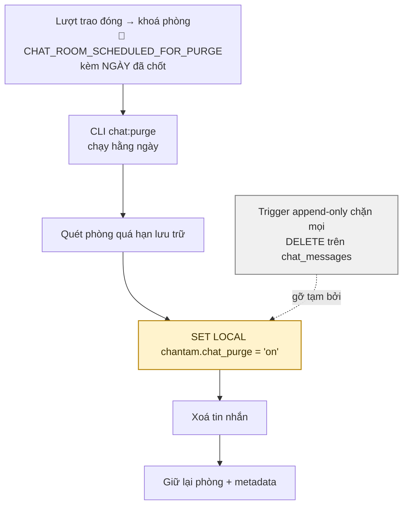

# 09 · Chat

Trạng thái: ✅ **đã hiện thực** gồm realtime, ảnh, dọn tin quá hạn, và từ 28/09 thêm thu hồi
tin, trần gửi, cùng đường điều tra cho Admin.

**Bảy endpoint:** danh sách phòng, đọc tin, gửi tin, xin link ảnh, đánh dấu đã đọc, **thu hồi
tin**, và **Admin đọc phòng** (có điều kiện).

## 9.1 Phòng chat sinh từ lượt trao

> **Vì sao phòng khoá lại thay vì xoá khi lượt trao đóng.** Lịch sử trao đổi là bằng chứng
> khi có tranh chấp. Xoá đi thì hai bên chỉ còn lời khai.

## 9.2 Gửi tin nhắn

> **Vì sao phát tin chỉ sau khi commit.** Phát từ trong transaction rồi rollback là nói với
> client về một tin nhắn không tồn tại — và không có cách nào rút lại lời đó.
>
> **Vì sao người gửi cũng nhận.** Họ có thể đang mở phòng trên hai thiết bị; bỏ qua họ sẽ
> làm thiết bị thứ hai thiếu tin.

> **Cổng hồ sơ đặt ở đường GỬI, không ở đường ĐỌC** — và đó là chủ ý: người hồ sơ chưa đủ vẫn
> phải đọc được tin nhắn gửi cho mình, nếu không họ mất luôn lời nhắn đang chờ.

> ✅ **Trần gửi tin — thêm 28/09.** Nặng hơn trần bình luận ở một điểm: mỗi tin bắn MỘT thông báo
> `NEW_CHAT_MESSAGE`, khoá chống trùng theo id tin nên không gộp được. Một nghìn tin là một
> nghìn lần rung máy. Ba mươi cái một phút rộng hơn hẳn nhịp gõ của người đang mặc cả chỗ hẹn;
> trần ngày 500 chặn phần tổng, vì riêng trần phút vẫn cho 43.200 tin mỗi ngày.

> **Đếm SAU khi tin đã lưu.** Đếm trước là trừ mất một suất cho một tin bị từ chối vì phòng đã
> khoá — phạt người dùng vì thứ chưa bao giờ gửi được.

## 9.3 Ảnh trong chat

## 9.4 Thu hồi tin nhắn — ✅ 28/09

> **Vì sao cần.** Đây chính là nơi hai bên trao số điện thoại và địa chỉ thật, nên dán nhầm vào
> phòng khác là chuyện sẽ xảy ra — và trước đó không gỡ được kể cả một giây sau.

> ⚠️ **Đây là một lỗ đục vào trigger append-only, nên phải hẹp nhất có thể.** Chỉ cho `UPDATE`
> chứ không cho `DELETE`; chỉ khi khai cờ phiên `chantam.chat_recall`, y như job dọn phải khai
> `chantam.chat_purge`; và chỉ được làm rỗng nội dung. Đổi `sender_id`, `room_id` hay
> `created_at` vẫn bị chặn — thu hồi là xoá lời mình nói, không phải sửa ai đã nói gì lúc nào.
> `test:chat-access` canh đúng chuyện đó: thử lùi `created_at` ngay cả khi đã bật cờ dọn, và
> trigger vẫn chặn.

> **Năm phút.** Dài hơn thì thu hồi thành công cụ viết lại cuộc trao đổi sau khi bên kia đã đọc
> và đã hành động theo nó — mà chính lịch sử đó là bằng chứng khi tranh chấp.

> **Ảnh biến mất theo.** Thu hồi mà để ảnh vẫn mở được bằng đường dẫn công khai thì chữ biến mất
> còn thứ đáng lo nhất vẫn nằm đó.

## 9.5 Admin đọc phòng để điều tra — ✅ 28/09

> **Vì sao cần.** §9.1 lấy chính lịch sử trò chuyện làm lý do giữ phòng thay vì xoá: *"bằng
> chứng khi có tranh chấp"*. Nhưng trước 28/09 **không endpoint nào đọc được nó, kể cả Admin** —
> nên người bị quấy rối báo xấu, Admin mở hàng đợi ra và không có gì để xem ngoài lời khai. Cả
> kênh tố cáo là trang trí.

> ⚠️ **Báo xấu một NGƯỜI chỉ mở phòng mà CẢ HAI cùng có mặt** — người bị báo và chính người báo.
> Bản đầu tôi viết chỉ đòi người bị báo có mặt, và `test:chat-access` bắt được ngay: một báo xấu
> duy nhất mở toang **mọi** cuộc trò chuyện của người đó với người khác. Cùng lối nghĩ với điều
> kiện giữ lượt trao đang tranh chấp ở [08 §8.3](./08-transaction.md).

> **Không có báo xấu thì trả 404, không phải 403.** 403 xác nhận phòng đó có thật, và id đoán
> được thì đó là một kênh dò.

> **Mỗi lần mở đều ghi audit.** Quyền đọc chỗ riêng tư mà không để lại vết là quyền không ai
> kiểm soát được. Ghi SAU khi đã chắc chắn đọc được — ghi cả những lần bị từ chối thì hàng nghìn
> dòng "đã thử đọc" sẽ chôn vùi những lần đọc thật.

> **Quyền `report.read`, không phải `admin.manage`.** Đọc phòng chat chỉ có một lý do chính
> đáng: điều tra một báo xấu. Nên nó thuộc về người đang xử báo xấu.

## 9.6 Dọn tin quá hạn lưu trữ

> **Thông báo gửi lúc KHOÁ PHÒNG, không phải lúc xoá.** Sơ đồ cũ đặt nó bên trong job dọn —
> đúng chỗ đó thì đã muộn. Báo lúc khoá cho người ta cả kỳ lưu trữ để lưu lại thông tin cần
> giữ, và câu chữ mang **ngày đã chốt** chứ không phải "sau một tuần": Admin đổi cấu hình sau đó
> cũng không dịch ngày của phòng này.

> **Vì sao cần một cái cổng riêng để xoá.** Bảng tin nhắn có trigger chặn sửa/xoá để không ai
> âm thầm đổi lịch sử trao đổi. Job dọn định kỳ là ngoại lệ **duy nhất** được phép, và nó phải
> khai báo rõ ràng bằng một biến phiên thay vì được miễn trừ ngầm.

## Chỗ cần soát

1. ✅ Cổng hồ sơ F07 **đã gắn** (25/09) — tài liệu cũ ghi "chưa gắn" ở cả sơ đồ §9.2 lẫn mục
   này, trong khi mã đã có từ lâu. Sửa 28/09.
2. ✅ **Thời hạn lưu trữ là cấu hình động** `chat.retention`, không phải hằng trong code. Cũng
   là một mục ghi sai.
3. ✅ **Báo xấu trỏ đúng tin nhắn** (28/09) — `POST /reports` nhận `targetType: CHAT_MESSAGE`,
   và hàng đợi Admin hiện đoạn đầu nội dung kèm tên người gửi.
4. ✅ **Đã có trần gửi tin** (28/09) — 30/phút + 500/24 giờ.
5. ⚠️ **Vẫn chưa CHẶN được một người.** Báo xấu là kênh tố cáo, không phải kênh tự vệ: trong
   lúc chờ Admin xử, người bị quấy rối vẫn nhận tin. Chặn ở đây khó hơn ở mạng xã hội vì hai
   người đang có một lượt trao chung — chặn xong thì ai hẹn giao đồ? Cần Bên A chốt.
6. **Tin đã thu hồi vẫn nằm trong database cho tới kỳ dọn.** Với người dùng thì nó biến mất,
   nhưng Admin có báo xấu đang mở vẫn đọc được mốc `recalledAt`. Đó là chủ ý — chính việc thu
   hồi sau khi gửi bậy là thứ đáng biết — nhưng nên nói rõ trong chính sách riêng tư.
7. Smart Match và chat nhóm chưa có (DEFERRED M3 ghi "Chat và Smart Match" chưa xong, nhưng
   chat 1-1 thì đã chạy).
