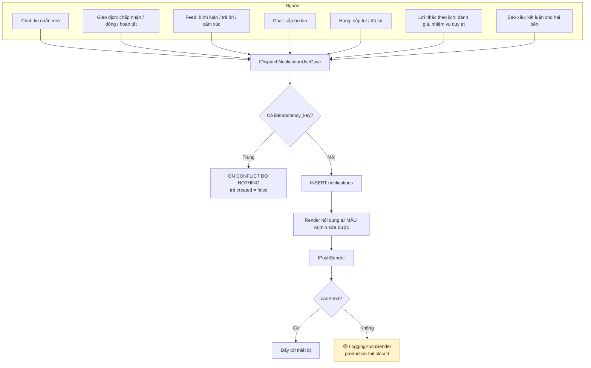
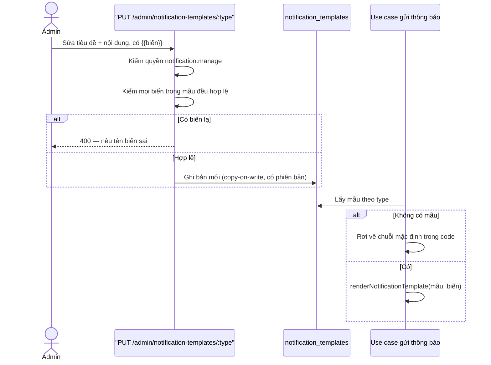
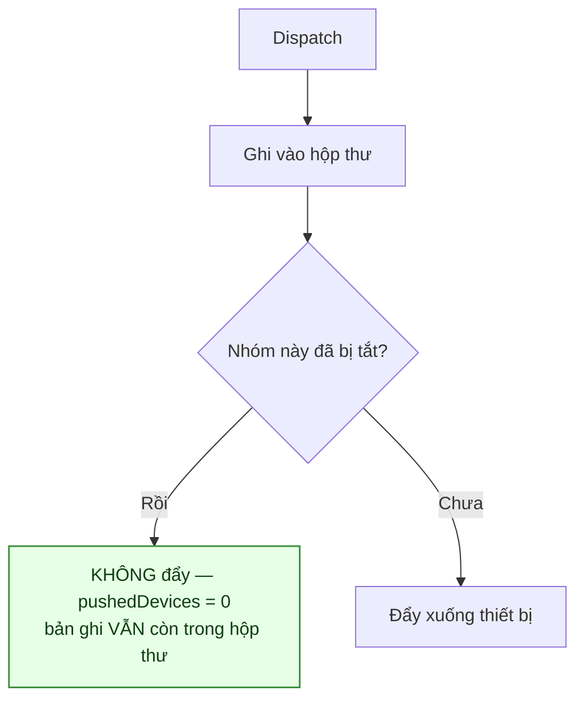

# 10 · Thông báo

Trạng thái: ✅ ghi trong app đầy đủ, có cài đặt theo nhóm và có dọn theo hạn lưu trữ.
🟡 **Đẩy thật (FCM) chưa nối** — xem [Chỗ cần soát](#chỗ-cần-soát).

**Bốn endpoint:** đọc hộp thư, đánh dấu đã đọc, **xem cài đặt**, **tắt/bật một nhóm**.

## 10.1 Kiến trúc

## 10.2 Hai mươi mốt loại, chia bốn nhóm

Nhóm là thứ người dùng tắt/bật được (§10.5). Mọi loại dưới đây đều **thật sự được gửi** —
không còn loại nào khai mà nằm im.

| Mã | Nhóm | Khi nào | Khoá chống trùng |
| --- | --- | --- | --- |
| `NEW_CHAT_MESSAGE` | CHAT | Có tin nhắn mới | theo messageId |
| `CHAT_ROOM_SCHEDULED_FOR_PURGE` | CHAT | Phòng sắp bị dọn | theo roomId |
| `GIFT_REQUEST_CREATED` | TRANSACTION | Có người xin nhận bài của bạn | `GIFT_REQUEST_CREATED:<requestId>` |
| `GIFT_REQUEST_REJECTED` | TRANSACTION | Chủ bài từ chối yêu cầu | `GIFT_REQUEST_REJECTED:<requestId>` |
| `GIFT_REQUEST_CLOSED` | TRANSACTION | Bài đóng lại nên yêu cầu bị đóng theo | `GIFT_REQUEST_CLOSED:<requestId>` |
| `GIFT_TRANSACTION_HANDED_OVER` | TRANSACTION | Người tặng báo đã bàn giao | `…:<transactionId>` |
| `GIFT_TRANSACTION_REOPENED` | TRANSACTION | Admin mở lại lượt đóng nhầm | theo lượt + người + mốc |
| `POST_EXPIRING_SOON` | SYSTEM | Bài còn 7 ngày là hết hạn | `POST_EXPIRING_SOON:<postId>:<ngày hết hạn>` |
| `GIFT_REQUEST_ACCEPTED` | TRANSACTION | Chủ bài duyệt, **hoặc** job tự chọn khi hết đồng hồ | `GIFT_REQUEST_ACCEPTED:<transactionId>` |
| `GIFT_TRANSACTION_CLOSED` | TRANSACTION | Lượt trao bị huỷ | theo transactionId |
| `GIFT_TRANSACTION_COMPLETED` | TRANSACTION | Lượt trao hoàn tất | theo lượt + người |
| `CONTENT_COMMENT_CREATED` | FEED | Có người bình luận bài mình | `CONTENT_COMMENT:<commentId>` |
| `CONTENT_COMMENT_REPLIED` | FEED | Có người trả lời bình luận mình | `CONTENT_COMMENT_REPLY:<commentId>` |
| `CONTENT_REACTION_FIRST_OF_DAY` | FEED | Lần đầu trong ngày có cảm xúc | `CONTENT_REACTION_FIRST:<postId>:<ngày VN>` |
| `RANK_DEMOTION_WARNING` | SYSTEM | Điểm xuống dưới mốc cảnh báo của bậc | `RANK_DEMOTION_WARNING:<userId>:<rank>:<ngày VN>` |
| `RANK_DEMOTED` | SYSTEM | Đã tụt hạng | `RANK_DEMOTED:<userId>:<từ>:<sang>:<ngày VN>` |
| `RANK_PROMOTED` | SYSTEM | Đã lên hạng — quyền lợi bậc mới có hiệu lực ngay | `RANK_PROMOTED:<userId>:<từ>:<sang>:<ngày VN>` |
| `REVIEW_REMINDER` | SYSTEM | Nhắc người nhận đánh giá | `REVIEW_REMINDER:<transactionId>` |
| `RANK_MAINTENANCE_REMINDER` | SYSTEM | Nhắc nhiệm vụ duy trì, trước 30 ngày | `RANK_MAINTENANCE_REMINDER:<cycleId>` |
| `REPORT_REVIEWED` | SYSTEM | Báo xấu của bạn đã được xử lý | `REPORT_REVIEWED:<targetId>:<reporterId>:<status>` |
| `CONTENT_MODERATED` | SYSTEM | Nội dung của bạn bị xử lý | `CONTENT_MODERATED:<targetType>:<targetId>` |

> `notifications.idempotency_key` có UNIQUE. Cùng một sự kiện chạy lại bao nhiêu lần cũng chỉ
> ra một thông báo — quan trọng vì job nền và retry mạng đều có thể gọi lại.

## 10.3 Mẫu thông báo Admin sửa lúc chạy (F62)

> **Vì sao kiểm biến lúc lưu chứ không lúc gửi.** Sai một tên biến mà chỉ phát hiện lúc gửi
> thì người đầu tiên nhận được thông báo hỏng, và Admin không biết cho tới khi có người kêu.

## 10.4 Cài đặt theo nhóm — ✅ 29/09

> **Nhóm chứ không phải từng loại.** Hai mươi mốt công tắc là một màn hình không ai đọc, và người
> đang bị làm phiền cần tắt nhanh chứ không cần chính xác. Bốn nhóm thì đọc một lượt là hiểu.

> **Vì sao phải có.** Trước đó là tất-cả-hoặc-không, nên người bị làm phiền sẽ tắt thông báo ở
> **mức hệ điều hành** — và mất luôn `GIFT_REQUEST_ACCEPTED`, thứ thật sự quan trọng. Đây đúng
> là lý lẽ đã dùng để thiết kế luật "cảm xúc chỉ báo lần đầu trong ngày" (§6.5).

> **Tắt tiếng KHÔNG phải tắt bản ghi.** Thông báo vẫn vào hộp thư để người dùng tự vào xem. Bỏ
> luôn bản ghi thì họ mất hẳn thông tin, chứ không phải được yên tĩnh — cùng lối nghĩ với tắt
> thông báo một phòng chat (§9.5b).

> **Bảng chỉ chứa NGOẠI LỆ.** Không có dòng nghĩa là đang bật, nên bật lại là xoá dòng chứ không
> ghi `false`. Đại đa số không đụng tới cài đặt này, và thêm một nhóm mới sau cũng không phải
> backfill cho toàn bộ người dùng.

> **Đọc cài đặt hỏng thì coi như CHƯA tắt.** Mất một lần yên tĩnh còn hơn nuốt mất một thông báo
> người dùng đang chờ — cùng lối xử lý với việc đọc mẫu.

> **`types` trả kèm mỗi nhóm** để client khỏi tự đoán, và khỏi lệch khi backend thêm loại mới.

## 10.5 Dọn theo hạn lưu trữ — ✅ 29/09

> ⚠️ **Trước 29/09 thông báo KHÔNG BAO GIỜ bị dọn.** Và đó là một lỗ trong chính sách lưu trữ,
> không chỉ là chuyện bảng phình to: thông báo mang tiêu đề bài, tên người, và **đoạn đầu tin
> nhắn chat**. Xoá lịch sử chat theo hạn xong, một bản sao của chính những câu đó vẫn nằm trong
> hộp thư mãi mãi.

> **90 ngày, cấu hình động** (`notification.retention`) — dài hơn mọi chu kỳ nghiệp vụ đang có
> (đồng hồ chọn người 30 ngày, hạn bài 3 tháng), nên không ai mất một thông báo còn đang cần.
> Sàn 7 ngày: dưới một tuần thì người đi vắng vài ngày về sẽ thấy hộp thư trống.

> **Xoá theo TUỔI, không phân biệt đã đọc.** Một thông báo chưa đọc sau 90 ngày không còn là thứ
> ai đó sắp đọc.

> **Xoá theo lô, và nói ra khi chưa đuổi kịp.** `notification:purge` chạy tối đa 20 lô mỗi lần;
> chạm trần thì log cảnh báo và thoát khác 0, để người vận hành biết mà tăng nhịp chạy thay vì
> để job im lặng tụt lại mãi.

## 10.6 Gửi sau khi ghi xong

## Chỗ cần soát

1. 🟡 **FCM chưa nối — và đây là việc CÒN LẠI DUY NHẤT của đẩy thật.** Hạ tầng token đã xong:
   `fcmToken` được thu ở đăng ký/đăng nhập/refresh, lưu theo phiên, và **bị xoá khi đổi mật khẩu
   hoặc thu hồi phiên**. `findPushTokens` cũng đã lọc bỏ phiên đã thu hồi hay hết hạn. Thiếu đúng
   **một lớp**: một cài đặt `IPushSender` gọi Firebase Admin SDK — một class cộng vài biến môi
   trường, không phải một dự án.

   **Chỗ không tự làm được: khoá Firebase.** Cần project Firebase và service account. Chừng nào
   chưa có, `LoggingPushSender` vẫn là cài đặt duy nhất và ở production `canSend()` trả `false`
   (fail-closed, cố ý). Thông báo trong app vẫn ghi đủ, nhưng **không có gì rung máy ai**.

2. ⚠️ **Chưa có queue / retry / dead-letter.** Hiện vô hại vì `LoggingPushSender` không bao giờ
   lỗi. Nhưng **ngay khi nối FCM thật** nó thành mất thông báo im lặng: mạng chập một nhịp là một
   người không bao giờ biết yêu cầu của mình đã được duyệt. Nên làm **cùng lúc** với mục 1, đừng
   để sau.

3. ✅ **Đã có tắt/bật theo nhóm** (29/09) — xem §10.4.

4. ✅ **Đã có nhắc bài sắp hết hạn** (29/09), trước 7 ngày, qua `notify:reminders`. Khoá chống
   trùng gắn cả mốc hết hạn nên gia hạn xong vẫn được nhắc lại cho hạn mới.

5. **Không có lời nhắc nào cho hàng đợi Admin.** Bình luận chờ duyệt và báo xấu chờ xử chỉ hiện
   khi Admin tự mở CMS — xem [06 §6.8](./06-interaction.md). Cân nhắc một bản tóm tắt theo ngày
   thay vì báo từng cái.
