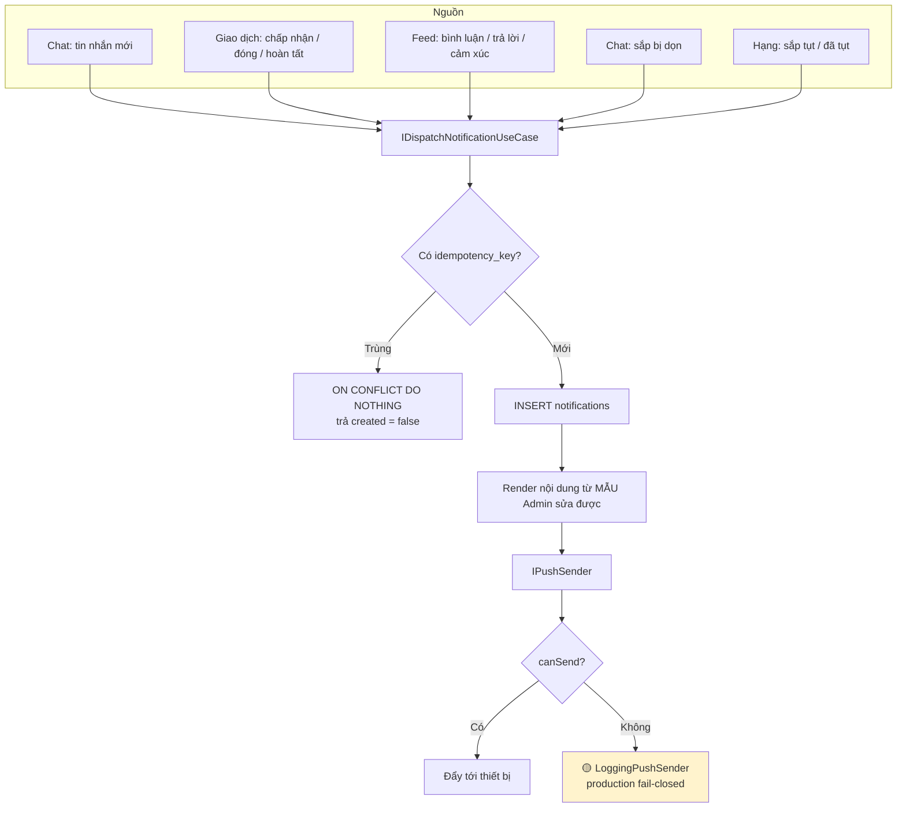
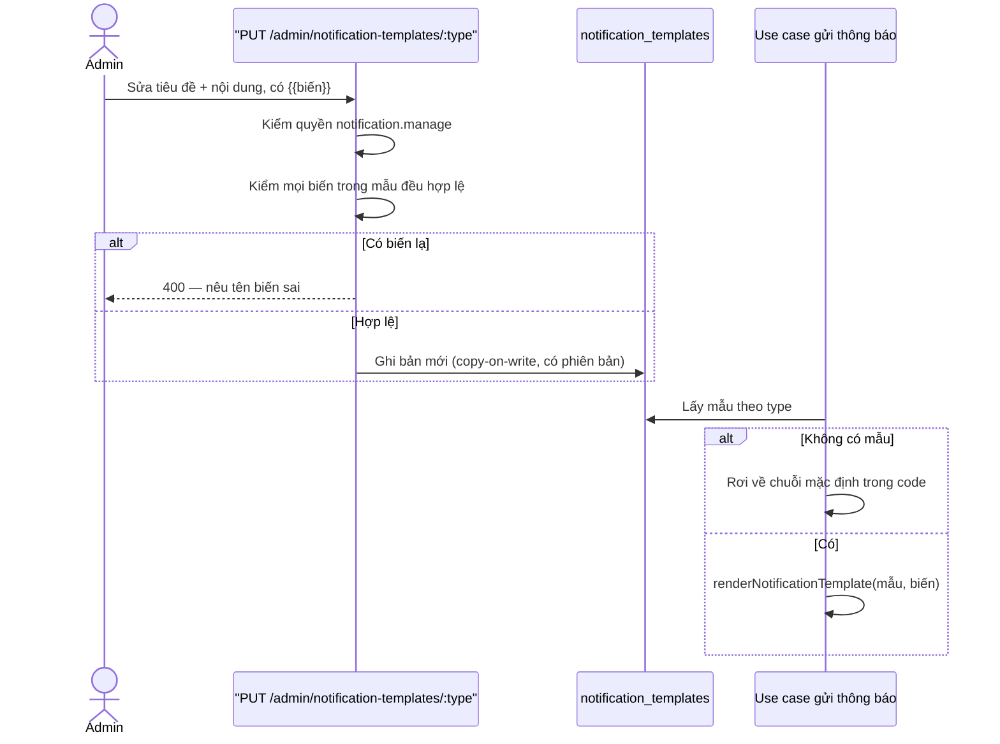
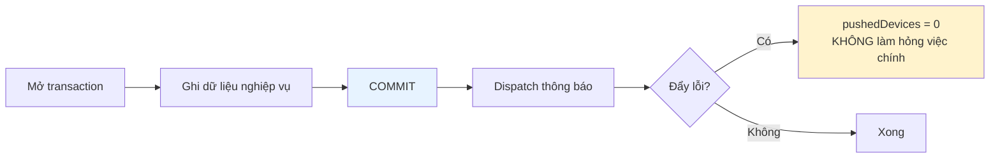

# 10 · Thông báo

Trạng thái: ✅ ghi trong app đầy đủ. 🟡 **Đẩy thật (FCM) chưa nối.**

## 10.1 Kiến trúc

## 10.2 Mười loại thông báo hiện có

| Mã | Khi nào | Khoá chống trùng |
| --- | --- | --- |
| `NEW_CHAT_MESSAGE` | Có tin nhắn mới | theo messageId |
| `GIFT_REQUEST_ACCEPTED` | Chủ bài chấp nhận yêu cầu | theo requestId |
| `GIFT_TRANSACTION_CLOSED` | Lượt trao bị huỷ | theo transactionId |
| `GIFT_TRANSACTION_COMPLETED` | Lượt trao hoàn tất | theo transactionId |
| `CHAT_ROOM_SCHEDULED_FOR_PURGE` | Phòng sắp bị dọn | theo roomId |
| `CONTENT_COMMENT_CREATED` | Có người bình luận bài mình | `CONTENT_COMMENT:<commentId>` |
| `CONTENT_COMMENT_REPLIED` | Có người trả lời bình luận mình | `CONTENT_COMMENT_REPLY:<commentId>` |
| `CONTENT_REACTION_FIRST_OF_DAY` | Lần đầu trong ngày có cảm xúc | `CONTENT_REACTION_FIRST:<postId>:<ngày VN>` |
| `RANK_DEMOTION_WARNING` | Điểm xuống dưới mốc cảnh báo của bậc | `RANK_DEMOTION_WARNING:<userId>:<rank>:<ngày VN>` |
| `RANK_DEMOTED` | Đã tụt hạng | `RANK_DEMOTED:<userId>:<từ>:<sang>:<ngày VN>` |

> `notifications.idempotency_key` có UNIQUE. Cùng một sự kiện chạy lại bao nhiêu lần cũng chỉ
> ra một thông báo — quan trọng vì job nền và retry mạng đều có thể gọi lại.

## 10.3 Mẫu thông báo Admin sửa lúc chạy (F62)

> **Vì sao kiểm biến lúc lưu chứ không lúc gửi.** Sai một tên biến mà chỉ phát hiện lúc gửi
> thì người đầu tiên nhận được thông báo hỏng, và Admin không biết cho tới khi có người kêu.

## 10.4 Gửi sau khi ghi xong

## Chỗ cần soát

1. 🟡 **FCM chưa nối.** `LoggingPushSender` là `IPushSender` duy nhất, và ở production
   `canSend()` trả `false`. Thông báo trong app vẫn ghi đủ, nhưng **không có gì rung máy ai**.
2. **Chưa có queue / retry / dead-letter.** Đẩy lỗi là mất, không thử lại.
3. Chưa có **tuỳ chọn tắt từng loại thông báo** cho người dùng. Hiện là tất-cả-hoặc-không.
4. ✅ **Thông báo sắp tụt hạng và đã tụt hạng đã có** (25/09). Còn thiếu: sắp hết hạn bài,
   nhắc nhiệm vụ duy trì trước 1 tháng (SRS yêu cầu), và nhắc người nhận đánh giá.
