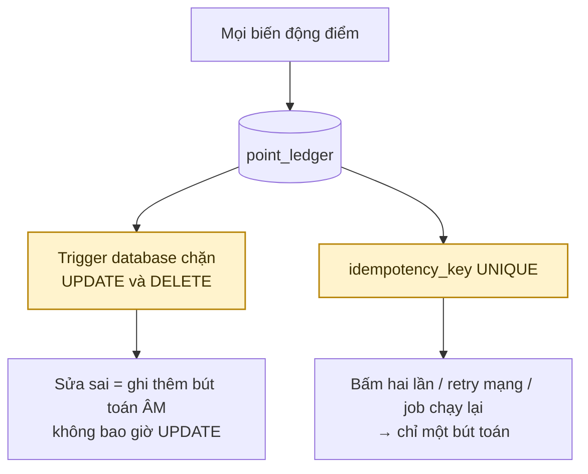
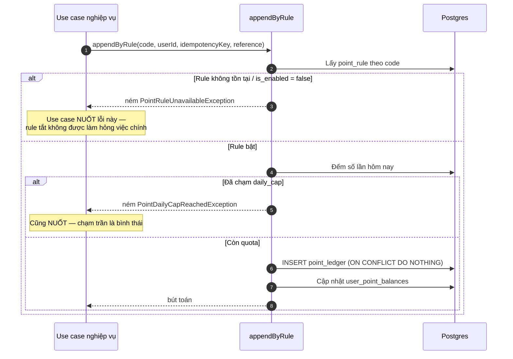
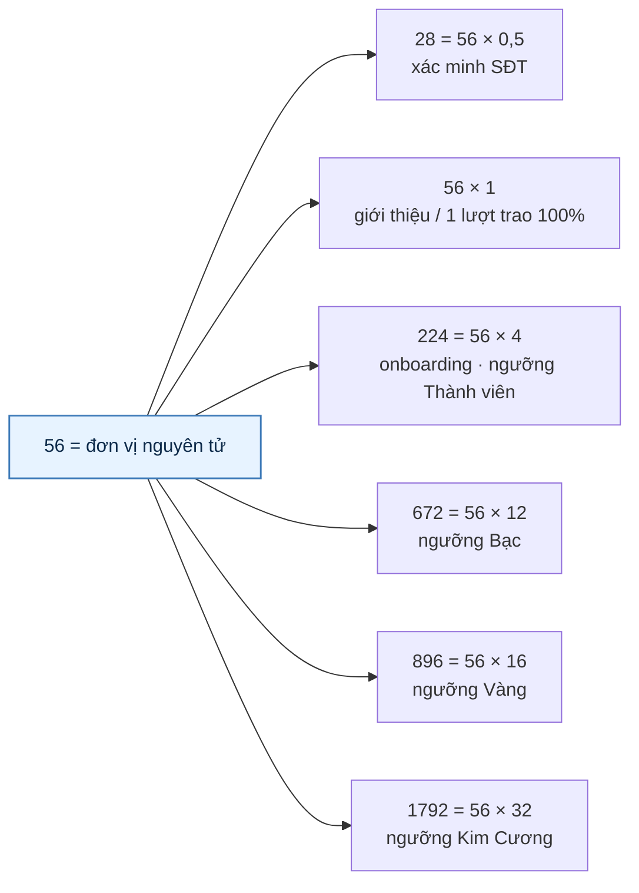
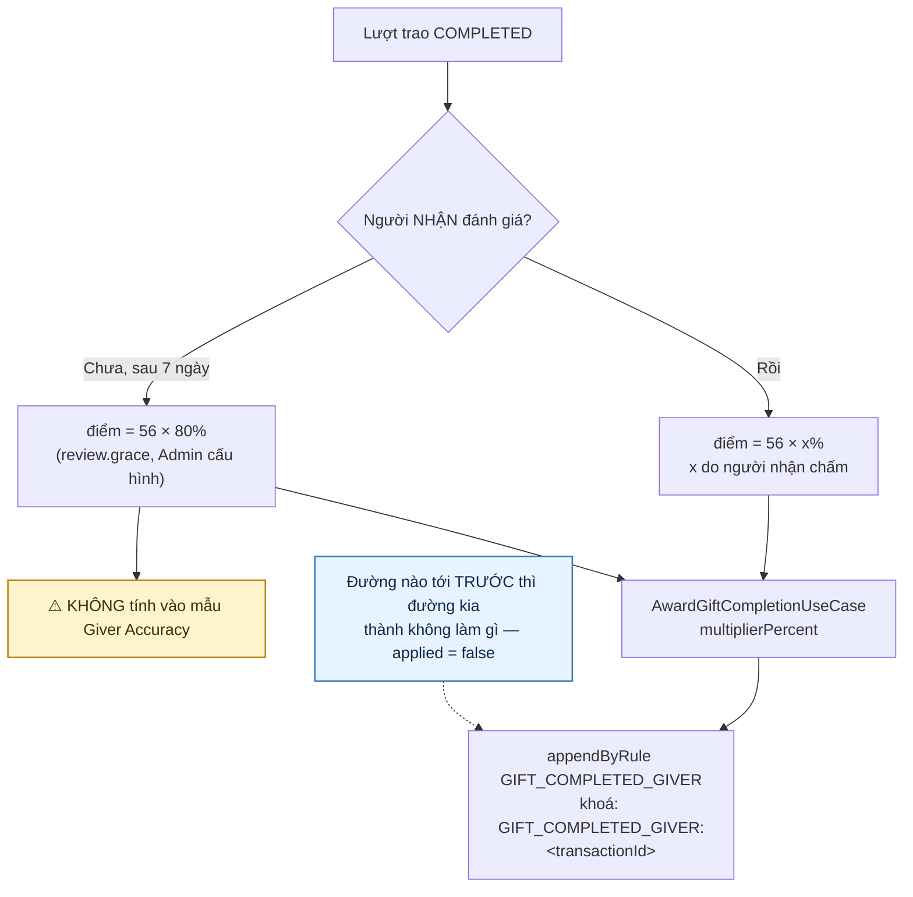
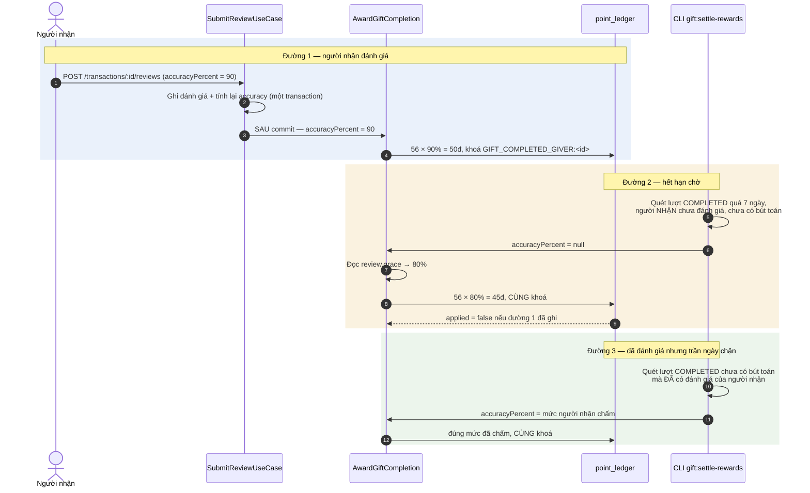
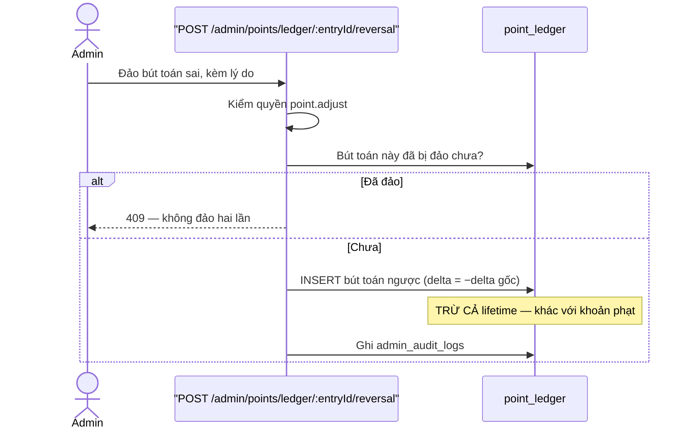
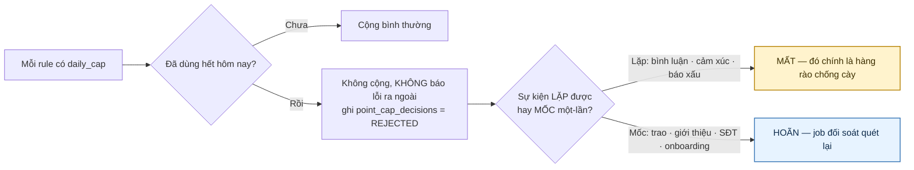

# 11 · Điểm Cống Hiến

Trạng thái: ✅ sổ cái đã vững. ✅ Trao tặng đã cộng điểm cả hai phía, cả hai đường.

## 11.1 Sổ cái append-only

Mỗi dòng ghi: `user_id` · `rule_code` · `rule_version` · `delta` · `balance_after` ·
`raw_balance_after` · `lifetime_after` · `reference_type/id` · `idempotency_key` · `actor` ·
`source` · `reason` · `created_at`.

`rule_version` ghi lại **phiên bản rule lúc cộng**, nên đọc lại một bút toán cũ không bị
lệch theo lần Admin sửa rule sau đó. Hai đường không đi qua `point_rules` — `appendAdjustment`
và bút toán hoàn — ghi `rule_version = 0`.

## 11.2 Cộng điểm theo rule

> **Chỉ nuốt đúng hai loại lỗi đó.** Mọi lỗi khác phải ném tiếp. Bắt `catch (e) {}` trống là
> biến một sự cố database thành "hôm nay không ai được điểm" mà không ai biết.
>
> Vị từ dùng chung là `isPointPolicyError`, và `appendPointIgnoringPolicy` là đường gọi có sẵn
> phần nuốt. **Đừng viết lại `error instanceof …` tại chỗ**: trước đây năm nơi tự khai, một nơi
> chỉ khai một nửa, và bốn nơi thì quên hẳn.

> ⚠️ **Đã từng có lỗi chặn ở đây (sửa 29/09).** `AppendPointEntryUseCase` không nuốt, và bốn
> chỗ gọi nó không nuốt: xác minh SĐT, hai đường onboarding, và referral. Ở hai đường
> onboarding, cộng điểm còn đứng **trước** thăng hạng. Nên chỉ cần Admin gọi
> `POST /admin/points/rules` với `enabled: false` cho `ONBOARDING_COMPLETED` là mọi người hoàn
> tất onboarding nhận 409 `POINT_RULE_UNAVAILABLE`, **không ai lên được MEMBER**, và vì thế
> không ai đăng được bài. Một cái công tắc trông như "tạm ngưng thưởng điểm" thực ra khoá cửa
> đăng bài của toàn bộ người mới.
>
> Nay thứ tự là **thăng hạng trước, thưởng sau**, và cả bốn chỗ đều nuốt ngoại lệ chính sách.
> Việc người dùng đã làm là SỰ THẬT; thưởng bao nhiêu là CHÍNH SÁCH. Chính sách không được
> đánh đổ sự thật.

## 11.3 Các rule đã seed

Hai cột khác nhau, đọc đừng gộp: **Nối** là đã có code gọi; **Bật** là `is_enabled` của
phiên bản rule mới nhất. Một rule đã nối mà đang tắt thì hôm nay không cộng đồng nào.

| Mã | Điểm | Cap ngày | Nối | Bật | Ghi chú |
| --- | ---: | ---: | :-: | :-: | --- |
| `PHONE_VERIFIED_FIRST_TIME` | 28 | — | ✅ | ✅ | |
| `REFERRAL_QUALIFIED` | 56 | 3 | ✅ | ✅ | |
| `ONBOARDING_COMPLETED` | 224 | — | ✅ | ✅ | |
| `REPORT_UPHELD` | 5 | 5 | ✅ | ✅ | bật ở migration `1795300000000` (chốt 29/09) |
| `CONTENT_VIOLATION_PENALTY` | −50 | — | ✅ | ✅ | phạt chủ bài khi Admin xác nhận báo xấu |
| `SHIP_UNPAID_PENALTY` | −50 | — | ✅ | ✅ | |
| `POST_REACTED` | 1 | **20** | ✅ | ✅ | bật ở migration `1794500000000` |
| `POST_COMMENTED` | 2 | **10** | ✅ | ✅ | bật ở migration `1794500000000` |
| **`GIFT_COMPLETED_GIVER`** | **56** (mức TRẦN) | 10 | ✅ | ✅ | **× % người nhận chấm** |
| `GIFT_COMPLETED_RECEIVER` | 28 | 5 | ✅ | ✅ | cộng phẳng ngay lúc hoàn tất |

Hai mã dưới đây **không nằm trong `point_rules`** — chúng đi qua `appendAdjustment`, nên
`rule_version` ghi 0 và không chịu cơ chế `daily_cap`:

| Mã | Điểm | Nối | Nguồn số điểm |
| --- | ---: | :-: | --- |
| `MAINTENANCE_FAILED` | −224/−336/−448 theo bậc | ✅ | `rank_tiers.maintenance_penalty_points`, chạy bằng `rank:evaluate` |
| `ITEM_REDEMPTION` | âm, theo giá món | ✅ | giá món chia tỷ lệ quy đổi |

> **Vì sao hai mã cuối không vừa khuôn `point_rules`.** Mọi rule khác có một số điểm cố định.
> Đổi vật phẩm thì số điểm tính từ giá trị món chia tỷ lệ quy đổi, khác nhau mỗi lần; phạt
> trượt duy trì thì số điểm phụ thuộc bậc hạng, đã có sẵn trong `rank_tiers`. Cả hai cần một
> đường ghi ledger nhận số điểm làm tham số, không phải `appendByRule`.

### Toàn bộ hệ điểm là bội số của 56

**Chốt 2026-09-25: X = 56** — một lượt trao hoàn tất đánh giá 100% đáng bằng một lượt giới
thiệu hợp lệ. Dùng mã `GIFT_COMPLETED_GIVER` **đã seed từ migration `1791200000000`**.

> ⚠️ **Đã từng tạo mã thứ hai và gây cộng hai lần.** Ngày 25/09 một migration seed thêm mã
> `GIFT_COMPLETED` vì `GIVE-RECEIVE-FLOW.md` §H4 ghi sai rằng chưa có rule nào. Hai mã nghĩa
> là hai khoá chống trùng, nên người tặng được cộng 56 phẳng lúc hoàn tất **cộng thêm** 56 × x%
> lúc đánh giá. Đã gỡ ở migration `1793400000000`, và `test:point-economy` nay canh "chỉ một mã
> thưởng người tặng".

> Cap ngày không phải trang trí: hai tài khoản trao qua trao lại cả ngày là một cỗ máy in
> điểm, và ràng buộc `giver_id <> receiver_id` không chặn được vòng ba người.

## 11.4 Điểm cho một lượt trao (F40)

### Hai đường, một khoá chống trùng

> **Đường 3 thêm ngày 29/09.** Điều kiện lọc của job trước đó là "người nhận **chưa** đánh
> giá", nên một lượt vừa được chấm 90% mà cộng điểm chạm trần ngày sẽ bị loại khỏi danh sách
> **vĩnh viễn**: đường đánh giá đã đi qua và nuốt ngoại lệ, đường hết hạn chờ thì không nhận nó
> vì đã có đánh giá. Nay cả ba đường dùng một truy vấn, và mức trả là mức người nhận đã chấm
> chứ không phải mức mặc định — áp 80% cho một lượt bị chấm 40% là trả sai số điểm, mà sổ
> append-only không sửa lại được.
>
> **Phía người NHẬN cũng có đường quét lại.** Phần thưởng của họ cộng phẳng ngay lúc hoàn tất
> và cũng nuốt ngoại lệ chính sách, nên chạm trần 5/ngày là mất — và trước đó không có gì quét
> lại phía này cả.

> **Vì sao khoá theo lượt trao, không theo đường kích hoạt.** Đây là điểm tựa của cả cơ chế.
> Khoá riêng cho mỗi đường là trả thưởng hai lần cho một lượt trao, và ledger append-only
> không sửa lại được.
>
> **Chấm 0% vẫn GHI bút toán delta = 0.** Bút toán đó là bằng chứng "đã chấm, và chấm 0" — nó
> chiếm khoá nên job sau này không trả mức mặc định 80% cho một lượt bị chấm 0. Bỏ qua thì
> chấm 0 lại thành có lợi hơn không chấm gì.
>
> **Làm tròn về số nguyên**: 56 × 43% = 24,08 → 24. Điểm là số nguyên ở mọi nơi khác, giữ
> phần thập phân ở đúng một chỗ sẽ làm mọi phép đối soát lệch.
>
> **Hệ số nhân chỉ áp cho khoản CỘNG.** "Phạt 60% của −50" không có nghĩa nghiệp vụ nào, và
> cho phép nó là mở đường giảm nhẹ hình phạt bằng một tham số không ai nhìn thấy.

> **Vì sao cần nhánh "không đánh giá".** Phần lớn người nhận sẽ nhận đồ rồi biến mất. Cho 0
> điểm là phạt người tặng vì việc của người khác; cho thẳng 100% thì người nhận có động cơ
> *không* đánh giá để giúp người tặng, và chỉ số accuracy mất nghĩa.
>
> **Vì sao mức mặc định không vào mẫu accuracy.** Nó là số hệ thống tự điền, không phải ý
> kiến người thật. Trộn vào thì accuracy chỉ còn phản ánh có bao nhiêu người lười đánh giá.

## 11.5 Đảo bút toán (F39)

> **Vì sao đảo phải trừ cả `lifetime` còn phạt thì không.** Đảo là nói "bút toán này chưa
> từng nên tồn tại"; để `lifetime` giữ nguyên là để một lần cộng nhầm vĩnh viễn nâng sàn rank
> của người đó. Phạt thì khác — nó là một sự kiện có thật, chỉ trừ số tiêu được.
>
> ⚠️ **Sau quyết định 2026-09-24**, `lifetime` không còn quyết định hạng nên phân biệt này
> mất ý nghĩa thực tiễn. Cần soát lại khi làm khối M4.

## 11.6 Cap theo ngày

Trần hiện hành: **giao dịch 10 phía người tặng / 5 phía người nhận · giới thiệu 3 · báo xấu
được xử lý 5 · bình luận 10 · cảm xúc 20.**

> **Ngày cắt theo `Asia/Ho_Chi_Minh`, không theo UTC** (sửa 29/09, hằng `BusinessTimeZone`).
> Cắt theo UTC thì "ngày" của hệ thống bắt đầu lúc 7 giờ sáng, nên ai tặng đồ sáng sớm Chủ
> nhật lại đang ăn vào quota của thứ Bảy.

> **Hoãn khác mất, và phân biệt đó là nghiệp vụ.** Bình luận và cảm xúc lặp được, nên trần
> chính là hàng rào chống cày điểm — câu thứ mười một không sinh điểm, và trả bù nó hôm sau là
> vô hiệu hoá hàng rào. Một lượt trao thì khác: nó xảy ra đúng một lần và đã xảy ra thật, trần
> ở đó chỉ để chặn hai tài khoản trao qua trao lại cả ngày. Mất vĩnh viễn là phạt người tặng
> thứ sáu trong ngày vì họ hào phóng. Danh sách được hoãn nằm ở `RetryablePointRuleCodes`.

## Chỗ cần soát

1. ✅ **Cộng điểm khi lượt trao hoàn tất đã chạy** — hai đường, một khoá chống trùng.
   Người nhận được cộng ngay; người tặng chờ mức chính xác.
2. ✅ **CLI `gift:settle-rewards`** áp mức mặc định sau `graceDays`, và từ 29/09 còn trả nốt
   những lượt bị trần ngày chặn — cả phía người tặng lẫn phía người nhận.
3. ✅ **Trừ điểm khi trượt nhiệm vụ duy trì đã chạy** — `MAINTENANCE_FAILED` qua
   `appendAdjustment`, số điểm đọc từ `rank_tiers`, chạy bằng `rank:evaluate`.
4. ✅ **`ITEM_REDEMPTION` đã nối** qua `appendAdjustment` (26/09).
5. ✅ **Chạm trần ngày với mốc một-lần nay là HOÃN, không mất** (29/09). Trước đó lỗ hổng cụ
   thể hơn cả những gì ghi ở đây: lượt trao **đã được đánh giá** mà cộng điểm bị trần chặn thì
   rơi ra khỏi mọi danh sách vĩnh viễn, trong khi lượt **chưa** đánh giá vẫn được job quét lại
   — nghĩa là người nhận đánh giá sớm lại làm người tặng thiệt, đúng cái động cơ lệch mà §11.4
   được dựng ra để tránh. Phía người NHẬN thì chưa từng có đường quét lại nào.
6. ✅ **Bút toán ghi nhận "đã chặn vì trần ngày" nay thật sự tồn tại** (29/09). Dòng
   `point_cap_decisions = REJECTED` nằm trong transaction, nên chính ngoại lệ chặn nó đã cuốn
   nó đi — bảng đó chưa từng giữ được một dòng REJECTED nào cho lối gọi qua `appendByRule`.
7. ✅ **`REPORT_UPHELD` đã bật** (29/09, migration `1795300000000`). Trần 5 lượt/ngày là phần
   chống lạm dụng chứ không phải trang trí: báo xấu là hành động tạo VIỆC cho người khác — mỗi
   lượt là một mục trong hàng đợi Admin — nên không có trần thì cách cày điểm rẻ nhất là rải
   báo xấu vu vơ, và cái giá rơi vào thời gian của Admin chứ không phải vào người cày.
8. ⚠️ **Chưa có màn hình nào cho Admin đọc `point_cap_decisions`.** Bảng nay đã giữ đủ bằng
   chứng cho câu hỏi "vì sao tôi không được điểm", nhưng chưa có endpoint nào trả nó ra.
9. Phân biệt `lifetime` / `balance` cần soát lại sau khi rank chuyển sang đọc `balance`.
