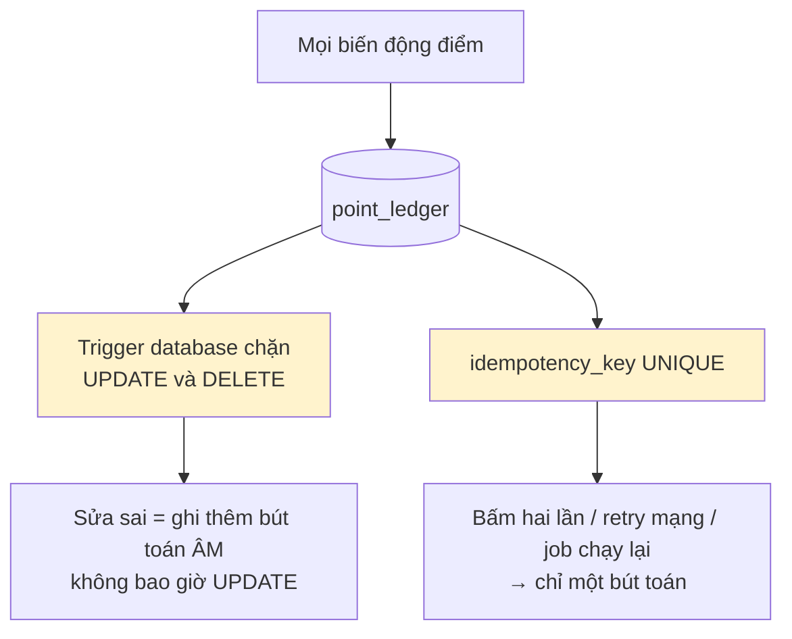
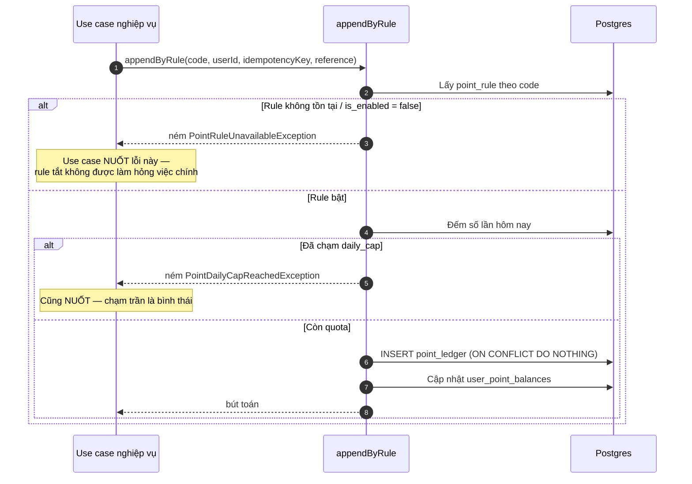
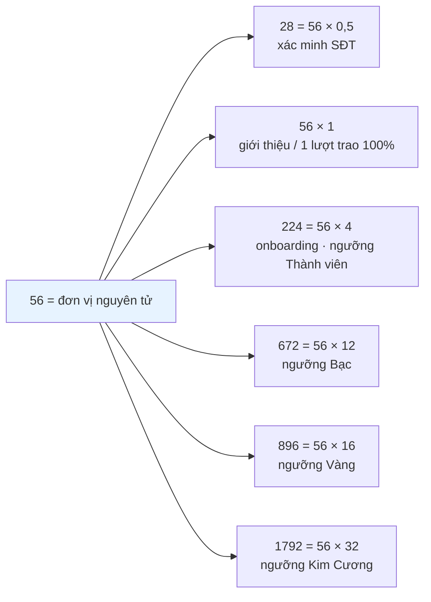
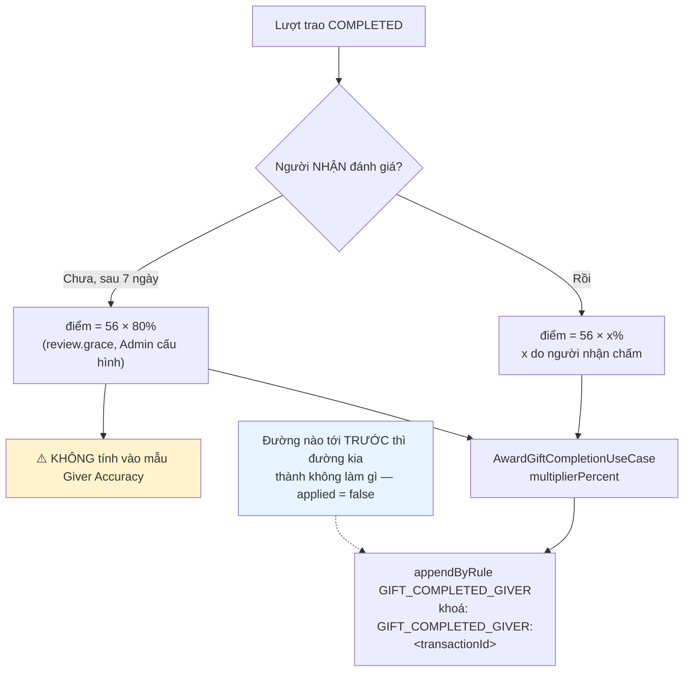
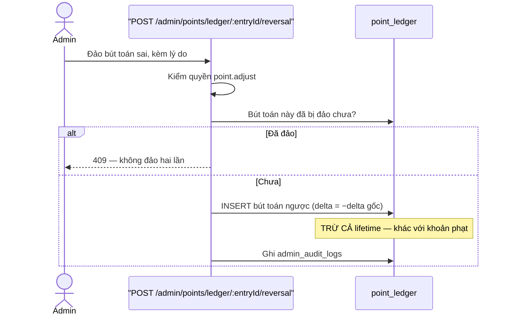
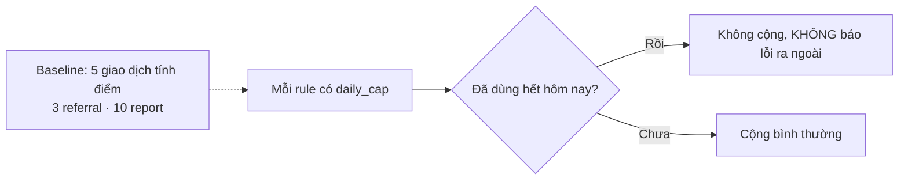

# 11 · Điểm Cống Hiến

Trạng thái: ✅ sổ cái đã vững. ⛔ **Chưa có rule nào cộng điểm cho việc trao tặng.**

## 11.1 Sổ cái append-only



Mỗi dòng ghi: `user_id` · `rule_code` · `delta` · `balance_after` · `raw_balance_after` ·
`lifetime_after` · `reference_type/id` · `idempotency_key` · `actor` · `source` · `created_at`.

## 11.2 Cộng điểm theo rule



> **Chỉ nuốt đúng hai loại lỗi đó.** Mọi lỗi khác phải ném tiếp. Bắt `catch (e) {}` trống là
> biến một sự cố database thành "hôm nay không ai được điểm" mà không ai biết.

## 11.3 Các rule đã seed

| Mã | Điểm | Cap ngày | Trạng thái |
| --- | ---: | ---: | --- |
| `PHONE_VERIFIED_FIRST_TIME` | 28 | — | ✅ đã gọi |
| `REFERRAL_QUALIFIED` | 56 | 3 | ✅ đã gọi |
| `ONBOARDING_COMPLETED` | 224 | — | ✅ đã gọi |
| `REPORT_UPHELD` | 5 | 5 | ✅ đã gọi |
| `SHIP_UNPAID_PENALTY` | −50 | — | ✅ đã gọi |
| `POST_REACTED` | 1 | — | ✅ đã gọi |
| `POST_COMMENTED` | 2 | — | ✅ đã gọi |
| **`GIFT_COMPLETED_GIVER`** | **56** (mức TRẦN) | 10 | ✅ đang gọi — **× % người nhận chấm** |
| `GIFT_COMPLETED_RECEIVER` | 28 | 5 | ✅ đang gọi ngay lúc hoàn tất |
| `MAINTENANCE_FAILED` | −224/−336/−448 theo bậc | — | ✅ đã seed ở `rank_tiers` · ⛔ chưa gọi |
| `ITEM_REDEMPTION` | âm, theo giá món | — | ✅ đang gọi qua `appendAdjustment` |

> **`ITEM_REDEMPTION` không vừa khuôn `point_rules`.** Mọi rule khác có một số điểm cố định;
> đổi vật phẩm thì số điểm tính từ giá trị món chia tỷ lệ quy đổi, khác nhau mỗi lần. Nó cần
> một đường ghi ledger nhận số điểm làm tham số, không phải `appendByRule`.

### Toàn bộ hệ điểm là bội số của 56



**Chốt 2026-09-25: X = 56** — một lượt trao hoàn tất đánh giá 100% đáng bằng một lượt giới
thiệu hợp lệ. Dùng mã `GIFT_COMPLETED_GIVER` **đã seed từ migration `1791200000000`**.

> ⚠️ **Đã từng tạo mã thứ hai và gây cộng hai lần.** Ngày 25/09 một migration seed thêm mã
> `GIFT_COMPLETED` vì `GIVE-RECEIVE-FLOW.md` §H4 ghi sai rằng chưa có rule nào. Hai mã nghĩa
> là hai khoá chống trùng, nên người tặng được cộng 56 phẳng lúc hoàn tất **cộng thêm** 56 × x%
> lúc đánh giá. Đã gỡ ở migration `1793400000000`, và `test:point-economy` nay canh "chỉ một mã
> thưởng người tặng".

> Cap ngày không phải trang trí: hai tài khoản trao qua trao lại cả ngày là một cỗ máy in
> điểm, và ràng buộc `giver_id <> receiver_id` không chặn được vòng ba người.

## 11.4 Điểm cho một lượt trao (F40) — ⛔ chưa có code



### Hai đường, một khoá chống trùng

```mermaid
sequenceDiagram
    autonumber
    actor R as Người nhận
    participant S as SubmitReviewUseCase
    participant A as AwardGiftCompletion
    participant L as point_ledger
    participant J as CLI gift:settle-rewards

    rect rgb(240, 248, 255)
    Note over R,L: Đường 1 — người nhận đánh giá
    R->>S: POST /transactions/:id/reviews (accuracyPercent = 90)
    S->>S: Ghi đánh giá + tính lại accuracy (một transaction)
    S->>A: SAU commit — accuracyPercent = 90
    A->>L: 56 × 90% = 50đ, khoá GIFT_COMPLETED_GIVER:&lt;id&gt;
    end

    rect rgb(255, 250, 240)
    Note over J,L: Đường 2 — hết hạn chờ
    J->>J: Quét lượt COMPLETED quá 7 ngày,<br/>người NHẬN chưa đánh giá, chưa có bút toán
    J->>A: accuracyPercent = null
    A->>A: Đọc review.grace → 80%
    A->>L: 56 × 80% = 45đ, CÙNG khoá
    L-->>A: applied = false nếu đường 1 đã ghi
    end
```

> **Vì sao khoá theo lượt trao, không theo đường kích hoạt.** Đây là điểm tựa của cả cơ chế.
> Khoá riêng cho mỗi đường là trả thưởng hai lần cho một lượt trao, và ledger append-only
> không sửa lại được.
>
> **Chấm 0% vẫn GHI bút toán delta = 0.** Bút toán đó là bằng chứng "đã chấm, và chấm 0" — nó
> chiếm khoá nên job sau này không trả mức mặc định 80% cho một lượt bị chấm 0. Bỏ qua thì
> chấm 0 lại thành có lợi hơn không chấm gì.
>
> **Làm tròn về số nguyên**: 56 × 43% = 24,08 → 24. Điểm là số nguyên ở mọi nơi khác, giữ
> phần thập phân ở đúng một chỗ sẽ làm mọi phép đối soát lệch.
>
> **Hệ số nhân chỉ áp cho khoản CỘNG.** "Phạt 60% của −50" không có nghĩa nghiệp vụ nào, và
> cho phép nó là mở đường giảm nhẹ hình phạt bằng một tham số không ai nhìn thấy.

> **Vì sao cần nhánh "không đánh giá".** Phần lớn người nhận sẽ nhận đồ rồi biến mất. Cho 0
> điểm là phạt người tặng vì việc của người khác; cho thẳng 100% thì người nhận có động cơ
> *không* đánh giá để giúp người tặng, và chỉ số accuracy mất nghĩa.
>
> **Vì sao mức mặc định không vào mẫu accuracy.** Nó là số hệ thống tự điền, không phải ý
> kiến người thật. Trộn vào thì accuracy chỉ còn phản ánh có bao nhiêu người lười đánh giá.

## 11.5 Đảo bút toán (F39)



> **Vì sao đảo phải trừ cả `lifetime` còn phạt thì không.** Đảo là nói "bút toán này chưa
> từng nên tồn tại"; để `lifetime` giữ nguyên là để một lần cộng nhầm vĩnh viễn nâng sàn rank
> của người đó. Phạt thì khác — nó là một sự kiện có thật, chỉ trừ số tiêu được.
>
> ⚠️ **Sau quyết định 2026-09-24**, `lifetime` không còn quyết định hạng nên phân biệt này
> mất ý nghĩa thực tiễn. Cần soát lại khi làm khối M4.

## 11.6 Cap theo ngày



## Chỗ cần soát

1. ✅ **Cộng điểm khi lượt trao hoàn tất đã chạy** — hai đường, một khoá chống trùng.
   Người nhận được cộng ngay; người tặng chờ mức chính xác.
2. ✅ **CLI `gift:settle-rewards`** áp mức mặc định sau 7 ngày.
3. ⛔ **Chưa có đường trừ điểm khi trượt nhiệm vụ duy trì.**
4. ⚠️ **Cap 5/ngày chạm là mất thưởng vĩnh viễn.** Người tặng 6 món trong một ngày không được
   điểm cho món thứ sáu, và không có hàng đợi trả bù hôm sau. Cần xác nhận đúng ý.
4. ✅ **`ITEM_REDEMPTION` đã nối** qua `appendAdjustment` (26/09).
5. Phân biệt `lifetime` / `balance` cần soát lại sau khi rank chuyển sang đọc `balance`.
