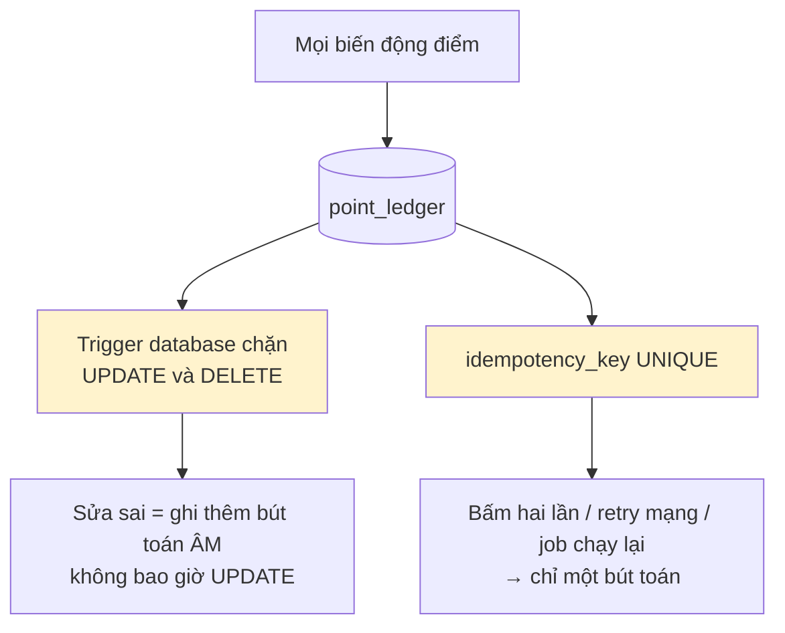
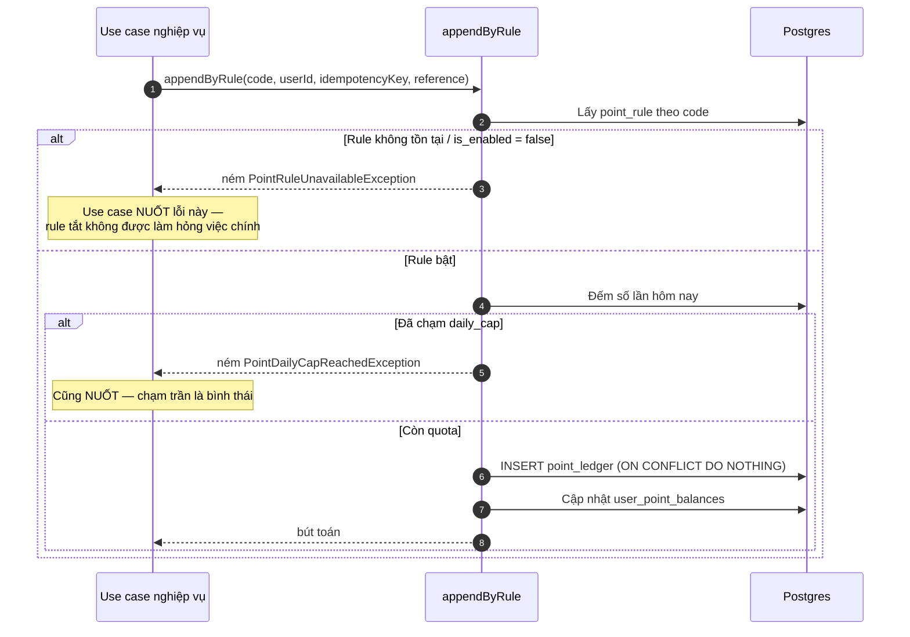
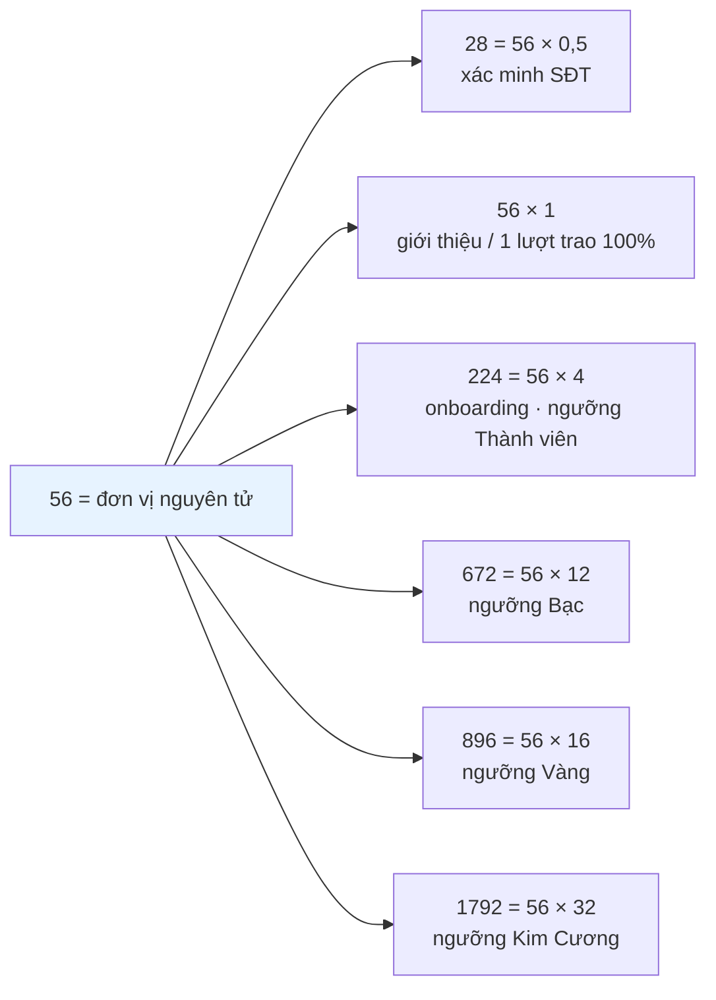
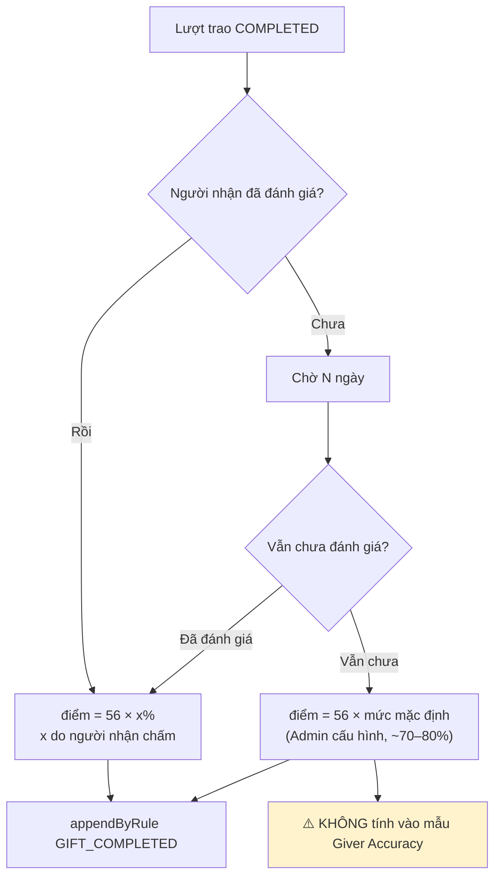
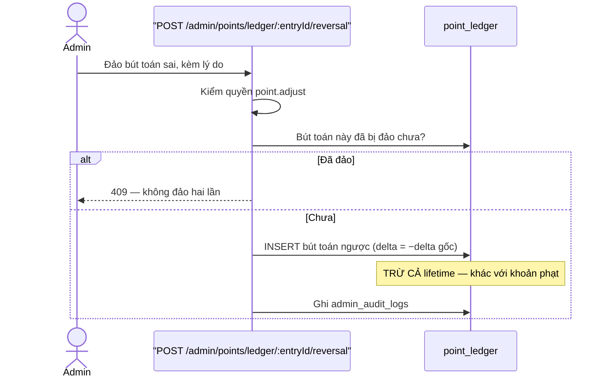
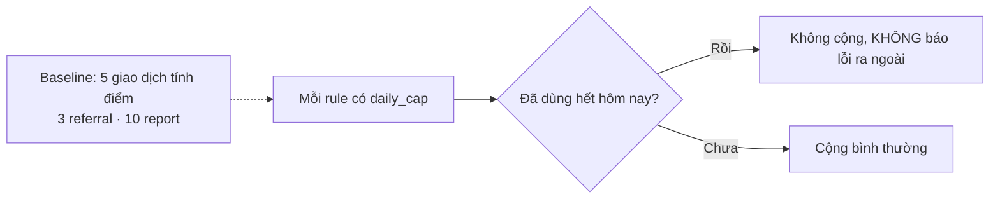

# 11 · Điểm Cống Hiến

Trạng thái: ✅ sổ cái đã vững. ⛔ **Chưa có rule nào cộng điểm cho việc trao tặng.**

## 11.1 Sổ cái append-only

Mỗi dòng ghi: `user_id` · `rule_code` · `delta` · `balance_after` · `raw_balance_after` ·
`lifetime_after` · `reference_type/id` · `idempotency_key` · `actor` · `source` · `created_at`.

## 11.2 Cộng điểm theo rule

> **Chỉ nuốt đúng hai loại lỗi đó.** Mọi lỗi khác phải ném tiếp. Bắt `catch (e) {}` trống là
> biến một sự cố database thành "hôm nay không ai được điểm" mà không ai biết.

## 11.3 Các rule đã seed

| Mã | Điểm | Cap ngày | Trạng thái |
| --- | ---: | ---: | --- |
| `PHONE_VERIFIED_FIRST_TIME` | 28 | — | ✅ đã gọi |
| `REFERRAL_QUALIFIED` | 56 | 3 | ✅ đã gọi |
| `ONBOARDING_COMPLETED` | 224 | — | ✅ đã gọi |
| `REPORT_UPHELD` | 5 | 5 | ✅ đã gọi |
| `SHIP_UNPAID_PENALTY` | −50 | — | ✅ đã gọi |
| `POST_REACTED` | 1 | — | ✅ đã gọi |
| `POST_COMMENTED` | 2 | — | ✅ đã gọi |
| **`GIFT_COMPLETED`** | **56** | **5** | ✅ đã seed · ⛔ **chưa ai gọi** |
| `MAINTENANCE_FAILED` | −224/−336/−448 theo bậc | — | ✅ đã seed ở `rank_tiers` · ⛔ chưa gọi |
| `ITEM_REDEMPTION` | âm, theo giá món | — | ⛔ chưa có |

> **`ITEM_REDEMPTION` không vừa khuôn `point_rules`.** Mọi rule khác có một số điểm cố định;
> đổi vật phẩm thì số điểm tính từ giá trị món chia tỷ lệ quy đổi, khác nhau mỗi lần. Nó cần
> một đường ghi ledger nhận số điểm làm tham số, không phải `appendByRule`.

### Toàn bộ hệ điểm là bội số của 56

**Chốt 2026-09-25: X = 56** — một lượt trao hoàn tất đánh giá 100% đáng bằng một lượt giới
thiệu hợp lệ. Đã seed vào `point_rules` mã `GIFT_COMPLETED` với cap 5/ngày, Admin sửa lúc chạy.

> Cap ngày không phải trang trí: hai tài khoản trao qua trao lại cả ngày là một cỗ máy in
> điểm, và ràng buộc `giver_id <> receiver_id` không chặn được vòng ba người.

## 11.4 Điểm cho một lượt trao (F40) — ⛔ chưa có code

> **Vì sao cần nhánh "không đánh giá".** Phần lớn người nhận sẽ nhận đồ rồi biến mất. Cho 0
> điểm là phạt người tặng vì việc của người khác; cho thẳng 100% thì người nhận có động cơ
> *không* đánh giá để giúp người tặng, và chỉ số accuracy mất nghĩa.
>
> **Vì sao mức mặc định không vào mẫu accuracy.** Nó là số hệ thống tự điền, không phải ý
> kiến người thật. Trộn vào thì accuracy chỉ còn phản ánh có bao nhiêu người lười đánh giá.

## 11.5 Đảo bút toán (F39)

> **Vì sao đảo phải trừ cả `lifetime` còn phạt thì không.** Đảo là nói "bút toán này chưa
> từng nên tồn tại"; để `lifetime` giữ nguyên là để một lần cộng nhầm vĩnh viễn nâng sàn rank
> của người đó. Phạt thì khác — nó là một sự kiện có thật, chỉ trừ số tiêu được.
>
> ⚠️ **Sau quyết định 2026-09-24**, `lifetime` không còn quyết định hạng nên phân biệt này
> mất ý nghĩa thực tiễn. Cần soát lại khi làm khối M4.

## 11.6 Cap theo ngày

## Chỗ cần soát

1. ⛔ **Con số đã có, đường gọi thì chưa.** `GIFT_COMPLETED` nằm trong `point_rules` nhưng
   không use case nào gọi nó khi lượt trao `COMPLETED`. Đây là việc chặn nặng nhất còn lại.
2. ⛔ **Chưa có job áp mức mặc định 80% sau 7 ngày** cho lượt trao người nhận không đánh giá.
3. ⛔ **Chưa có đường trừ điểm khi trượt nhiệm vụ duy trì.**
4. ⛔ **`ITEM_REDEMPTION` cần một khuôn khác `appendByRule`** — số điểm thay đổi theo món.
5. Phân biệt `lifetime` / `balance` cần soát lại sau khi rank chuyển sang đọc `balance`.
