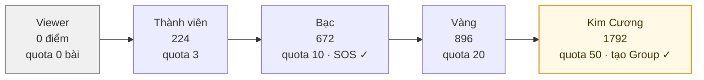
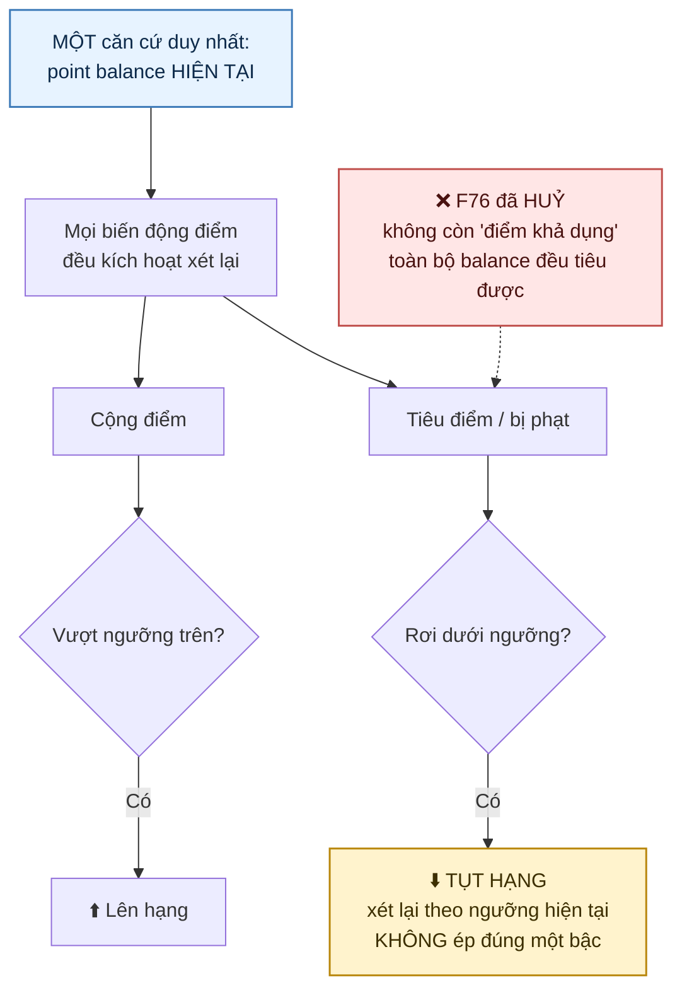
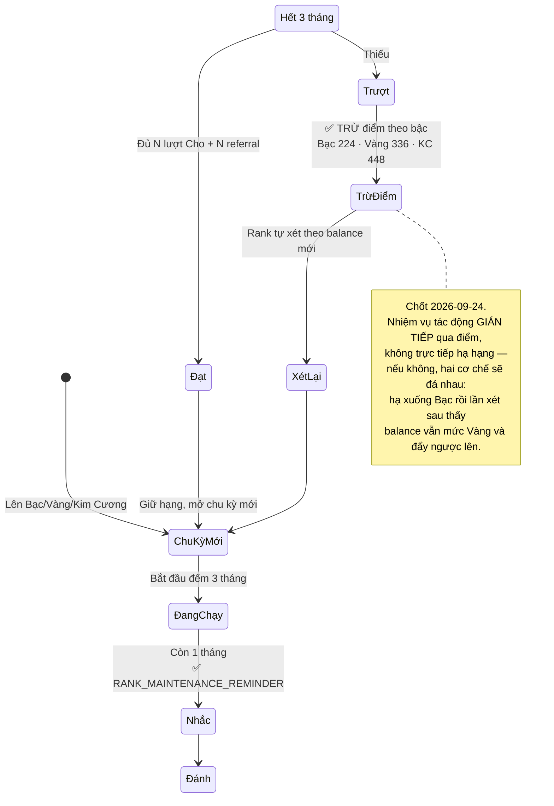
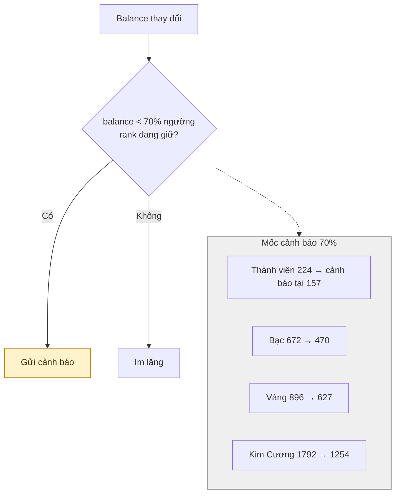
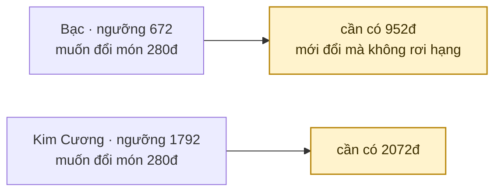
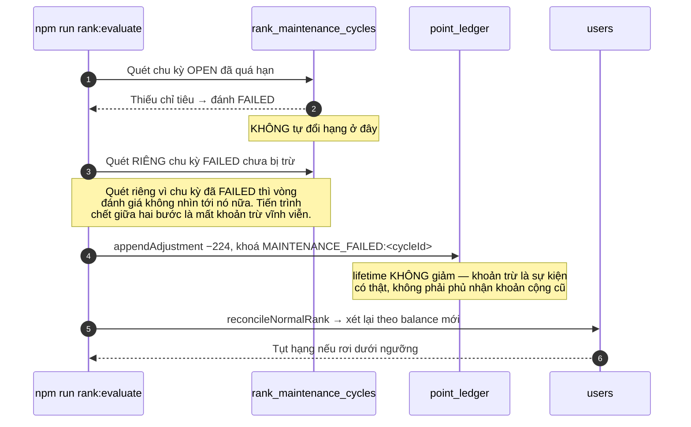
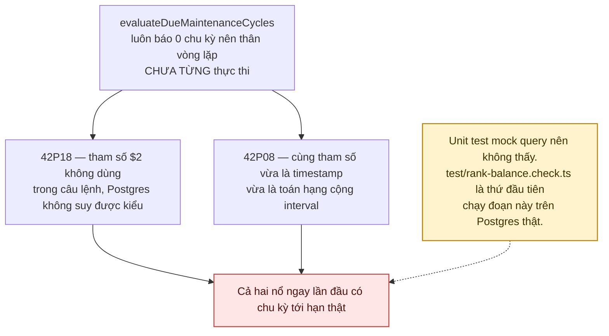

# 12 · Thứ hạng

Trạng thái: ✅ **đã hiện thực** đúng mô hình chốt ngày 2026-09-24, có script kiểm trên
Postgres thật (`npm run test:rank-balance`).

## 12.1 Năm bậc

## 12.2 Mô hình đã chốt 2026-09-24

> **Vì sao chỉ một căn cứ.** Trước đây có hai con số cùng nói về hạng: `lifetime` (sàn) và
> nhiệm vụ duy trì (trần). Hai cơ chế cùng quyết một thứ thì luôn có lúc chúng nói ngược
> nhau, và không có quy tắc nào phân xử.

## 12.3 Chu kỳ duy trì 3 tháng

| Rank | Nhiệm vụ mỗi 3 tháng | Điểm kiếm được nếu làm đủ |
| --- | --- | ---: |
| Bạc | 2 lượt Cho + 2 referral | 2×56 + 2×56 = **224** |
| Vàng | 3 lượt Cho + 3 referral | **336** |
| Kim Cương | 4 lượt Cho + 4 referral | **448** |

## 12.4 Cảnh báo sắp tụt hạng — ✅ đã có

> **Vì sao bắt buộc phải có.** Khi tiêu điểm làm tụt hạng, người dùng đổi một vật phẩm rồi
> sáng hôm sau phát hiện mình đã xuống Bạc — mất quota bài, mất quyền SOS — mà không ai báo.
>
> ⚠️ **Và đúng đường đó từng bị quên (sửa 29/09).** `RankChangeNotifier` được dựng để gom bốn
> đường làm đổi balance — cộng theo rule, hoàn bút toán, khoản trừ số truyền vào, và **đổi vật
> phẩm** — nhưng đổi vật phẩm gọi thẳng `appendAdjustment`, không qua nó. Người hạng Vàng đổi
> món 300 điểm còn 596 (dưới cả ngưỡng Bạc) mà `users.rank` vẫn là GOLD, nên họ giữ quota 20
> bài và quyền SOS không còn đủ điều kiện cho tới khi một biến động điểm KHÔNG liên quan nào
> đó tình cờ kích hoạt xét lại. `rank-balance.check.ts` gọi `reconcileNormalRank` **bằng tay**
> sau khi tiêu điểm, nên nó xanh trong khi đường thật hỏng — nay có phép kiểm canh chính chỗ
> nối đó. Hai đường khác cũng đã sửa: trừ điểm trượt nhiệm vụ và referral đủ điều kiện từng
> gọi `reconcileNormalRank` trần, nên hạng CÓ đổi nhưng không thông báo nào được gửi.
>
> Gửi qua `RankChangeNotifier`, gọi sau MỌI biến động điểm. Khoá chống trùng theo
> `userId:rank:ngày VN` nên **một lời nhắc mỗi ngày cho mỗi bậc**: không có mốc ngày thì mỗi
> lượt kiếm 1 điểm rồi tiêu đi cũng đẻ một thông báo, người dùng tắt hết, và từ đó mất luôn
> thông báo về lượt xin nhận.
>
> Đã tụt rồi thì gửi `RANK_DEMOTED` thay vì cảnh báo — người đã mất hạng không cần nghe "bạn
> sắp mất hạng". Lên hạng thì gửi `RANK_PROMOTED` (thêm 29/09) và **không** kèm cảnh báo:
> người vừa vượt ngưỡng lên trên thì không thể đang dưới mốc cảnh báo của bậc cũ.
>
> `GET /ranks/me` trả `warningPoints` + `demotionWarning`, và từ 29/09 trả thêm `rankPoints`
> + `rankPointsSource`. **Client phải so với `rankPoints`, không phải `balancePoints`**: cấu
> hình `rank.points_source` áp cho chỗ quyết hạng, nên đọc `balancePoints` là đúng hôm nay và
> sai ngay lần Admin đổi nguồn sang LIFETIME — cảnh báo tính theo một con số còn tụt hạng tính
> theo con số khác. Chính `RankChangeNotifier` trước đây mắc đúng lỗi đó.

## 12.5 Hệ quả: càng lên cao càng khó tiêu

Đây là hệ quả tự nhiên của mô hình đã chọn, không phải lỗi — nhưng cần biết trước.

## 12.6 Đường trừ điểm khi trượt nhiệm vụ

## 12.7 Hai lỗi có sẵn chưa từng chạy, đã sửa

## Chỗ cần soát

1. ✅ **Nhắc trước 1 tháng đã có** (SRS BR-PROF-RANK-03) — `RANK_MAINTENANCE_REMINDER`,
   `RemindMaintenanceBeforeDays = 30`, chạy bằng `notify:reminders`.
   ⚠️ Nội dung lời nhắc từng nói sai: câu quét đọc `cycle.gifts_done`/`referrals_done`, hai
   cột chỉ ghi lúc **đánh giá**, nên với chu kỳ còn OPEN chúng luôn bằng 0 — người đã trao
   xong cả hai món vẫn nhận câu "bạn đã hoàn tất 0/2 lượt trao". Sửa 29/09: đếm sống theo
   cửa sổ chu kỳ, bằng đúng hai câu mà bước đánh giá dùng.
2. ⚠️ **Cột `rank_transitions.points_at_transition`** (trước tên là `lifetime_points`) giữ
   ảnh chụp số điểm lúc đổi hạng. Đã đổi tên vì giá trị ghi vào đó chính là balance.
3. ⚠️ **`reconcileNormalRank` gọi sau MỌI bút toán.** Một người nhận 50 thông báo/ngày sẽ kéo
   50 lượt xét hạng — chưa đo tải, cần theo dõi khi có dữ liệu thật.
4. Quota và ngưỡng SOS theo rank vẫn là **giả định chờ Bên A xác nhận**.
5. ✅ **Đã quyết trong code, có chủ ý.** **Nâng hạng** đếm trọn đời
   (`countLifetimeCompletedGifts` — "thăng hạng thường xét cả quá trình, không bó trong một
   quý"); **duy trì** đếm trong cửa sổ chu kỳ (`countCompletedGifts` với `cycleStart`/
   `cycleEnd`). Hai câu hỏi khác nhau nên hai cách đếm khác nhau.
6. ⚠️ **Chưa có thông báo nào khi tiến độ nhiệm vụ duy trì về đích.** Người làm đủ 2/2 giữa
   chu kỳ vẫn nhận lời nhắc ở mốc 30 ngày (nay nói đúng "2/2"), nhưng không có lời xác nhận
   "bạn đã đủ chỉ tiêu, không bị trừ điểm kỳ này" — mà đó là thứ họ muốn nghe nhất.
