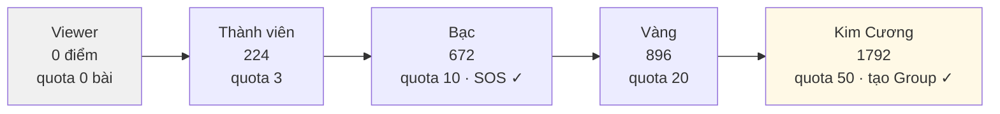
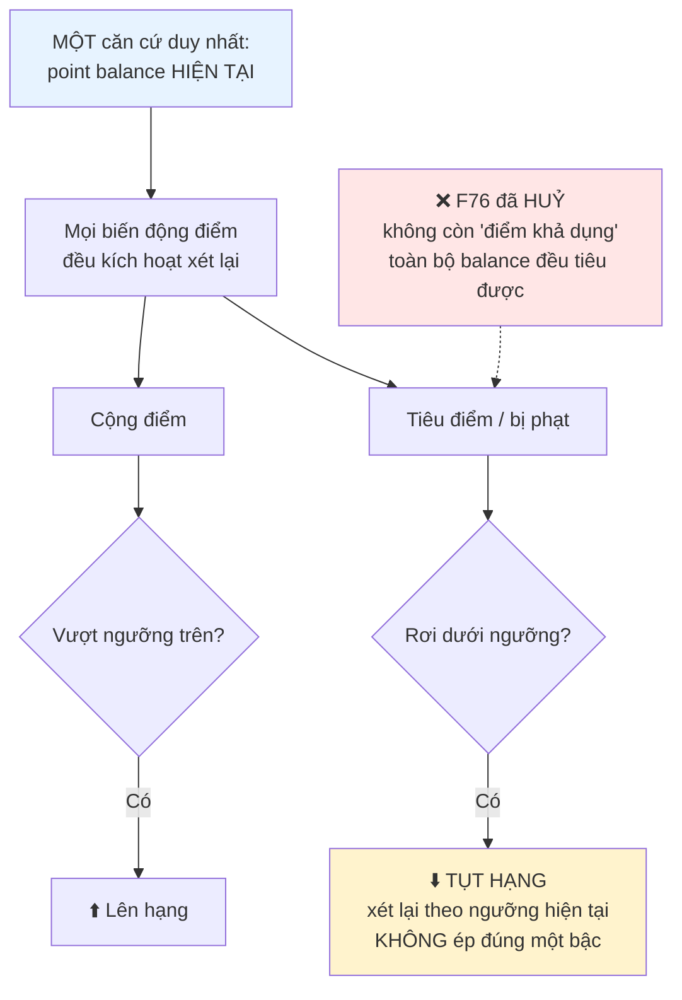
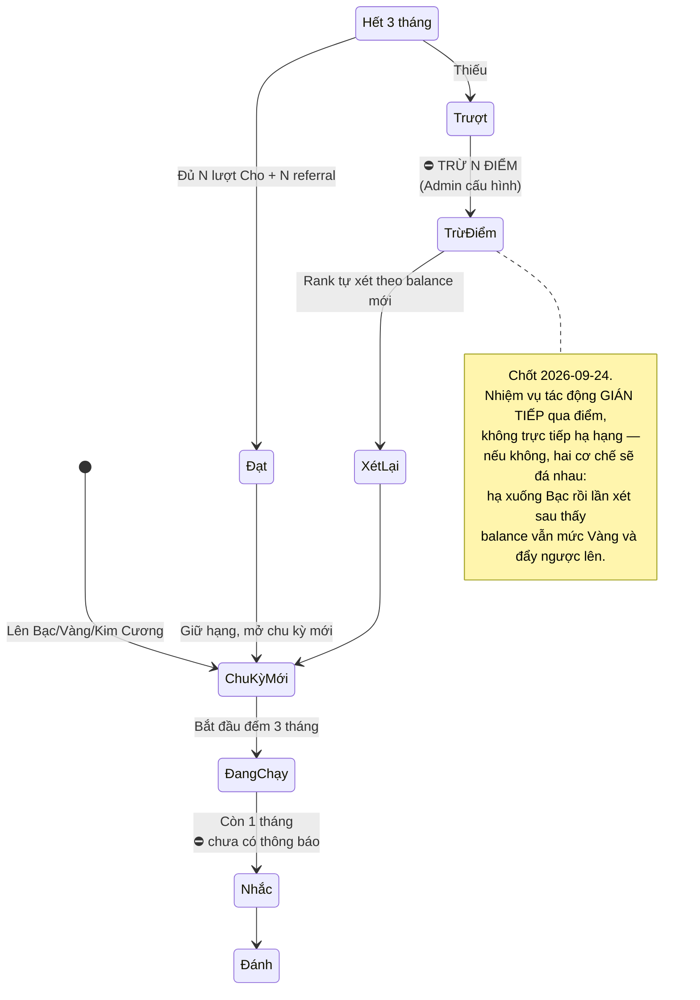
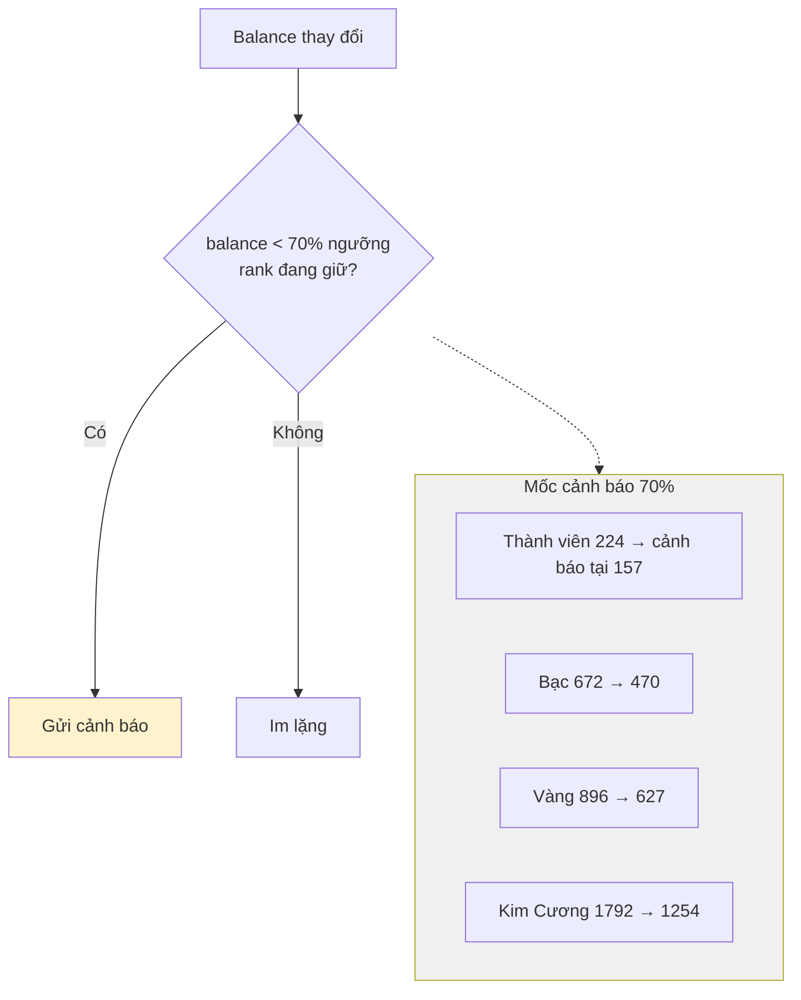
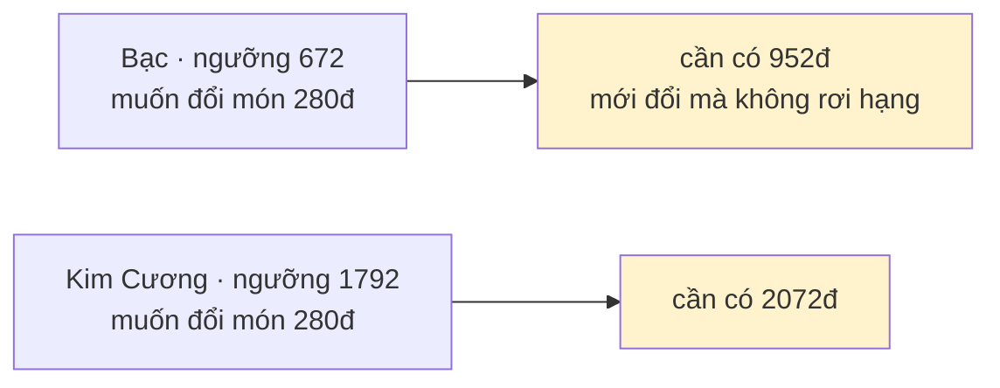
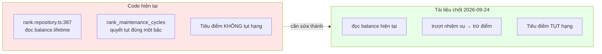

# 12 · Thứ hạng

Trạng thái: ⚠️ **Tài liệu và code đang mâu thuẫn.** Sơ đồ này vẽ **mô hình đã chốt ngày
2026-09-24**, và ghi rõ chỗ code còn làm khác.

## 12.1 Năm bậc

## 12.2 Mô hình đã chốt 2026-09-24

> **Vì sao chỉ một căn cứ.** Trước đây có hai con số cùng nói về hạng: `lifetime` (sàn) và
> nhiệm vụ duy trì (trần). Hai cơ chế cùng quyết một thứ thì luôn có lúc chúng nói ngược
> nhau, và không có quy tắc nào phân xử.

## 12.3 Chu kỳ duy trì 3 tháng

| Rank | Nhiệm vụ mỗi 3 tháng | Điểm kiếm được nếu làm đủ |
| --- | --- | ---: |
| Bạc | 2 lượt Cho + 2 referral | 2×56 + 2×56 = **224** |
| Vàng | 3 lượt Cho + 3 referral | **336** |
| Kim Cương | 4 lượt Cho + 4 referral | **448** |

## 12.4 Cảnh báo sắp tụt hạng — ⛔ chưa có

> **Vì sao bắt buộc phải có.** Khi tiêu điểm làm tụt hạng, người dùng đổi một vật phẩm rồi
> sáng hôm sau phát hiện mình đã xuống Bạc mà không ai báo trước. Bảng ngưỡng trong
> `FEATURES.md` đã có sẵn cột này, nhưng **chưa có đường nào gửi**.

## 12.5 Hệ quả: càng lên cao càng khó tiêu

Đây là hệ quả tự nhiên của mô hình đã chọn, không phải lỗi — nhưng cần biết trước.

## 12.6 ⚠️ Code hiện đang làm khác

## Chỗ cần soát

1. ⚠️ **Code đọc `lifetime`, tài liệu nói `balance`.** Mâu thuẫn đã biết, chưa sửa.
2. ⛔ **Trừ N điểm khi trượt nhiệm vụ chưa có code**, và **N chưa có con số**.
3. ⛔ **Cảnh báo sắp tụt hạng chưa có đường gửi.**
4. ⛔ **Nhắc trước 1 tháng** (SRS BR-PROF-RANK-03 yêu cầu) chưa có.
5. Quota và ngưỡng SOS theo rank vẫn là **giả định chờ Bên A xác nhận**.
