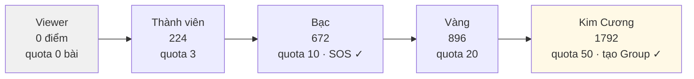
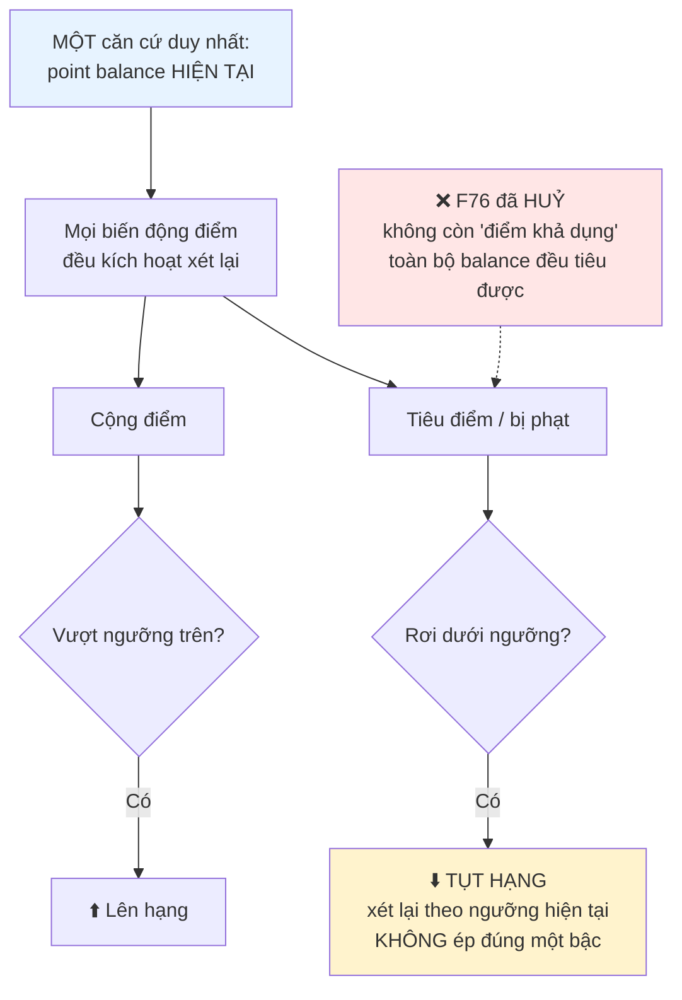
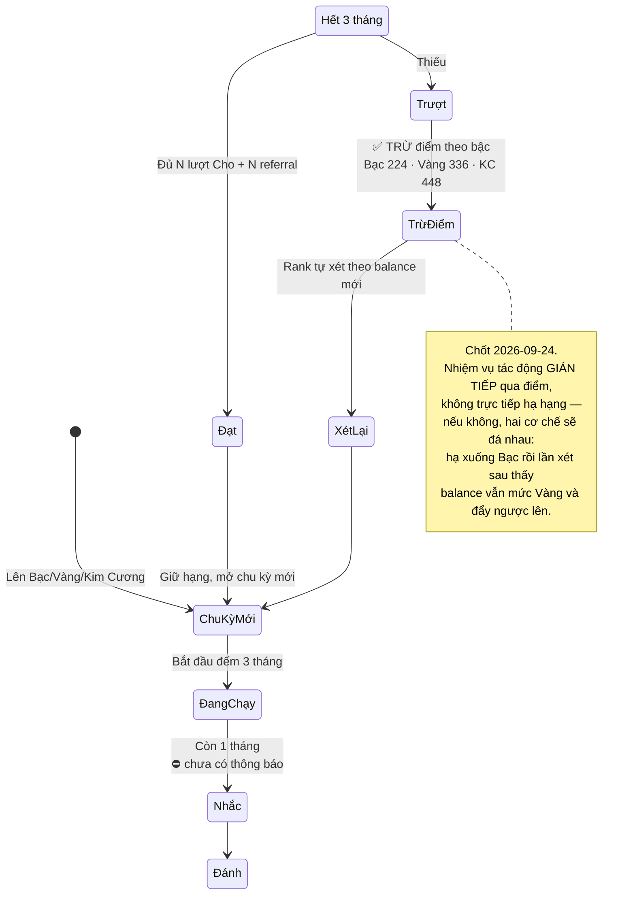
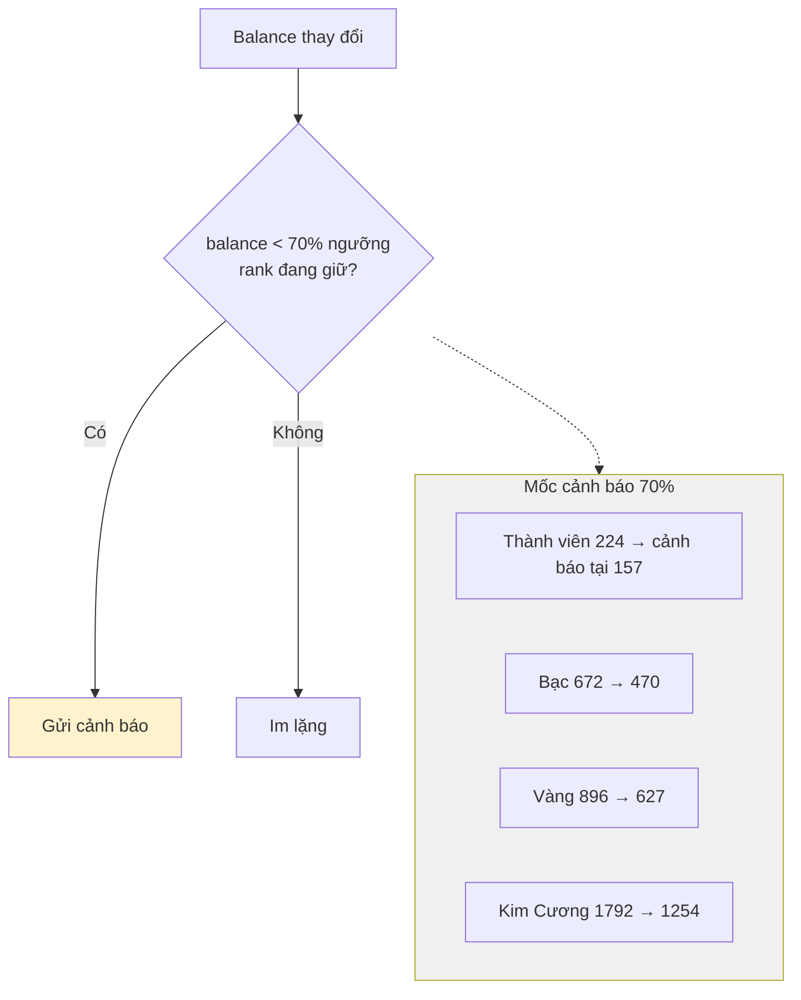
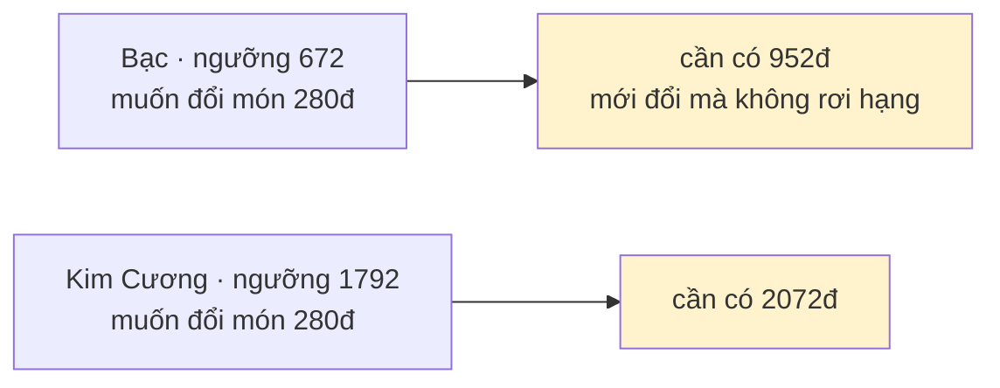
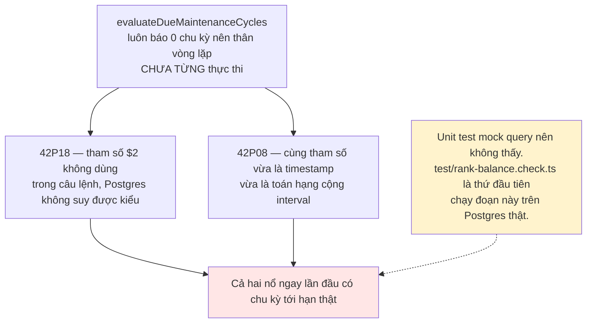

# 12 · Thứ hạng

Trạng thái: ✅ **đã hiện thực** đúng mô hình chốt ngày 2026-09-24, có script kiểm trên
Postgres thật (`npm run test:rank-balance`).

## 12.1 Năm bậc



## 12.2 Mô hình đã chốt 2026-09-24



> **Vì sao chỉ một căn cứ.** Trước đây có hai con số cùng nói về hạng: `lifetime` (sàn) và
> nhiệm vụ duy trì (trần). Hai cơ chế cùng quyết một thứ thì luôn có lúc chúng nói ngược
> nhau, và không có quy tắc nào phân xử.

## 12.3 Chu kỳ duy trì 3 tháng



| Rank | Nhiệm vụ mỗi 3 tháng | Điểm kiếm được nếu làm đủ |
| --- | --- | ---: |
| Bạc | 2 lượt Cho + 2 referral | 2×56 + 2×56 = **224** |
| Vàng | 3 lượt Cho + 3 referral | **336** |
| Kim Cương | 4 lượt Cho + 4 referral | **448** |

## 12.4 Cảnh báo sắp tụt hạng — ✅ đã có



> **Vì sao bắt buộc phải có.** Khi tiêu điểm làm tụt hạng, người dùng đổi một vật phẩm rồi
> sáng hôm sau phát hiện mình đã xuống Bạc — mất quota bài, mất quyền SOS — mà không ai báo.
>
> Gửi qua `RankChangeNotifier`, gọi sau MỌI biến động điểm. Khoá chống trùng theo
> `userId:rank:ngày VN` nên **một lời nhắc mỗi ngày cho mỗi bậc**: không có mốc ngày thì mỗi
> lượt kiếm 1 điểm rồi tiêu đi cũng đẻ một thông báo, người dùng tắt hết, và từ đó mất luôn
> thông báo về lượt xin nhận.
>
> Đã tụt rồi thì gửi `RANK_DEMOTED` thay vì cảnh báo — người đã mất hạng không cần nghe "bạn
> sắp mất hạng". `GET /ranks/me` cũng trả `warningPoints` + `demotionWarning` để client tự
> dựng được lời nhắc mà không đặt lại mốc riêng.

## 12.5 Hệ quả: càng lên cao càng khó tiêu



Đây là hệ quả tự nhiên của mô hình đã chọn, không phải lỗi — nhưng cần biết trước.

## 12.6 Đường trừ điểm khi trượt nhiệm vụ

```mermaid
sequenceDiagram
    autonumber
    participant CLI as npm run rank:evaluate
    participant R as rank_maintenance_cycles
    participant L as point_ledger
    participant U as users

    CLI->>R: Quét chu kỳ OPEN đã quá hạn
    R-->>CLI: Thiếu chỉ tiêu → đánh FAILED
    Note over R: KHÔNG tự đổi hạng ở đây

    CLI->>R: Quét RIÊNG chu kỳ FAILED chưa bị trừ
    Note over CLI,R: Quét riêng vì chu kỳ đã FAILED thì vòng<br/>đánh giá không nhìn tới nó nữa. Tiến trình<br/>chết giữa hai bước là mất khoản trừ vĩnh viễn.
    CLI->>L: appendAdjustment −224, khoá MAINTENANCE_FAILED:&lt;cycleId&gt;
    Note over L: lifetime KHÔNG giảm — khoản trừ là sự kiện<br/>có thật, không phải phủ nhận khoản cộng cũ
    CLI->>U: reconcileNormalRank → xét lại theo balance mới
    U-->>CLI: Tụt hạng nếu rơi dưới ngưỡng
```

## 12.7 Hai lỗi có sẵn chưa từng chạy, đã sửa



## Chỗ cần soát

1. ⛔ **Nhắc trước 1 tháng** (SRS BR-PROF-RANK-03 yêu cầu) chưa có.
2. ⚠️ **Cột `rank_transitions.points_at_transition`** (trước tên là `lifetime_points`) giữ
   ảnh chụp số điểm lúc đổi hạng. Đã đổi tên vì giá trị ghi vào đó chính là balance.
3. ⚠️ **`reconcileNormalRank` gọi sau MỌI bút toán.** Một người nhận 50 thông báo/ngày sẽ kéo
   50 lượt xét hạng — chưa đo tải, cần theo dõi khi có dữ liệu thật.
4. Quota và ngưỡng SOS theo rank vẫn là **giả định chờ Bên A xác nhận**.
5. **Nhiệm vụ duy trì vẫn dùng `countLifetimeCompletedGifts`** cho điều kiện nâng hạng — cần
   soát xem "N lượt Cho hoàn tất" là đếm trọn đời hay đếm trong chu kỳ.
