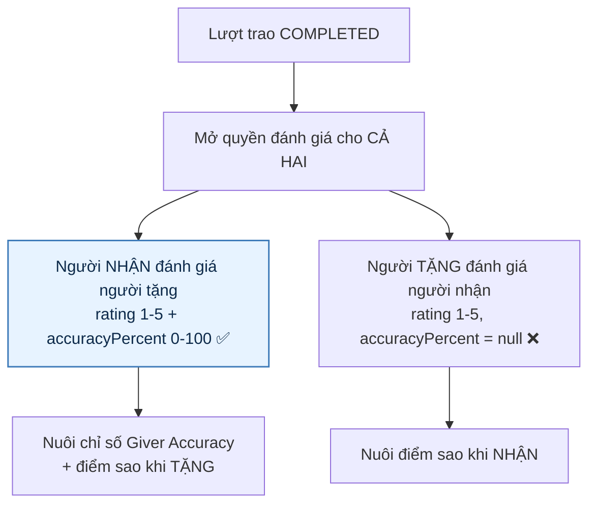
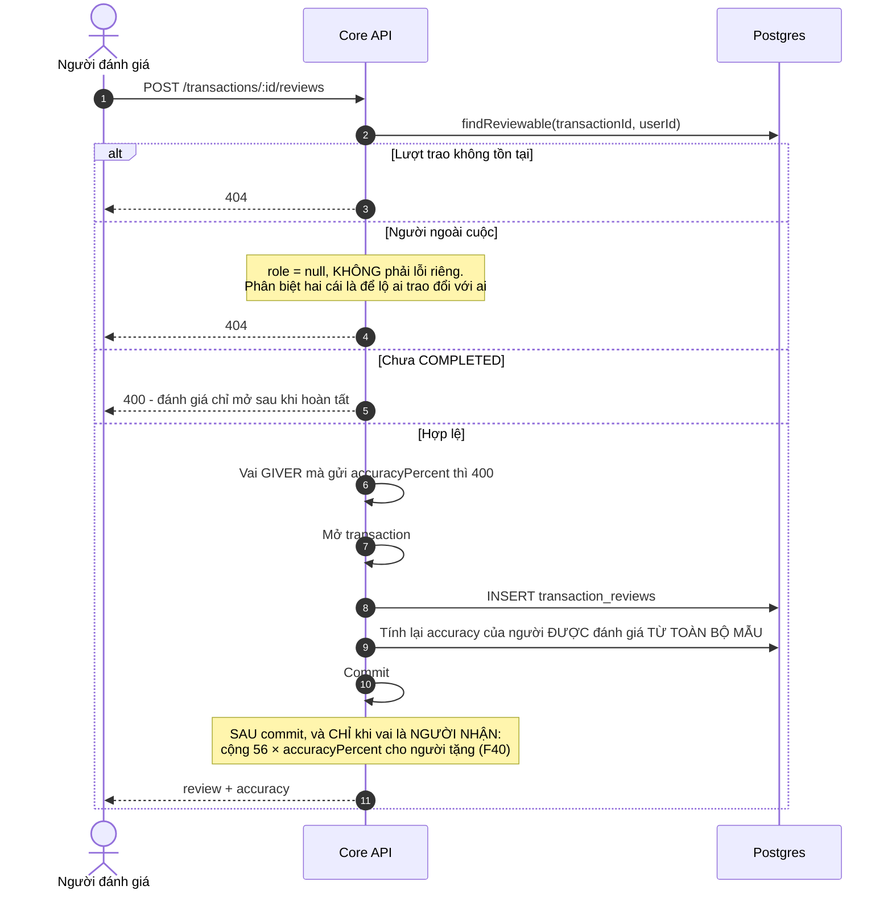
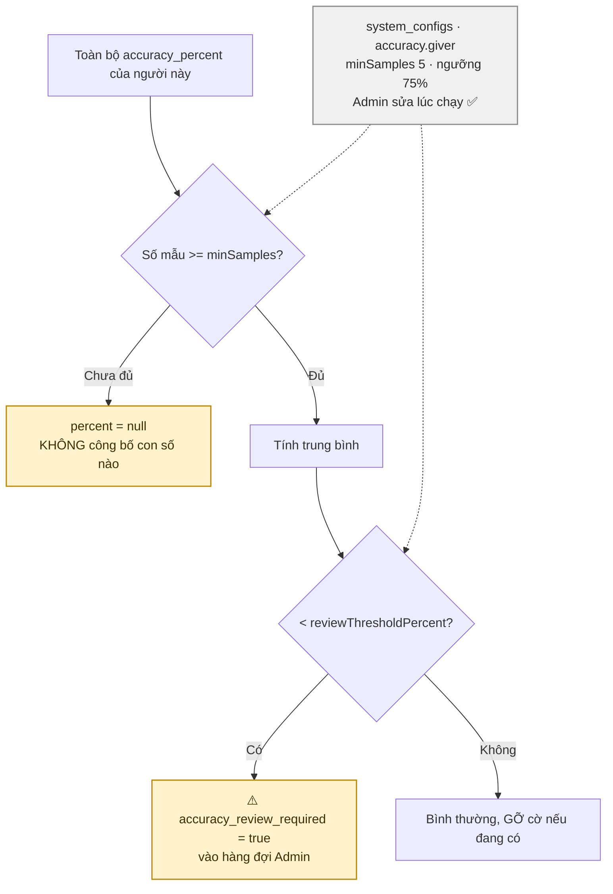
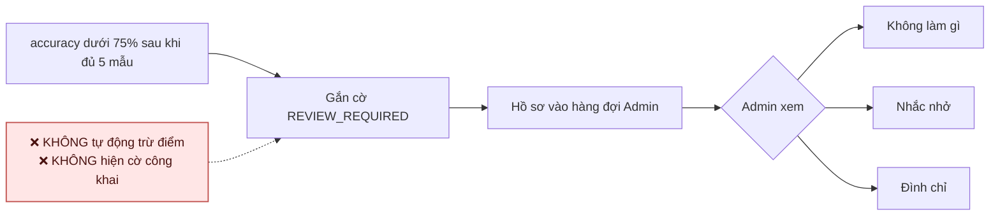
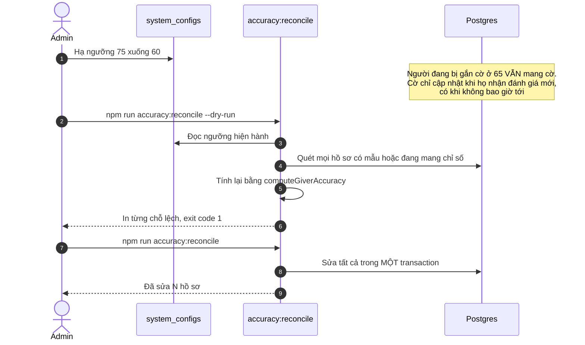

# 13 · Đánh giá sau giao dịch & Giver Accuracy

> **Sơ đồ hiện trạng backend.** [Quy tắc mục tiêu 07/10/2026](../plan/GIVE-RECEIVE-2026-10-07.md)
> cho sửa review một lần trước hạn N, cộng điểm hoàn tất riêng và chốt điểm theo giá trị
> sau N ngày. Phần “review không sửa được” và `56 × accuracy` bên dưới chỉ đúng với code cũ.

Trạng thái: ✅ **đã hiện thực đầy đủ**, gồm cả CLI đối soát.

## 13.1 Hai chiều đánh giá

> **Vì sao chỉ người nhận chấm accuracy.** Chỉ họ mới thấy vật phẩm thật và so được với mô
> tả. Cho người tặng tự chấm độ chính xác của chính mình là hỏi một câu không ai trả lời sai.
>
> **Điểm sao thì HAI chỉ số, không phải một** (nối 29/09). Vai của người ĐƯỢC đánh giá là vai
> đối lập với người đánh giá, nên `reviewer_role = 'RECEIVER'` đang chấm đối phương *với vai
> người tặng*, và ngược lại. Gộp lại thành một con số là trộn "có đáng xin nhận từ người này
> không" với "có nên duyệt cho người này không" — hai câu hỏi mà hai người khác nhau đi tìm.
>
> ⚠️ **Trước 29/09 điểm sao là dữ liệu chết.** Cả hai bên đều bị hỏi chấm 1–5 sau mỗi lượt
> trao, có cả `CHECK (rating BETWEEN 1 AND 5)`, nhưng con số đó chỉ quay ra đúng một chỗ:
> danh sách đánh giá của chính lượt trao đó. Không tổng hợp ở đâu — không hồ sơ công khai,
> không hồ sơ riêng, không danh sách Admin. Hỏi hàng nghìn lần rồi bỏ đi là dạy người dùng
> trả lời cho xong.

**Vai do DATABASE giữ, không do client gửi lên.** Client gửi `role` thì ai cũng khai mình là
người nhận để chấm accuracy cho đối phương.

## 13.2 Luồng gửi đánh giá

> **Vì sao tính lại từ toàn bộ mẫu chứ không cộng dồn.** Cộng dồn thì một lần ghi hỏng là
> chỉ số lệch vĩnh viễn, và không ai phát hiện ra vì không còn gì để đối chiếu. Áp cho cả
> accuracy lẫn điểm sao.
>
> **Ghi song song với đánh giá là CỐ Ý ra lỗi nghiệp vụ, không phải 500.** Phép kiểm "đã gửi
> chưa" ở tầng use case chỉ để có thông báo đọc được; `UQ_transaction_reviews_one_per_reviewer`
> mới là thứ thật sự chặn. Hai request cùng vượt qua phép kiểm rồi cùng ghi thì cái thua nhận
> `isUniqueViolation` → cùng một lỗi nghiệp vụ, không phải một lỗi ràng buộc mà người dùng
> không hiểu và người vận hành thì thấy như sự cố.

> **Mức chính xác: người TẶNG xem được ngay, không cần đánh giá trước** (29/09). Bình luận và
> điểm sao vẫn kín cho tới khi cả hai đã gửi — đó mới là chỗ trả đũa được. Nhưng mức chính xác
> không phải một ý kiến về họ, nó là **hệ số tính thưởng**: 56 × mức đó. Che đi nghĩa là họ
> thấy 24 điểm rơi vào sổ mà không bao giờ biết con số nào tạo ra, và muốn biết thì phải đi
> chấm điểm người khác trước — một điều kiện không ai giải thích được. Việc che cũng đã là
> HÌNH THỨC: `reason` của bút toán trong `GET /points/me/ledger` vốn ghi thẳng "người nhận chấm
> 43% mức chính xác", nên giữ nguyên chỉ khiến hai endpoint nói khác nhau về cùng một con số.

## 13.3 Tính chỉ số Giver Accuracy

> **Vì sao dưới ngưỡng mẫu thì trả `null` chứ không phải một con số tạm.** Kết luận "người
> này mô tả sai 40%" từ MỘT lần đánh giá là bôi nhọ chứ không phải đo lường.
>
> Lập luận đó chỉ có nghĩa nếu con số **được công bố** — và cho tới 29/09 thì nó không: chỉ
> chính chủ và Admin thấy được, nên cả cơ chế min-samples đang bảo vệ một thứ chưa tồn tại.
> Nay `GET /profile/:username` trả `accuracy` và `rating`, và ngưỡng áp lúc ĐỌC chứ không lúc
> ghi — Admin hạ `rating.display` là mọi hồ sơ công bố ngay, không phải chờ ai đánh giá thêm.
>
> **Cờ xem xét thì KHÔNG công khai.** Cờ là tín hiệu để Admin nhìn qua; hiện nó ra là biến
> một việc "cần người thật xem lại" thành một dấu đóng lên mặt người ta.
>
> **Vì sao cấu hình hỏng thì rơi về mặc định.** Gõ nhầm một ô không được biến thành "gắn cờ
> tất cả mọi người" — đó là loại sự cố không ai nối được với một ô nhập liệu.

## 13.4 Cờ chỉ đưa lên bàn Admin, KHÔNG tự phạt

## 13.5 Đối soát khi Admin đổi ngưỡng

## Chỗ cần soát

1. ✅ **Nhắc đánh giá đã có, và từ 29/09 nhắc CẢ HAI vai.** `REVIEW_REMINDER`, nhắc sau 2 ngày,
   chạy bằng `notify:reminders`. Cửa sổ chặn hai đầu cho bên NHẬN — thôi nhắc khi đã quá
   `graceDays`, vì lúc đó hệ thống đã áp mức mặc định và nhắc là nhắc một việc vô ích. Bên TẶNG
   không có mốc nào nên câu nhắc của họ KHÔNG nói "còn N ngày": bịa ra một con số ngày ở đó là
   dựng một áp lực không tồn tại. Khoá chống trùng mang cả vai, nếu không người thứ hai sẽ
   không bao giờ được nhắc.
2. ✅ **Hàng đợi Admin đã có** — `GET /admin/users?accuracyReviewRequired=true`.
3. ⚠️ **Đánh giá không sửa được, không xoá được — và trigger database chặn**, không phải chỉ
   thiếu endpoint (`test:reviews` canh cả hai). Chấm nhầm là chịu. Vẫn cần Bên A xác nhận đúng ý.
4. Ngưỡng accuracy hiện là **75%** theo CHỐT-03, ngưỡng công bố điểm sao là **3 mẫu**
   (`rating.display`); cả hai là cấu hình động nên đổi không cần deploy.
5. ⚠️ **Chưa có gì tổng hợp `comment`.** Bình luận được ghi, giới hạn 1000 ký tự, nhưng không
   endpoint nào liệt kê bình luận về một người — chỉ đọc được từng lượt trao một. Người đang
   cân nhắc xin nhận thấy được điểm số mà không thấy được người khác đã viết gì.
6. ⚠️ **`accuracy:reconcile` không chia lô.** Nó quét mọi hồ sơ có mẫu rồi sửa tất cả trong MỘT
   transaction — cố ý, để không có nửa theo ngưỡng mới nửa theo ngưỡng cũ, nhưng chưa đo với
   dữ liệu lớn. Đã lọc `deleted_at IS NULL` từ 29/09.
