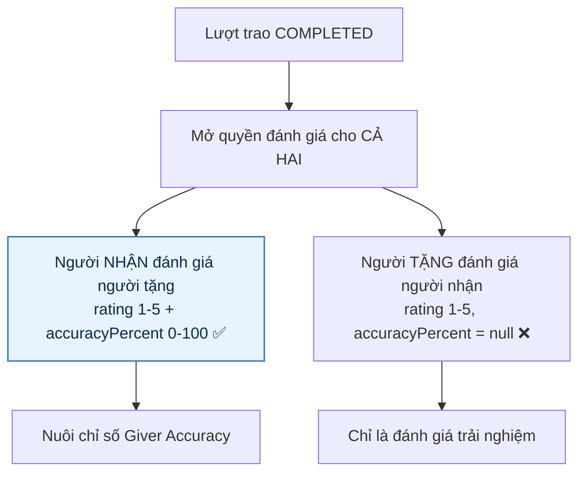
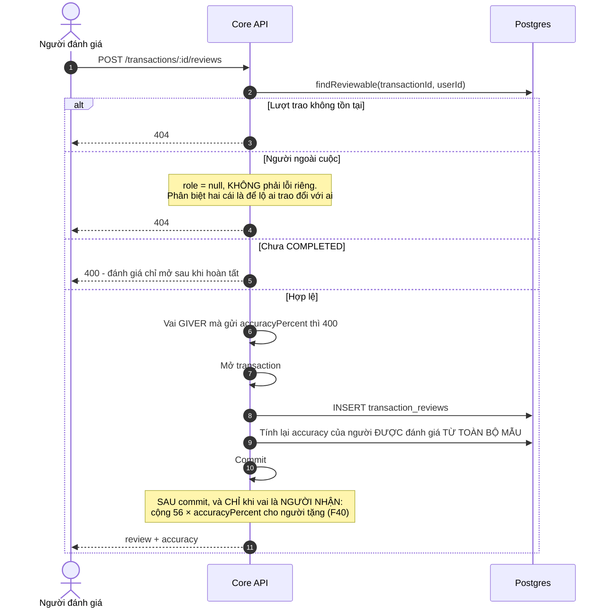
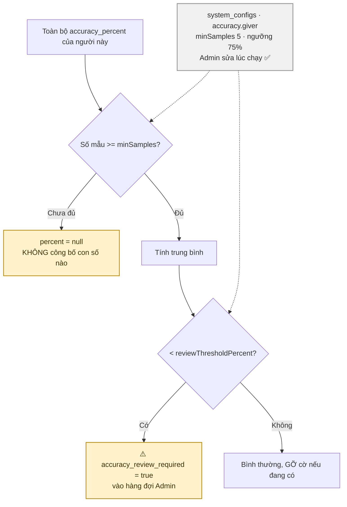
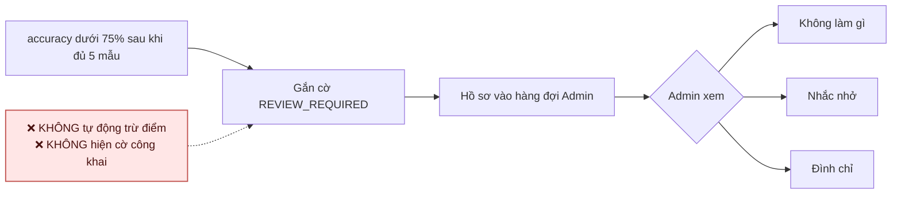
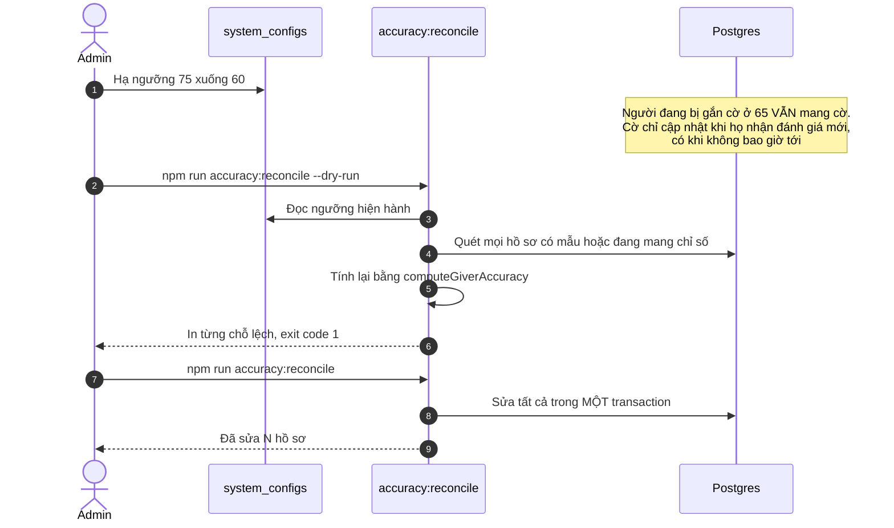

# 13 · Đánh giá sau giao dịch & Giver Accuracy

Trạng thái: ✅ **đã hiện thực đầy đủ**, gồm cả CLI đối soát.

## 13.1 Hai chiều đánh giá

> **Vì sao chỉ người nhận chấm accuracy.** Chỉ họ mới thấy vật phẩm thật và so được với mô
> tả. Cho người tặng tự chấm độ chính xác của chính mình là hỏi một câu không ai trả lời sai.

**Vai do DATABASE giữ, không do client gửi lên.** Client gửi `role` thì ai cũng khai mình là
người nhận để chấm accuracy cho đối phương.

## 13.2 Luồng gửi đánh giá

> **Vì sao tính lại từ toàn bộ mẫu chứ không cộng dồn.** Cộng dồn thì một lần ghi hỏng là
> chỉ số lệch vĩnh viễn, và không ai phát hiện ra vì không còn gì để đối chiếu.

## 13.3 Tính chỉ số Giver Accuracy

> **Vì sao dưới ngưỡng mẫu thì trả `null` chứ không phải một con số tạm.** Kết luận "người
> này mô tả sai 40%" từ MỘT lần đánh giá là bôi nhọ chứ không phải đo lường.
>
> **Vì sao cấu hình hỏng thì rơi về mặc định.** Gõ nhầm một ô không được biến thành "gắn cờ
> tất cả mọi người" — đó là loại sự cố không ai nối được với một ô nhập liệu.

## 13.4 Cờ chỉ đưa lên bàn Admin, KHÔNG tự phạt

## 13.5 Đối soát khi Admin đổi ngưỡng

## Chỗ cần soát

1. **Chưa có nhắc người nhận đánh giá.** Không nhắc thì phần lớn sẽ không đánh giá, và nhánh
   "áp mức mặc định 80% sau 7 ngày" ([11-point](./11-point.md)) sẽ là đường chạy chính chứ
   không phải ngoại lệ — tức chỉ số Giver Accuracy chỉ có mẫu của người chịu khó chấm.
2. **Chưa có hàng đợi Admin riêng cho hồ sơ bị gắn cờ.** Cờ được gắn nhưng không có màn hình
   nào liệt kê chúng — Admin phải tự biết mà đi tìm.
3. **Đánh giá không sửa được, không xoá được.** Chấm nhầm là chịu. Cần xác nhận đúng ý.
4. Ngưỡng hiện là **75%** theo CHỐT-03, đã là cấu hình động nên đổi không cần deploy.
