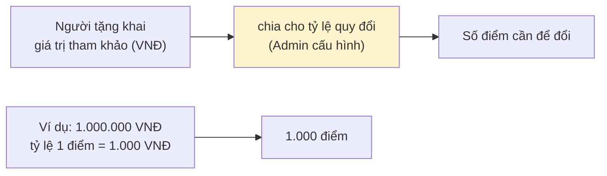
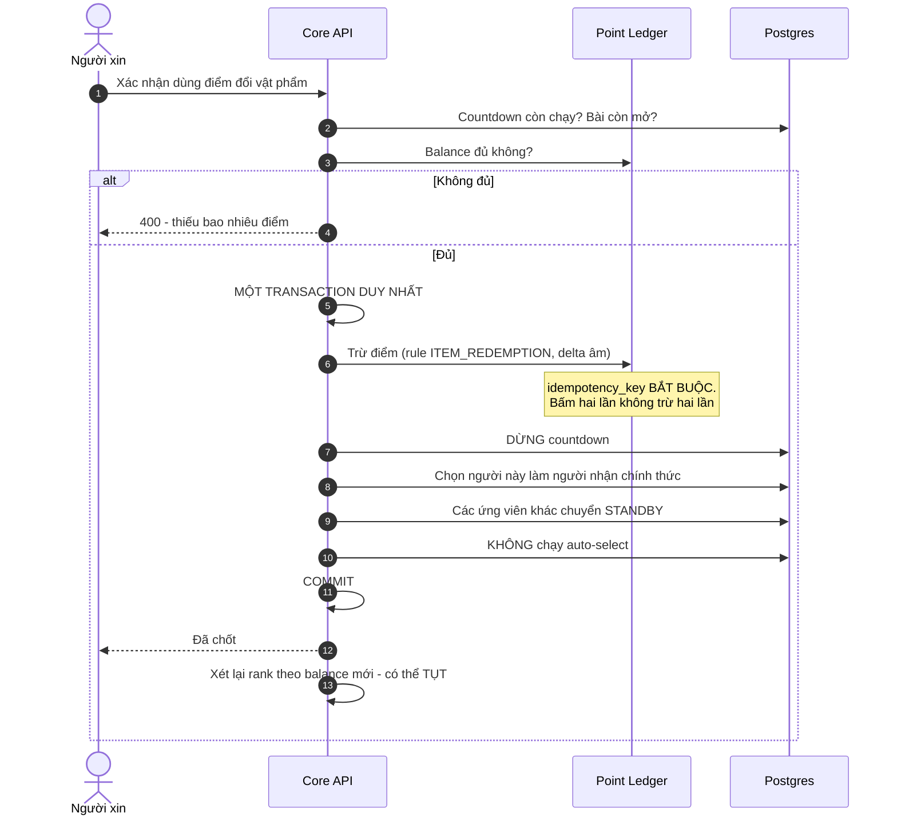
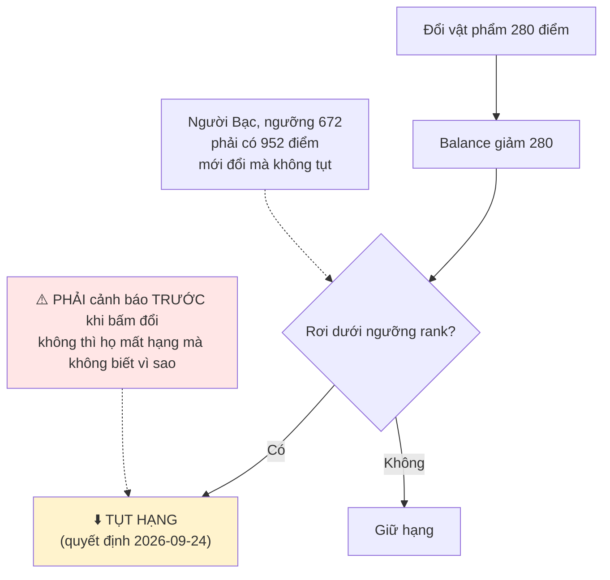

# 14 · Đổi vật phẩm bằng điểm

Trạng thái: ⛔ **chưa có dòng code nào.** Toàn bộ sơ đồ này là thiết kế.

## 14.1 Định giá vật phẩm (F74)

> **Khai khống ở đây KHÔNG sinh ra điểm** — nó chỉ làm vật phẩm đắt hơn, tức khó đổi hơn.
> Ngược hẳn với [F40](./11-point.md), nơi giá người tặng khai cố ý không được tin.

## 14.2 ✅ Tỷ lệ quy đổi — chốt 2026-09-25

**2.000 VNĐ/điểm**, seed ở `system_configs.point.redemption`, Admin sửa lúc chạy.

Chọn theo câu trả lời được, chứ không theo cảm giác về giá trị một điểm:

> **Tặng bao nhiêu món thì đổi được một món giá trị tương đương?**

| Tặng N món để đổi 1 | Điểm cần cho món 1 triệu | Tỷ lệ |
| ---: | ---: | --- |
| 5 | 280 | 1 điểm ≈ 3.570 VNĐ |
| **9** | **500** | **2.000 VNĐ/điểm ← đã chọn** |
| 18 | 1.000 | 1 điểm = 1.000 VNĐ |

> Con số 1.000 VNĐ/điểm từng nằm trong `FEATURES.md` chỉ là ví dụ minh hoạ cú pháp, nhưng nó
> ngụ ý **phải tặng 18 món mới đổi được 1 món tương đương** — nhiều khả năng không ai chủ ý.

## 14.3 Luồng đổi điểm (F75 + F77)

> **Vì sao phải trọn vẹn trong một transaction.** Trừ điểm xong mà chưa kịp chốt người nhận
> là mất điểm mà không được đồ — và không có cách nào người dùng tự đòi lại.

## 14.4 Hệ quả với thứ hạng

## 14.5 Ghi sổ (F77)

Mỗi lần đổi **bắt buộc** vào `point_ledger`:

| Trường | Giá trị |
| --- | --- |
| `user_id` | Người tiêu điểm |
| `rule_code` | `ITEM_REDEMPTION` |
| `delta` | Âm, bằng số điểm bị trừ |
| `reference_type` / `reference_id` | Trỏ về bài đăng |
| `idempotency_key` | Bắt buộc |

## Chỗ cần soát

1. ⛔ **Toàn bộ phân hệ chưa có code**, và nó phụ thuộc countdown 7 ngày cũng chưa có
   ([07-request](./07-request.md)).
2. ⛔ **`ITEM_REDEMPTION` không vừa khuôn `point_rules`** — số điểm thay đổi theo món, cần
   một đường ghi ledger nhận số điểm làm tham số thay vì `appendByRule`.
3. ⛔ **Chưa có cảnh báo "đổi món này sẽ làm bạn tụt hạng"** trước khi người dùng bấm.
4. Vật phẩm đổi bằng điểm có được **đánh giá và tính accuracy** như lượt trao thường không?
   Chưa ai nói.
5. Người tặng có **được điểm** khi vật phẩm của họ bị đổi bằng điểm không? Chưa ai nói.
