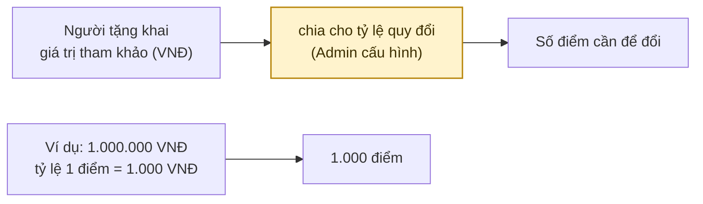
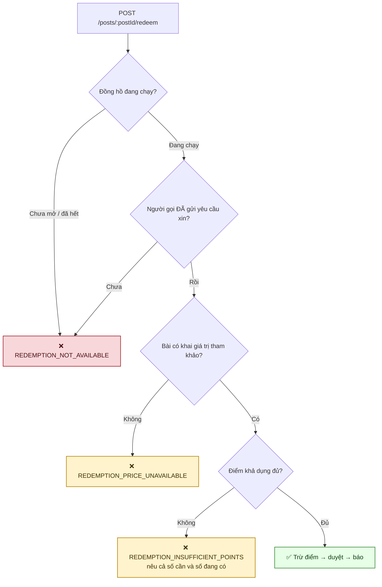
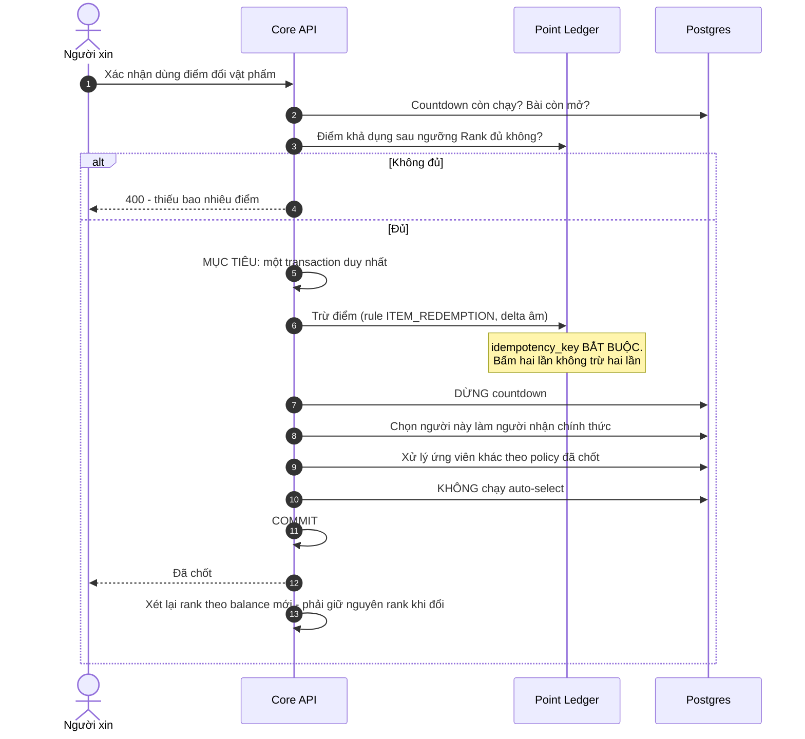
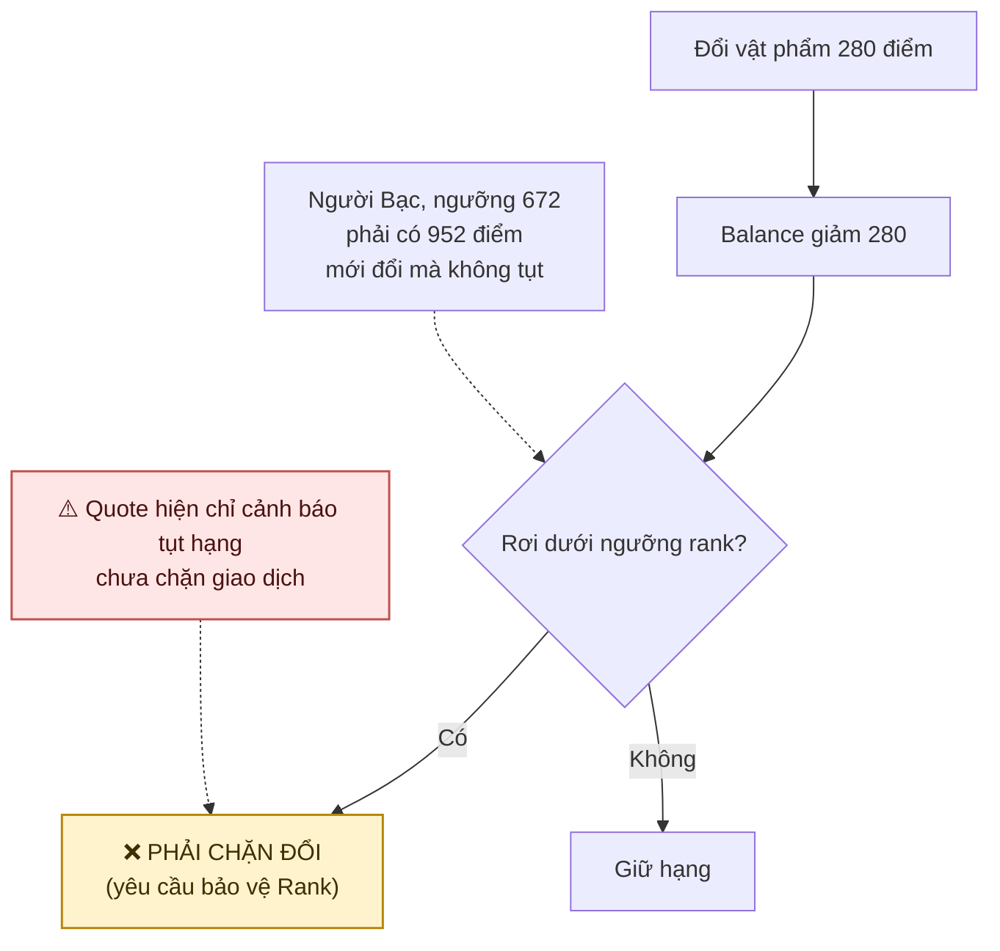

# 14 · Đổi vật phẩm bằng điểm

Trạng thái: 🟡 **đã có API và luồng cơ bản, chưa khớp đầy đủ yêu cầu khách hàng**.
`POST /posts/:postId/redeem` để đổi, `GET /posts/:postId/redemption-quote` để xem trước.
Các gap về bảo vệ Rank, tính nguyên tử, tỷ lệ Admin và hàng đợi sau redeem được theo dõi
tại [handoff backend](../plan/REDEMPTION-REQUIREMENT-GAP.md). Script kiểm hiện có:
`npm run test:redemption` — chưa thay thế acceptance tests trong handoff.

## 14.1 Định giá vật phẩm (F74) — ✅

> **Khai khống ở đây KHÔNG sinh ra điểm** — nó chỉ làm vật phẩm đắt hơn, tức khó đổi hơn.
> Ngược hẳn với [F40](./11-point.md), nơi giá người tặng khai cố ý không được tin.
>
> **Làm tròn LÊN.** 1.500 VNĐ với tỷ lệ 1.000 ra 2 điểm chứ không phải 1: làm tròn xuống là
> bán món đồ rẻ hơn giá người tặng khai, và chênh lệch đó nhân với số lượt đổi là một khoản
> thất thoát không ai theo dõi.
>
> **Không khai giá KHÔNG có nghĩa là cho không** — nó nghĩa là chưa quy ra điểm được. Coi ô
> trống là 0 điểm thì mọi bài quên điền giá trở thành đổi miễn phí.
>
> ⚠️ **Client KHÔNG được tự chia** (sửa 29/09). Trước đó `vndPerPoint` chỉ được đọc ở đúng một
> chỗ trong máy chủ và không endpoint nào trả nó ra, nên muốn hiện "cần 500 điểm" thì client
> phải hardcode tỷ lệ và tự làm tròn. Hai hệ quả: Admin đổi tỷ lệ là mọi client hiện sai cho
> tới khi deploy lại, và client làm tròn XUỐNG thì hiện thiếu 1 điểm so với số sẽ bị trừ. Với
> người ĐỦ điểm, đường duy nhất để biết giá là trả nó — lỗi thiếu điểm chỉ nêu số cần khi bạn
> thiếu. Nay `GET /posts/:postId/redemption-quote` trả giá đã tính, tỷ lệ đang áp, và tính bằng
> ĐÚNG hàm `quoteRedemption` mà đường bấm thật dùng.

## 14.2 ✅ Tỷ lệ quy đổi — chốt 2026-09-25

**2.000 VNĐ/điểm**, seed ở `system_configs.point.redemption`. Backend đọc cấu hình khi xử
lý, nhưng API Admin hiện **chưa cho publish khoá này**; xem handoff trước khi coi việc
"Admin sửa lúc chạy" là hoàn chỉnh.

Chọn theo câu trả lời được, chứ không theo cảm giác về giá trị một điểm:

> **Tặng bao nhiêu món thì đổi được một món giá trị tương đương?**

| Tặng N món để đổi 1 | Điểm cần cho món 1 triệu | Tỷ lệ |
| ---: | ---: | --- |
| 5 | 280 | 1 điểm ≈ 3.570 VNĐ |
| **9** | **500** | **2.000 VNĐ/điểm ← đã chọn** |
| 18 | 1.000 | 1 điểm = 1.000 VNĐ |

> Con số 1.000 VNĐ/điểm từng nằm trong `FEATURES.md` chỉ là ví dụ minh hoạ cú pháp, nhưng nó
> ngụ ý **phải tặng 18 món mới đổi được 1 món tương đương** — nhiều khả năng không ai chủ ý.

## 14.3 Ba điều kiện, và cả ba đều cố ý

| Điều kiện | Vì sao |
| --- | --- |
| Đồng hồ **đang chạy** | Đổi điểm là một nhánh **của** việc chọn người nhận, không phải lối đi vòng. Bài chưa ai xin thì chưa có gì để tranh; bài hết đồng hồ thì người nhận đã chốt |
| Người đổi **đã xin** | F75: *"người xin có hai đường — chờ, hoặc dùng điểm"*. Cho người ngoài nhảy vào đổi là biến hàng đợi thành trang trí |
| Bài **có khai giá** | Không khai giá là chưa quy ra điểm được, không phải cho không |

> **Đọc mốc đồng hồ, không tin trạng thái bài.** Job tự chọn chạy mỗi giờ, nên có một khoảng
> bài đã hết hạn mà chưa ai chốt — trong khoảng đó bài vẫn `PUBLISHED`.
>
> **Chưa xin và bài không tồn tại trả CÙNG một lỗi.** Phân biệt hai cái là để lộ bài nào tồn
> tại cho người chưa từng thấy nó. Endpoint xem trước gộp y như vậy (`NOT_AVAILABLE`), và
> `test:redemption` canh cả bốn nhánh cùng ra một lý do.
>
> **Xem trước thì KHÔNG ném lỗi.** Mọi nhánh trả 200 kèm `unavailableReason`: client chỉ cần
> biết "hiện nút hay không, và nếu không thì vì sao", còn bắt nó đọc mã lỗi 4xx để dựng giao
> diện là bắt nó dựng lại logic đã có sẵn ở máy chủ. `POST …/redeem` mới là chỗ ném lỗi thật.

## 14.4 Luồng đổi điểm (F75 + F77)

> **Trừ điểm TRƯỚC khi duyệt, và hoàn lại nếu duyệt hỏng.**
>
> Duyệt trước rồi trừ thì một lỗi ở bước trừ để lại người nhận đã được chốt mà chưa trả gì —
> món quà đi mất và không có đường đòi. Trừ trước thì lỗi tệ nhất là điểm bị giữ tạm, và khoản
> hoàn trả lại ngay.
>
> **Hiện trạng khác sơ đồ mục tiêu:** `appendAdjustment` và `acceptRequest` mỗi cái mở một
> transaction; lỗi duyệt được bù bằng bút toán hoàn. Cơ chế này không bảo đảm nguyên tử nếu
> tiến trình chết giữa hai bước. Handoff yêu cầu gộp transaction và kiểm điểm khả dụng theo
> ngưỡng Rank dưới khóa.

## 14.5 Hệ quả với thứ hạng

## 14.6 Ghi sổ (F77)

Mỗi lần đổi **bắt buộc** vào `point_ledger`:

| Trường | Giá trị |
| --- | --- |
| `user_id` | Người tiêu điểm |
| `rule_code` | `ITEM_REDEMPTION` |
| `delta` | Âm, bằng số điểm bị trừ |
| `reference_type` / `reference_id` | Trỏ về bài đăng |
| `idempotency_key` | Bắt buộc |

## Chỗ cần soát

1. ✅ **Đã hiện thực** (26/09). `appendAdjustment` ghi sổ với số điểm truyền vào, và
   `acceptRequest` tự xoá `selection_deadline` nên đồng hồ dừng luôn.
2. 🟡 **Quote mới cảnh báo tụt hạng, chưa bảo vệ Rank.** `wouldDemote` + `rankAfter` tính
   theo bậc thang trong `rank_tiers`, nhưng POST hiện vẫn cho tiêu phần điểm cần để giữ hạng.
   Nguồn tính Rank nay luôn là balance; tuỳ chọn `rank.points_source` đã được gỡ 02/10.
3. ✅ **Endpoint xem giá trước đã có** (29/09) — `GET /posts/:postId/redemption-quote`.
4. ✅ **Có, giống mọi lượt trao.** `acceptRequest` tạo một `gift_transaction` bình thường, nên
   khi COMPLETED thì hai bên đánh giá như thường và mức chính xác vào mẫu Giver Accuracy như
   thường. Không có nhánh riêng nào cho vật phẩm đổi bằng điểm.
5. ✅ **Có.** Người tặng được 56 điểm qua `GIFT_COMPLETED_GIVER` (phẳng từ CHỐT-14; mức chính xác người
   nhận chấm), đúng như mọi lượt trao.
   ⚠️ **Nhưng người ĐỔI cũng được +28.** `awardCompletionPoints` cộng
   `GIFT_COMPLETED_RECEIVER` cho người nhận mà không phân biệt lượt trao đó đến từ đâu, nên
   người vừa trả 500 điểm nhận lại 28. Không phải cỗ máy in điểm — cả lượt là
   −500 +28 +56 = **−416**, vẫn giảm phát. Nhưng hoàn 28 cho người vừa *mua* món đồ cần Bên A
   chốt là có chủ ý hay không; **chưa sửa, chỉ ghi lại**.
6. ✅ **Thông báo đã nói đúng sự thật** (sửa 29/09). Trước đó `AcceptedRequestNotifier` chỉ có
   một cờ boolean `automatic`, và đường đổi điểm truyền `false` — nên người vừa trả 500 điểm
   nhận được câu "Người tặng đã chọn bạn", trong khi người tặng không chọn ai cả. Nay là ba
   đường `MANUAL` / `AUTOMATIC` / `REDEEMED`; một cờ hai giá trị không diễn tả được ba đường.
7. ✅ **Chủ bài nay được báo khi lượt chốt KHÔNG do họ bấm** (29/09,
   `GIFT_POST_RECEIVER_SELECTED`). Hai đường: job tự chọn và đổi điểm. Trước đó chỉ người NHẬN
   được báo, nên chủ bài thấy bài mình đột nhiên `RESERVED` và một phòng chat mở ra, rồi chỉ
   hiểu chuyện gì xảy ra khi người kia nhắn tin. Đường `MANUAL` cố ý im — họ vừa bấm.
