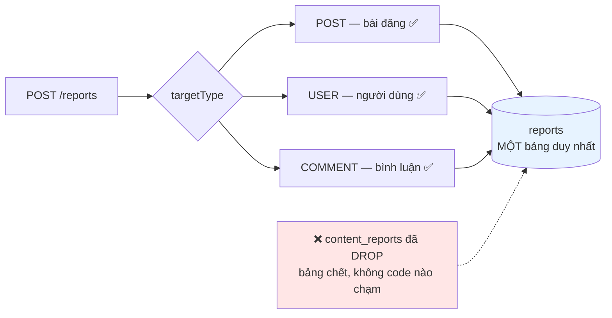
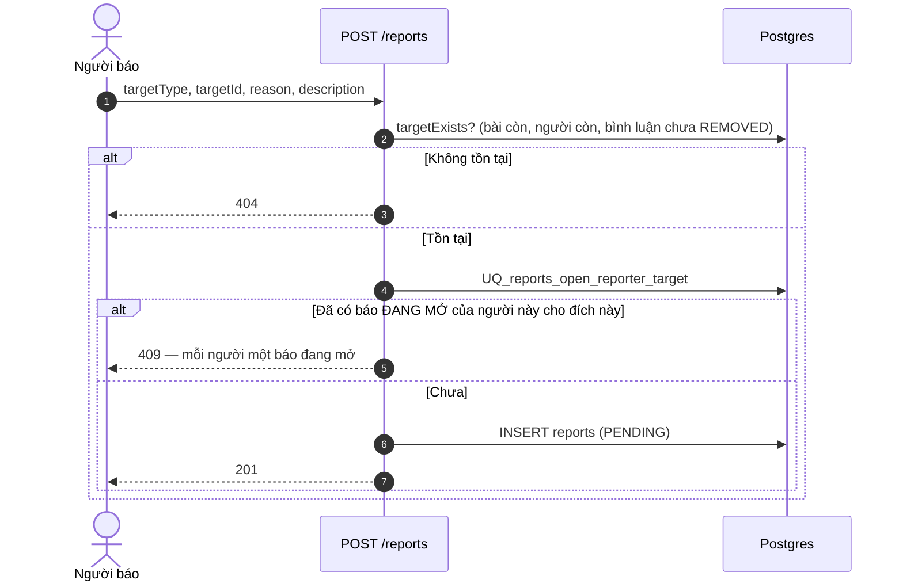
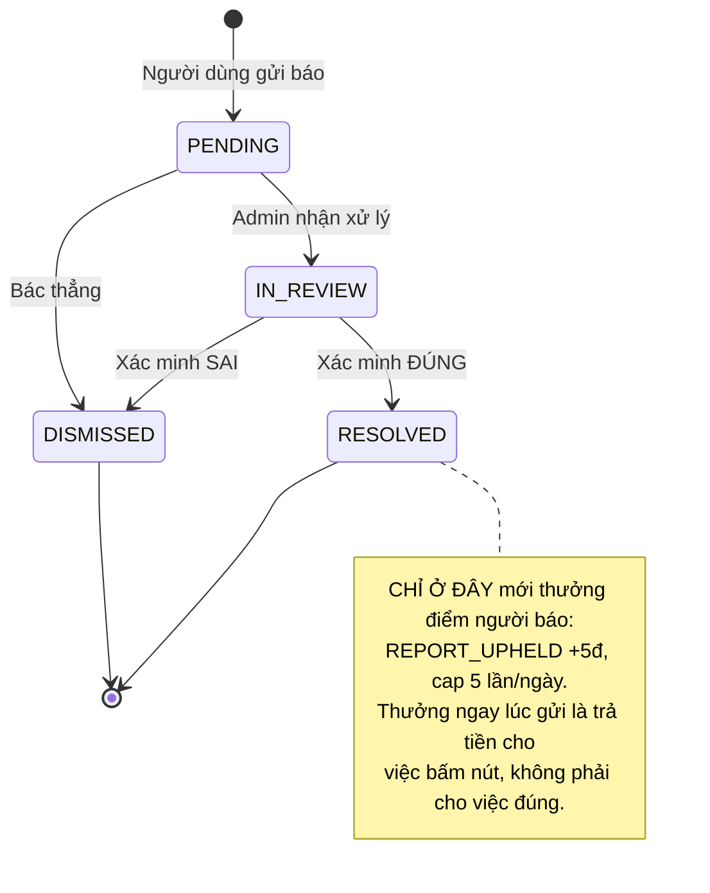
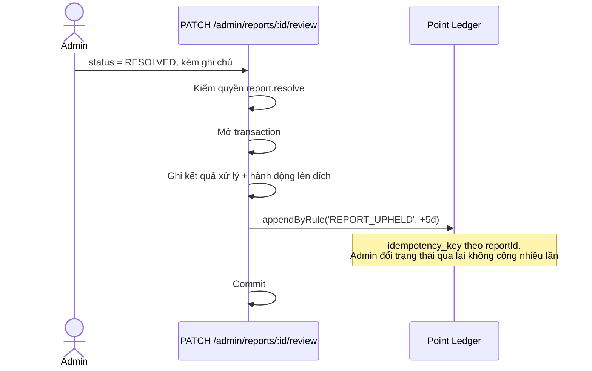
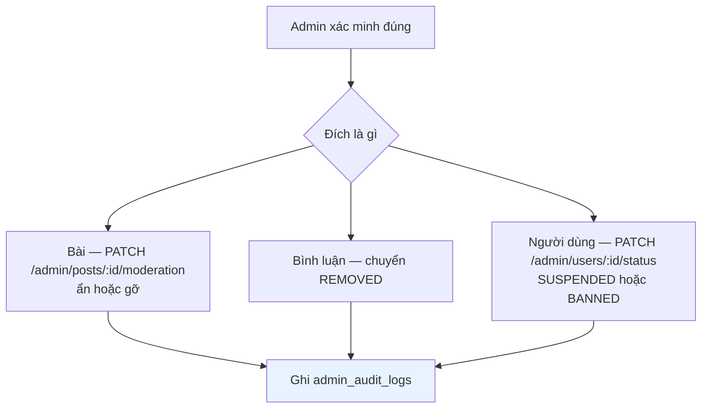

# 15 · Báo xấu & kiểm duyệt

Trạng thái: ✅ **đã hiện thực**, gồm cả việc gộp hai bảng báo xấu trùng nhau.

## 15.1 Ba loại đích

Lý do báo: `SCAM` · `PROHIBITED_ITEM` · `INAPPROPRIATE_CONTENT` · `HARASSMENT` ·
`MISLEADING` · `OTHER`.

## 15.2 Luồng gửi báo

> **Vì sao chặn báo trùng ở tầng ràng buộc database.** Kiểm ở tầng ứng dụng rồi mới ghi thì
> hai request song song lọt qua được cả hai. Ràng buộc UNIQUE không có kẽ đó.
>
> Ràng buộc chỉ tính báo **đang mở** — báo đã xử lý xong không chặn người đó báo lại lần sau
> khi có vi phạm mới.

## 15.3 Hàng đợi Admin

## 15.4 Thưởng người báo đúng (F41)

> Nếu rule tắt hoặc đã chạm cap ngày, use case **nuốt đúng hai ngoại lệ đó** và vẫn xử lý
> xong báo xấu. Không thưởng được điểm không được làm hỏng việc kiểm duyệt.

## 15.5 Hành động lên nội dung vi phạm

## Chỗ cần soát

1. **Chưa có thông báo cho người báo** khi báo của họ được xử lý. Họ không biết mình báo
   đúng hay sai, và cũng không biết vì sao được cộng 5 điểm.
2. **Chưa có thông báo cho người bị xử lý.** Bài biến mất mà không ai nói vì sao.
3. **Cap 10 report/người/ngày** là baseline trong tài liệu nhưng rule `REPORT_UPHELD` đang
   cap ở 5 — hai con số khác nhau, cần soát.
4. Chưa có cơ chế **chống báo xấu ác ý**: một người báo sai 50 lần không bị gì.
5. Bình luận `PENDING_REVIEW` (do bộ lọc từ ngữ) **không nằm trong hàng đợi này** — xem
   [06-interaction](./06-interaction.md).
