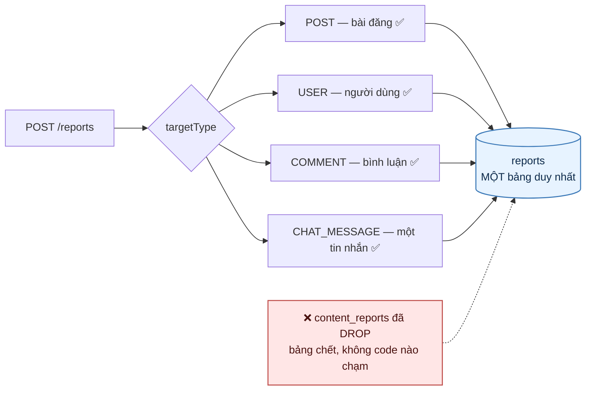
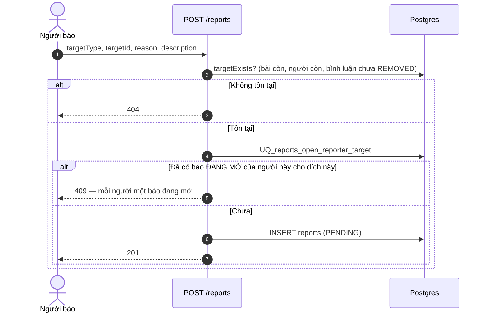
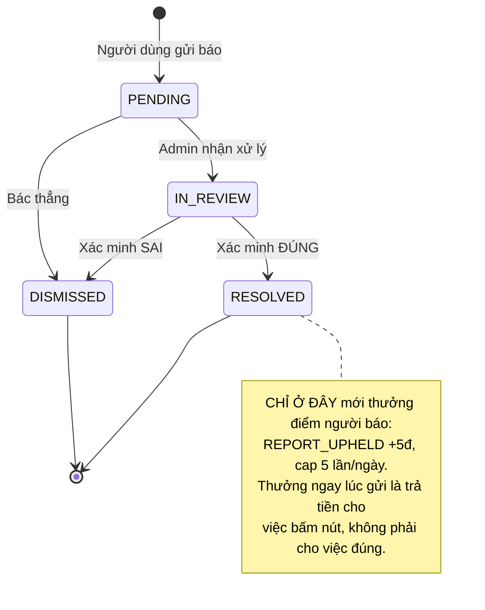
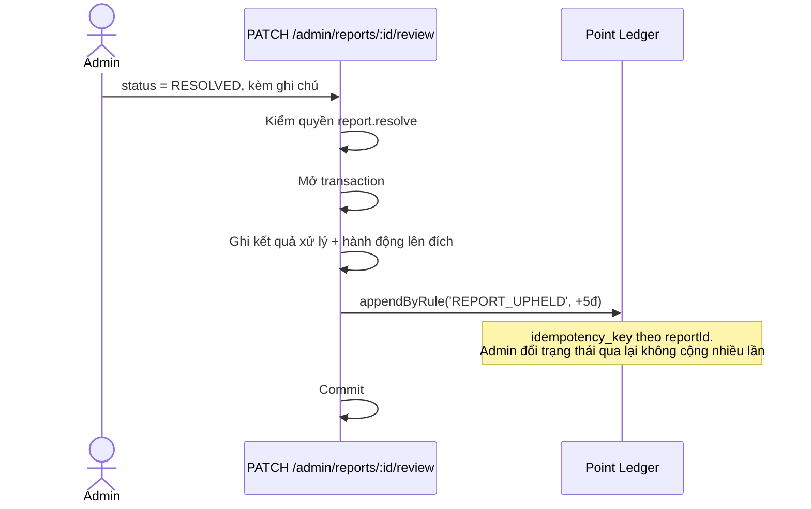
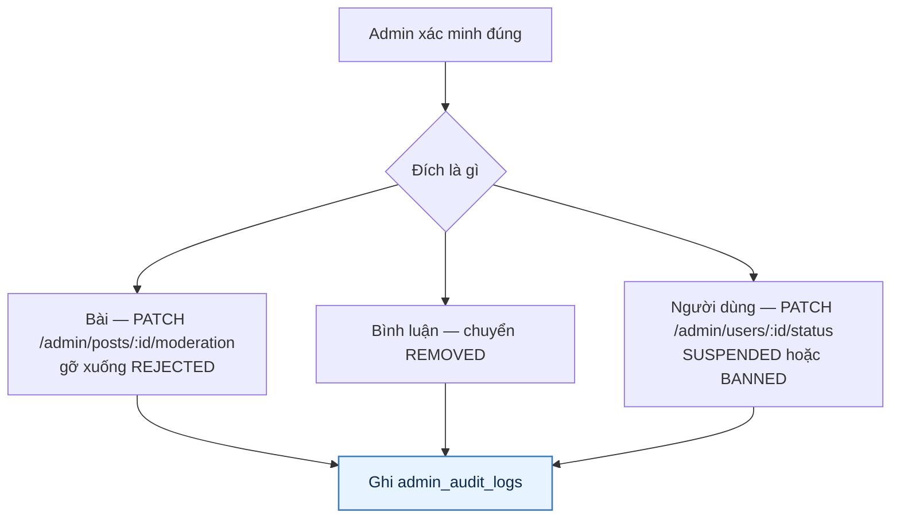

# 15 · Báo xấu & kiểm duyệt

Trạng thái: ✅ **đã hiện thực**, gồm cả việc gộp hai bảng báo xấu trùng nhau.

## 15.1 Bốn loại đích

> **`CHAT_MESSAGE` thêm 28/09.** Trước đó người bị quấy rối chỉ báo được cả CON NGƯỜI, và Admin
> mở hàng đợi ra thì không có gì để xem — họ không phải thành viên phòng. Báo xấu trỏ đúng dòng
> cần đọc mới mở được đường điều tra.
>
> Báo xấu một tin **đã thu hồi** vẫn được, và đó là cố ý: chính việc thu hồi sau khi gửi bậy là
> thứ Admin cần biết. Bình luận đã `REMOVED` thì không — nó đã bị xử lý rồi.

Lý do báo: `SCAM` · `PROHIBITED_ITEM` · `INAPPROPRIATE_CONTENT` · `HARASSMENT` ·
`MISLEADING` · `OTHER`.

## 15.2 Luồng gửi báo

> **Vì sao chặn báo trùng ở tầng ràng buộc database.** Kiểm ở tầng ứng dụng rồi mới ghi thì
> hai request song song lọt qua được cả hai. Ràng buộc UNIQUE không có kẽ đó.
>
> Ràng buộc chỉ tính báo **đang mở** — báo đã xử lý xong không chặn người đó báo lại lần sau
> khi có vi phạm mới.
>
> ⚠️ **Nhưng ràng buộc đó chặn theo ĐÍCH, không theo số lượt.** Tới 29/09 không có trần nào cho
> việc gửi báo xấu — bình luận, chia sẻ, tin nhắn, đăng nhập, đăng ký đều có, báo xấu thì không.
> Nên một người báo 500 đích khác nhau trong một phút là hoàn toàn hợp lệ, và mỗi lượt là một
> mục trong hàng đợi Admin. Hậu quả không phải "người báo bừa không bị gì", mà là **báo xấu
> thật bị chôn** dưới hàng trăm mục rác.
>
> Nay **10 lượt/ngày và 3 lượt/phút** cho mỗi người. Trần ngày kiểm TRƯỚC trần phút: chạm cả
> hai mà báo "thử lại sau 57 giây" là nói sai, thật ra còn phải chờ nhiều giờ. Đếm SAU khi ghi
> xong, để một lượt bị chặn ở bước kiểm đích không trừ mất một suất.

## 15.3 Hàng đợi Admin

## 15.4 Thưởng người báo đúng (F41)

> Nếu rule tắt hoặc đã chạm cap ngày, use case **nuốt đúng hai ngoại lệ đó** và vẫn xử lý
> xong báo xấu. Không thưởng được điểm không được làm hỏng việc kiểm duyệt.
>
> `REPORT_UPHELD` seed TẮT và chỉ được bật ngày 29/09 (migration `1795300000000`), nên trước đó
> nhánh này chạy nhưng không cộng đồng nào. Trần 5 lượt/ngày giữ nguyên: báo xấu là hành động
> tạo VIỆC cho người khác, nên bật thưởng mà bỏ trần là mở đường cày điểm bằng cách rải báo xấu
> vu vơ, với cái giá rơi vào thời gian của Admin.

## 15.5 Hành động lên nội dung vi phạm

Với đích `POST`, xác nhận đúng thực hiện nguyên tử ba việc: chuyển bài đang
`PUBLISHED`/`PENDING_REVIEW` sang `REJECTED`, ghi khoản phạt theo point rule
`CONTENT_VIOLATION_PENALTY` (khởi tạo −50 điểm, không giảm lifetime), và ghi audit. Khoá
idempotency theo bài nên nhiều report cùng đích không trừ lặp. Bài đang có giao dịch sống
(`RESERVED`) không bị gỡ ngang.

Với đích `COMMENT`, xác nhận đúng chuyển bình luận sang `REMOVED` trong **cùng transaction**
với kết luận, kèm audit `REMOVE_COMMENT` (thêm 29/09). Trước đó sơ đồ trên vẽ ba hành động
nhưng chỉ `POST` có hành động thật: Admin bấm RESOLVED trên một bình luận rồi phải tự nhớ sang
màn hình khác gỡ nó, và không bản ghi nào cho biết họ có làm hay không.

Với đích `CHAT_MESSAGE`, Admin gỡ bằng `DELETE /admin/chat/messages/:messageId` (thêm 29/09).
Đây là một bước RIÊNG, không tự động theo kết luận: gỡ tin nhắn cần quyền `report.resolve` chứ
không phải `report.read`, và một câu có thể đáng gỡ trong khi cả cuộc trò chuyện thì không.

> **Đích `USER` CỐ Ý vẫn tách rời** — `PATCH /admin/users/:id/status`. Đình chỉ một người phải
> là quyết định riêng, có cân nhắc; gỡ một dòng chữ và khoá một tài khoản không cùng mức hệ quả.

> **Cửa thứ ba của việc báo xấu tin nhắn, mở 29/09.** Từ 28/09 đã có hai cửa: báo trỏ đúng một
> dòng, và Admin đọc được phòng làm bằng chứng. Nhưng không có đường nào GỠ — nạn nhân báo
> được, Admin đọc được, bấm RESOLVED được, rồi câu chữ đó nằm trong phòng vĩnh viễn và cả hai
> vẫn đọc lại được. `PATCH .../recall` không phải đường đó: nó đòi người gọi LÀ người gửi và
> trong 5 phút — cửa sổ ấy để người gửi chữa lỗi gõ nhầm, không phải để giới hạn quyền kiểm
> duyệt.
>
> Đường gỡ của Admin đi qua **đúng cờ phiên** mà trigger append-only cho phép, nên bản ghi sau
> khi gỡ có hình dạng giống hệt một lượt thu hồi và bảng vẫn append-only. `test:chat-access`
> canh riêng điều đó: sau khi thêm đường gỡ, một `UPDATE` trần vào `chat_messages` vẫn phải bị
> chặn.

## Chỗ cần soát

1. ✅ **Đã có 25/09.** Người báo luôn nhận `REPORT_REVIEWED` kèm kết luận — cả khi bị bác, vì
   không báo thì lần sau họ báo lại y như vậy.
2. ✅ Người bị xử lý nhận `CONTENT_MODERATED` kèm lý do, **chỉ khi báo xấu được XÁC MINH**. Báo
   xấu bị bác thì không báo: họ chưa làm gì sai, và nói "có người báo bạn" là mời một cuộc cãi
   vã. Thông báo lỗi không bao giờ làm hỏng kết luận của Admin — kết luận đã ghi rồi.
3. ✅ **Hai con số đó không so được với nhau, và một trong hai từng không tồn tại.** `5` là trần
   THƯỞNG (`REPORT_UPHELD.daily_cap`); `10` là trần GỬI, và tới 29/09 nó mới thật sự có trong
   code. Nay cả hai cùng tồn tại và không đụng nhau.
4. ✅ **Đã có danh sách người báo bừa** (29/09) — `GET /admin/reports/reporters`, tỷ lệ bị BÁC
   của từng người, ngưỡng ở cấu hình động `report.abuse` (mặc định: từ 5 lượt đã có kết luận,
   bị bác ≥ 80%).
   **KHÔNG tự động phạt**, y như cờ Giver Accuracy: một người báo sai nhiều có thể là người
   hiểu sai luật chứ không phải người xấu, và phân biệt hai cái là việc của con người.
   Chỉ đếm lượt ĐÃ có kết luận — người vừa gửi 20 báo còn đang chờ xử lý không phải người báo
   bừa, họ chỉ là người đang chờ.
   **Tính SỐNG từ bảng `reports`, không lưu thành cột.** Chỉ Admin đọc nên không có áp lực hiệu
   năng, mà lưu sẵn thì kéo theo ba thứ: migration backfill, đường tính lại mỗi khi có kết luận
   mới, và job đối soát cho lần đổi ngưỡng — đúng ba thứ mà `giver_accuracy_*` đang phải mang.
   Tính sống thì con số không bao giờ lệch được với nguồn, và đổi ngưỡng có hiệu lực ngay.
5. Bình luận `PENDING_REVIEW` (do bộ lọc từ ngữ) **không nằm trong hàng đợi này** — xem
   [06-interaction](./06-interaction.md).
6. ⚠️ **Chưa có gì nối kết luận báo xấu với việc đình chỉ người dùng.** Với `POST` và `COMMENT`
   thì hành động đi cùng kết luận trong một transaction; với `USER` thì Admin phải sang
   `PATCH /admin/users/:id/status`, và không bản ghi nào nối hai việc. Tách rời là **cố ý**,
   nhưng nếu muốn tra "báo xấu nào dẫn tới lệnh đình chỉ nào" thì hiện không tra được.
