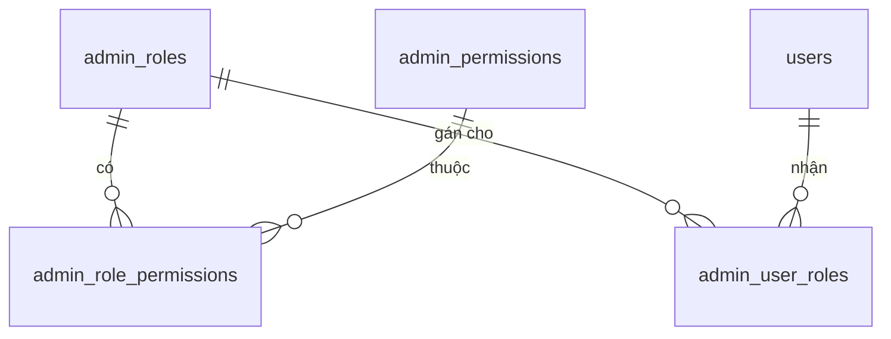
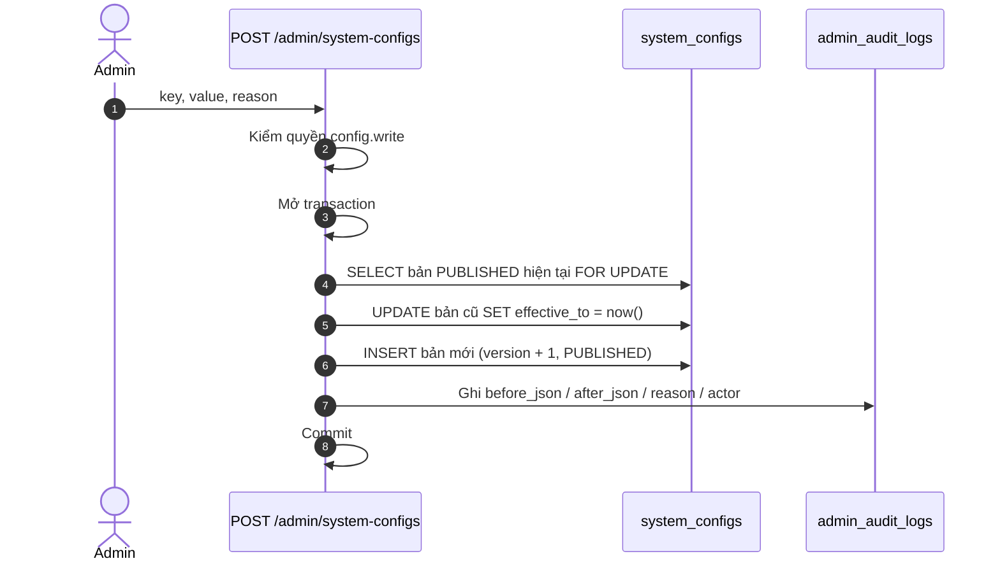
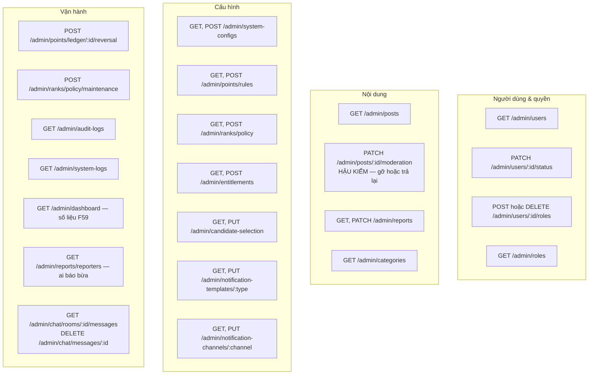
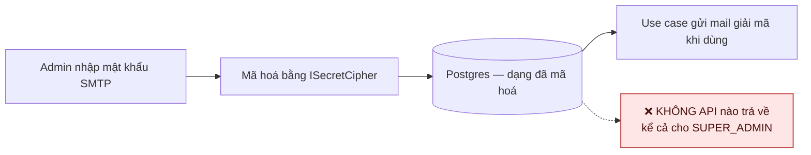

# 16 · Admin CMS & RBAC

Trạng thái: ✅ **đã hiện thực**. Allowlist theo username đã bị gỡ hoàn toàn.

## 16.1 Mô hình quyền

17 quyền hiện có:

| Nhóm | Quyền |
| --- | --- |
| Cổng vào | `admin.access` |
| Cấu hình | `config.read` · `config.write` |
| Quyền hạn | `admin.manage` |
| Kiểm toán | `audit.read` |
| Số liệu | `dashboard.read` |
| Danh mục | `category.read` · `category.manage` |
| Bài đăng | `post.read` · `post.moderate` |
| Báo xấu | `report.read` · `report.resolve` |
| Điểm | `point.adjust` |
| Hạng | `rank.operate` |
| Đặc quyền | `entitlement.read` · `entitlement.write` |
| Thông báo | `notification.manage` |

> `admin.access` là quyền CỔNG VÀO chính CMS (`get-own-admin-access.use-case.ts`), tách khỏi mọi
> quyền nghiệp vụ: thu hồi nó là đóng cửa mà không phải gỡ từng quyền một.
>
> `dashboard.read` (thêm 29/09) tách khỏi `config.read` vì xem số liệu và sửa chính sách là hai
> việc khác nhau — người cần theo dõi tăng trưởng không nhất thiết là người được đổi ngưỡng điểm.
> Gán cho `SUPER_ADMIN` và `AUDITOR`, **không** cho `MODERATOR`: họ xử nội dung từng cái, số liệu
> tăng trưởng không giúp gì cho việc đó, và quyền nào cũng nên hẹp nhất có thể.

## 16.2 Guard mặc định đóng

> **Vì sao mặc định đóng.** Thêm endpoint admin mà quên decorator thì nó khoá ngay lần gọi
> đầu, và người viết biết ngay. Hướng ngược lại là lặng lẽ mở một cửa quản trị mà không ai
> phát hiện cho tới khi có người đi qua.
>
> **Vì sao đọc quyền từ database chứ không từ token.** Thu hồi quyền của một người phải có
> hiệu lực ngay, không phải chờ token họ hết hạn.
>
> **Use case vẫn tự kiểm quyền** vì còn đường gọi khác ngoài HTTP — CLI và job nền không đi
> qua guard nào.

## 16.3 Cấu hình động copy-on-write

> **Vì sao không UPDATE tại chỗ.** Khi một bút toán điểm phát sinh, phải tra được nó ra đời
> dưới phiên bản cấu hình nào. UPDATE tại chỗ xoá mất câu trả lời đó vĩnh viễn.

Các khoá cấu hình đang có — bảng đầy đủ ở [CONFIG-INVENTORY.md](../CONFIG-INVENTORY.md):

| Khoá | Nội dung |
| --- | --- |
| `accuracy.giver` | Ngưỡng Giver Accuracy (F43) |
| `rating.display` | Số mẫu tối thiểu để công bố điểm sao (F42) |
| `report.abuse` | Ngưỡng đưa người báo xấu vào diện Admin xem xét |
| `moderation.blocked_terms` | Danh sách từ ngữ cho bộ lọc bình luận |
| `point.redemption` | Tỷ lệ quy đổi VNĐ/điểm |
| `review.grace` | Hạn chờ đánh giá và mức mặc định |
| `rank.points_source` | Cột điểm quyết định hạng — `BALANCE` hay `LIFETIME` |
| `chat.retention` | Hạn lưu trữ lịch sử chat |
| `notification.retention` | Hạn lưu trữ hộp thư |
| `selection.candidate_priority` | Thứ tự tiêu chí chọn người nhận — **cố ý chưa seed**, xem dưới |
| *(bí mật SMTP/Zalo)* | Mã hoá tại chỗ, **không API nào trả về** |

> ⚠️ **Năm khoá từng không có dòng nào (sửa 29/09), và một trong số đó làm cả tính năng nằm im.**
>
> Mọi `normalize*` đều lùi về mặc định khi thiếu dòng, nên không có gì đổ — chỉ lặng lẽ hai
> chuyện: Admin mở trang cấu hình ra không thấy ô nào để sửa, và "cấu hình động" thành ra phải
> deploy mới đổi được.
>
> Nhưng `moderation.blocked_terms` thì nặng hơn hẳn. Không dòng nào →
> `normalizeBlockedTerms(null)` trả `[]` → `screenText(body, [])` trả `ALLOW` cho **mọi** nội
> dung. Nghĩa là `ContentBlockedTermsException` chưa bao giờ được ném, `PENDING_REVIEW` chưa bao
> giờ sinh ra, và hàng đợi bình luận của Admin cùng badge đếm số chờ duyệt chưa bao giờ có gì để
> hiện. Code thì hoàn chỉnh — `screenText` xử lý dấu, biến âm, ba dạng chuẩn hoá, có spec đầy đủ.
> Không phép kiểm nào bắt được vì tất cả đều TRUYỀN danh sách từ vào trực tiếp.
>
> Nay có `npm run test:config-inventory` trong CI, hỏi đúng câu mà không phép kiểm nào từng hỏi:
> *ngoài production thì danh sách đó có tồn tại không, và nó có bắt được gì không.*

> **`selection.candidate_priority` CỐ Ý vẫn không seed.** `GET /admin/candidate-selection` trả
> kèm `isConfigured`, tính bằng "có dòng cấu hình hay không". Seed giá trị mặc định vào sẽ làm cờ
> đó thành `true` và nói với Admin rằng đã có người đặt thứ tự này — trong khi chưa ai đặt. Ở đó
> **sự vắng mặt chính là thông tin**, và mất một tín hiệu thật để thêm một dòng không cần thiết là
> đổi xấu.

## 16.4 Các mặt quản trị

## 16.5 Bí mật không bao giờ quay ra

## Chỗ cần soát

1. ✅ **Dashboard KPI (F59) đã có** (29/09) — `GET /admin/dashboard`, đúng năm khối mục này từng
   nêu: người dùng mới, bài theo danh mục, giao dịch hoàn tất, phân bổ hạng, dung lượng. Thêm
   khối thứ sáu là hàng đợi đang tồn — con số duy nhất trong bảng mà Admin phải LÀM GÌ ĐÓ với
   nó, không chỉ để biết.
   ⚠️ **"Dung lượng" đếm bằng SỐ OBJECT, không phải byte.** Không bảng nào lưu kích thước:
   `post_media` có `r2_key`, `chat_message_media` có `storage_key`, và hết. Đo byte thật đòi gọi
   ra storage cho từng object — không đặt trong một endpoint dashboard được. Muốn có byte thì
   phải thêm cột lúc tải lên; tới lúc đó thì trả số object và gọi đúng tên nó, thay vì quy đổi
   bằng một kích thước trung bình bịa ra.
   Phân bổ hạng đọc từ chính `users.rank`, **không tính lại từ điểm**: bảng phải nói đúng cái mà
   hệ thống đang DÙNG để cấp quyền, kể cả khi nó đang lệch với điểm. Tính lại sẽ che mất chính
   xác loại lệch cần thấy.
2. ✅ **Campaign & Home động (F63)**, ✅ **Blog / Tin tức (F64)** và ✅ **F65 đủ bốn phân
   hệ** đã xong: Từ thiện (03/10), Rao vặt, Quảng cáo và Công đức (04/10). Ba cặp quyền
   riêng: `campaign.*` (nới nghĩa cho Từ thiện), `banner.*`, `merit.*`. `merit.manage` là quyền
   nạng nhất trong CMS — nó sửa được **số tài khoản ngân hàng** của đơn vị nhận công đức,
   nên chỉ `SUPER_ADMIN` được cấp.
3. ✅ **Cả hai hàng đợi đã có** — `GET /admin/users?accuracyReviewRequired=true` cho hồ sơ bị gắn
   cờ accuracy, và `GET /admin/comments` kèm `/admin/comments/pending-count` cho bình luận chờ
   duyệt.
   Ghi chú: hàng đợi bình luận trước 29/09 luôn rỗng, không phải vì không ai viết bậy mà vì bộ
   lọc chưa có từ nào — xem §16.3.
4. Bốn vai trò đã seed: `SUPER_ADMIN`, `MODERATOR`, `POLICY_ADMIN`, `AUDITOR`. Vai cho vận hành
   Group (`GROUP_ADMIN` / `SUBTEAM_ADMIN`) là **hệ riêng, không dùng bảng này** — xem
   [18-group](./18-group.md).
5. ⚠️ **Danh sách từ ngữ là bản KHỞI TẠO, cần Bên A soát.** 41 mục seed ở migration
   `1795600000000`, còn 38 sau chuẩn hoá vì các biến thể gộp về cùng một dạng. `BLOCK` chỉ dành
   cho từ xúc phạm trực diện; dấu hiệu lừa đảo và hàng cấm để `REVIEW` vì máy không kết luận
   được thay người. Ba mục bắt nhầm nhiều nhất là "giá rẻ", "bán lại", "thanh lý" — ai cũng có
   thể viết "mua hồi đó giá rẻ" — nên đó là ứng viên đầu tiên nên bỏ nếu hàng đợi quá tải.
