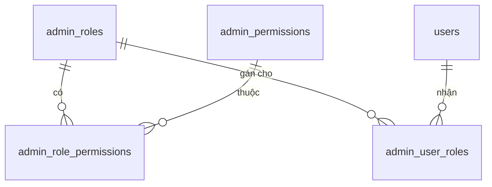
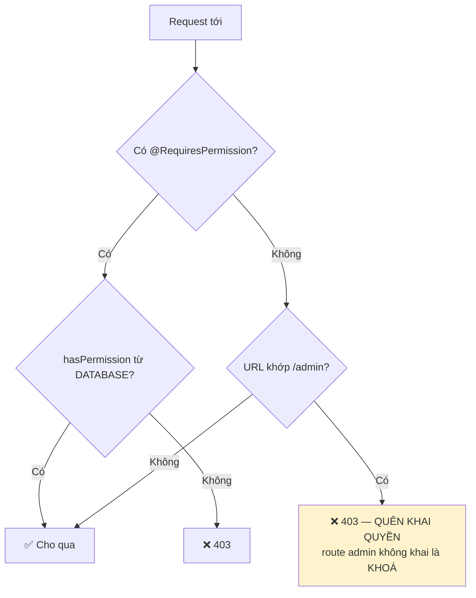
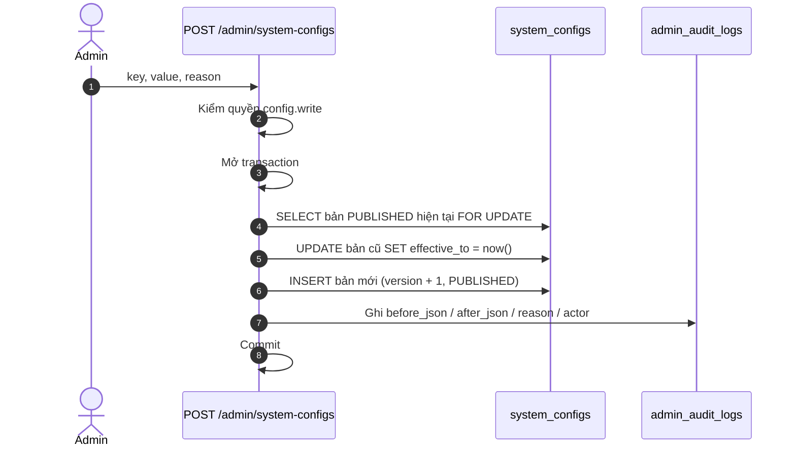
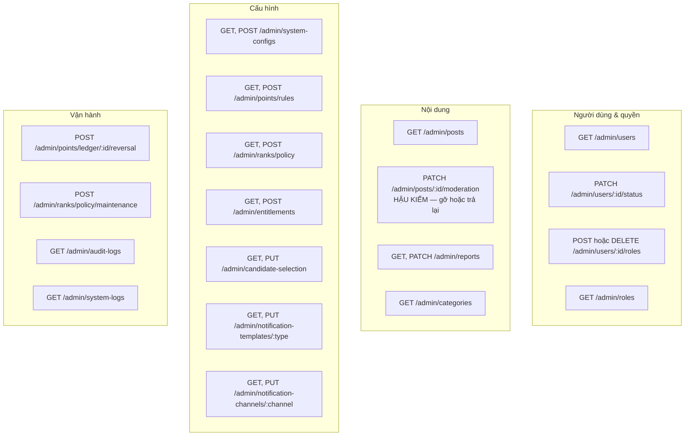
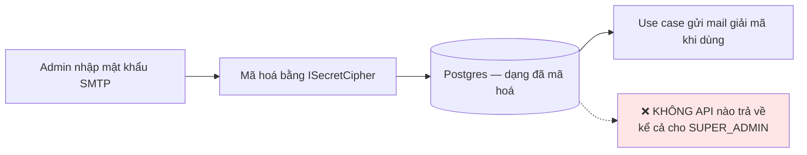

# 16 · Admin CMS & RBAC

Trạng thái: ✅ **đã hiện thực**. Allowlist theo username đã bị gỡ hoàn toàn.

## 16.1 Mô hình quyền

15 quyền hiện có:

| Nhóm | Quyền |
| --- | --- |
| Cấu hình | `config.read` · `config.write` |
| Quyền hạn | `admin.manage` |
| Kiểm toán | `audit.read` |
| Danh mục | `category.read` · `category.manage` |
| Bài đăng | `post.read` · `post.moderate` |
| Báo xấu | `report.read` · `report.resolve` |
| Điểm | `point.adjust` |
| Hạng | `rank.operate` |
| Đặc quyền | `entitlement.read` · `entitlement.write` |
| Thông báo | `notification.manage` |

## 16.2 Guard mặc định đóng

> **Vì sao mặc định đóng.** Thêm endpoint admin mà quên decorator thì nó khoá ngay lần gọi
> đầu, và người viết biết ngay. Hướng ngược lại là lặng lẽ mở một cửa quản trị mà không ai
> phát hiện cho tới khi có người đi qua.
>
> **Vì sao đọc quyền từ database chứ không từ token.** Thu hồi quyền của một người phải có
> hiệu lực ngay, không phải chờ token họ hết hạn.
>
> **Use case vẫn tự kiểm quyền** vì còn đường gọi khác ngoài HTTP — CLI và job nền không đi
> qua guard nào.

## 16.3 Cấu hình động copy-on-write

> **Vì sao không UPDATE tại chỗ.** Khi một bút toán điểm phát sinh, phải tra được nó ra đời
> dưới phiên bản cấu hình nào. UPDATE tại chỗ xoá mất câu trả lời đó vĩnh viễn.

Các khoá cấu hình đang có:

| Khoá | Nội dung |
| --- | --- |
| `accuracy.giver` | `minSamples`, `reviewThresholdPercent` |
| `selection.candidate_priority` | Thứ tự bộ tiêu chí chọn người nhận |
| *(bí mật SMTP/Zalo)* | Mã hoá tại chỗ, **không API nào trả về** |

## 16.4 Các mặt quản trị

## 16.5 Bí mật không bao giờ quay ra

## Chỗ cần soát

1. ⛔ **Dashboard KPI (F59) chưa có gì.** Không có số liệu người dùng mới, bài theo danh mục,
   giao dịch hoàn tất, phân bổ rank, dung lượng.
2. ⛔ **Campaign & Home động (F63), Blog (F64), quản lý Từ thiện/Quảng cáo/Công đức (F65)**
   chưa có dòng nào.
3. **Chưa có hàng đợi cho hồ sơ bị gắn cờ accuracy** và **bình luận PENDING_REVIEW**.
4. Hai vai trò đã seed là `SUPER_ADMIN` và `MODERATOR`. Vai cho vận hành Group
   (`GROUP_ADMIN` / `SUBTEAM_ADMIN`) là **hệ riêng, không dùng bảng này** — xem
   [18-group](./18-group.md).
