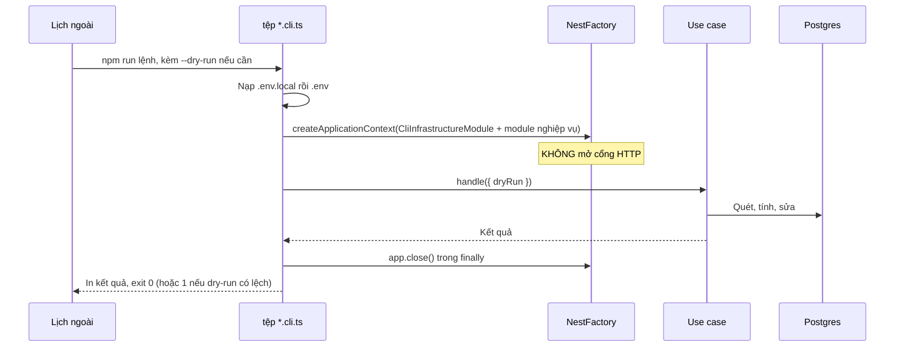
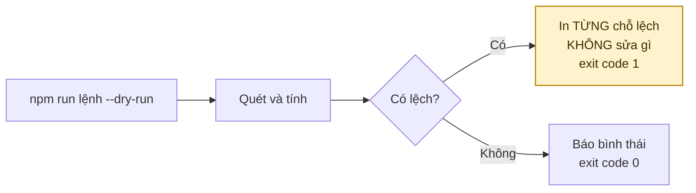
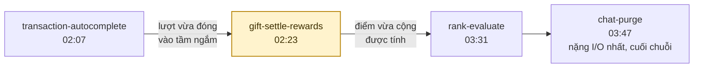
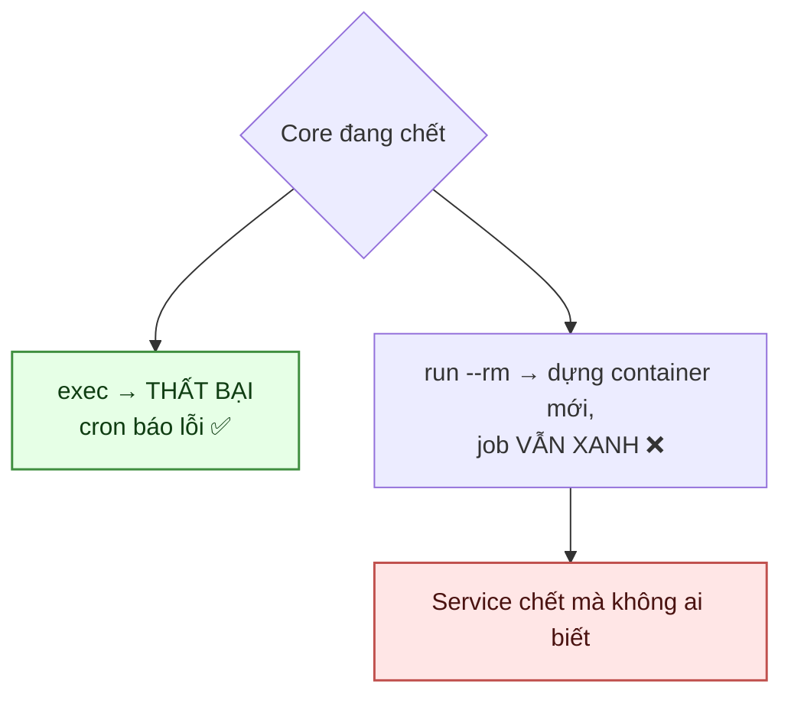

# 17 · Job nền & CLI

Trạng thái: ✅ **cả mười một CLI đã chạy được** sau khi sửa hai lỗi từng làm chúng chết.

`media:sweep-orphans` là CLI duy nhất **mặc định không làm gì** — nó xoá object không hoàn
tác được, nên phải gõ rõ `--apply`. Lịch cron cũng chỉ chạy khô để báo con số.

## 17.1 Mười lệnh

```mermaid
flowchart TD
    C["Lịch bên ngoài (cron/systemd)"] --> A["chat:purge<br/>xoá tin nhắn quá hạn lưu trữ"]
    C --> B["point:reconcile<br/>vá thưởng xác minh SĐT bị thiếu"]
    C --> D["post:expire<br/>đóng bài quá hạn, rao vặt thành bài tặng"]
    C --> E["rank:evaluate<br/>đánh giá chu kỳ duy trì rank"]
    C --> F["transaction:autocomplete<br/>tự hoàn tất lượt trao quá hạn ⚠️"]
    C --> G["feed:reconcile-counts<br/>đối soát số đếm feed"]
    C --> H["accuracy:reconcile<br/>tính lại Giver Accuracy theo ngưỡng"]
    C --> I["gift:settle-rewards<br/>trả thưởng lượt trao người nhận không đánh giá"]
    C --> J["notify:reminders<br/>nhắc đánh giá và nhắc nhiệm vụ duy trì"]
    C --> K["selection:auto-select<br/>chốt người nhận khi hết đồng hồ 7 ngày"]

    style C fill:#e7f3ff,stroke:#3d7ab8,stroke-width:1.5px,color:#0d2a4a
    style F fill:#fff3cd,stroke:#b8860b,stroke-width:1.5px,color:#3d2f00
```

> Core **cố ý không dựng scheduler nào trong tiến trình**. Hai bản sao service cùng chạy
> scheduler nội bộ sẽ chạy mọi job hai lần, và không có gì ngăn được điều đó từ bên trong.

## 17.2 Khuôn chung

## 17.3 Hai cái bẫy đã làm cả bảy CLI chết

Cả hai **chỉ lộ ra khi chạy thật**, vì unit test tiêm sẵn hàm giả vào đúng chỗ hỏng.

```mermaid
flowchart TD
    subgraph B1["Bẫy 1 — mất this"]
        A1["truyền NestFactory.createApplicationContext trần"] --> A2["mất this"]
        A2 --> A3["❌ Cannot read properties of undefined"]
        A3 --> A4["✅ Sửa: .bind(NestFactory)"]
    end
    subgraph B2["Bẫy 2 — module thiếu"]
        C1["mỗi tệp *-cli.module.ts tự đoán 4 module"] --> C2["@Global chỉ có hiệu lực<br/>SAU KHI được import ở đâu đó"]
        C2 --> C3["❌ Nest cant resolve dependencies"]
        C3 --> C4["✅ Sửa: CliInfrastructureModule dùng chung"]
    end

    style A3 fill:#ffe6e6,stroke:#c0504d,stroke-width:1.5px,color:#4a1210
    style C3 fill:#ffe6e6,stroke:#c0504d,stroke-width:1.5px,color:#4a1210
    style A4 fill:#e6ffe6,stroke:#3f8f3f,stroke-width:1.5px,color:#0f3d12
    style C4 fill:#e6ffe6,stroke:#3f8f3f,stroke-width:1.5px,color:#0f3d12
```

`CliInfrastructureModule` bám theo `InfrastructureModule`, **trừ**:

| Bỏ | Vì sao |
| --- | --- |
| `ControllerModule` | `DocsModule` bên trong chờ một HTTP app CLI không bao giờ dựng, nạp vào là treo tiến trình |
| `AuthModule` / `HealthModule` | Guard và endpoint sức khoẻ không có người gọi trong một lần chạy CLI |
| `RealtimeModule` | Thay bằng `NoopRealtimeModule` — dựng websocket server cho tiến trình sống vài giây là giữ cổng đủ lâu để hai lượt cron đụng nhau |

> `NoopChatRealtimePublisher` **ghi log cảnh báo** nếu thật sự bị gọi, không nuốt lặng lẽ:
> nếu có ngày một CLI gửi tin nhắn, người vận hành phải thấy ngay rằng người nhận sẽ không
> nhận được tức thì.

## 17.4 Cờ --dry-run

> **Vì sao in từng chỗ lệch chứ không chỉ tổng số.** Một con số "đã sửa 12 chỗ" không cho ai
> biết đường ghi nào đang hỏng.
>
> **Vì sao dry-run có lệch thì exit 1.** Để cron hay CI coi lệch là chuyện cần biết, không
> phải một lần chạy bình thường.

## Chỗ cần soát

1. ⚠️ **`transaction:autocomplete` đếm từ `accepted_at`** nên đóng lượt trao trước khi hàng
   tới nơi, và **không kiểm tranh chấp** — xem [08-transaction](./08-transaction.md).
2. ⛔ **Chưa có job kiểm Active Member** (`last_login_at` quá 90 ngày).
3. ⛔ **Chưa có job dọn object mồ côi** trong bucket.
4. ✅ **Nhắc nhiệm vụ duy trì trước 30 ngày đã có** — `notify:reminders`.
5. ✅ **Lịch cron đã có** — [`deploy/cron/`](../../deploy/cron/README.md): crontab, wrapper,
   logrotate và runbook. Xem §17.5.
6. ⛔ **Chưa nối alert vào kênh người thật đọc.** Cron gửi mail cho user `deploy` theo mặc định
   hệ thống, nên một job đỏ lúc 2 giờ sáng không ai biết.

## 17.5 Lịch chạy trên VPS

```mermaid
gantt
    title Chuỗi job một ngày (giờ Việt Nam)
    dateFormat HH:mm
    axisFormat %H:%M
    section Đầu ngày
    post-expire            :00:11, 5m
    section Chuỗi đêm
    transaction-autocomplete :02:07, 8m
    gift-settle-rewards      :02:23, 10m
    rank-evaluate            :03:31, 8m
    chat-purge               :03:47, 15m
    section Buổi sáng
    notify-reminders       :08:17, 10m
    section Mỗi giờ
    point-reconcile        :01:19, 3m
    selection-auto-select  :01:37, 4m
```

**Thứ tự trong chuỗi đêm là có lý do:**

> **`gift-settle-rewards` là job cấp bách nhất.** Không chạy là điểm của người tặng treo vô
> hạn mỗi khi người nhận không đánh giá — mà đó là phần lớn trường hợp. Nếu chỉ canh alert cho
> một job, canh cái này.
>
> **Phút lẻ, không phải `:00`.** Mọi job đặt ở `:00` sẽ cùng đánh vào database một lúc, và hai
> job không bao giờ được trùng phút.
>
> **`CRON_TZ=Asia/Ho_Chi_Minh`.** Hiểu theo UTC thì lời nhắc tới máy người dùng lúc 3 giờ
> chiều, và `post-expire` cắt ngày lệch 7 tiếng.

### Vì sao `docker compose exec` chứ không `run --rm`

`exec` cũng dùng lại container đang chạy nên không phải nạp lại toàn bộ cây DI mỗi lượt.

