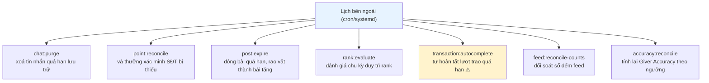
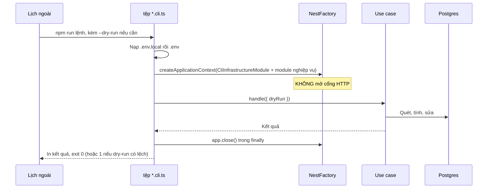
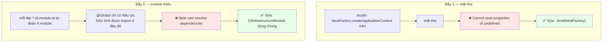
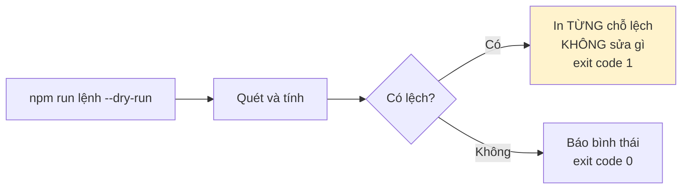

# 17 · Job nền & CLI

Trạng thái: ✅ **cả bảy CLI đã chạy được** sau khi sửa hai lỗi làm chúng chết từ trước.

## 17.1 Bảy lệnh

> Core **cố ý không dựng scheduler nào trong tiến trình**. Hai bản sao service cùng chạy
> scheduler nội bộ sẽ chạy mọi job hai lần, và không có gì ngăn được điều đó từ bên trong.

## 17.2 Khuôn chung

## 17.3 Hai cái bẫy đã làm cả bảy CLI chết

Cả hai **chỉ lộ ra khi chạy thật**, vì unit test tiêm sẵn hàm giả vào đúng chỗ hỏng.

`CliInfrastructureModule` bám theo `InfrastructureModule`, **trừ**:

| Bỏ | Vì sao |
| --- | --- |
| `ControllerModule` | `DocsModule` bên trong chờ một HTTP app CLI không bao giờ dựng, nạp vào là treo tiến trình |
| `AuthModule` / `HealthModule` | Guard và endpoint sức khoẻ không có người gọi trong một lần chạy CLI |
| `RealtimeModule` | Thay bằng `NoopRealtimeModule` — dựng websocket server cho tiến trình sống vài giây là giữ cổng đủ lâu để hai lượt cron đụng nhau |

> `NoopChatRealtimePublisher` **ghi log cảnh báo** nếu thật sự bị gọi, không nuốt lặng lẽ:
> nếu có ngày một CLI gửi tin nhắn, người vận hành phải thấy ngay rằng người nhận sẽ không
> nhận được tức thì.

## 17.4 Cờ --dry-run

> **Vì sao in từng chỗ lệch chứ không chỉ tổng số.** Một con số "đã sửa 12 chỗ" không cho ai
> biết đường ghi nào đang hỏng.
>
> **Vì sao dry-run có lệch thì exit 1.** Để cron hay CI coi lệch là chuyện cần biết, không
> phải một lần chạy bình thường.

## Chỗ cần soát

1. ⚠️ **`transaction:autocomplete` đếm từ `accepted_at`** nên đóng lượt trao trước khi hàng
   tới nơi, và **không kiểm tranh chấp** — xem [08-transaction](./08-transaction.md).
2. ⛔ **Chưa có job kiểm Active Member** (`last_login_at` quá 90 ngày).
3. ⛔ **Chưa có job dọn object mồ côi** trong bucket.
4. ⛔ **Chưa có job nhắc nhiệm vụ duy trì trước 1 tháng.**
5. **Chưa có lịch cron thật nào được cấu hình** — bảy lệnh chạy tay được, nhưng không có tài
   liệu nói cái nào chạy lúc mấy giờ.
