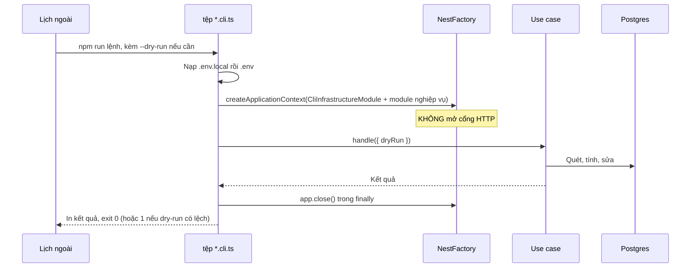
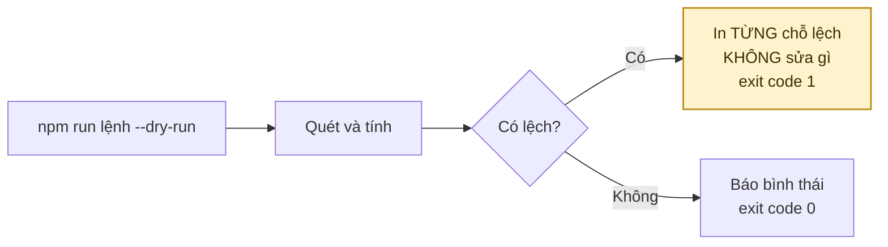
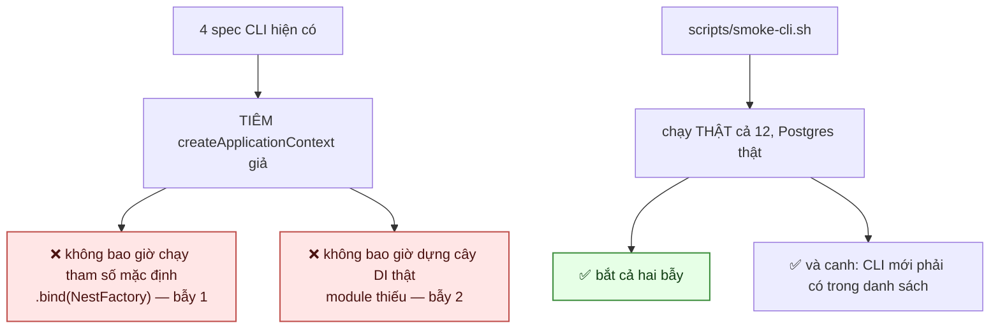
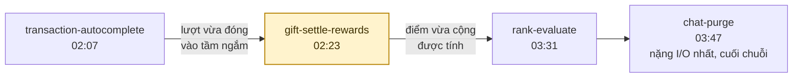
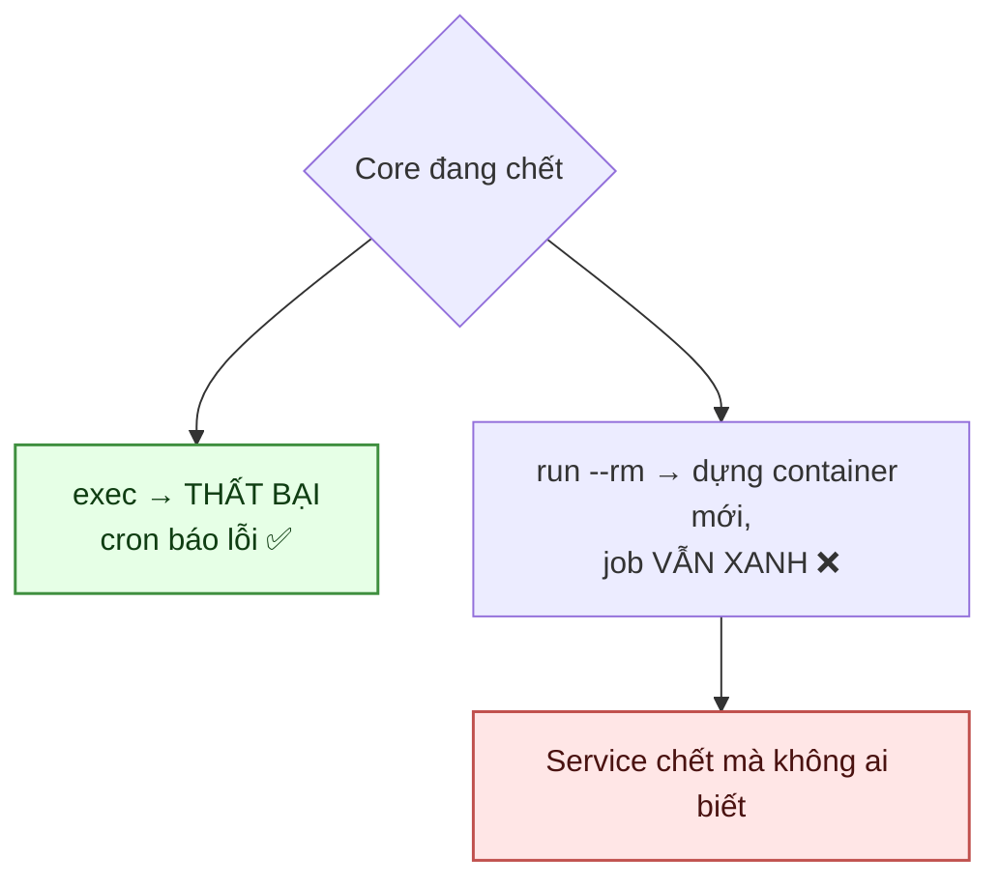

# 17 · Job nền & CLI

Trạng thái: ✅ **cả mười hai CLI đã chạy được**, và từ 29/09 CI chạy thật cả mười hai mỗi
lượt build — xem §17.6.

`media:sweep-orphans` là CLI duy nhất **mặc định không làm gì** — nó xoá object không hoàn
tác được, nên phải gõ rõ `--apply`. Lịch cron cũng chỉ chạy khô để báo con số.

## 17.1 Mười hai lệnh

```mermaid
flowchart TD
    C["Lịch bên ngoài (cron/systemd)"] --> A["chat:purge<br/>xoá tin nhắn quá hạn lưu trữ"]
    C --> B["point:reconcile<br/>vá thưởng MỐC một-lần bị treo:<br/>xác minh SĐT · onboarding · giới thiệu"]
    C --> D["post:expire<br/>đóng bài quá hạn, rao vặt thành bài tặng"]
    C --> E["rank:evaluate<br/>đánh giá chu kỳ duy trì rank"]
    C --> F["transaction:autocomplete<br/>tự hoàn tất lượt trao quá hạn ⚠️"]
    C --> G["feed:reconcile-counts<br/>đối soát số đếm feed"]
    C --> H["accuracy:reconcile<br/>tính lại Giver Accuracy theo ngưỡng"]
    C --> I["gift:settle-rewards<br/>trả nốt thưởng lượt trao còn treo:<br/>hết hạn chờ · bị trần ngày chặn · phía người nhận"]
    C --> J["notify:reminders<br/>nhắc đánh giá, nhiệm vụ duy trì, và bài sắp hết hạn"]
    C --> K["selection:auto-select<br/>chốt người nhận khi hết đồng hồ 7 ngày"]
    C --> L["notification:purge<br/>dọn thông báo quá hạn lưu trữ"]
    C --> M["media:sweep-orphans<br/>báo object mồ côi — chạy KHÔ, xem đoạn trên"]

    style C fill:#e7f3ff,stroke:#3d7ab8,stroke-width:1.5px,color:#0d2a4a
    style F fill:#fff3cd,stroke:#b8860b,stroke-width:1.5px,color:#3d2f00
```

> Core **cố ý không dựng scheduler nào trong tiến trình**. Hai bản sao service cùng chạy
> scheduler nội bộ sẽ chạy mọi job hai lần, và không có gì ngăn được điều đó từ bên trong.

**Ba loại job, và loại đáng lo nhất không phải loại dọn:**

| Loại | Job | Không chạy thì sao |
| --- | --- | --- |
| **Dọn** | `chat:purge` · `notification:purge` · `media:sweep-orphans` | Database và bucket phình to. Chậm và tốn tiền, nhưng **không ai mất gì** |
| **Trả & đối soát** | `gift:settle-rewards` · `point:reconcile` · `rank:evaluate` · `accuracy:reconcile` · `feed:reconcile-counts` | **Người dùng không nhận được điểm họ đã kiếm**, hạng không lên/tụt đúng. Đây là tiền |
| **Đẩy vòng đời** | `post:expire` · `selection:auto-select` · `transaction:autocomplete` · `notify:reminders` | Bài hết hạn vẫn hiện, **đồng hồ 7 ngày hết mà không ai được chọn**, không ai được nhắc |

Phân loại này quyết định canh alert cho cái nào: bảng chat to lên thì không ai thấy, còn người
tặng không được cộng điểm là thứ họ sẽ khiếu nại.

## 17.2 Khuôn chung

## 17.3 Hai cái bẫy đã làm cả bảy CLI chết

Cả hai **chỉ lộ ra khi chạy thật**, vì unit test tiêm sẵn hàm giả vào đúng chỗ hỏng.

```mermaid
flowchart TD
    subgraph B1["Bẫy 1 — mất this"]
        A1["truyền NestFactory.createApplicationContext trần"] --> A2["mất this"]
        A2 --> A3["❌ Cannot read properties of undefined"]
        A3 --> A4["✅ Sửa: .bind(NestFactory)"]
    end
    subgraph B2["Bẫy 2 — module thiếu"]
        C1["mỗi tệp *-cli.module.ts tự đoán 4 module"] --> C2["@Global chỉ có hiệu lực<br/>SAU KHI được import ở đâu đó"]
        C2 --> C3["❌ Nest cant resolve dependencies"]
        C3 --> C4["✅ Sửa: CliInfrastructureModule dùng chung"]
    end

    style A3 fill:#ffe6e6,stroke:#c0504d,stroke-width:1.5px,color:#4a1210
    style C3 fill:#ffe6e6,stroke:#c0504d,stroke-width:1.5px,color:#4a1210
    style A4 fill:#e6ffe6,stroke:#3f8f3f,stroke-width:1.5px,color:#0f3d12
    style C4 fill:#e6ffe6,stroke:#3f8f3f,stroke-width:1.5px,color:#0f3d12
```

`CliInfrastructureModule` bám theo `InfrastructureModule`, **trừ**:

| Bỏ | Vì sao |
| --- | --- |
| `ControllerModule` | `DocsModule` bên trong chờ một HTTP app CLI không bao giờ dựng, nạp vào là treo tiến trình |
| `AuthModule` / `HealthModule` | Guard và endpoint sức khoẻ không có người gọi trong một lần chạy CLI |
| `RealtimeModule` | Thay bằng `NoopRealtimeModule` — dựng websocket server cho tiến trình sống vài giây là giữ cổng đủ lâu để hai lượt cron đụng nhau |

> `NoopChatRealtimePublisher` **ghi log cảnh báo** nếu thật sự bị gọi, không nuốt lặng lẽ:
> nếu có ngày một CLI gửi tin nhắn, người vận hành phải thấy ngay rằng người nhận sẽ không
> nhận được tức thì.

## 17.4 Cờ --dry-run

> **Vì sao in từng chỗ lệch chứ không chỉ tổng số.** Một con số "đã sửa 12 chỗ" không cho ai
> biết đường ghi nào đang hỏng.
>
> **Vì sao dry-run có lệch thì exit 1.** Để cron hay CI coi lệch là chuyện cần biết, không
> phải một lần chạy bình thường.

## Chỗ cần soát

1. ⚠️ **`transaction:autocomplete` đếm từ `accepted_at`** nên đóng lượt trao trước khi hàng
   tới nơi, và **không kiểm tranh chấp** — xem [08-transaction](./08-transaction.md).
2. ⛔ **Chưa có job kiểm Active Member.** Nhưng đầu vào thì **đã có đủ**: cột `last_active_at`
   đang được ghi (`user.repository.ts`), và cấu hình `affiliate.active_member_window_days` = 90
   đã seed từ migration `1790200000000`. Chỉ là **không ai đọc cấu hình đó** — nó là một khoá
   ghi-mà-không-đọc, và `test:config-inventory` KHÔNG bắt được loại này: nó kiểm khoá có dòng,
   không kiểm có ai đọc.
   Còn thiếu một quyết định trước khi làm: đánh dấu bất hoạt thì **hệ quả là gì**? Cấu hình nằm
   trong nhóm `affiliate` nên có lẽ liên quan tính hoa hồng — xem [19-affiliate](./19-affiliate.md).
3. ✅ **`media:sweep-orphans` chính là job dọn object mồ côi**, đã xếp lịch hằng tuần
   (`29 5 * * 2`) và chạy **KHÔ** — không có `--apply`. Chỉ báo con số là lựa chọn đúng cho một
   job xoá thứ không hoàn tác được.
4. ✅ **Nhắc nhiệm vụ duy trì trước 30 ngày đã có** — `notify:reminders`.
5. ✅ **Lịch cron đã có** — [`deploy/cron/`](../../deploy/cron/README.md): crontab, wrapper,
   logrotate và runbook. Xem §17.5.
   ⚠️ **`notification:purge` từng bị vẽ trong biểu đồ §17.5 mà KHÔNG có trong crontab** (sửa
   29/09). Nó được thêm ở đợt 10-notification, đưa vào sơ đồ lịch ở mốc 04:09, rồi không ai xếp
   lịch thật — nên ngoài production hộp thư chưa bao giờ được dọn, và tài liệu thì nói đã xếp.
   Dạng lỗi tệ hơn quên làm: nó **trông như đã làm**.
6. ⛔ **Chưa nối alert vào kênh người thật đọc.** `run-cli.sh` làm đúng phần của nó — giữ exit
   code, ghi stderr, nên chạy thành công thì **không** gửi gì và chỉ lượt đỏ mới báo. Nhưng
   crontab không có `MAILTO`, nên thư vào hộp local của user `deploy`.
   Đặt `MAILTO` một mình **không đủ**: cron luôn đi qua MTA cục bộ, mà một VPS chỉ chạy
   docker-compose thường chưa cài MTA — lúc đó cron ghi "no MTA, discarding output" rồi bỏ. Gửi
   tới Gmail còn cần SPF/DKIM, thiếu thì bị chặn im lặng: **có alert mà không biết mình không
   nhận được alert**, kiểu hỏng tệ nhất cho một hệ báo động. Và credential SMTP sẽ tồn tại ở hai
   nơi (app trong `system_configs`, hệ thống trong cấu hình MTA).
   Hướng nhẹ hơn: một lượt `curl` trong `run-cli.sh` khi đỏ, URL trong env var — không MTA,
   không SPF/DKIM, không nhân bản credential. Chờ Bên A chốt kênh.

## 17.6 CI chạy thật cả mười hai CLI

> **Nó bắt được lỗi ngay lần chạy đầu.** `post:expire` chết khi khởi động vì `PostModule` cần
> `CloseOpenRequestsService` mà không khai `GiftRequestModule` — trong app HTTP thì chạy được chỉ
> vì một chỗ khác đã import và module là `@Global()`. Đúng bẫy 2, và nó nằm trong crontab ở
> `11 0 * * *`: **bài quá hạn không được đóng suốt từ lúc `CloseOpenRequestsService` ra đời.**
> Sửa ở gốc — `PostModule` tự khai phụ thuộc của nó, chứ không thêm module vào từng
> `*-cli.module.ts`.
>
> **`exit 1` chỉ được tha cho CLI KHAI nó là tín hiệu.** Bản đầu của script tha exit 1 cho mọi
> CLI và lập tức che đúng lỗi trên: `main()` bắt lỗi rồi đặt `exitCode = 1`, nên nó hiện ra y như
> một lượt "có việc cần biết". Một lưới chặn mà tha thứ quá rộng thì không phải lưới.
>
> **Chạy TẤT CẢ, không chọn mẫu.** Bẫy 2 là lỗi theo từng module, nên `notification-cli.module`
> đủ không nói gì về `post-cli.module`. Script còn canh luôn rằng mọi CLI có file đều nằm trong
> danh sách — thêm CLI mới mà quên là script vẫn xanh, đúng kiểu lỗi im lặng nó được viết ra để
> chặn.

## 17.5 Lịch chạy trên VPS

```mermaid
gantt
    title Chuỗi job một ngày (giờ Việt Nam)
    dateFormat HH:mm
    axisFormat %H:%M
    section Đầu ngày
    post-expire            :00:11, 5m
    section Chuỗi đêm
    transaction-autocomplete :02:07, 8m
    gift-settle-rewards      :02:23, 10m
    rank-evaluate            :03:31, 8m
    chat-purge               :03:47, 15m
    notification-purge       :04:09, 10m
    section Hằng tuần
    feed-reconcile-counts  :04:41, 10m
    accuracy-reconcile     :04:13, 10m
    media-sweep-orphans    :05:29, 10m
    section Buổi sáng
    notify-reminders       :08:17, 10m
    section Mỗi giờ
    point-reconcile        :01:19, 3m
    selection-auto-select  :01:37, 4m
```

**Thứ tự trong chuỗi đêm là có lý do:**

> **`gift-settle-rewards` là job cấp bách nhất.** Không chạy là điểm của người tặng treo vô
> hạn mỗi khi người nhận không đánh giá — mà đó là phần lớn trường hợp. Nếu chỉ canh alert cho
> một job, canh cái này.
>
> **Phút lẻ, không phải `:00`.** Mọi job đặt ở `:00` sẽ cùng đánh vào database một lúc, và hai
> job không bao giờ được trùng phút.
>
> **`CRON_TZ=Asia/Ho_Chi_Minh`.** Hiểu theo UTC thì lời nhắc tới máy người dùng lúc 3 giờ
> chiều, và `post-expire` cắt ngày lệch 7 tiếng.

### Vì sao `docker compose exec` chứ không `run --rm`

`exec` cũng dùng lại container đang chạy nên không phải nạp lại toàn bộ cây DI mỗi lượt.

