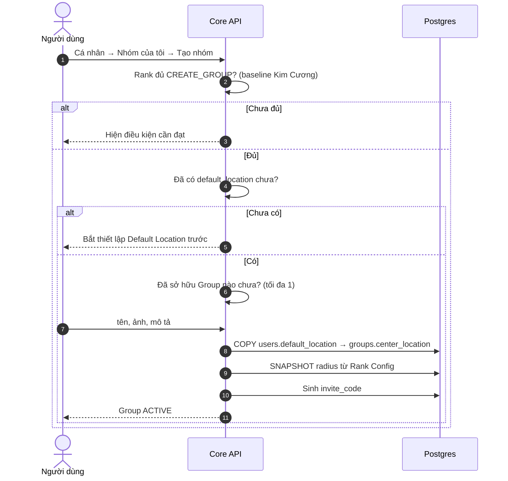
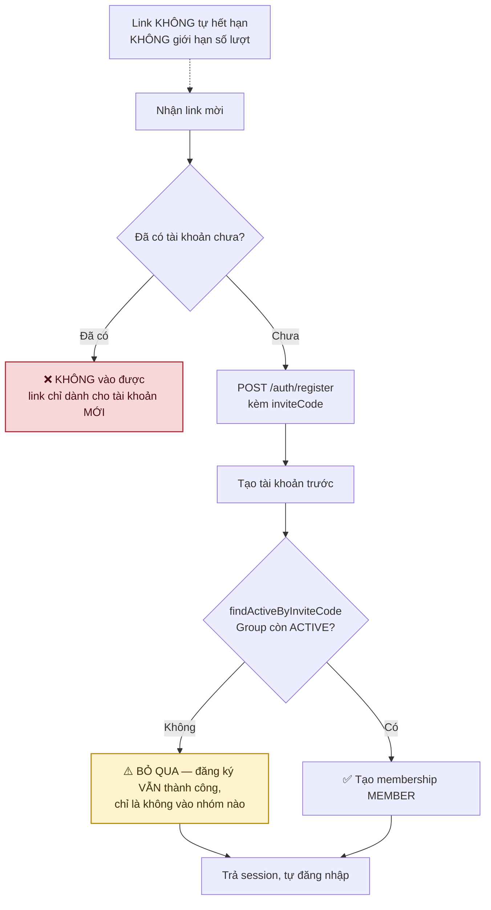
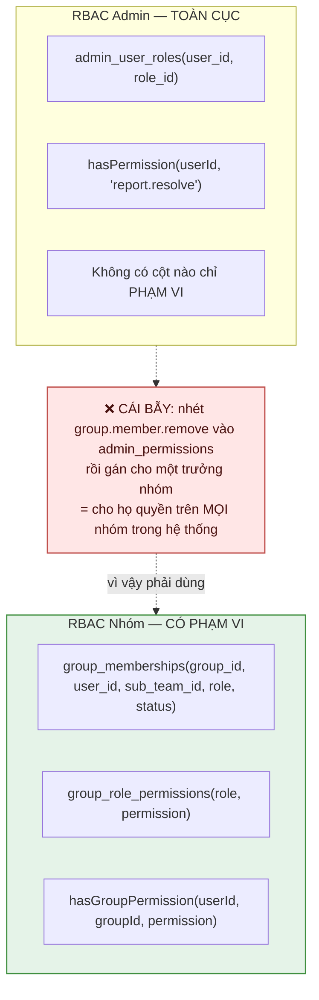
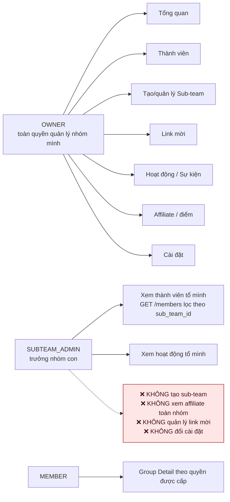
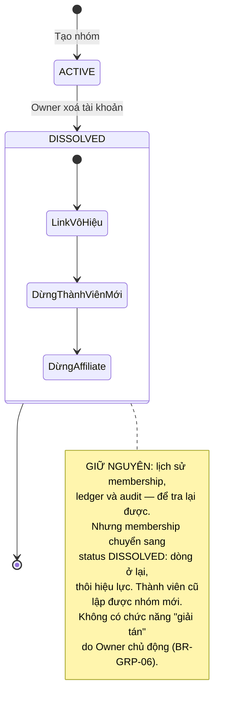
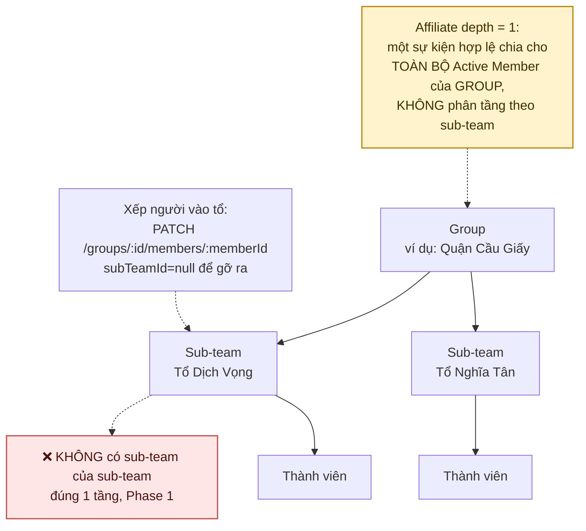

# 18 · Group & Sub-team

Trạng thái: ✅ **xong Phase 1** (26/09, soát lại 30/09) — bảng, RBAC có phạm vi, tạo nhóm, xem
nhóm của tôi, vào nhóm qua link mời, danh sách thành viên, sub-team và phép xếp người vào tổ,
giải tán khi Owner xoá tài khoản. Script kiểm trên Postgres thật: `npm run test:group`
(54 phép kiểm).

Lượt soát 30/09 sửa bốn thứ, xem §Chỗ cần soát: vai `SUBTEAM_ADMIN` trước đó **hoàn toàn vô
tác dụng**, đổi vai **âm thầm gỡ người khỏi tổ**, thành viên của nhóm đã giải tán bị **đóng
băng vĩnh viễn**, và ba endpoint nhóm **chưa hề được validate** vì thiếu decorator ở khoá bọc
body.

Sáu endpoint: `POST /groups`, `GET /groups/me`, `GET /groups/:groupId/members`,
`GET|POST /groups/:groupId/sub-teams`, `PATCH /groups/:groupId/members/:memberId` — chi tiết
ở [API.md §11](../API.md#11-nhóm--groups).

⛔ **Còn thiếu (Sprint 3, cần Bên A chốt):** affiliate event engine (F56) và điều kiện địa lý
bắt buộc (F57) — xem [`19-affiliate.md`](./19-affiliate.md).

## 18.1 Tạo Group — ✅

> **Vì sao tâm và bán kính chụp lại tại thời điểm tạo và Owner không đổi được.** Cho đổi thì
> người ta dời vùng theo nơi đang có nhiều sự kiện để gom điểm. Snapshot cũng không đổi theo
> khi Owner đổi Default Location hoặc tụt rank (BR-GRP-03).

## 18.2 Vào nhóm — chỉ tài khoản mới ✅

**Chốt 2026-09-24: KHÔNG rời, KHÔNG chuyển nhóm.** Muốn sang nhóm khác thì tạo tài khoản mới.

> **Vì sao mã hỏng không làm hỏng việc đăng ký.** Tài khoản đã tạo xong trước khi đọc mã. Ném
> lỗi ở đây là bắt người ta đăng ký lại — phạt người dùng cho lỗi của người gửi link. Mã cũng
> đi qua `trim()` + viết hoa: dán link kèm khoảng trắng là chuyện thường.

> **Vì sao đây là chủ ý chứ không phải sót.** Membership chỉ sinh ra từ link mời dành cho tài
> khoản mới, và chính ràng buộc đó là hàng rào chặn việc một người nhảy vòng quanh các nhóm
> để gom affiliate. Cho rời tự do mà vẫn giữ hàng rào thì rời xong là kẹt ở ngoài vĩnh viễn —
> tệ hơn là không cho rời.

## 18.3 RBAC nhóm — TÁCH khỏi RBAC Admin ✅

## 18.4 Ba vai trong nhóm

Bộ quyền của `SUBTEAM_ADMIN` nằm ở bảng `group_role_permissions`, **không** hard-code trong
code.

> ⚠️ **Nhưng "cấu hình Admin hệ thống" thì chưa đúng** (sửa 30/09 — câu cũ nói bảng này *"có
> audit và đánh phiên bản như mọi cấu hình động khác"*, sai cả ba vế). Không endpoint nào chạm
> tới bảng: đổi quyền hiện phải chạy SQL tay. Bảng **không có cột `version`** nên không đánh
> phiên bản được, và cột `updated_by` có sẵn nhưng **chưa bao giờ được ghi**.
>
> Khác biệt này quan trọng vì nó quyết định ai đổi được bộ quyền: hôm nay là người có quyền
> truy cập database, không phải người có quyền Admin. Muốn đúng như câu cũ thì cần một đường
> Admin thật, và đó là việc chưa làm.

> ⚠️ **SRS không có khái niệm trưởng nhóm.** BR-GRP-05 chỉ chia Owner và Member, và §3255
> nói sub-team *"chỉ để tổ chức"*. Thêm vai này là **mở rộng SRS**, không phải làm rõ.

## 18.5 Owner xoá tài khoản → Group giải tán (CHỐT-02) — ✅

## 18.6 Sub-team — ✅

> **Tổ phải thuộc CHÍNH nhóm đó.** Câu `UPDATE` trong `assignMember` mang thêm một vế
> `EXISTS (… AND team.group_id = $1)`. Thiếu nó thì Owner nhóm A xếp được người của mình vào
> tổ của nhóm B — chỉ cần đoán đúng một id. `test:group` canh đúng ca này.

> ⚠️ **BỎ TRỐNG `subTeamId` là GIỮ tổ, `null` tường minh mới là gỡ ra** (sửa 30/09). Trước đó
> controller đổi "không gửi" thành `null` và câu `UPDATE` ghi `sub_team_id` vô điều kiện, nên
> gọi endpoint chỉ để **đổi vai** sẽ âm thầm gỡ người đó khỏi tổ — nghịch lý nhất là phong
> `SUBTEAM_ADMIN` cho ai thì gỡ họ khỏi đúng cái tổ họ sắp quản.
>
> Một `PATCH` không gửi trường nào nay trả 422. Trước đó nó trả 200 và gỡ người khỏi tổ.

## Chỗ cần soát

1. ⚠️ **Trưởng nhóm là mở rộng ngoài SRS** — cần Bên A biết.
2. **Bộ quyền khởi tạo cho `SUBTEAM_ADMIN`** mới là đề xuất, chưa ai duyệt. Và xem §18.4: đổi
   bộ quyền đó hiện phải chạy SQL tay, chưa có đường Admin.
3. ✅ **`SUBTEAM_ADMIN` nay xem được thành viên tổ mình** (30/09). Thực trạng trước đó nặng hơn
   câu cũ ở đây: **cả hai** quyền của vai này đều không dòng code nào đọc, nên phong vai đó cho
   ai cũng **không đổi một thứ gì**. Bảy trong mười quyền nhóm ở tình trạng đó, kể cả
   `group.overview.view` — quyền duy nhất của `MEMBER`.

   `GET /groups/:id/members` nay nhận `group.member.view` (trả cả nhóm) **hoặc**
   `group.subteam.member.view` (trả chỉ tổ của chính người gọi). Thứ tự xét quan trọng: quyền
   toàn nhóm xét trước, vì Owner cũng có thể được xếp vào một tổ. Trưởng tổ **chưa** được xếp
   vào tổ nào thì bị từ chối — trả cả nhóm ở đó là leo thang quyền bằng một trường bỏ trống.

   Năm quyền còn lại canh những endpoint **chưa tồn tại**; `test:config-inventory` nay khai
   từng cái kèm lý do, và một quyền seed mà không khai vào đâu là phép kiểm đỏ.

   ⛔ **Còn cần Bên A:** trưởng tổ nên thấy đến đâu *ngoài* thành viên tổ mình. Hiện họ thấy
   đúng tổ mình, không thấy tổ khác và không thấy affiliate.
4. **Không có đường xoá tổ.** `sub_teams.deleted_at` đã có cột, chưa có endpoint. Xoá tổ còn
   người trong đó thì xử lý ra sao cũng chưa ai nói.
5. ✅ **Bán kính nay đọc ba khoá `group.*_radius_meters`** (30/09) — `capability.limit` không
   còn tham gia, xem [19-affiliate](./19-affiliate.md) mục 7. Vẫn còn một câu cho Bên A: bán
   kính **khác nhau theo rank** hay chung một con số? Hiện là một con số chung.

   ⚠️ Cột có `CHK_groups_radius CHECK (radius_km BETWEEN 1 AND 50)`, nên cấu hình **không nới
   rộng quá 50 km được**. Đường Admin từ chối thẳng giá trị ngoài khoảng, và
   `resolveGroupRadiusKm` còn kẹp một lần nữa — nới thật thì phải sửa CHECK trong một migration.
6. ✅ **Người bị `BANNED`: không cần làm gì trên membership** (trả lời 30/09). Ban một người là
   `users.status = BANNED`, và đường đó đã thu hồi **toàn bộ** phiên của họ
   (`revokeEverything`), trong khi `login` và `refresh` đều chặn `BANNED`. Họ không gọi được
   endpoint nhóm nào cả.

   Nên `group_membership_statuses_enum` **cố ý không có** `BANNED`: chép trạng thái đó sang
   membership là tạo nguồn sự thật thứ hai cho cùng một việc, và hai nguồn thì sẽ có ngày nói
   khác nhau. Điều kiện Active Member của affiliate cũng đọc `users.status`, cùng một nguồn.
7. ✅ **Giải tán không còn khoá thành viên cũ ngoài hệ thống nhóm** (30/09). `hasMembership` chỉ
   hỏi "có dòng membership nào không", nên sau khi Owner xoá tài khoản, thành viên cũ vẫn bị coi
   là đã có nhóm: không lập được nhóm mới, mà cũng không vào nhóm nào khác được — đường duy nhất
   để vào là link mời cho tài khoản **mới**. Nhóm đã chết, họ mất luôn quyền thuộc một nhóm.

   Ý định ban đầu không phải vậy: `UQ_groups_one_active_per_owner` là index **một phần** kèm
   đúng câu *"nhóm đã giải tán không nên chặn người đó lập nhóm mới"*. Database được thiết kế để
   **cho**, tầng ứng dụng chặn.

   Sửa bằng cột `group_memberships.status` — thứ mà sơ đồ §18.3 đã vẽ là có từ đầu. Thêm một vế
   `WHERE` không đủ: `UQ_group_memberships_user` là UNIQUE trần trên `user_id` nên dòng mới sẽ
   vi phạm nó, mà index một phần không tham chiếu được bảng khác. Nay ràng buộc là "mỗi người
   một membership **đang hiệu lực**", dòng cũ ở lại làm lịch sử đúng như CHỐT-02 yêu cầu.
8. ✅ **Ba endpoint nhóm trước đó chưa hề được validate** (30/09). `CreateGroupBodyDto.group`,
   `CreateSubTeamBodyDto.subTeam` và `AssignGroupMemberBodyDto.membership` chỉ có
   `@ApiProperty()` — thiếu `@IsDefined()` + `@ValidateNested()` + `@Type()`. Hệ quả: body thiếu
   khoá bọc thành 500, **và** mọi decorator bên trong bị bỏ qua vì class-transformer không dựng
   class con.

   `body-wrapper-guard.spec` đã có từ trước nhưng không thấy — nó chỉ soát wrapper **đã có**
   `@ValidateNested()`, nên wrapper không decorator nào thì vô hình. Nay nó soát mọi thuộc tính
   trong một class `*BodyDto` mà kiểu là một DTO khác.
