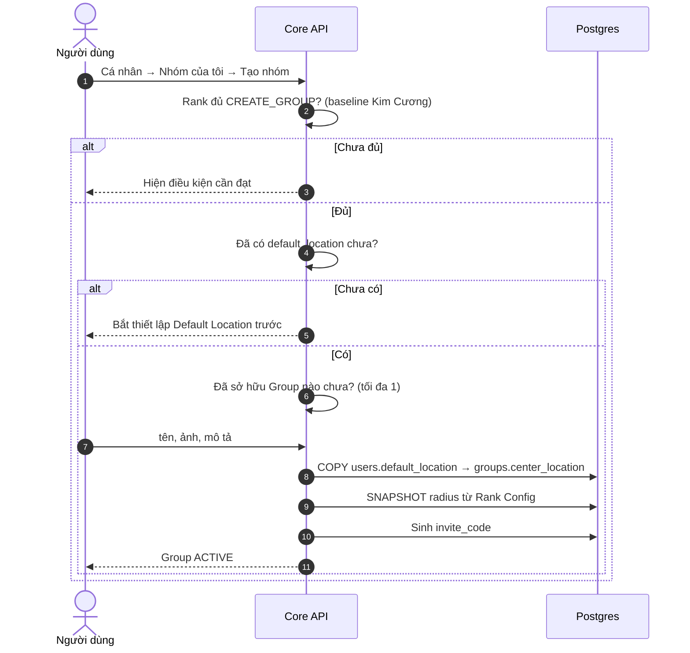
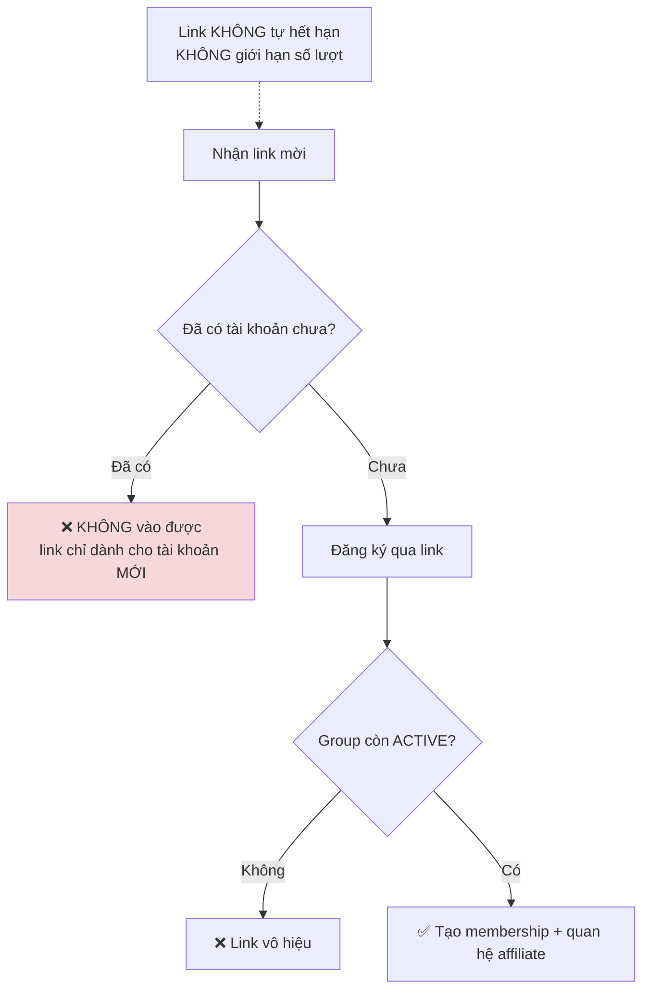
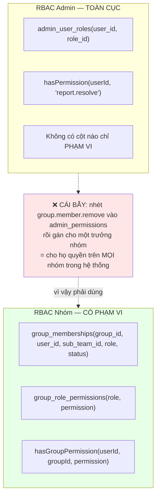
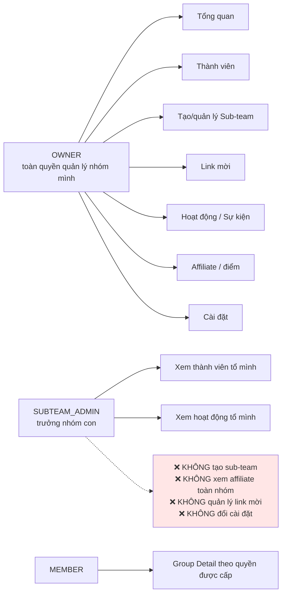
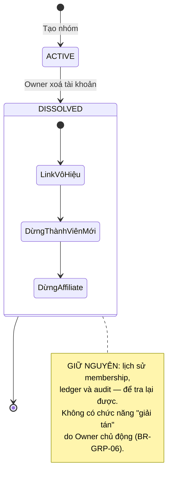
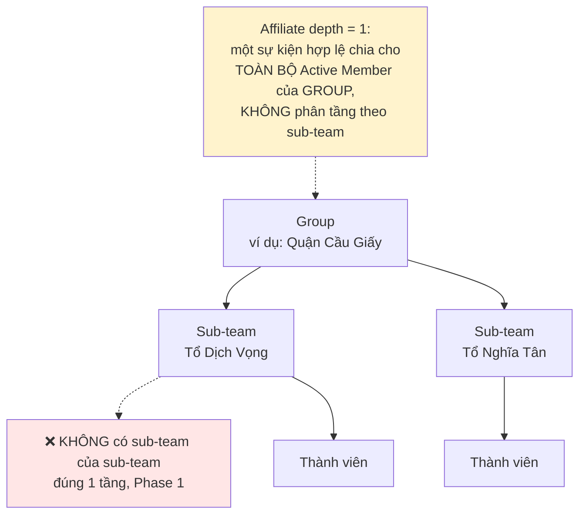

# 18 · Group & Sub-team

Trạng thái: ⛔ **chưa có dòng code nào** — không entity, không bảng, không endpoint. Toàn bộ
sơ đồ này là thiết kế theo SRS §3.7A cộng các quyết định chốt ngày 2026-09-24.

## 18.1 Tạo Group

> **Vì sao tâm và bán kính chụp lại tại thời điểm tạo và Owner không đổi được.** Cho đổi thì
> người ta dời vùng theo nơi đang có nhiều sự kiện để gom điểm. Snapshot cũng không đổi theo
> khi Owner đổi Default Location hoặc tụt rank (BR-GRP-03).

## 18.2 Vào nhóm — chỉ tài khoản mới

**Chốt 2026-09-24: KHÔNG rời, KHÔNG chuyển nhóm.** Muốn sang nhóm khác thì tạo tài khoản mới.

> **Vì sao đây là chủ ý chứ không phải sót.** Membership chỉ sinh ra từ link mời dành cho tài
> khoản mới, và chính ràng buộc đó là hàng rào chặn việc một người nhảy vòng quanh các nhóm
> để gom affiliate. Cho rời tự do mà vẫn giữ hàng rào thì rời xong là kẹt ở ngoài vĩnh viễn —
> tệ hơn là không cho rời.

## 18.3 RBAC nhóm — TÁCH khỏi RBAC Admin

## 18.4 Ba vai trong nhóm

Bộ quyền của `SUBTEAM_ADMIN` là **cấu hình Admin hệ thống**, không hard-code — bảng
`group_role_permissions`, có audit và đánh phiên bản như mọi cấu hình động khác.

> ⚠️ **SRS không có khái niệm trưởng nhóm.** BR-GRP-05 chỉ chia Owner và Member, và §3255
> nói sub-team *"chỉ để tổ chức"*. Thêm vai này là **mở rộng SRS**, không phải làm rõ.

## 18.5 Owner xoá tài khoản → Group giải tán (CHỐT-02)

## 18.6 Sub-team

## Chỗ cần soát

1. ⛔ **Toàn bộ phân hệ chưa có code.** Đây là khối lớn nhất còn lại.
2. ⚠️ **Trưởng nhóm là mở rộng ngoài SRS** — cần Bên A biết.
3. **Bộ quyền khởi tạo cho `SUBTEAM_ADMIN`** mới là đề xuất, chưa ai duyệt.
4. Bán kính lấy theo **Rank Config lúc tạo** — mặc định 10km, Admin chỉnh 1–50km. Cần xác
   nhận bán kính khác nhau theo rank hay chung một con số.
5. Người bị `BANNED` thì membership của họ xử lý thế nào? Chưa ai nói.
