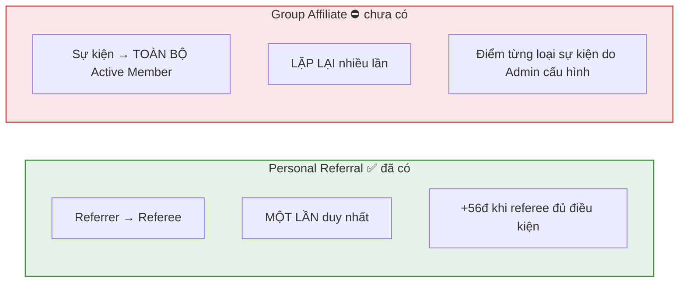
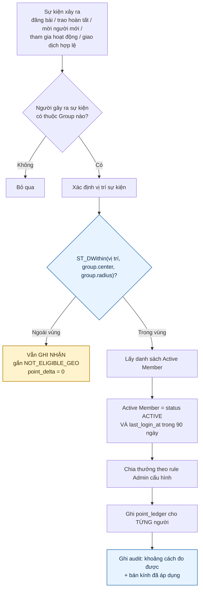
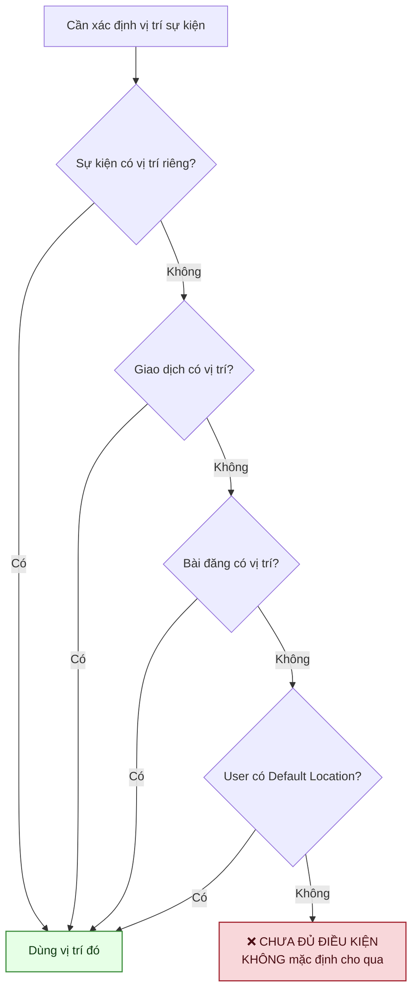
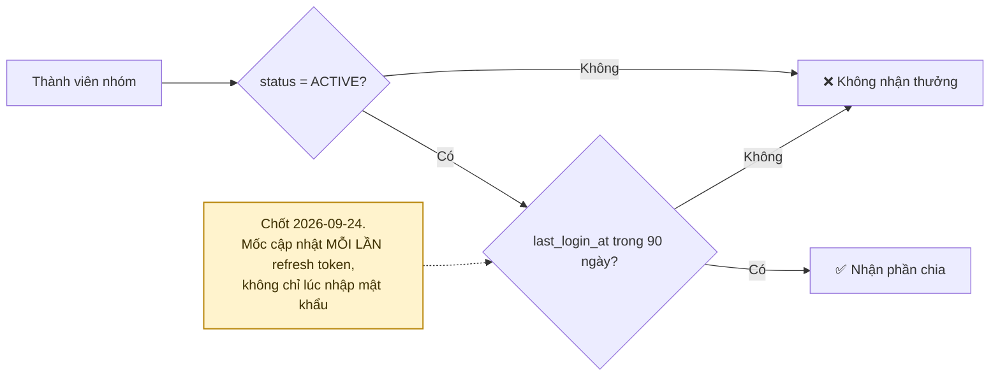
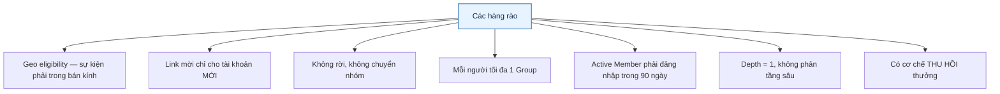

# 19 · Group Affiliate & điều kiện địa lý

Trạng thái: ⛔ **chưa có dòng code nào.** Thiết kế theo SRS §3.7A (BR-AFF) và CHỐT-06.

## 19.1 Affiliate khác Personal Referral thế nào

## 19.2 Luồng xử lý một sự kiện affiliate

> **Vì sao ngoài vùng vẫn ghi nhận chứ không bỏ đi.** Bỏ đi thì khi có tranh chấp "vì sao sự
> kiện của tôi không được tính", không có gì để tra. Ghi kèm lý do `NOT_ELIGIBLE_GEO` trả lời
> được câu đó.
>
> **Vì sao audit phải lưu cả khoảng cách lẫn bán kính.** Bán kính là snapshot lúc tạo Group;
> nếu về sau Admin sửa cấu hình, không có hai con số này thì không dựng lại được phán quyết
> cũ (F58).

## 19.3 Thứ tự lấy vị trí (F58)

> **Vì sao không có vị trí thì từ chối chứ không cho qua.** Cho qua là mở đúng cái cửa mà
> điều kiện địa lý sinh ra để đóng: lập nhóm ảo rải khắp nơi, gửi sự kiện không kèm vị trí,
> và thu điểm ở mọi nơi.

## 19.4 Định nghĩa Active Member

> **Vì sao mốc phải tính cả nhánh refresh token.** App mobile giữ refresh token nên người mở
> app hằng ngày vẫn có thể không "đăng nhập" lần nào suốt 90 ngày. Chỉ ghi ở nhánh login sẽ
> đánh nhầm người đang dùng đều thành không hoạt động, và họ mất phần chia.

## 19.5 Chống gian lận

## Chỗ cần soát

1. ⛔ **Toàn bộ phân hệ chưa có code**, và nó phụ thuộc [18-group](./18-group.md) cũng chưa có.
2. **Danh sách loại sự kiện affiliate chưa chốt cụ thể.** BR-AFF-02 liệt kê "đăng bài,
   tặng/giao dịch hoàn tất, mời user mới hợp lệ, tham gia Event, giao dịch hợp lệ trong vùng"
   — cần biến thành danh sách mã rule rõ ràng.
3. **Điểm cho từng loại sự kiện chưa có con số nào.**
4. **Cách chia thưởng chưa rõ**: mỗi Active Member nhận đủ N điểm, hay N điểm chia đều cho số
   người? Nhóm 500 người thì hai cách chênh nhau 500 lần.
5. **Cơ chế thu hồi** (BR-AFF) chưa có thiết kế — thu hồi khi nào, ai bấm, ghi sổ thế nào.
6. **Cap ngày cho affiliate chưa có.** Không có cap thì một nhóm lớn sinh điểm không giới hạn.
