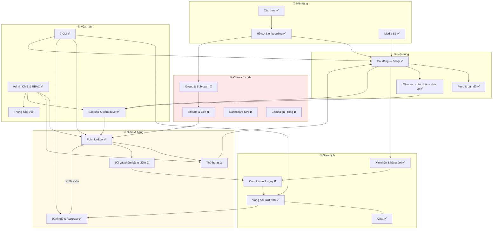
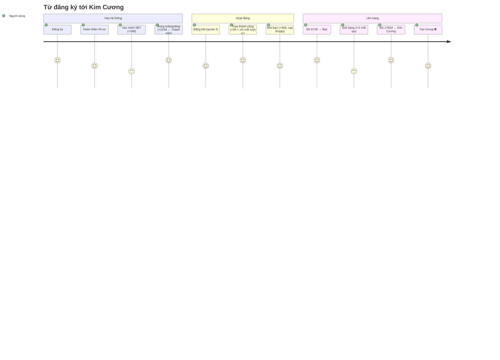
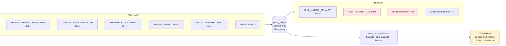
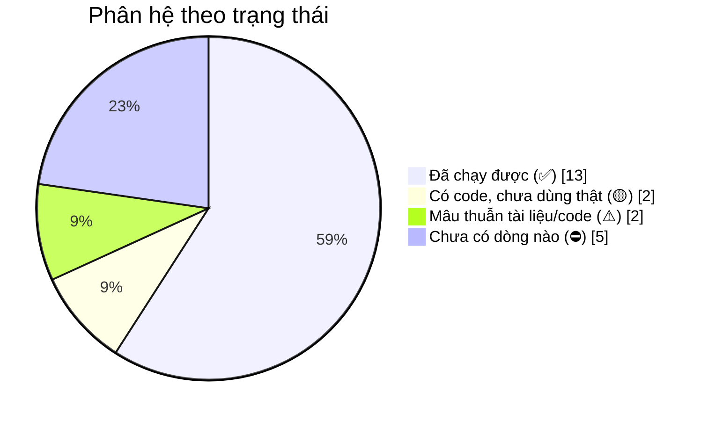

# 20 · Bản đồ toàn hệ thống

Một sơ đồ gộp mọi phân hệ và quan hệ giữa chúng. Dùng để nhìn tổng thể; chi tiết nằm ở các
sơ đồ 01–19.

## 20.1 Toàn cảnh

## 20.2 Đường đi của một người dùng mới

## 20.3 Đường điểm — nơi mọi thứ gặp nhau

## 20.4 Mức độ hoàn thiện theo phân hệ

| Trạng thái | Phân hệ |
| --- | --- |
| ✅ | Xác thực · Hồ sơ · Media · Bài đăng · Feed · Tương tác · Xin nhận · Lượt trao · Chat · Đánh giá · Báo xấu · Admin CMS · CLI |
| 🟡 | Thông báo (chưa có FCM) · Xác minh SĐT (chưa có adapter SMS) |
| ⚠️ | Thứ hạng (code khác tài liệu) · Tự hoàn tất (sai mốc đếm, không kiểm tranh chấp) |
| ⛔ | Countdown 7 ngày · Đổi vật phẩm bằng điểm · Group · Affiliate · Dashboard KPI · Campaign/Blog |
