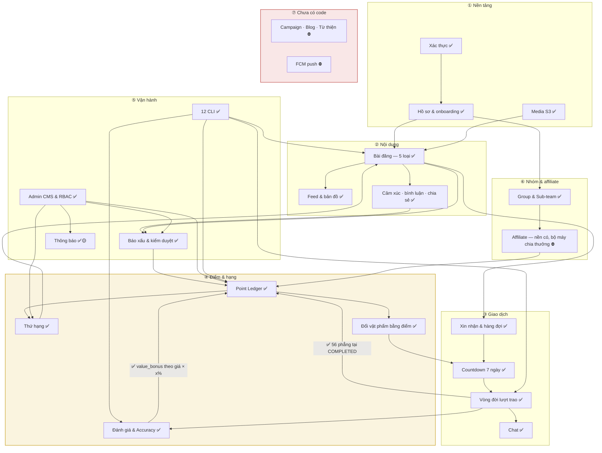
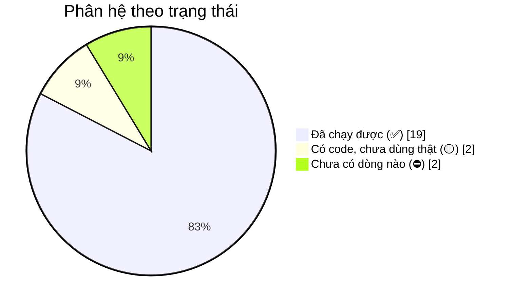

# 20 · Bản đồ toàn hệ thống

Một sơ đồ gộp mọi phân hệ và quan hệ giữa chúng. Dùng để nhìn tổng thể; chi tiết nằm ở các
sơ đồ 01–19.

> **Cập nhật 30/09.** Bản trước ghi Group và Dashboard KPI là ⛔ *chưa có code* trong khi Group
> đã có 12 endpoint và Dashboard đã chạy. Một bảng trạng thái nói sai thì tệ hơn không có bảng
> nào: nó là thứ Bên A và người mới đọc đầu tiên, và ở đây nó **nói thiếu** những gì đã làm.

## 20.1 Toàn cảnh

## 20.2 Đường đi của một người dùng mới

## 20.3 Đường điểm — nơi mọi thứ gặp nhau

```mermaid
flowchart LR
    subgraph Vào["Điểm VÀO"]
        I1["PHONE_VERIFIED_FIRST_TIME +28 ✅"]
        I2["ONBOARDING_COMPLETED +224 ✅"]
        I3["REFERRAL_QUALIFIED +56 ✅"]
        I4["REPORT_UPHELD +5 ✅"]
        I5["GIFT_COMPLETED_GIVER +56 phẳng ✅<br/>+ GIFT_VALUE_BONUS_GIVER theo giá ✅"]
        I5b["GIFT_COMPLETED_RECEIVER ✅"]
        I6["POST_REACTED · POST_COMMENTED ✅"]
        I7["Affiliate event ⛔"]
    end

    L[(point_ledger<br/>append-only<br/>idempotent)]

    subgraph Ra["Điểm RA"]
        O1["SHIP_UNPAID_PENALTY −50 ✅"]
        O2["ITEM_REDEMPTION âm ✅"]
        O3["Trượt nhiệm vụ −224/336/448 ✅"]
        O4["Đảo bút toán (Admin) ✅"]
        O5["CONTENT_VIOLATION_PENALTY ✅"]
    end

    Vào --> L --> Ra
    L --> B["user_point_balances<br/>balance · raw_balance · lifetime"]
    B --> R["Xét lại RANK theo balance ✅<br/>+ báo sắp tụt / đã tụt"]

```

## 20.4 Mức độ hoàn thiện theo phân hệ

| Trạng thái | Phân hệ |
| --- | --- |
| ✅ | Xác thực · Hồ sơ · Media · Bài đăng · Feed · Tương tác · Xin nhận · Lượt trao · Chat · Đánh giá · Báo xấu · Admin CMS · CLI · Thứ hạng · Countdown chọn người nhận · Đổi vật phẩm bằng điểm · **Group & Sub-team** · **Dashboard KPI** · **Kiểm duyệt chat** |
| 🟡 | Thông báo (chưa có FCM) · Xác minh SĐT (chưa có adapter SMS) |
| ⛔ | Bộ máy chia thưởng affiliate · Campaign/Blog/Từ thiện |

> **Hàng ⚠️ đã bỏ.** Bản trước ghi *"Tự hoàn tất (sai mốc đếm, không kiểm tranh chấp)"*, trong
> khi [21 §21.4](./21-open-issues.md) mục 2 và 3 nói cả hai đã sửa từ 25/09 — hai tài liệu nói
> ngược nhau về cùng một thứ, và một trong hai chắc chắn sai. Đếm mốc vốn đã dùng
> `COALESCE(handed_over_at, accepted_at)`, và lượt có báo xấu đang mở bị giữ lại kèm exit code
> khác 0.
>
> **Affiliate không còn là ⛔ trắng.** Nền đã có: `groups.center_location` + `radius_km`,
> `last_active_at` ghi ở mọi lần cấp phiên, và `GET /groups/:id/affiliate` đếm được ai đủ điều
> kiện. Thiếu đúng phần **chia thưởng** — mà phần đó chờ Bên A chốt cách chia, xem
> [19](./19-affiliate.md) mục 4.
