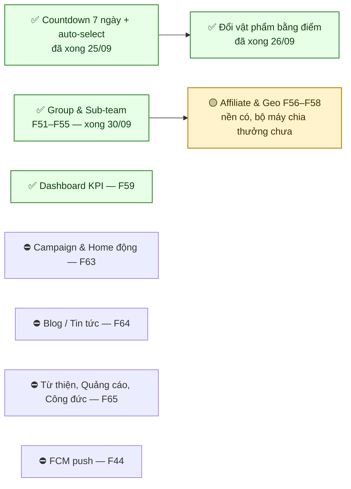

# 21 · Những chỗ cần chốt

Gom toàn bộ điểm còn treo rải rác trong 29 sơ đồ còn lại về một chỗ, xếp theo mức chặn.

> **File này là LỊCH SỬ, xếp theo loại vấn đề.** Mỗi mục đã đóng được đánh ✅ chứ
> không xoá, vì xoá đi thì lần sau không ai biết nó từng là vấn đề. Nhưng vì vậy nó càng
> dài thì càng khó trả lời câu "hôm nay còn vướng gì".
>
> **Danh sách ĐANG còn treo nằm ở [31 · Sổ treo theo phân hệ](./31-open-items.md)** — xếp theo
> phân hệ, chỉ chứa thứ chưa đóng, mỗi mục ghi rõ ai quyết và để treo thì mất gì.
>
> Hai file, một nguồn: khi một mục đóng lại, nó được đánh ✅ ở đây rồi **xoá khỏi 31**.

> **Soát lại 30/09.** Bảy mục ghi là treo thì đã xong, và **hai mục tự nó sai** — xem đánh dấu
> ✅ và ❌ dưới đây. Lượt thứ hai cùng ngày đóng nốt bốn chỗ còn lại: thông báo cho người giới
> thiệu, trần gọi chung, tự kiểm CLI ở cổng triển khai, và healthcheck ngoài cho service chết. Một danh sách "việc còn treo" mà không ai dọn sẽ dài ra rồi bị bỏ qua cả
> khối, nên mỗi mục đã xong phải được đánh dấu chứ không xoá: xoá đi thì lần sau không ai biết
> nó từng là vấn đề.

## 21.1 Quyết định còn treo

**✅ Không còn câu hỏi nào chặn cứng.** Toàn bộ đã chốt ngày 2026-09-25 và đã seed vào cấu
hình động:

| Con số | Giá trị | Ở đâu |
| --- | --- | --- |
| Điểm cho lượt trao hoàn tất (X) | **56**, cap 5/ngày | `point_rules.GIFT_COMPLETED` |
| Tỷ lệ quy đổi F74 | **2.000 VNĐ/điểm** | `system_configs.point.redemption` |
| Chờ rồi áp mức mặc định | **7 ngày, 80%** | `system_configs.review.grace` |
| Phạt trượt nhiệm vụ | **Bạc 224 · Vàng 336 · KC 448** | `rank_tiers.maintenance_penalty_points` |

> Việc còn lại **không phải quyết định nữa mà là hiện thực**: các con số đã nằm trong cấu
> hình nhưng chưa có đường nào gọi tới chúng. Xem mục 21.4.

## 21.2 Mâu thuẫn tài liệu ↔ code

| # | Nội dung | Ở đâu | Sơ đồ |
| --- | --- | --- | --- |
| 1 | ✅ **Đã đúng từ trước.** Nhánh xét hạng vốn đọc `balance`; `lifetime_points` chỉ là ảnh chụp trong audit, nay đổi tên thành `points_at_transition` | — | [12](./12-rank.md) |
| 2 | ✅ **Đã sửa 25/09.** Trượt nhiệm vụ chỉ đánh FAILED, rồi trừ điểm và xét lại theo balance | — | [12](./12-rank.md) |
| 3 | ✅ **Đã đúng từ trước, nay có script chứng minh** — `npm run test:rank-balance` | — | [12](./12-rank.md) |
| 4 | ✅ **Đã có đường gửi 25/09** — `RankChangeNotifier`, một lời nhắc mỗi ngày cho mỗi bậc | — | [12](./12-rank.md) |
| 5 | **Hai lỗi SQL có sẵn chưa từng chạy** trong `evaluateDueMaintenanceCycles` (42P18, 42P08) — đã sửa 25/09 | — | [12](./12-rank.md) |

## 21.3 Chức năng đã chốt nhưng chưa gắn

| # | Nội dung | Chốt ngày | Trạng thái | Sơ đồ |
| --- | --- | --- | --- | --- |
| 1 | Cổng hồ sơ F07 chặn xin nhận + chat | 2026-09-24 | ✅ đã gắn 25/09 | [02](./02-profile.md) |
| 2 | Mốc hoạt động, cập nhật mỗi lần cấp phiên | 2026-09-24 | ✅ `users.last_active_at` 25/09 | [01](./01-auth.md) |
| 3 | Rule `GIFT_COMPLETED` = 56 điểm | 2026-09-25 | ✅ đã nối 25/09 — hai đường, một khoá | [11](./11-point.md) |
| 4 | Chặn xoá tài khoản khi còn lượt trao dở dang | từ lâu | ✅ **vốn đã có** — tôi ghi sai trạng thái | [01](./01-auth.md) |
| 6 | Trừ điểm khi trượt nhiệm vụ duy trì | 2026-09-24 | ✅ đã nối 25/09 | [12](./12-rank.md) |
| 5 | Cổng hồ sơ cho tạo Group | 2026-09-24 | ✅ đã gắn — `assertOnboarded` ở `CreateGroupUseCase` | [18](./18-group.md) |

## 21.4 Lỗ hổng nghiệp vụ đã phát hiện

| # | Vấn đề | Hậu quả | Sơ đồ |
| --- | --- | --- | --- |
| 1 | ✅ **Đã sửa 25/09.** Hoàn tất lượt trao nay sinh điểm qua đánh giá, hoặc qua `gift:settle-rewards` sau 7 ngày | — | [11](./11-point.md) |
| 2 | ✅ **Vốn đã đếm từ `COALESCE(handed_over_at, accepted_at)`** — tôi ghi sai trạng thái | — | [08](./08-transaction.md) |
| 3 | ✅ **Đã sửa 25/09.** Lượt có báo xấu đang mở bị giữ lại; CLI in ra và thoát khác 0 | — | [08](./08-transaction.md) |
| 4 | ✅ **Đã có.** `media:sweep-orphans` báo con số hằng tuần (thứ Ba 05:29); xoá thật vẫn phải chạy tay với `--apply` vì danh sách nguồn key thiếu một dòng là xoá sạch ảnh của cả một phân hệ | — | [03](./03-media.md) |
| 5 | ✅ **Đã sửa 25/09** — `notify:reminders`, nhắc sau 2 ngày, một lời nhắc cho mỗi lượt trao | — | [13](./13-review.md) |
| 6 | ✅ **Đã có cả hai.** `GET /admin/comments` + `/pending-count` cho bình luận `PENDING_REVIEW`; bộ lọc `accuracyReviewRequired` trên `GET /admin/users` cho hồ sơ bị gắn cờ | — | [13](./13-review.md) · [16](./16-admin.md) |
| 7 | ✅ **Đã sửa 25/09.** Người báo luôn được biết kết luận; người bị xử lý chỉ được báo khi báo xấu được XÁC MINH — bị bác thì họ chưa làm gì sai | — | [15](./15-report.md) |
| 8 | ✅ **Đã khớp.** `MaxReportsPerDay = 10` trong `report.use-cases.ts`, đúng con số tài liệu. (`report.abuse` là thứ khác: ngưỡng nhận diện người báo bừa) | — | [15](./15-report.md) |
| 8b | **Từng cộng điểm HAI LẦN cho người tặng** vì tin `GIVE-RECEIVE-FLOW.md` §H4 ghi sai rằng chưa có rule. Đã sửa ở migration `1793400000000`, và `test:point-economy` nay canh "chỉ một mã thưởng người tặng" | — | [11](./11-point.md) |
| 9 | ✅ **Bên A xác nhận 25/09:** cap 10 lượt/ngày, chạm trần là mất thưởng, KHÔNG có hàng đợi trả bù. Đúng chủ ý | — | [11](./11-point.md) |
| 10 | ✅ **Đã nối 30/09.** `send-alert.sh` POST tới `$CHANTAM_CRON_ALERT_URL`, payload mang cả `text` lẫn `content` nên Slack/Mattermost/Discord đều đọc được. Chưa đặt URL thì ghi vào `alerts-chua-gui-duoc.log` và trả mã khác 0 — không im lặng. Nhịp tim hằng tuần để im lặng có nghĩa. **Việc còn lại: điền một biến môi trường** | — | [17](./17-jobs.md) |

## 21.4b Phát hiện thêm từ đợt soát thứ hai

| # | Vấn đề | Sơ đồ |
| --- | --- | --- |
| 1 | `docs/DATABASE.md` ghi **28 bảng** (và **25** ở một chỗ khác trong cùng file), thực tế **52**. Con số "44" ở bản trước của dòng này cũng đã lạc hậu — một tài liệu đếm bảng bằng tay thì luôn lạc hậu, nên §27 nay chỉ dẫn cách ĐẾM thay vì ghi số | [27](./27-database.md) |
| 2 | ✅ **Đã có đáp án trong code: CỐ ĐỊNH theo bài.** `applyGeoJitter(point, seed, radius)` nhận `seed = post.globalId` và sinh số ngẫu nhiên tiền định từ đó, nên gọi bao nhiêu lần cũng ra cùng một điểm — phép lấy trung bình không thu được gì. `bucketDistance` còn làm tròn khoảng cách về bội số 100 m để chặn giải tam giác từ ba điểm. Câu hỏi này nằm treo trong tài liệu dù code đã trả lời | [25](./25-location-privacy.md) |
| 3 | Bán kính jitter là hằng trong code; vùng nông thôn có thể vẫn chỉ ra đúng một nhà | [25](./25-location-privacy.md) |
| 4 | Compatibility window của `/gift-posts` **chưa có hạn chót** | [25](./25-location-privacy.md) |
| 5 | Hai bên trong lượt trao **không có endpoint lấy vị trí thật** — họ tự gõ địa chỉ qua chat | [25](./25-location-privacy.md) |
| 6 | ✅ **Đã sửa 29/09, khép nốt 30/09.** Referral chạm cap ngày HOÃN chứ không mất, và lượt quét lại nay đi qua `QualifyReferralUseCase` nên CÓ thông báo — trước đó nó gọi thẳng repository và cộng điểm im lặng | [23](./23-referral.md) · [11](./11-point.md) |
| 7 | ⚠️ **Ghi sai, sửa 30/09 — cơ chế xong 01/10.** Vòng tròn qua đường đăng ký là không thể theo cấu trúc; rủi ro thật là một người tạo nhiều tài khoản. Nay có `GET /admin/referrals/review` và đường thu hồi điểm nối tới được — **ba ngưỡng mặc định TẮT, cần Bên A chốt sau khi có dữ liệu** | [23 §23.7](./23-referral.md) |
| 8 | ✅ **Đã xong 30/09.** Gộp danh mục (`POST /categories/:id/merge`) và trần độ sâu 4 tầng đã làm; "chưa sắp xếp thủ công" là **ghi sai** — `sort_order` được `ORDER BY` ở cả hai đường đọc từ trước | [22](./22-category.md) |
| 9 | ❌ **Khẳng định này SAI.** `capability_policies.revision_id` trỏ `config_revisions`, và bảng đó giữ đủ lịch sử: hiện có hai bản, bản 1 `ARCHIVED` với `effective_to`, bản 2 `PUBLISHED` còn mở. Tra được lúc đó quota là bao nhiêu. ✅ **Endpoint đọc lịch sử đã có 01/10** — `GET /admin/entitlements/history`, kèm khung thời gian và số capability từng bản. Lần làm đó cũng phát hiện đường publish chỉ đặt `effective_to` mà giữ `PUBLISHED`, nên cột `status` nói sai — đã sửa và có migration dọn dữ liệu cũ | [24](./24-entitlement.md) |
| 10 | ✅ **Đã có.** `scripts/smoke-cli.sh` chạy thật cả 12 CLI trong job `integration`, và nó bắt được `post:expire` chết vì `PostModule` thiếu `GiftRequestModule` ngay lượt đầu | [28](./28-architecture.md) · [29](./29-cicd.md) |
| 11 | ✅ **Đã chạy thật 30/09.** Trước đó chỉ 5 trong 30 script nằm trong CI; nay cả 30 chạy (25 ở một bước tuần tự, `chat-e2e` sau khi service lên, cộng `test-cron-alert.sh`). Lượt đầu bắt ngay **hai lỗi do migration `1795700000000` của chính tôi gây ra**: `chat-purge` nổ ràng buộc vì ghi cứng version 1, và `redemption` dùng `ON CONFLICT DO NOTHING` nên lượt đặt cấu hình bị bỏ qua LẶNG LẼ — phép kiểm "nguồn LIFETIME thì không cảnh báo tụt hạng" đo một thứ nó tưởng đã đặt. Kiểu thứ hai tệ hơn: nó xanh trong khi không kiểm gì. Sửa bằng `test/publish-config-version.ts` | [28](./28-architecture.md) |
| 12 | Chưa có request id / trace id xuyên suốt | [26](./26-api-conventions.md) |
| 13 | Thông báo lỗi chỉ có tiếng Việt, chưa có cơ chế đa ngữ | [26](./26-api-conventions.md) |
| 14 | `point_ledger` và `chat_messages` chỉ tăng không giảm, chưa có chiến lược phân vùng | [27](./27-database.md) |
| 15 | ✅ **Đã chốt 29/09: giữ `RESERVED`.** `acceptRequest` nay ghi `RESERVED`, năm nơi đọc bỏ tên thứ hai, migration `1795200000000` suy lại trạng thái cho dòng cũ (theo đúng luật của `syncPostStatus`, KHÔNG đổi phẳng — bài đang `DELIVERING` mà lượt trao đã xong hết thì đáng ra là `COMPLETED`, đổi phẳng sang `RESERVED` là đóng băng đúng cái lỗi cũ). Giá trị enum để lại làm lưới hứng; `DELIVERING` của LƯỢT TRAO không đổi | [04](./04-post.md) · [07](./07-request.md) |
| 16 | ✅ **Đã sửa 29/09 — rò rỉ quota đăng bài.** `syncPostStatus` chỉ quản `PUBLISHED`/`RESERVED`/`COMPLETED`, nên bài đã bị `acceptRequest` đẩy sang `DELIVERING` thì KHÔNG BAO GIỜ được suy lại trạng thái: người nhận xác nhận xong, bài vẫn đứng `DELIVERING`, mà `DELIVERING` nằm trong `QuotaStatuses` → tác giả mất vĩnh viễn một suất đăng bài. Đúng lỗi mà `syncPostStatus` được viết ra để chặn, quay lại qua cửa khác. `post-status.check.ts` bắt được, nhưng script đó đã hỏng biên dịch từ 28/09 nên không ai chạy | [04](./04-post.md) · [07](./07-request.md) |

## 21.5 Con số vẫn là giả định, chờ Bên A xác nhận

| Hạng mục | Giá trị hiện tại |
| --- | --- |
| Quota bài theo rank | Viewer 0 · Thành viên 3 · Bạc 10 · Vàng 20 · Kim Cương 50 |
| Rank được dùng SOS | Bạc trở lên |
| Cap ngày | 5 giao dịch tính điểm · 3 referral |
| Cap report | 10/người/ngày |
| ~~Bán kính Group~~ | ✅ **đã chốt 30/09**: thang theo bậc 3/5/7/10 km, sửa qua `PUT /admin/groups/radius-policy` |
| Onboarding cho 224đ = lên thẳng Thành viên | đúng ý chưa? |

## 21.6 Mở rộng ngoài SRS — cần Bên A biết

| Nội dung | Vì sao là mở rộng |
| --- | --- |
| **Trưởng nhóm sub-team** (`SUBTEAM_ADMIN`) | BR-GRP-05 chỉ chia Owner/Member; SRS nói sub-team *"chỉ để tổ chức"*. Phạm vi đã chốt 30/09: đúng thành viên tổ mình, không hơn |
| **Cảnh báo sắp tụt hạng** | Hệ quả bắt buộc của việc bỏ F76, SRS không có |
| **Cờ kiểm duyệt chat** | SRS không nói chat đi qua bộ lọc từ ngữ. Thêm vì mọi thương lượng diễn ra ở đó, và **gắn cờ chứ không chặn** — chặn một hội thoại riêng vì một danh sách từ là quyền lớn hơn mức danh sách đó đáng được trao |

## 21.7 Chưa có dòng code nào



> **Vì sao affiliate là 🟡 chứ không ⛔.** Nền đã có đủ: `groups.center_location` + `radius_km`,
> `last_active_at` ghi ở mọi lần cấp phiên, `group_memberships` để lấy danh sách, và
> `GET /groups/:id/affiliate` đếm được ai đủ điều kiện ngay hôm nay. Thiếu đúng phần **chia
> thưởng**, và phần đó chờ Bên A chốt cách chia — mục 4 của [19](./19-affiliate.md) một mình đủ
> làm lệch kinh tế điểm 500 lần với nhóm 500 người, nên viết trước khi chốt là viết để bỏ.

## 21.8 Hạ tầng chưa sẵn sàng production

```text
[ ] SMS/Zalo adapter (F09 hiện không chạy được thật)
[ ] FCM push (F44)
[ ] R2 staging/prod: bucket, key, CORS, CDN domain
[ ] Backup database VÀ restore test
[ ] Global rate limit
[x] Monitoring / alerting — cron đỏ và service chết đều có đường báo
    (`check-health.sh` mỗi 5 phút). ⚠️ Vẫn cần ĐIỀN `CHANTAM_CRON_ALERT_URL`
    và `CHANTAM_HEALTH_URL` — chưa điền thì mọi cảnh báo rơi vào
    `alerts-chua-gui-duoc.log`, có ghi lại nhưng không ai đọc
[x] Global rate limit (`GlobalRateLimitGuard`, 600/phút theo IP).
    ⚠️ Phải đặt `TRUST_PROXY=true` khi đứng sau proxy — để sai là trần chung
    đánh sập cả API vì mọi người dùng chung một bucket
[x] Lịch cron thật cho 12 CLI
[ ] Queue / retry / dead-letter cho thông báo
```
