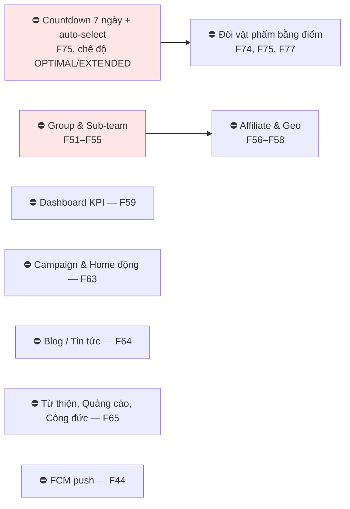

# 21 · Những chỗ cần chốt

Gom toàn bộ điểm còn treo rải rác trong 29 sơ đồ còn lại về một chỗ, xếp theo mức chặn.

## 21.1 Quyết định còn treo

**✅ Không còn câu hỏi nào chặn cứng.** Toàn bộ đã chốt ngày 2026-09-25 và đã seed vào cấu
hình động:

| Con số | Giá trị | Ở đâu |
| --- | --- | --- |
| Điểm cho lượt trao hoàn tất (X) | **56**, cap 5/ngày | `point_rules.GIFT_COMPLETED` |
| Tỷ lệ quy đổi F74 | **2.000 VNĐ/điểm** | `system_configs.point.redemption` |
| Chờ rồi áp mức mặc định | **7 ngày, 80%** | `system_configs.review.grace` |
| Phạt trượt nhiệm vụ | **Bạc 224 · Vàng 336 · KC 448** | `rank_tiers.maintenance_penalty_points` |

> Việc còn lại **không phải quyết định nữa mà là hiện thực**: các con số đã nằm trong cấu
> hình nhưng chưa có đường nào gọi tới chúng. Xem mục 21.4.

## 21.2 Mâu thuẫn tài liệu ↔ code

| # | Nội dung | Ở đâu | Sơ đồ |
| --- | --- | --- | --- |
| 1 | ✅ **Đã đúng từ trước.** Nhánh xét hạng vốn đọc `balance`; `lifetime_points` chỉ là ảnh chụp trong audit, nay đổi tên thành `points_at_transition` | — | [12](./12-rank.md) |
| 2 | ✅ **Đã sửa 25/09.** Trượt nhiệm vụ chỉ đánh FAILED, rồi trừ điểm và xét lại theo balance | — | [12](./12-rank.md) |
| 3 | ✅ **Đã đúng từ trước, nay có script chứng minh** — `npm run test:rank-balance` | — | [12](./12-rank.md) |
| 4 | ✅ **Đã có đường gửi 25/09** — `RankChangeNotifier`, một lời nhắc mỗi ngày cho mỗi bậc | — | [12](./12-rank.md) |
| 5 | **Hai lỗi SQL có sẵn chưa từng chạy** trong `evaluateDueMaintenanceCycles` (42P18, 42P08) — đã sửa 25/09 | — | [12](./12-rank.md) |

## 21.3 Chức năng đã chốt nhưng chưa gắn

| # | Nội dung | Chốt ngày | Trạng thái | Sơ đồ |
| --- | --- | --- | --- | --- |
| 1 | Cổng hồ sơ F07 chặn xin nhận + chat | 2026-09-24 | ✅ đã gắn 25/09 | [02](./02-profile.md) |
| 2 | Mốc hoạt động, cập nhật mỗi lần cấp phiên | 2026-09-24 | ✅ `users.last_active_at` 25/09 | [01](./01-auth.md) |
| 3 | Rule `GIFT_COMPLETED` = 56 điểm | 2026-09-25 | ✅ đã nối 25/09 — hai đường, một khoá | [11](./11-point.md) |
| 4 | Chặn xoá tài khoản khi còn lượt trao dở dang | từ lâu | ⛔ chưa gắn | [01](./01-auth.md) |
| 6 | Trừ điểm khi trượt nhiệm vụ duy trì | 2026-09-24 | ✅ đã nối 25/09 | [12](./12-rank.md) |
| 5 | Cổng hồ sơ cho tạo Group | 2026-09-24 | ⛔ chờ phân hệ Group | [18](./18-group.md) |

## 21.4 Lỗ hổng nghiệp vụ đã phát hiện

| # | Vấn đề | Hậu quả | Sơ đồ |
| --- | --- | --- | --- |
| 1 | ✅ **Đã sửa 25/09.** Hoàn tất lượt trao nay sinh điểm qua đánh giá, hoặc qua `gift:settle-rewards` sau 7 ngày | — | [11](./11-point.md) |
| 2 | Đồng hồ 5 ngày đếm từ `accepted_at` | Ship liên tỉnh 4–5 ngày → cron đóng trước khi hàng tới | [08](./08-transaction.md) |
| 3 | Tự hoàn tất không kiểm tranh chấp | Lượt trao đang có báo xấu vẫn thành "thành công" | [08](./08-transaction.md) |
| 4 | Object mồ côi không ai dọn | Bucket phình mãi | [03](./03-media.md) |
| 5 | Không nhắc người nhận đánh giá | Nhánh "mặc định sau N ngày" thành đường chạy chính | [13](./13-review.md) |
| 6 | Không có hàng đợi Admin cho hồ sơ bị gắn cờ accuracy và bình luận `PENDING_REVIEW` | Cờ gắn xong không ai thấy | [13](./13-review.md) · [16](./16-admin.md) |
| 7 | Không thông báo cho người báo xấu / người bị xử lý | Cả hai bên không biết chuyện gì xảy ra | [15](./15-report.md) |
| 8 | Cap report: tài liệu 10/ngày, rule đang 5 | Hai con số khác nhau | [15](./15-report.md) |
| 9 | **Cap 5 lượt trao/ngày chạm là mất thưởng vĩnh viễn** — người tặng 6 món trong một ngày không được điểm món thứ sáu, không có hàng đợi trả bù | Người tặng nhiều bị phạt vì tặng nhiều | [11](./11-point.md) |
| 10 | **Chưa có lịch cron cho `gift:settle-rewards`** — không chạy thì điểm treo vô hạn khi người nhận không đánh giá | Điểm không bao giờ tới tay người tặng | [17](./17-jobs.md) |

## 21.4b Phát hiện thêm từ đợt soát thứ hai

| # | Vấn đề | Sơ đồ |
| --- | --- | --- |
| 1 | `docs/DATABASE.md` ghi **28 bảng**, thực tế **44** | [27](./27-database.md) |
| 2 | Jitter toạ độ — chưa rõ ngẫu nhiên mỗi lần gọi hay cố định theo bài. Nếu ngẫu nhiên, gọi nhiều lần rồi lấy trung bình sẽ ra gần đúng vị trí thật | [25](./25-location-privacy.md) |
| 3 | Bán kính jitter là hằng trong code; vùng nông thôn có thể vẫn chỉ ra đúng một nhà | [25](./25-location-privacy.md) |
| 4 | Compatibility window của `/gift-posts` **chưa có hạn chót** | [25](./25-location-privacy.md) |
| 5 | Hai bên trong lượt trao **không có endpoint lấy vị trí thật** — họ tự gõ địa chỉ qua chat | [25](./25-location-privacy.md) |
| 6 | Referral chạm cap ngày thì **mất điểm vĩnh viễn**, không trả bù hôm sau | [23](./23-referral.md) |
| 7 | Chưa chặn referral vòng tròn giữa nhiều tài khoản cùng một người | [23](./23-referral.md) |
| 8 | Danh mục: chưa có gộp (merge), chưa giới hạn độ sâu cây, chưa sắp xếp thủ công | [22](./22-category.md) |
| 9 | `capability_rank_values` **không có lịch sử phiên bản** — bài bị từ chối vì quota thì không tra được lúc đó quota là bao nhiêu | [24](./24-entitlement.md) |
| 10 | Chưa có test nào chạy CLI thật trong CI — đúng loại lỗi đã làm cả bảy CLI chết | [28](./28-architecture.md) · [29](./29-cicd.md) |
| 11 | Script `test/*.check.ts` phải chạy tay, chưa nằm trong pipeline | [28](./28-architecture.md) |
| 12 | Chưa có request id / trace id xuyên suốt | [26](./26-api-conventions.md) |
| 13 | Thông báo lỗi chỉ có tiếng Việt, chưa có cơ chế đa ngữ | [26](./26-api-conventions.md) |
| 14 | `point_ledger` và `chat_messages` chỉ tăng không giảm, chưa có chiến lược phân vùng | [27](./27-database.md) |

## 21.5 Con số vẫn là giả định, chờ Bên A xác nhận

| Hạng mục | Giá trị hiện tại |
| --- | --- |
| Quota bài theo rank | Viewer 0 · Thành viên 3 · Bạc 10 · Vàng 20 · Kim Cương 50 |
| Rank được dùng SOS | Bạc trở lên |
| Cap ngày | 5 giao dịch tính điểm · 3 referral |
| Cap report | 10/người/ngày |
| Bán kính Group | 10km, chỉnh 1–50km |
| Onboarding cho 224đ = lên thẳng Thành viên | đúng ý chưa? |

## 21.6 Mở rộng ngoài SRS — cần Bên A biết

| Nội dung | Vì sao là mở rộng |
| --- | --- |
| **Trưởng nhóm sub-team** (`SUBTEAM_ADMIN`) | BR-GRP-05 chỉ chia Owner/Member; SRS nói sub-team *"chỉ để tổ chức"* |
| **Cảnh báo sắp tụt hạng** | Hệ quả bắt buộc của việc bỏ F76, SRS không có |

## 21.7 Chưa có dòng code nào



## 21.8 Hạ tầng chưa sẵn sàng production

```text
[ ] SMS/Zalo adapter (F09 hiện không chạy được thật)
[ ] FCM push (F44)
[ ] R2 staging/prod: bucket, key, CORS, CDN domain
[ ] Backup database VÀ restore test
[ ] Global rate limit
[ ] Monitoring / alerting
[ ] Lịch cron thật cho 7 CLI
[ ] Queue / retry / dead-letter cho thông báo
```
