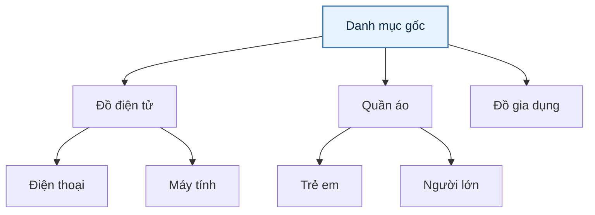
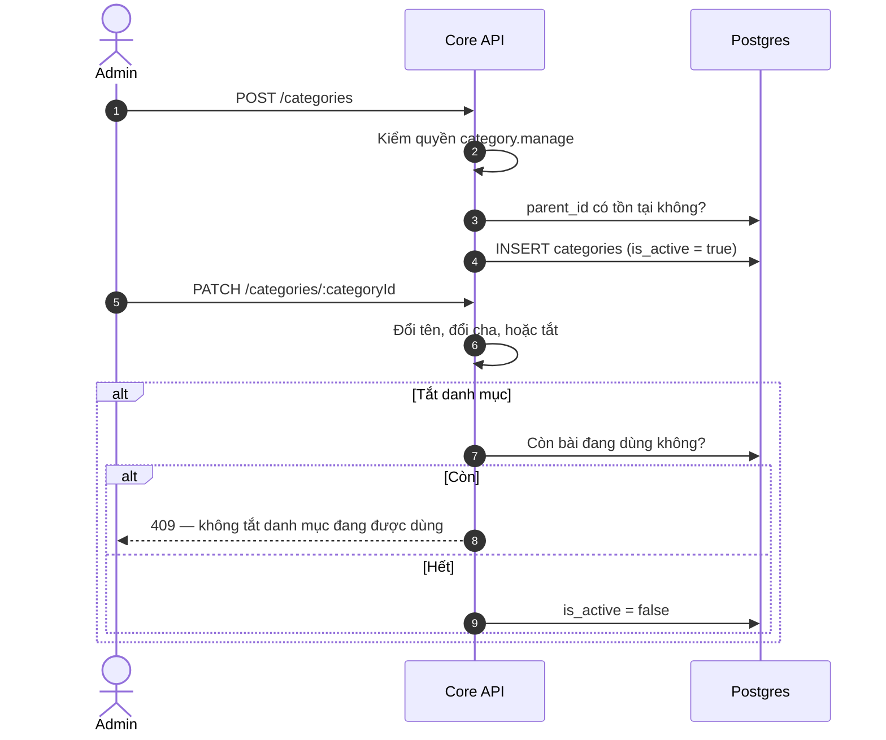
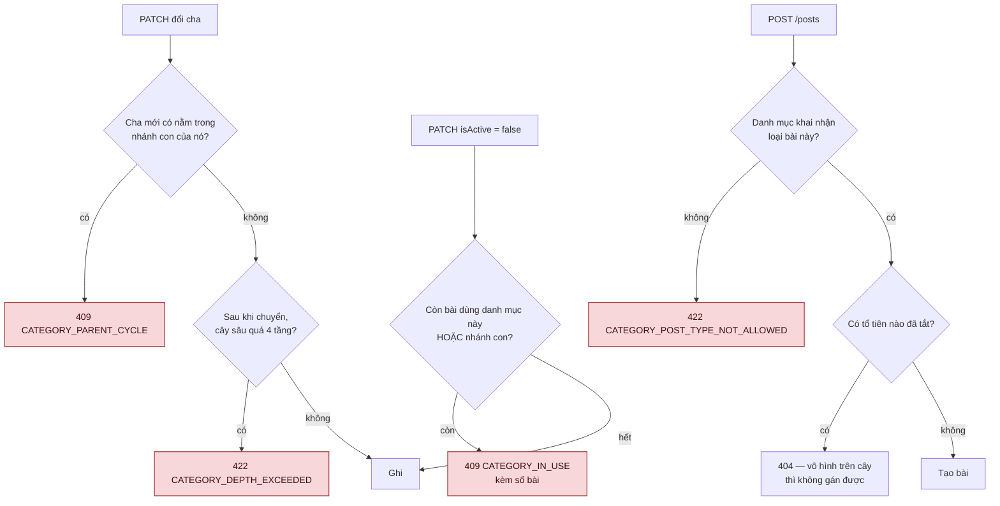
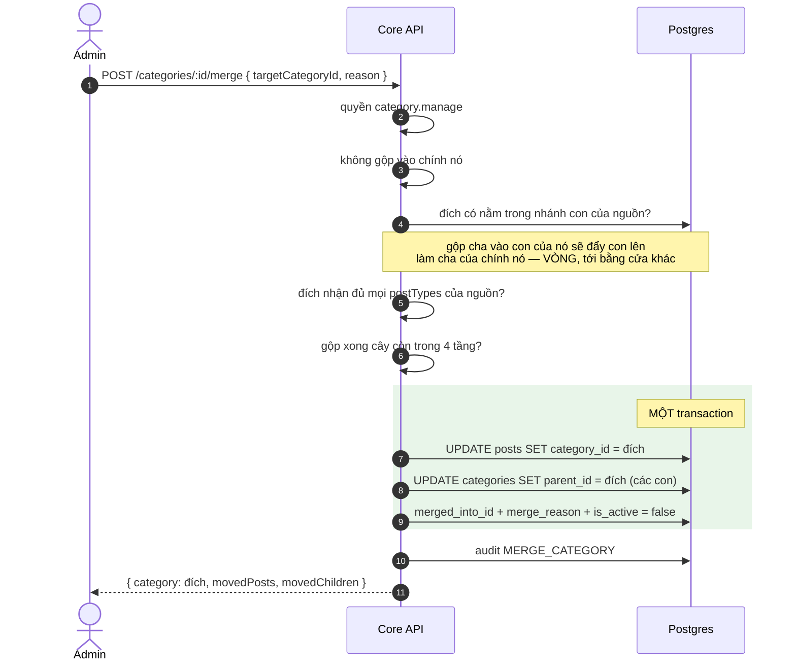
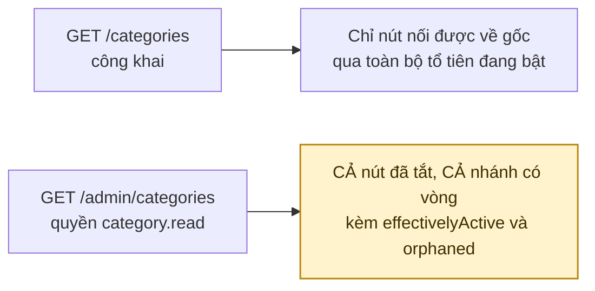

# 22 · Danh mục

Trạng thái: ✅ **đã hiện thực**, đã chuyển từ allowlist username sang quyền `category.manage`.

## 22.1 Cây danh mục

Lưu theo mô hình cây với `parent_id`. Bài đăng gắn vào **nút lá**, nhưng truy vấn theo nút
cha phải lấy được cả nhánh con.

## 22.2 CRUD

> **Vì sao tắt chứ không xoá.** Bài cũ trỏ vào danh mục đó vẫn cần đọc được tên để hiển thị
> lịch sử. Xoá đi thì mọi bài cũ trong danh mục mất nhãn và không ai dựng lại được.
>
> **Vì sao chặn tắt khi còn bài dùng.** Tắt một danh mục đang có 3.000 bài là làm 3.000 bài
> biến mất khỏi bộ lọc mà không ai báo trước.

## 22.3 Bốn ràng buộc của cây

Cả bốn đều được **kiểm ở server**, không phải quy ước để client tự tuân.

> **Vì sao vòng là lỗi nặng nhất, không phải chuyện thẩm mỹ.** Cây dựng bằng cách đi
> từ gốc `parent_id IS NULL` xuống. Một nhánh có vòng thì không nút nào của nó còn là
> gốc, nên **cả nhánh biến mất khỏi CẢ hai đường đọc, kể cả đường của Admin** — trong
> khi mọi dòng vẫn `is_active = true`. Đo được trên máy 30/09: dựng A → B → C rồi đặt
> `A.parent = C`, sau đó `GET /categories` và `GET /admin/categories` đều không còn
> nút nào. Khi đó không lấy lại được `categoryId` qua API để `PATCH` về, nên chỉ còn
> đường SQL tay: một lượt bấm sai của Admin tạo ra trạng thái mà chính Admin không gỡ
> được.
>
> **Vì sao `postTypes` phải kiểm ở server.** Trước 30/09 cột này xuất hiện đúng hai
> chỗ — mapper trả ra và `pruneByPostType` tỉa cây hiển thị — nên nó là ràng buộc *tư
> vấn*: server nói với client "danh mục này chỉ nhận OFFER", client tuân, còn một lượt
> gọi API trực tiếp thì đặt WANTED vào đó được. Đo được: bài WANTED vào danh mục khai
> `{OFFER}` tạo thành công. Danh mục khai danh sách **rỗng** vẫn nhận mọi loại — đó là
> hành vi trước khi cột này tồn tại, siết lại sẽ làm mọi danh mục cũ không đăng được
> bài nào.
>
> **Trần 4 tầng là giới hạn của màn hình chọn trên điện thoại**, không phải giới hạn
> kỹ thuật, nên nó là hằng `MaxCategoryDepth` chứ không phải khoá cấu hình: nới nó ra
> là đổi thiết kế giao diện. Phép đo tính **cả hai chiều** — chuỗi tổ tiên của cha mới
> và chiều sâu của chính nhánh đang chuyển: chuyển một nhánh hai tầng xuống dưới một
> nút đã ở tầng ba ra năm tầng, và phép đo chỉ nhìn cha mới sẽ bỏ sót đúng ca đó.

## 22.4 Lọc bài theo danh mục lấy **cả nhánh**

`§22.1` nói bài gắn vào nút lá nhưng truy vấn theo nút cha phải lấy được cả nhánh con.
Trước 30/09 mọi chỗ lọc dùng `category_id = :id` **phẳng**, nên lọc theo một danh mục
cha trả về **0 bài** — đúng thứ sơ đồ nói phải làm được.

Nay bốn đường đọc đều đi qua `categorySubtreeFilter`, một `WITH RECURSIVE` trong mệnh
đề `IN`:

| Đường đọc | Kiểm 30/09 |
| --- | --- |
| `GET /posts/nearby?categoryId=` | lọc theo cha tầng 1 ra bài nằm ở tầng 4 |
| `GET /posts/me?categoryId=` | như trên |
| `GET /admin/posts?categoryId=` | như trên |
| `GET /posts/map?categoryId=` | cụm trên bản đồ đếm cả nhánh |

`findSmartMatches` **cố ý không đổi**: nó so danh mục của chính bài đang gợi ý như một
tín hiệu liên quan, không phải một bộ lọc người dùng chọn.

`UNION` (không `ALL`) trong câu đệ quy là **hàng rào chống vòng**: nó bỏ id đã thấy nên
một vòng làm câu dừng thay vì chạy mãi. Cần vế đó vì dữ liệu có thể đã có vòng từ trước
khi `PATCH` biết chặn, và một câu đọc phải tự đứng được.

## 22.5 Gộp danh mục

> **Gộp là CHUYỂN rồi TẮT, không phải xoá** — cùng lý do §22.2 chọn tắt thay vì xoá:
> bài cũ trỏ vào danh mục đó vẫn cần đọc được tên để hiển thị lịch sử.
>
> **Ba câu trong một transaction.** Tách ra thì một lần chết giữa chừng để lại nguồn đã
> tắt mà bài vẫn ở đó — tức đúng cái §22.2 gọi là "3.000 bài biến mất khỏi bộ lọc mà
> không ai báo trước", lần này do chính đường gộp gây ra. Thứ tự bắt buộc: chuyển
> **trước**, tắt **sau**.
>
> **`merged_into_id` tồn tại để trả lời một câu.** Sau ba tháng, "danh mục này tắt vì
> đã gộp vào chỗ khác, hay vì Admin tắt tay?" — và hai câu trả lời dẫn tới hai hành
> động khác nhau: tắt tay thì bật lại được, còn đã gộp thì bật lại là tạo ra hai danh
> mục trùng nghĩa **lần nữa**. Nên `PATCH isActive: true` lên một danh mục đã gộp trả
> `409 CATEGORY_MERGED_CANNOT_REOPEN` kèm tên danh mục đích, và cây Admin trả trường
> `mergedInto` để Admin thấy được lý do mà không phải mở database.
>
> Hai `CHECK` chốt lại ở tầng dữ liệu: `CHK_categories_merged_is_inactive` (đã gộp thì
> phải đã tắt) và `CHK_categories_merge_not_self`. Chúng là hàng rào cuối, không phải
> hàng rào đầu — một ràng buộc nổ ra thành 500 thì Admin chỉ đọc được "Đã xảy ra lỗi
> không xác định", đo được đúng như vậy trong lượt thăm dò trước khi thêm mã 1288.

## 22.6 Hai đường đọc, và chỗ chúng từng nói khác nhau

Hai cờ trên DTO tồn tại vì hai đường đọc từng nói khác nhau về cùng một danh mục:

- **`effectivelyActive`** — `false` khi chính nó bật nhưng một **tổ tiên** đã tắt. Đo
  được 30/09: một danh mục con active dưới một cha đã tắt thì người dùng hoàn toàn
  không thấy (`findActiveTree` chỉ lấy dòng active nên con không gắn được vào đâu), còn
  Admin đọc `isActive: true` và **không có tín hiệu nào** về việc đó.
- **`orphaned`** — `true` khi nút không nối được về gốc, tức nhánh của nó có vòng. Chỉ
  đường Admin trả về, và đó là **cách duy nhất** lấy lại `categoryId` để `PATCH` cha về.
  Cạnh khép vòng hiện ra một lần nữa ở tầng dưới với cờ này bật, chỉ đúng chỗ vòng đóng.

## Chỗ cần soát

1. **Chưa có ảnh cho danh mục** — có `icon` (chuỗi tên icon, ≤100 ký tự) nhưng chưa có
   đường tải ảnh riêng. Nếu thiết kế cần ảnh thật thay vì icon dựng sẵn thì cần Bên A
   chốt, vì nó kéo theo cả một luồng media.
2. **Chưa có đường `GET /admin/categories/:id`** cho một danh mục lẻ. Hiện Admin đọc cả
   cây rồi tự tìm. Với vài chục danh mục thì không sao; nó thành vấn đề khi cây lớn.
3. **Gộp không có đường lùi.** `merged_into_id` ghi lại nguồn đã đi đâu, nhưng gộp sai
   thì không có `POST /unmerge`: những bài đã chuyển không còn dấu vết về danh mục cũ.
   Cần Bên A chốt có cần lùi được hay không — nếu cần thì phải ghi danh mục cũ trên
   **từng bài**, chứ một cột trên danh mục không đủ.

> Ba mục trên đều là tính năng thêm, không phải lỗi. Bốn mục cũ ở đây đã đóng: sắp xếp
> thủ công và icon **vốn đã có** từ trước (`sort_order` được `ORDER BY` ở cả hai đường
> đọc, `icon` nằm trong DTO) — hai dòng đó trong bản soát trước là ghi sai; còn gộp danh
> mục và trần độ sâu làm ngày 30/09.
