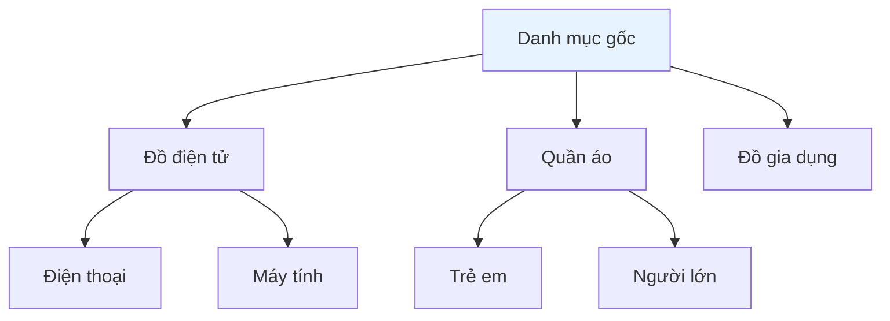
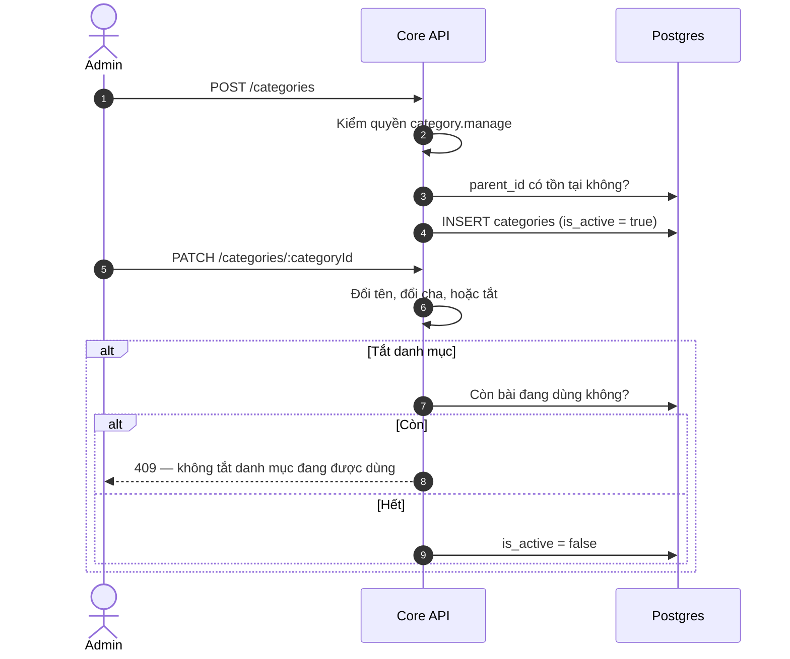
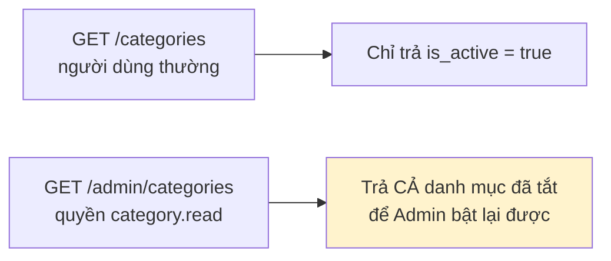

# 22 · Danh mục

Trạng thái: ✅ **đã hiện thực**, đã chuyển từ allowlist username sang quyền `category.manage`.

## 22.1 Cây danh mục

Lưu theo mô hình cây với `parent_id`. Bài đăng gắn vào **nút lá**, nhưng truy vấn theo nút
cha phải lấy được cả nhánh con.

## 22.2 CRUD

> **Vì sao tắt chứ không xoá.** Bài cũ trỏ vào danh mục đó vẫn cần đọc được tên để hiển thị
> lịch sử. Xoá đi thì mọi bài cũ trong danh mục mất nhãn và không ai dựng lại được.
>
> **Vì sao chặn tắt khi còn bài dùng.** Tắt một danh mục đang có 3.000 bài là làm 3.000 bài
> biến mất khỏi bộ lọc mà không ai báo trước.

## 22.3 Hai đường đọc

## Chỗ cần soát

1. **Chưa có sắp xếp thủ công** — danh mục trả theo thứ tự tự nhiên, Admin không đổi được thứ
   tự hiển thị.
2. **Chưa có icon/ảnh cho danh mục**, trong khi app thường cần chúng ở màn hình chọn.
3. **Chưa có gộp danh mục** (merge). Tạo nhầm hai danh mục trùng nghĩa thì phải sửa tay từng
   bài.
4. Độ sâu cây **không giới hạn** — chưa có ràng buộc nào chặn ai đó tạo 20 tầng.
