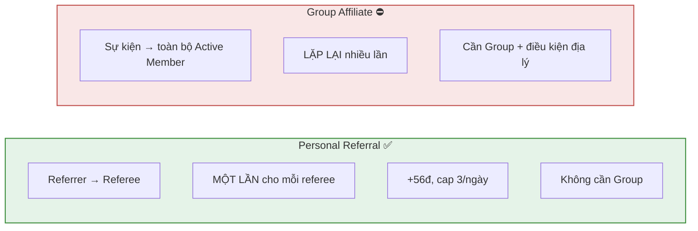
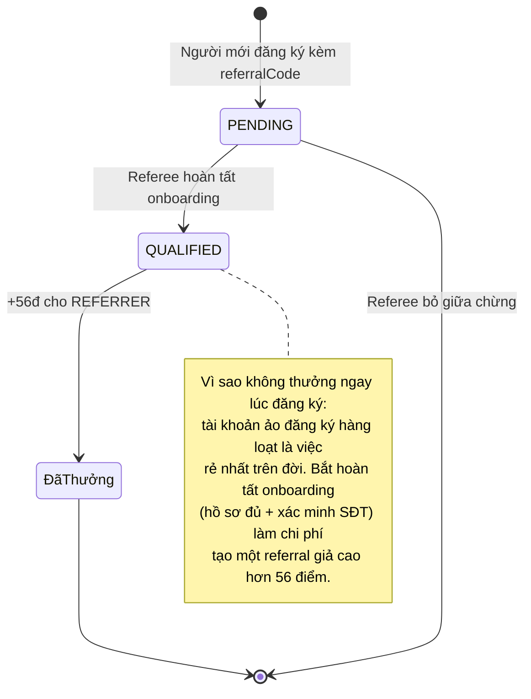
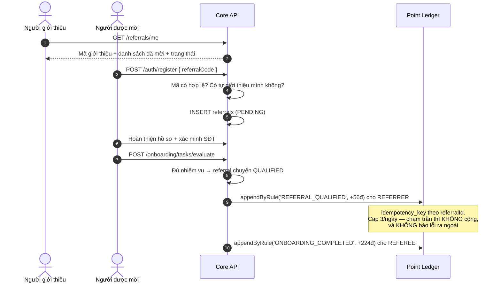
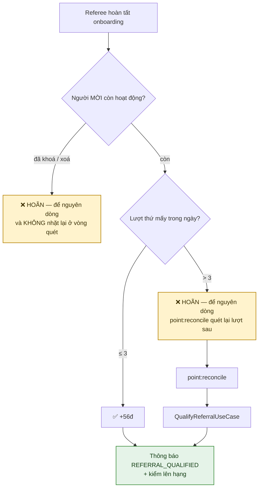

# 23 · Personal Referral

Trạng thái: ✅ **đã hiện thực**.

## 23.1 Khác Group Affiliate thế nào



## 23.2 Vòng đời một referral



## 23.3 Luồng đầy đủ



## 23.4 Trần theo ngày, và hai đường trả thưởng



> **Vì sao hoãn mà vẫn giữ dòng.** Quan hệ giới thiệu là dữ liệu thật, cần ghi dù không
> thưởng. Từ chối cả quan hệ chỉ vì hết quota điểm là làm mất dữ liệu để tiết kiệm một
> con số. Trigger `enforce_referral_qualification_transition` đòi `qualified_at` và
> `reward_entry_id` phải cùng xuất hiện trong MỘT lần ghi, nên ở tầng database "đã đủ
> điều kiện" đồng nghĩa với "đã trả thưởng" — hoãn là cách duy nhất không nói dối.
>
> **Vì sao `point:reconcile` phải đi qua use case, không qua repository.** Đường quét
> lại gọi `QualifyReferralUseCase`, cùng đường mà onboarding gọi. Trước 30/09 nó gọi
> thẳng `ReferralRepository.qualifyAndAward`, nên nó bỏ qua cả hai việc use case làm
> sau khi ghi sổ: gửi `REFERRAL_QUALIFIED`, và gọi `RankChangeNotifier`. Hệ quả đo
> được: **referral thứ 4 trở đi trong ngày** — tức đường bình thường của một người mời
> tích cực — được cộng 56 điểm hoàn toàn im lặng, và cú lên hạng từ những điểm đó cũng
> không ai nói. Hai mục "đã sửa" của bản soát trước (hoãn thay vì mất; thêm thông báo)
> **không ăn khớp với nhau**.
>
> **Vì sao kiểm người mời ở thời điểm TRẢ THƯỞNG, không chỉ lúc đăng ký.** Giữa hai
> mốc đó là cả quá trình onboarding của người được mời — vài ngày, đủ để Admin khoá
> một tài khoản farm. Đo được: tài khoản `BANNED` và đã xoá mềm vẫn nhận +56 điểm, và
> `point:reconcile` vá lại mãi. Nay `findPendingQualifications` cũng lọc theo vế đó,
> nếu không thì vòng quét nhặt lại một khoản sẽ không bao giờ được ghi, mỗi lượt một
> dòng log lỗi. Người bị treo **tạm** rồi được gỡ thì lượt đó quay lại — hoãn, không mất.

## 23.5 "Hợp lệ" cho nhiệm vụ hạng nghĩa là gì

Nhiệm vụ duy trì hạng đòi *N Personal Referral **hợp lệ*** mỗi quý. Hợp lệ = `qualified_at IS NOT NULL`
**và người được mời chưa bị khoá vĩnh viễn hay xoá**.

Vế thứ hai thêm ngày 30/09. Trước đó cả **năm** chỗ SQL của phân hệ hạng chỉ xét
`qualified_at`, và đo được: một người mời ba tài khoản, cả ba đủ điều kiện rồi cả ba bị
khoá vì là tài khoản ảo — bộ đếm vẫn ra 3, tức vẫn đủ nhiệm vụ của quý. Nói cách khác,
**chính việc Admin dọn tài khoản ảo không làm giảm thành tích của người tạo ra chúng.**

`<> 'BANNED'` chứ không `= 'ACTIVE'`: `SUSPENDED` là treo có thời hạn và tự về `ACTIVE`,
nên một người được mời bị treo bảy ngày vẫn là thành viên thật — xoá công của người mời
vì việc đó là phạt sai người.

Ba thứ **không** bị ảnh hưởng: quan hệ giới thiệu vẫn còn dòng, vẫn hiện ở
`GET /referrals/me`, và điểm đã trả không bị thu lại — sổ điểm là append-only, thu hồi
là việc của đường đảo bút toán có lý do.

## 23.6 `GET /referrals/me`

Trả mã, ba con số, **và danh sách người đã mời** (tối đa 50, mới nhất trước):

| Trường | Ý nghĩa |
| --- | --- |
| `code` | Mã giới thiệu — bất biến, gắn lúc đăng ký |
| `totalCount` | Số người đã đăng ký bằng mã |
| `qualifiedCount` | Trong đó bao nhiêu đã đủ điều kiện |
| `rewardedCount` | Bao nhiêu lượt thật sự được thưởng sau khi áp trần |
| `invitees[].status` | `PENDING` hoặc `QUALIFIED` |
| `invitees[].awardedPoints` | Số điểm **đã vào sổ** cho lượt đó, `null` khi chưa tính |

§23.3 vẽ endpoint này trả *"Mã giới thiệu + danh sách đã mời + trạng thái"* từ đầu, nhưng
trước 30/09 nó chỉ có ba con số. Ba con số nói được "bao nhiêu", không nói được "ai" —
nên người mời không biết ai đang kẹt ở `PENDING` để mà nhắc, và nhắc chính là việc duy
nhất họ còn làm được sau khi đã gửi mã.

`awardedPoints` đọc từ `point_ledger` theo `reward_entry_id`, **không** đọc lại
`point_rules`: rule là cấu hình động, nên đọc lại sẽ nói sai về những lượt đã trả trước
khi Admin đổi mức.

## 23.7 Dấu vết đăng ký

`referrals.signup_ip_hash` và `signup_device_hash` có từ migration đầu tiên. Trước 30/09
**không dòng nào có giá trị** — và trigger coi hai cột đó là bất biến, nên chỉ ghi được
đúng lúc `INSERT`; vá sau cho dữ liệu cũ là không thể.

Nay ghi lúc đăng ký, băm bằng `hashSignupFingerprint` (HMAC-SHA256 với pepper dùng chung
với `verified_phones`). Băm chứ không lưu thô vì bảng này **không xoá được**: lưu IP thô ở
đó là giữ lịch sử vị trí thô của người dùng vô thời hạn, cho một mục đích duy nhất — so
trùng — mà so trùng thì chỉ cần băm.

Và chúng **được đọc**: `GET /admin/users/:userId` trả thêm

```json
"referrals": { "invited": 6, "qualified": 3, "sharedSignupFingerprints": 2 }
```

`sharedSignupFingerprints` là số cụm dấu vết trùng nhau trong danh sách người họ đã mời.
Đếm IP và thiết bị **tách nhau** rồi cộng: "hai người cùng wifi, khác máy" và "hai người
cùng máy, khác wifi" là hai tín hiệu khác nhau, gộp lại là làm mất chính thứ để phân biệt
một gia đình dùng chung mạng với một người mở mười tài khoản trên một máy.

Hệ thống chỉ **đếm và hiện cho Admin**, không tự khoá ai — ngưỡng bao nhiêu là đáng chặn
là quyết định nghiệp vụ, và một quy tắc tự động đoán sai sẽ khoá oan người dùng chung
mạng gia đình hoặc một máy trong tiệm net. `deviceId` do client tự sinh nên là tín hiệu
**yếu**: ai muốn lách thì đổi mỗi lần. Giữ vì phần lớn người tạo tài khoản hàng loạt
không lách, và một tín hiệu yếu vẫn hơn không có tín hiệu nào — miễn là không ai tự động
hoá quyết định dựa vào nó.

Lượt đăng ký trước 30/09 luôn ra `0`, và `0` ở đó nghĩa là **"không biết"**, không phải
"sạch".

## Chỗ cần soát

1. **"Referral vòng tròn" — bản soát trước ghi sai bản chất.** Một vòng qua đường đăng ký
   là **không thể** theo cấu trúc: `UQ_referrals_referee_id` cho mỗi người đúng một người
   mời, gắn **chỉ lúc đăng ký**, và mỗi người đăng ký một lần. A được B mời đòi A đăng ký
   sau B, mà B đăng ký sau A — không đồng thời đúng được, và `CHK_referrals_not_self` chặn
   nốt ca tự mời mình.

   Rủi ro thật là **một người tạo nhiều tài khoản**. Chi phí của nó hiện là: một SĐT đã
   xác minh riêng cho mỗi tài khoản (`UQ` một phần trên `users.phone`, bảng
   `verified_phones` sống lâu hơn tài khoản, và thoát VIEWER đòi bằng chứng
   `PHONE_VERIFIED`), cộng trần 3 lượt/ngày. Từ 30/09 thêm dấu vết đăng ký để Admin
   nhìn ra cụm — xem §23.7.

   **Cần Bên A chốt:** ngưỡng `sharedSignupFingerprints` bao nhiêu thì đáng xem, và khi
   đáng xem thì làm gì (hoãn thưởng? đưa vào hàng đợi soát? không làm gì, chỉ hiện?).
   Cố ý chưa tự động hoá.

2. **Chưa có đường thu hồi điểm khi phát hiện farm.** Tài khoản bị khoá thì thôi không
   tính vào nhiệm vụ hạng (§23.5), nhưng 56 điểm đã trả vẫn nằm trong sổ. Đảo bút toán có
   sẵn (`IReversePointEntryUseCase`) nhưng không đường Admin nào gọi nó cho referral. Cần
   Bên A chốt có thu hay không — thu thì phải nói rõ thu cả điểm đã tiêu đổi quà thì xử
   lý thế nào.

3. **Không có phân trang cho `invitees`.** Trần cứng 50, mới nhất trước. Đủ cho trang tóm
   tắt; sẽ thiếu nếu về sau có người mời vài trăm người và cần xem hết.
